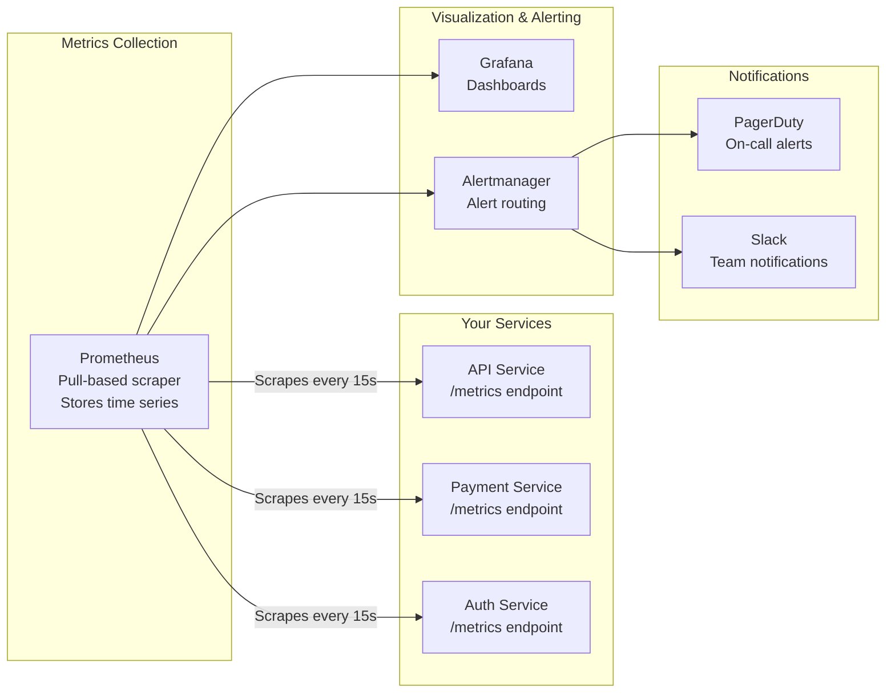

# Metrics and Monitoring

## Why This Topic Exists

Logs tell you what happened in a specific event. But what if you want to know: "How fast is my API right now?" or "Has the error rate been creeping up over the last 6 hours?" or "Is my server about to run out of memory?"

Logs cannot answer these questions efficiently — searching billions of log lines to compute an average is far too slow. You need **metrics**: numbers collected continuously over time, designed for aggregation, dashboarding, and alerting.

Metrics are how Google engineers monitor hundreds of billions of requests per day. They are how Netflix keeps 220 million streams running. Understanding metrics is essential for any senior or staff engineer.

---

## Learning Objectives

By the end of this topic, you will be able to:

- Name and use the four metric types: counters, gauges, histograms, and summaries
- Apply the 4 Golden Signals (Latency, Traffic, Errors, Saturation)
- Use the RED method for service monitoring
- Use the USE method for resource monitoring
- Describe how Prometheus collects metrics and how Grafana visualizes them
- Write effective alert rules that are actionable without being noisy
- Explain SLI, SLO, and SLA and how they relate to each other

---

## Prerequisites

- Understanding of the three pillars of observability (topic 01)
- Familiarity with HTTP requests and basic service architecture
- Comfort with the concept of a time series (a series of values over time)

---

## Introduction

A **metric** is a numerical measurement of some aspect of a system, collected at regular intervals over time. For example:
- HTTP request count: 142,854 requests in the last minute
- P99 latency: 99% of requests completed in under 342ms
- Memory usage: 2.1 GB of 4 GB total

Metrics are cheap to store (just numbers), fast to query (time-series databases), and perfect for dashboards and alerting. This makes them the backbone of any serious monitoring setup.

---

## Real-World Analogy

Think of a **hospital intensive care unit (ICU)**. Every patient has monitors attached measuring:
- Heart rate (right now)
- Blood pressure (right now)
- Oxygen saturation (trend over hours)
- Body temperature (trend over days)

Doctors don't read through text notes to know if a patient is crashing. They look at the **numerical monitors**. When heart rate drops below 40 BPM, an alarm sounds immediately — someone can respond in seconds.

That's exactly what metrics do for your systems. Dashboards are the monitors. Alerts are the alarms. The on-call engineer is the doctor.

---

## Core Concepts

### Metric Types

#### 1. Counter

A **counter** is a value that only ever goes up. It resets to zero when the service restarts.

```
http_requests_total = 1,482,943
errors_total = 1,247
```

Use counters for: request counts, error counts, bytes sent.

The interesting value is often the **rate of change**: "how many requests per second?" You compute this by taking the difference between two counter readings divided by time.

#### 2. Gauge

A **gauge** is a value that can go up or down. It represents a current snapshot.

```
memory_usage_bytes = 2,147,483,648  (can increase or decrease)
active_connections = 87              (changes constantly)
queue_depth = 1,024                  (grows when consumers are slow)
cpu_usage_percent = 63.2
```

Use gauges for: CPU, memory, disk, queue size, concurrent connections.

#### 3. Histogram

A **histogram** samples observations and counts them into configurable buckets. This lets you calculate percentiles.

```
http_request_duration_seconds_bucket{le="0.1"} = 54,231   (< 100ms)
http_request_duration_seconds_bucket{le="0.5"} = 98,421   (< 500ms)
http_request_duration_seconds_bucket{le="1.0"} = 99,854   (< 1s)
http_request_duration_seconds_bucket{le="+Inf"} = 100,000 (total)
```

From this you can calculate: P50 (median), P95, P99, P99.9 latency. This is essential for understanding the latency experience of your users.

#### 4. Summary

Similar to histograms but calculates percentiles on the client side. Less flexible than histograms because you cannot aggregate across instances. **Prefer histograms in most cases.**

### Why Percentiles Matter More Than Averages

Averages are misleading. Imagine 100 requests:
- 99 requests take 10ms
- 1 request takes 10,000ms (10 seconds)

Average: (99 × 10 + 10,000) / 100 = **109ms** — sounds fine!
P99: **10,000ms** — 1% of users wait 10 seconds. That's terrible.

P99 latency tells you what the slowest 1% of users experience. P99.9 tells you what the slowest 0.1% experience. At high scale, even 0.1% is thousands of users.

**Always track P99 and P99.9 latency, not just averages.**

---

## Visual Diagram (Mermaid)



---

## Deep Explanation

### The 4 Golden Signals (Google SRE)

Google's Site Reliability Engineering (SRE) team defined four signals that cover the health of any service:

| Signal | What It Measures | Example |
|--------|-----------------|---------|
| **Latency** | How long requests take | P99 response time = 342ms |
| **Traffic** | How much demand | 14,200 requests/second |
| **Errors** | Rate of failed requests | Error rate = 0.3% |
| **Saturation** | How "full" the service is | CPU at 87%, queue depth 1,200 |

If you only have time to instrument one thing, track these four signals. They will tell you about almost every production problem.

**Latency** is often the first signal to degrade. Watch it carefully.
**Saturation** is often the leading indicator — a service that is almost full will soon fail.

### RED Method (For Services)

The RED method was popularized by Tom Wilkie at Weaveworks. It applies to any request-driven service:

- **Rate**: Number of requests per second
- **Errors**: Number of those requests that are failing
- **Duration**: How long requests are taking (the distribution, not just average)

This is a simplified, memorable version of the golden signals for services. When you are building a new microservice, start with RED metrics.

### USE Method (For Resources)

The USE method was created by Brendan Gregg. It applies to physical resources (CPU, memory, network, disk):

- **Utilization**: Percentage of time the resource is busy (CPU at 75%)
- **Saturation**: Amount of extra work waiting to be done (run queue length)
- **Errors**: Error events for the resource (disk I/O errors)

When a service is behaving strangely and RED metrics don't explain it, go to USE metrics for the underlying resources.

### Prometheus: Pull-Based Metrics Collection

**Prometheus** is the most widely used open-source metrics system. Its key design decision: it **pulls** metrics rather than having services push to it.

How it works:
1. Your service exposes a `/metrics` endpoint that returns all current metric values in Prometheus text format
2. Prometheus scrapes this endpoint every 15 seconds (configurable)
3. Prometheus stores the time series in its local time-series database (TSDB)
4. You query Prometheus using PromQL (Prometheus Query Language)

Example PromQL query:
```promql
# Requests per second over the last 5 minutes
rate(http_requests_total[5m])

# P99 latency
histogram_quantile(0.99, rate(http_request_duration_seconds_bucket[5m]))

# Error rate
rate(http_requests_total{status=~"5.."}[5m]) / rate(http_requests_total[5m])
```

**Why pull-based?** If a service stops responding, Prometheus immediately knows it is down (scrape failed). With push-based systems, you need a separate mechanism to detect when a service stops sending metrics.

### Grafana: Visualization

**Grafana** connects to Prometheus (and dozens of other data sources) and provides beautiful, configurable dashboards. You define dashboard panels using PromQL queries. Engineers use Grafana to:
- Watch real-time latency, error rate, and throughput
- Set up alert rules that trigger when a metric crosses a threshold
- Compare current behavior to the same time last week
- Drill into specific services or time ranges during incidents

### Alerting Best Practices

Poor alerting is one of the most common problems in engineering teams. There are two failure modes:

**Too few alerts:** You don't know something is broken until users complain.
**Too many alerts (alert fatigue):** So many alerts that engineers start ignoring them. The one that matters gets missed.

Rules for good alerts:

| Rule | Why |
|------|-----|
| **Alerts must be actionable** | If you receive an alert and don't know what to do, the alert is useless |
| **Alert on symptoms, not causes** | Alert "error rate > 1%" rather than "CPU > 90%" — CPU being high is not necessarily a problem |
| **Set appropriate thresholds** | Alert at 1% error rate for payments, maybe 5% for notifications |
| **Use `for` duration** | Don't alert on a 1-second spike. Alert when a condition has persisted for 5 minutes |
| **Group related alerts** | Don't page 10 times for the same incident |
| **Add runbook links** | Every alert should link to a runbook explaining how to respond |

**Alert on SLO burn rate:** Instead of alerting on raw error rate, alert when you are burning through your error budget too fast. This is more sophisticated but dramatically reduces noise while catching the important events.

### SLI, SLO, and SLA

These three acronyms are fundamental to the Google SRE approach and appear frequently in senior interviews.

#### SLI (Service Level Indicator)

An SLI is the actual measurement — the metric that tells you how well you are performing.

Examples:
- "The fraction of HTTP requests that were served in under 300ms"
- "The fraction of database writes that succeeded"
- "The fraction of API calls that returned a non-500 response"

#### SLO (Service Level Objective)

An SLO is the target you set for your SLI. It is an internal goal.

Examples:
- "99.9% of HTTP requests complete in under 300ms"
- "99.95% of database writes succeed"

SLOs define your **error budget**: if your SLO is 99.9% availability, you can be down for 8.7 hours per year (the other 0.1%). This budget can be "spent" on deployments, experiments, and acceptable failures.

#### SLA (Service Level Agreement)

An SLA is a contractual commitment to customers with financial consequences if violated.

Example:
- "AWS guarantees 99.99% monthly uptime for EC2. If we miss this, you get service credits."

The relationship:

```
SLI (measurement) → is compared against → SLO (internal target)
SLO (internal target) → informs → SLA (external promise)
```

Always set your SLO stricter than your SLA. If your SLA is 99.9%, set your SLO at 99.95%. That way you catch problems before they breach the SLA.

---

## Step-by-Step Example

### Setting Up RED Monitoring for a New Service

You are building a payment service. Here is how you instrument it:

**Step 1: Add metric counters and histograms in code.**
```python
# Counter: total requests
payment_requests_total = Counter(
    'payment_requests_total',
    'Total payment requests',
    ['status', 'payment_method']
)

# Histogram: request duration
payment_duration = Histogram(
    'payment_duration_seconds',
    'Payment processing duration',
    buckets=[0.05, 0.1, 0.25, 0.5, 1.0, 2.5, 5.0]
)
```

**Step 2: Record metrics in request handler.**
```python
with payment_duration.time():  # records duration automatically
    result = process_payment(request)
    payment_requests_total.labels(
        status=result.status,
        payment_method=request.payment_method
    ).inc()
```

**Step 3: Write PromQL alert rules.**
```yaml
- alert: PaymentHighErrorRate
  expr: |
    rate(payment_requests_total{status="error"}[5m]) /
    rate(payment_requests_total[5m]) > 0.01
  for: 5m
  annotations:
    summary: "Payment error rate above 1%"
    runbook: "https://runbooks.company.com/payment-errors"
```

**Step 4: Build a Grafana dashboard with:**
- Rate: requests per second over time
- Errors: error rate percentage
- Duration: P50, P95, P99 latency

---

## Advantages / Disadvantages / Trade-offs

| | Advantage | Disadvantage |
|--|-----------|--------------|
| **Prometheus** | Open source, pull model detects failures, PromQL is powerful | Scales to ~100s of targets easily, then needs federation or Thanos for larger scale |
| **Histograms** | Can compute percentiles, aggregatable | Higher cardinality than counters; bucket boundaries must be chosen carefully |
| **Counters** | Always increasing, rate() gives rates | Cannot represent values that decrease |
| **SLOs** | Focus team on what matters to users | Require careful definition; wrong SLIs lead to wrong priorities |
| **Alerting on symptoms** | Fewer false positives | May miss some early warning signs |

---

## When to Use / When NOT to Use

**Always use metrics for:**
- Service health dashboards
- SLO tracking
- Alerting on production issues
- Capacity planning

**Metrics are NOT right for:**
- Per-user or per-request detail (high cardinality — use logs and traces instead)
- Full request/response bodies
- Debugging specific incidents (use logs and traces for that)

---

## Common Interview Questions

**Q: What are the 4 Golden Signals?**
A: Latency (how long requests take), Traffic (how many requests), Errors (rate of failures), Saturation (how full the system is). Defined by Google SRE.

**Q: What is the difference between SLI, SLO, and SLA?**
A: SLI is the actual measurement. SLO is the internal target. SLA is the external contractual promise. Set SLO stricter than SLA to catch problems before customers notice.

**Q: Why use P99 latency instead of average?**
A: Averages hide outliers. A small number of very slow requests can make thousands of users have a terrible experience while the average looks fine. P99 tells you what the slowest 1% of users experience.

---

## Common Beginner Mistakes

1. **Only tracking averages.** P99 and P99.9 reveal the real user experience. Average latency is almost always misleading.

2. **High cardinality labels on metrics.** Never use `user_id`, `order_id`, or any high-cardinality value as a Prometheus label. It creates millions of time series and will crash your Prometheus instance.

3. **Alert fatigue from noisy alerts.** If alerts fire constantly and aren't actionable, engineers mute them. Then a real problem gets missed. Every alert must be actionable.

4. **Confusing SLI, SLO, and SLA.** Know that SLI is the measurement, SLO is the goal, SLA is the contract.

5. **Not using a `for` duration on alerts.** Alerting on any spike creates false positives. Use `for: 5m` to alert only when a condition has persisted.

---

## Summary

Metrics are numerical measurements collected over time — the backbone of production monitoring. The four key metric types are counters, gauges, histograms, and summaries. The four Golden Signals (Latency, Traffic, Errors, Saturation) cover most failure modes. Prometheus collects metrics by pulling from service endpoints; Grafana visualizes them in dashboards. Good alerting is actionable, not noisy. SLIs measure performance, SLOs set targets, and SLAs are external promises.

---

## Key Takeaways

- Four metric types: Counter (always up), Gauge (up/down), Histogram (percentiles), Summary
- 4 Golden Signals: Latency, Traffic, Errors, Saturation — track these for every service
- RED for services: Rate, Errors, Duration
- USE for resources: Utilization, Saturation, Errors
- Always track P99 latency — averages hide the worst user experiences
- Prometheus pulls metrics; Grafana visualizes them
- SLI (measurement) → SLO (internal target) → SLA (external contract)
- Good alerts are actionable and specific; bad alerts cause alert fatigue

---

## Related Topics (relative markdown links)

- [01. The Three Pillars of Observability (BEGINNER)](./01.%20The%20Three%20Pillars%20of%20Observability%20(BEGINNER).md)
- [02. Logging (BEGINNER)](./02.%20Logging%20(BEGINNER).md)
- [04. Distributed Tracing (INTERMEDIATE)](./04.%20Distributed%20Tracing%20(INTERMEDIATE).md)
- [05. Alerting and On-Call (INTERMEDIATE)](./05.%20Alerting%20and%20On-Call%20(INTERMEDIATE).md)
- [Chapter 11: Reliability and Fault Tolerance](../11.%20Reliability%20and%20Fault%20Tolerance/)
- [Chapter 16: Performance](../16.%20Performance/)
