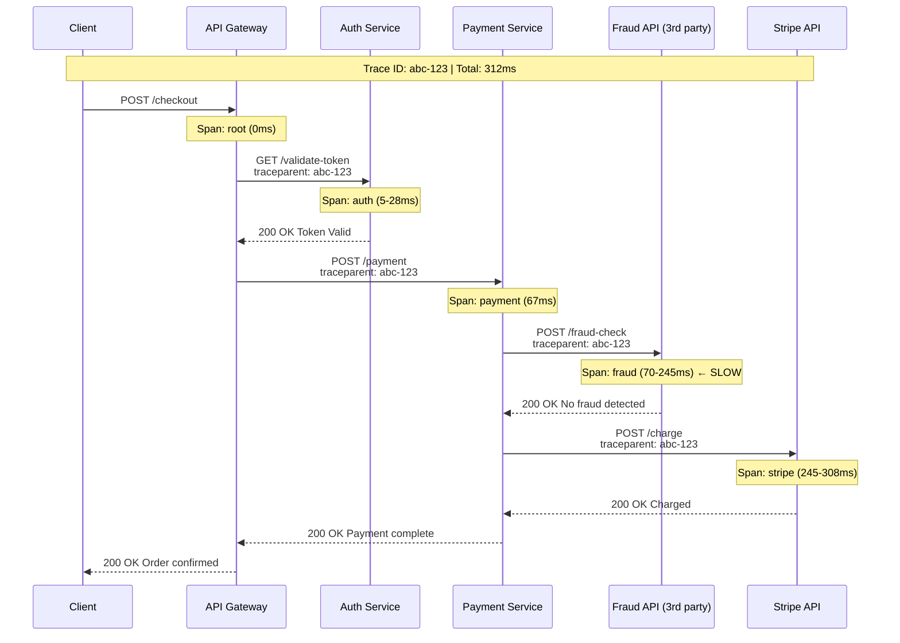

# Distributed Tracing

## Why This Topic Exists

You have a distributed system with 10 microservices. A user's request takes 3 seconds instead of 200ms. Your metrics show that the payment service's P99 latency is high. But why? Is it the database? Is it a slow API call to a third-party provider? Is it the network between your EU and US data centers?

Your logs are scattered across 10 services. Manually correlating timestamps across all of them would take hours. Your metrics show the symptom but not the cause.

**Distributed tracing** is the tool that answers "where exactly in the distributed journey did this request slow down?" in seconds. It is one of the most valuable debugging tools for microservice architectures and a key topic in senior engineering interviews.

---

## Learning Objectives

By the end of this topic, you will be able to:

- Define a trace and explain how it is composed of spans
- Describe how trace context propagates between services via HTTP headers
- Explain the W3C Trace Context standard
- Name common tracing backends: Jaeger, Zipkin, AWS X-Ray
- Understand what OpenTelemetry is and why it matters
- Describe tracing sampling strategies and their trade-offs
- Read a trace visualization and identify the bottleneck

---

## Prerequisites

- Understanding of microservices and inter-service HTTP calls
- Familiarity with the three pillars of observability (topic 01)
- Familiarity with correlation IDs from the logging topic (topic 02)

---

## Introduction

When you run a monolith, a slow request is easy to debug — everything is in one process. A single debugger session or profiler run shows you exactly where time is spent.

Microservices change this. A single user action might trigger:
1. API Gateway authenticates the request
2. User Service fetches user profile
3. Recommendation Service runs ML inference
4. Product Service queries the database
5. Inventory Service checks stock
6. Payment Service charges the credit card
7. Notification Service sends a confirmation email

Each of these is a separate network call, a separate process, possibly running in a different region or cloud. The total latency is the sum of all of them plus network time.

**Distributed tracing** gives you a unified view of this entire journey for a single request.

---

## Real-World Analogy

Think about **tracking a package** with FedEx.

You have a tracking number (the trace ID). On the FedEx website, you can see:
- Package picked up at sender — 9:00 AM (span 1: duration 5 min)
- Arrived at Chicago sorting facility — 11:30 AM (span 2: duration 45 min)
- Departed Chicago — 12:15 PM (span 3: duration 2 hours)
- Arrived at destination facility — 2:15 PM (span 4: duration 20 min)
- Out for delivery — 3:00 PM (span 5)
- Delivered — 4:47 PM

You can see the entire journey as a timeline. If you want to know why delivery was delayed, you look at which step took the longest. The 2-hour flight (span 3) is expected. If span 3 shows 8 hours instead of 2, that's the problem.

A distributed trace works exactly the same way. Each "stop" in the package's journey is a **span**. All spans connected by the same tracking number form a **trace**.

---

## Core Concepts

### Trace

A **trace** represents the entire end-to-end journey of a single request through your distributed system. It is identified by a unique **trace ID** (a 128-bit random number, typically represented as a hex string like `4bf92f3577b34da6a3ce929d0e0e4736`).

A trace contains one or more **spans** arranged in a parent-child hierarchy.

### Span

A **span** represents a single unit of work within a trace. It records:
- **Operation name**: "HTTP GET /checkout", "SQL SELECT users", "Redis GET user:12345"
- **Start time**: When the work began
- **Duration**: How long it took
- **Tags/Attributes**: Key-value metadata (HTTP status code, database query, error message)
- **Logs/Events**: Timestamped events within the span (useful for errors)
- **Parent Span ID**: Which span triggered this work (except the root span)
- **Trace ID**: Links this span to the overall trace

### The Parent-Child Hierarchy

Spans form a tree. The top-level span (root span) is created by the first service that handles the request. When that service calls another service, it creates a child span.

```
Trace abc123 — Total: 312ms
├── [ROOT]  API Gateway: POST /checkout           0ms → 312ms
│   ├── Auth Service: ValidateToken               5ms → 28ms
│   ├── Cart Service: GetCart                    28ms → 67ms
│   │   └── Database: SELECT * FROM carts        32ms → 61ms  ← 29ms
│   └── Payment Service: ProcessPayment          67ms → 312ms
│       ├── FraudCheck API: CheckTransaction     70ms → 245ms ← 175ms! SLOW
│       └── Stripe API: ChargeCard              245ms → 308ms
```

At a glance, you can see that `FraudCheck API: CheckTransaction` took 175ms — that is the bottleneck.

### Trace Propagation

For a trace to work, the **trace context** (trace ID + span ID) must be passed from one service to the next. This happens via HTTP headers.

When Service A calls Service B:
1. Service A creates a new child span
2. Service A injects the trace context into the outgoing HTTP headers
3. Service B reads those headers
4. Service B creates its own spans as children of Service A's span

#### The W3C Trace Context Standard

For years, every tracing system used different header formats. Jaeger used `uber-trace-id`. Zipkin used `X-B3-TraceId` / `X-B3-SpanId`. AWS X-Ray used `X-Amzn-Trace-Id`. This made interoperability impossible.

In 2020, the W3C published the **Trace Context** standard (also known as W3C Trace Context or simply `traceparent`). It defines two HTTP headers:

```
traceparent: 00-4bf92f3577b34da6a3ce929d0e0e4736-00f067aa0ba902b7-01
             ^^ ^^^^^^^^^^^^^^^^^^^^^^^^^^^^^^^^ ^^^^^^^^^^^^^^^^ ^^
             version  trace-id (128-bit hex)       parent-span-id  flags

tracestate: vendor1=value1,vendor2=value2
```

All modern tracing tools now support this standard. OpenTelemetry uses it by default.

### OpenTelemetry

**OpenTelemetry** (OTel) is the open-source standard for observability instrumentation. It provides:
- **APIs**: Language SDKs for instrumenting your code (Java, Python, Go, Node.js, etc.)
- **SDKs**: Collect and process telemetry data (traces, metrics, logs)
- **Collector**: A proxy that receives telemetry from your services, processes it, and exports to any backend
- **Semantic conventions**: Standard names for common operations (HTTP server, database, messaging)

The key value: you instrument your code once with OpenTelemetry, then switch backends freely (from Jaeger to Datadog to AWS X-Ray) without changing your application code.

```
Your Code
  → OpenTelemetry SDK
    → OTel Collector
      → Jaeger (or Zipkin, Datadog, AWS X-Ray, etc.)
```

OpenTelemetry is the modern standard. For any new system, use OpenTelemetry rather than vendor-specific SDKs.

### Popular Tracing Backends

| Tool | Type | Notes |
|------|------|-------|
| **Jaeger** | Open source | Built by Uber, CNCF project. Good UI, supports W3C and Zipkin formats. Self-hosted. |
| **Zipkin** | Open source | Built by Twitter. Simple and lightweight. Older but widely used. |
| **AWS X-Ray** | Managed | Native integration with AWS services. Good if you're all-in on AWS. |
| **Datadog APM** | Commercial | Full observability platform. Traces, metrics, and logs in one place. Expensive. |
| **Tempo** | Open source | By Grafana Labs. Integrates with Grafana dashboards. Cost-efficient. |
| **Honeycomb** | Commercial | Built for high-cardinality event-based tracing. Good for complex queries. |

---

## Visual Diagram (Mermaid)



---

## Deep Explanation

### Instrumentation: Manual vs Auto

**Automatic instrumentation**: OpenTelemetry provides agents that automatically instrument common libraries (HTTP frameworks, database clients, gRPC). You add the agent to your service and it starts creating spans for every HTTP request and database call without any code changes.

**Manual instrumentation**: You add explicit span creation in your code for business-logic operations that auto-instrumentation doesn't cover.

```python
# Auto-instrumented: spans created automatically
response = requests.get("https://api.example.com/data")  # auto span created

# Manual instrumentation: custom business logic
with tracer.start_as_current_span("process-fraud-check") as span:
    span.set_attribute("user.id", user_id)
    span.set_attribute("payment.amount", amount)
    result = fraud_check_api.check(user_id, amount)
    span.set_attribute("fraud.score", result.score)
```

### Sampling Strategies

**The problem**: At Netflix scale (billions of requests per day), recording every single trace would require enormous storage and processing. Even at medium scale (10,000 RPS), 100% trace collection can be expensive.

**Sampling** means deciding which traces to keep and which to discard.

#### Head-Based Sampling

The decision to sample is made at the **beginning** of the trace (at the root span), before you know what will happen.

- **Consistent**: If the root span decides to sample, all child spans in that trace are also sampled
- **Simple to implement**: Just a random percentage check at entry
- **Problem**: You might discard a trace that turns out to be interesting (slow, errored)

Example: "Sample 1% of all traces randomly."

#### Tail-Based Sampling

The decision is made **after** the trace completes. The collector holds all spans in a buffer, waits for the trace to finish, then decides whether to keep it based on the outcome.

- **Smart**: Always keep error traces, slow traces, traces from specific users
- **More expensive**: Requires buffering all spans until trace completes
- **Recommended for production**: Sample 100% of errors, 1% of successes

Example configuration:
```yaml
tail_sampling:
  - name: "always sample errors"
    type: status_code
    status_code: ERROR
    sample_rate: 1.0

  - name: "sample slow traces"
    type: latency
    threshold_ms: 1000
    sample_rate: 1.0

  - name: "sample everything else"
    type: probabilistic
    sample_rate: 0.01  # 1%
```

#### Priority Sampling

A middle ground: mark certain traces as "high priority" (errors, specific users, certain paths) and ensure they are always kept. Deprioritize routine successful traces.

### Trace Visualization

Most tracing UIs show traces as a **Gantt chart** — a horizontal timeline where each span is a bar showing when it started and how long it ran. Child spans appear indented below their parent.

This format immediately shows:
- Total request duration
- Which spans ran sequentially vs. in parallel
- Which span took the longest (the critical path)
- Any errors (usually shown in red)

---

## Step-by-Step Example

### Tracing a Netflix Video Play Request

When you press "Play" on Netflix, here is a simplified trace of what happens:

```
Trace: play-request-xyz789 | Total: 890ms

├── Edge API Gateway: /play                              0-15ms
│
├── Auth Service: ValidateUserSession                   15-45ms
│
├── Device/DRM Service: GetPlaybackToken                45-180ms
│   └── DRM Provider API: GenerateLicense              50-175ms  ← 125ms
│
├── Content Service: GetVideoMetadata                  180-220ms
│   └── CDN Config: GetStreamingURLs                  185-215ms
│
├── Recommendation Service: LogPlaybackEvent           220-240ms
│   └── Kafka: PublishEvent                           222-238ms
│
└── Personalization: UpdateWatchHistory               240-255ms

Total: 890ms
Bottleneck: DRM Provider API (125ms of 890ms — 14% of total time)
```

**Diagnosis using the trace:**

1. Open Jaeger, search for traces > 500ms on `/play` endpoint
2. Open a representative slow trace
3. The Gantt chart shows DRM Provider API is the largest bar
4. Check if it is always slow (infrastructure issue) or intermittently slow (load-based)
5. Look at DRM span attributes: `drm.key_type=widevine`, `region=EU`, `response_code=200`
6. Compare with fast traces: fast traces show `drm.cache_hit=true`, slow traces show `drm.cache_hit=false`
7. Root cause: the DRM license cache has a low hit rate for EU users during peak hours

**Fix:** Increase DRM cache TTL for EU region. DRM API calls drop 70%. Average play latency goes from 890ms to 420ms.

This diagnosis would have taken days without tracing. With tracing, it took 20 minutes.

---

## Advantages / Disadvantages / Trade-offs

| | Advantage | Disadvantage |
|--|-----------|--------------|
| **Distributed Tracing** | Shows exactly where latency lives in complex call graphs | Performance overhead (2-5% CPU), storage cost |
| **100% Sampling** | Never miss a trace | Extremely expensive at scale |
| **1% Random Sampling** | Low cost | May miss rare failures or important requests |
| **Tail-Based Sampling** | Keep interesting traces, discard routine ones | Complex to implement, requires buffering |
| **OpenTelemetry** | Vendor-neutral, one instrumentation for any backend | SDK overhead, complexity |
| **Auto Instrumentation** | Zero code changes needed | Cannot capture business-logic context |

---

## When to Use / When NOT to Use

**Use distributed tracing when:**
- You have more than 2-3 services in a call path
- You have latency problems that are hard to attribute to a single service
- You need to understand how services interact and where bottlenecks are
- You are doing capacity planning and need to understand critical paths

**Tracing is less useful when:**
- You have a monolith (use local profiling instead)
- You only have 1-2 services (logs and metrics are sufficient)
- Your bottleneck is clearly within a single service (use profiling)

**Required for:**
- Any microservices architecture with > 3 services
- Any system with SLOs on latency

---

## Common Interview Questions

**Q: What is the difference between a trace and a span?**
A: A trace represents the complete end-to-end journey of a single request. A span is one unit of work within that trace — a single service processing, a database call, an external API call. Multiple spans form a tree that makes up a trace.

**Q: How does trace context propagate between services?**
A: Via HTTP headers. When Service A calls Service B, it injects the trace ID and span ID into headers (using the W3C `traceparent` header standard). Service B reads these headers and creates child spans that reference Service A's span ID, linking them into the same trace.

**Q: What is OpenTelemetry?**
A: A CNCF open-source standard providing vendor-neutral APIs, SDKs, and a collector for instrumenting applications. It supports traces, metrics, and logs. You instrument once and can send data to any backend (Jaeger, Datadog, Tempo, etc.) without changing application code.

**Q: What is tail-based sampling?**
A: A sampling strategy where the decision to keep or discard a trace is made after the trace completes. This allows you to always keep interesting traces (errors, slow traces) while discarding routine successful traces. More intelligent than head-based sampling but requires buffering.

---

## Common Beginner Mistakes

1. **Not propagating trace context.** If any service in the call chain fails to read and forward the `traceparent` header, the trace breaks into fragments. Every HTTP client and server must be instrumented.

2. **Sampling everything in production.** 100% sampling on a high-traffic service will overwhelm your tracing backend and create enormous storage costs. Use sampling from day one.

3. **Only tracing external APIs.** Internal database calls, cache lookups, and message queue publishes should also be instrumented as spans. These are often where the real latency lives.

4. **Ignoring trace errors in span attributes.** When a span fails, mark it with an error status and include the error message as an attribute. Without this, you cannot filter for failed traces.

5. **Using vendor-specific SDKs.** If you instrument with Datadog's proprietary SDK, you are locked in. Use OpenTelemetry instead.

---

## Summary

Distributed tracing follows a single request through every service it touches, recording the duration and context of each step. A **trace** is the complete journey; a **span** is one step in that journey. Traces are linked by propagating the trace ID through HTTP headers (using the W3C `traceparent` standard). **OpenTelemetry** provides vendor-neutral instrumentation. **Sampling** is necessary at scale — tail-based sampling intelligently keeps error and slow traces while discarding routine ones. Popular backends include Jaeger, Zipkin, and AWS X-Ray.

---

## Key Takeaways

- A trace = end-to-end request journey (identified by trace ID)
- A span = one unit of work (service, DB call, API call) with start time and duration
- Spans form a parent-child tree that shows the full call graph
- Trace context propagates via HTTP headers (W3C `traceparent`)
- OpenTelemetry = vendor-neutral standard for all observability instrumentation
- Tail-based sampling: always keep errors and slow traces, sample the rest
- Distributed tracing is essential when you have 3+ services in a call chain
- Trace visualization (Gantt chart) makes bottlenecks immediately obvious

---

## Related Topics (relative markdown links)

- [01. The Three Pillars of Observability (BEGINNER)](./01.%20The%20Three%20Pillars%20of%20Observability%20(BEGINNER).md)
- [02. Logging (BEGINNER)](./02.%20Logging%20(BEGINNER).md)
- [03. Metrics and Monitoring (INTERMEDIATE)](./03.%20Metrics%20and%20Monitoring%20(INTERMEDIATE).md)
- [05. Alerting and On-Call (INTERMEDIATE)](./05.%20Alerting%20and%20On-Call%20(INTERMEDIATE).md)
- [06. Performance Profiling (INTERMEDIATE)](./06.%20Performance%20Profiling%20(INTERMEDIATE).md)
- [Chapter 12: Microservices](../12.%20Microservices/)
- [Chapter 08: Distributed Systems](../08.%20Distributed%20Systems/)
