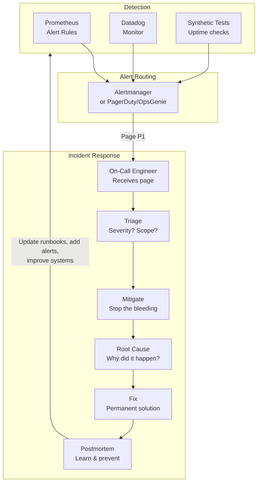

# Alerting and On-Call

## Why This Topic Exists

Observability tools generate data constantly — metrics, logs, traces, all flowing through your systems 24/7. But data by itself does not fix problems. Someone needs to be notified when something goes wrong and needs to act on it.

**Alerting** is the bridge between observability data and human action. **On-call** is the practice of having engineers responsible for production systems outside business hours. Together, they are how real engineering teams keep systems running — not by preventing all failures (impossible), but by detecting them fast and recovering faster.

This topic covers what separates well-run engineering teams from ones that get burned out by noisy alerts and chaotic incidents.

---

## Learning Objectives

By the end of this topic, you will be able to:

- Define what makes an alert good vs. bad
- Describe how alert routing works and the tools used (PagerDuty, OpsGenie)
- Explain how on-call rotations work and why they exist
- Walk through the incident response lifecycle from detection to postmortem
- Explain what a blameless postmortem is and why it matters
- Define MTTD and MTTR and describe how to improve them
- Describe what a runbook is and why every alert should have one

---

## Prerequisites

- Understanding of metrics and monitoring (topic 03)
- Basic familiarity with SLIs, SLOs, and SLAs
- Understanding of what production incidents are (systems that fail and affect users)

---

## Introduction

Every system will eventually fail. A database crashes, a deployment introduces a bug, a dependency goes down, traffic spikes beyond capacity. The question is not whether something will go wrong — it will. The question is: how quickly do you find out, and how quickly do you fix it?

Alerting and on-call practices answer both questions. Good alerting means you detect problems within seconds or minutes. Good on-call practices mean someone responds, triages, and fixes it systematically.

The goal is not to eliminate all incidents. It is to make incidents rare, short, and learning opportunities rather than disasters.

---

## Real-World Analogy

Think about a **fire station**. Firefighters do not stand watching every building 24/7. Instead:
- **Sensors** (smoke detectors, fire alarms) detect abnormal conditions automatically
- When a sensor trips, a **dispatch center** receives the alert and routes it to the right fire station
- The **on-call crew** responds according to practiced procedures (runbooks)
- After major incidents, there is a **review** to understand what happened and how to prevent recurrence

The fire department does not blame the firefighter who was on duty when the fire started. They study the incident to improve processes, equipment, and prevention.

Good engineering on-call works exactly the same way.

---

## Core Concepts

### What Makes a Good Alert

Most engineering teams suffer from one of two failure modes:

**Too few alerts:** Problems go undetected for hours or days. Users notice before engineers do.

**Alert fatigue:** Hundreds of alerts firing daily, most of them low-priority or duplicates. Engineers start ignoring alert notifications. When a real emergency fires, it blends into the noise.

Alert fatigue is extremely common and extremely dangerous. The solution is not "add more alerts" — it is designing every alert carefully.

**A good alert has these properties:**

| Property | Description | Example |
|----------|-------------|---------|
| **Actionable** | When this alert fires, there is a specific thing to do | "Payment error rate > 1% → check payment service logs, follow runbook" |
| **Significant** | Something a user would notice or be affected by | "P99 checkout latency > 3 seconds" |
| **Accurate** | Low false positive rate | Does not fire for normal traffic spikes |
| **Specific** | Points at one component or metric | Not "something is wrong with the system" |
| **Has a runbook** | Links to step-by-step response instructions | Every alert should have a runbook URL |
| **Right recipient** | Goes to the person who can fix it | Database alert → database on-call, not frontend engineer |

**Alert on symptoms, not causes.** Alert "checkout error rate is high" rather than "database CPU is high." CPU being high may not affect users; high error rate definitely does.

### Paging vs Non-Paging Alerts

Not all alerts should wake someone up at 3 AM.

| Priority | Response | When | Example |
|----------|----------|------|---------|
| **P1 / Critical** | Page immediately (24/7) | SLO breach, data loss risk, major user impact | Payment service down |
| **P2 / High** | Page during business hours | Degraded performance, non-critical feature failing | Recommendation service slow |
| **P3 / Medium** | Ticket/Slack notification | Non-user-facing, can wait | Disk at 70% capacity |
| **P4 / Low** | Weekly report | Informational | Log storage at 50% |

Only P1 alerts should wake people up. Everything else can wait for business hours or a weekly review.

### Alert Routing: PagerDuty and OpsGenie

When an alert fires in Prometheus/Grafana/Datadog, something needs to route that alert to the right person at the right time. This is where **alert management tools** come in.

**PagerDuty** and **OpsGenie** are the two most popular platforms. They handle:
- **Routing**: Route "payment service" alerts to the payment team, "database" alerts to the DBA team
- **Escalation**: If the first on-call engineer doesn't acknowledge within 10 minutes, escalate to their manager
- **Schedules**: Manage on-call rotations (who is on call this week?)
- **Silencing**: Suppress alerts during planned maintenance windows
- **Incident management**: Group related alerts into a single incident
- **Integrations**: Connect to Slack, email, phone, SMS, GitHub

---

## Visual Diagram (Mermaid)



---

## Deep Explanation

### On-Call Rotations

An **on-call rotation** is a schedule where engineers take turns being the first responder for production incidents. Typically structured as:

- **Primary on-call**: The first person paged when an alert fires
- **Secondary on-call**: Backup if primary doesn't respond
- **Escalation chain**: Manager, director — for when the incident is very severe

Rotation schedules vary:
- **Weekly rotation**: One engineer is primary for a full week
- **Follow-the-sun**: Teams in different time zones hand off at the end of their workday, so someone in their local daytime hours is always primary

**Healthy on-call practices:**
- **Compensate on-call time**: Engineers on call work harder; compensate with extra pay or time off
- **Limit overnight pages**: If engineers are paged every night, burnout follows. Work to reduce alert noise.
- **Handoff ritual**: At the end of an on-call shift, brief the incoming on-call on recent incidents and known issues
- **Shadow rotations**: Junior engineers shadow senior on-call before being added to the rotation

### Incident Response Lifecycle

When an alert fires and the on-call engineer is paged, there is a standard lifecycle:

#### 1. Detect
The alert fires. The on-call engineer is paged. Time matters — every minute of detection delay is downtime for users.

Key metric: **MTTD (Mean Time to Detect)** — how long between a problem starting and the alert firing.

#### 2. Triage
Answer three questions quickly:
- How bad is it? (1% of users affected? 100%? Revenue-impacting?)
- What component? (Payment service? Database? CDN?)
- How urgent? (P1 page everyone? P2 can wait until morning?)

Keep this phase short — minutes, not hours. Don't solve the problem yet, just understand the scope.

#### 3. Mitigate
**Stop the bleeding.** This is not the permanent fix — it is the fastest way to reduce user impact.

Common mitigations:
- Roll back the last deployment
- Increase circuit breaker timeout
- Route traffic to a different region
- Temporarily disable a non-critical feature
- Add more servers to handle load

Mitigation's goal: reduce user impact as fast as possible, even if the root cause is unknown.

#### 4. Root Cause Analysis
Once users are no longer impacted (or impact is reduced), investigate why it happened. Use logs, metrics, and traces to understand the chain of events.

#### 5. Fix
Implement a permanent solution. This might take hours or days — that is fine. The mitigation already restored service.

#### 6. Postmortem
After every significant incident, write a postmortem document. This is the most valuable part of the entire process.

Key metric: **MTTR (Mean Time to Recover/Resolve)** — from detection to resolution. Good teams aim for MTTR under 30 minutes for most incidents.

### Blameless Postmortems

The concept of the **blameless postmortem** comes from Google's SRE practice and has been adopted by Netflix, Etsy, Airbnb, and most modern engineering organizations.

The key insight: **humans do not intentionally cause incidents**. When an engineer deploys a bug that causes an outage, they were doing their best with the information they had. Blaming them:
- Doesn't prevent the next incident
- Creates a culture of fear where engineers hide mistakes
- Loses the learning opportunity

Instead, a blameless postmortem asks: **what systemic issues allowed this to happen?**

**A blameless postmortem document includes:**

| Section | Content |
|---------|---------|
| **Incident Summary** | What happened, how long, how many users affected |
| **Timeline** | Minute-by-minute: when did what happen? |
| **Root Cause** | The technical explanation of why it happened |
| **Contributing Factors** | What made it worse or harder to detect? |
| **What Went Well** | What did the team do right? |
| **What Went Poorly** | Where did processes break down? |
| **Action Items** | Specific tasks (with owners and deadlines) to prevent recurrence |

The last section — **action items** — is the whole point. If a postmortem produces no action items, it was a waste of time. Action items might include: adding a missing alert, improving a runbook, adding a deployment check, adding a circuit breaker, improving documentation.

The culture of blamelessness is what allows teams to be honest in postmortems and actually learn. "We should have caught this in testing" is useful. "Bob should have been more careful" is not.

### Runbooks

A **runbook** is a document that describes how to respond to a specific type of incident. Every P1 and P2 alert should link to a runbook.

A good runbook includes:
- What this alert means
- What immediate impact to check (which users? which regions?)
- Step-by-step troubleshooting guide
- Common causes and how to diagnose each
- Mitigation options with specific commands
- Escalation path (when to call the database team, when to engage your cloud provider's support)

Runbooks should be treated as living documents — updated after every related incident.

### MTTD and MTTR

These are the two most important metrics for measuring your incident response capability:

| Metric | Definition | How to Improve |
|--------|-----------|----------------|
| **MTTD** (Mean Time to Detect) | Average time between a problem starting and an alert firing | Add more/better alerts, improve synthetic monitoring, reduce alert thresholds |
| **MTTR** (Mean Time to Recover) | Average time from alert to incident resolved | Better runbooks, faster mitigation options (feature flags, easy rollback), on-call training |

A team that detects incidents in 2 minutes and resolves them in 15 minutes will have dramatically better SLOs than one that detects in 30 minutes and resolves in 3 hours — even if they have exactly the same number of incidents.

**Industry benchmarks (approximate):**
- World-class MTTD: < 5 minutes
- World-class MTTR: < 30 minutes
- Average MTTD: 20-30 minutes
- Average MTTR: 2-4 hours

---

## Step-by-Step Example

### Responding to a Production Incident

**Scenario:** 3 AM. You receive a PagerDuty page: "Payment service error rate > 5% for 5 minutes."

**Step 1: Acknowledge the alert** (30 seconds)
You acknowledge in PagerDuty to stop escalation. You are now the incident commander.

**Step 2: Open the runbook** (1 minute)
The alert links to "Payment Service High Error Rate Runbook." It says: check the Grafana dashboard, look at the last deployment time, check downstream dependencies.

**Step 3: Triage** (3 minutes)
- Grafana: error rate is 7%, started at 2:52 AM
- Last deployment: 2:48 AM (4 minutes before the spike)
- Traces: failures are all in the Stripe API call
- Logs: "Stripe API: 401 Unauthorized"

**Step 4: Mitigate** (2 minutes)
The Stripe API key is invalid — the deployment probably rotated credentials incorrectly. Fastest mitigation: roll back the deployment.

```bash
kubectl rollout undo deployment/payment-service
```

**Step 5: Confirm recovery** (2 minutes)
Error rate drops from 7% to 0.1% within 2 minutes. Users can complete payments again.

**Step 6: Root cause** (next day)
The deployment automated a credential rotation but the new Stripe API key was not yet activated in the Stripe dashboard. The credential rotation script had a timing issue.

**Step 7: Postmortem** (next day)
- Root cause: Credential rotation script does not verify the new key is active before deploying
- Action item 1: Add a pre-deployment check that validates the Stripe API key works
- Action item 2: Add a synthetic test that performs a $0.01 test charge every 5 minutes to detect Stripe issues
- Action item 3: Improve the runbook to include "check Stripe API key validity"

Total incident duration: 12 minutes. Zero blame. Three improvements to prevent recurrence.

---

## Advantages / Disadvantages / Trade-offs

| | Advantage | Disadvantage |
|--|-----------|--------------|
| **Many alerts** | Catch more problems quickly | Alert fatigue; engineers stop responding |
| **Few strict alerts** | Low fatigue, high confidence when it fires | Slow detection; user-visible before engineer-visible |
| **Weekly on-call rotation** | Spreads burden | Context loss at handoff |
| **Dedicated SRE team** | Deep expertise, consistent quality | Expensive; creates bottleneck |
| **Blameless culture** | Honest postmortems, systemic improvements | Harder to implement in blame-heavy organizations |

---

## Common Interview Questions

**Q: What makes a good alert?**
A: A good alert is actionable (there is a specific response to take), symptom-based (alerts on user impact, not internal metrics), specific (points to one component), accurate (low false positive rate), and linked to a runbook.

**Q: What is a blameless postmortem?**
A: A structured incident review focused on systemic causes rather than individual blame. The goal is to identify what process, tooling, or system changes would prevent similar incidents — not to find who made a mistake.

**Q: What is the difference between MTTD and MTTR?**
A: MTTD (Mean Time to Detect) is how long it takes to discover that something is wrong. MTTR (Mean Time to Recover) is how long it takes to restore service after detection. Both are key SLO metrics for reliability.

---

## Common Beginner Mistakes

1. **Alerting on causes (CPU, memory) rather than symptoms (error rate, latency).** High CPU may or may not affect users. Alert on what users experience.

2. **Not having runbooks.** An on-call engineer paged at 3 AM should not have to think through the entire debugging process from scratch. A runbook captures the steps for the most common failure modes.

3. **Never reviewing or retiring old alerts.** Systems change. Alerts set up 2 years ago may no longer be relevant or may be too sensitive for current traffic. Review and prune alerts quarterly.

4. **Blaming individuals in postmortems.** This immediately stops honest discussion. Everyone will say "we did everything right" to avoid blame. You learn nothing.

5. **Creating action items without owners or deadlines.** An action item without a name and a due date is just a wish. Assign every action item to a specific person with a specific date.

---

## Summary

Alerting and on-call are the human layer of observability — how people respond when the system signals a problem. Good alerts are actionable, symptom-based, and specific. Alert management platforms (PagerDuty, OpsGenie) route alerts to the right team, manage escalation, and organize on-call schedules. The incident response lifecycle moves through detect, triage, mitigate, root cause, fix, and postmortem. Blameless postmortems create a culture of learning rather than blame. MTTD and MTTR measure how good your incident response is. Runbooks make on-call sustainable.

---

## Key Takeaways

- Alert on symptoms (error rate, latency) not causes (CPU, memory)
- Good alerts are actionable, accurate, specific, and linked to runbooks
- PagerDuty/OpsGenie route alerts, manage escalation, and schedule on-call
- Incident lifecycle: Detect → Triage → Mitigate → Root Cause → Fix → Postmortem
- Mitigation (stop the bleeding) comes before root cause analysis
- Blameless postmortems improve systems, not blame people
- Action items need owners and deadlines — otherwise they don't get done
- MTTD measures how fast you find problems; MTTR measures how fast you fix them

---

## Related Topics (relative markdown links)

- [01. The Three Pillars of Observability (BEGINNER)](./01.%20The%20Three%20Pillars%20of%20Observability%20(BEGINNER).md)
- [03. Metrics and Monitoring (INTERMEDIATE)](./03.%20Metrics%20and%20Monitoring%20(INTERMEDIATE).md)
- [04. Distributed Tracing (INTERMEDIATE)](./04.%20Distributed%20Tracing%20(INTERMEDIATE).md)
- [06. Performance Profiling (INTERMEDIATE)](./06.%20Performance%20Profiling%20(INTERMEDIATE).md)
- [Chapter 11: Reliability and Fault Tolerance](../11.%20Reliability%20and%20Fault%20Tolerance/)
