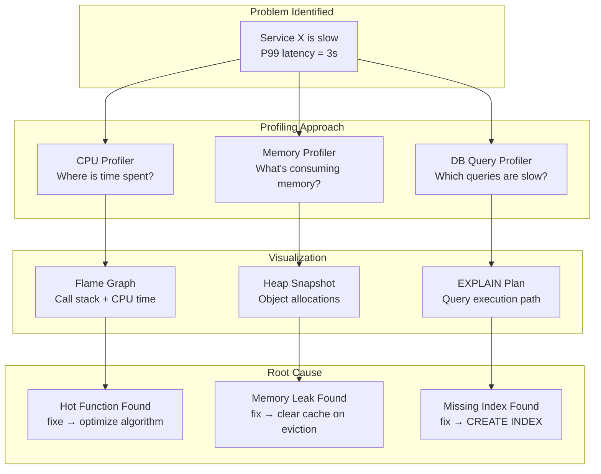

# Performance Profiling

## Why This Topic Exists

Your metrics tell you that a service is slow. Your traces tell you which service is the bottleneck. But neither tells you **why** the service itself is slow. Is it spending too much time in a specific function? Is it allocating memory faster than it can free it? Is it waiting on a database query that is missing an index?

**Profiling** is the practice of measuring exactly where a running program spends its time and memory. It answers the most important question in performance optimization: **where should I focus my effort?**

Without profiling, engineers guess. They optimize the parts of the code they wrote recently, or the parts that look complex. Often, the real bottleneck is somewhere entirely unexpected — a third-party library, a regex that runs thousands of times per request, a database query in an inner loop. Profiling removes the guesswork.

---

## Learning Objectives

By the end of this topic, you will be able to:

- Explain the difference between CPU profiling and memory profiling
- Read and interpret a flame graph
- Describe what continuous profiling is and when it is used
- Name key APM tools (New Relic, Datadog APM) and what they provide
- Describe database query profiling with EXPLAIN plans and slow query logs
- Explain the difference between benchmarking and profiling
- Walk through a real example of finding and fixing a memory leak in production

---

## Prerequisites

- Understanding of how programs execute (functions calling other functions)
- Familiarity with distributed tracing (topic 04) and the concept of bottlenecks
- Basic understanding of how memory allocation works (heap vs stack is helpful but not required)

---

## Introduction

There is a famous quote attributed to Donald Knuth: "Premature optimization is the root of all evil." The full quote continues: "yet we should not pass up our opportunities in that critical 3% of code."

The point is that in any program, **a very small fraction of the code accounts for the vast majority of the execution time.** Profiling finds that 3%. Without profiling, you are optimizing at random. With profiling, every optimization effort is targeted and effective.

Profiling is the investigative tool that comes after tracing narrows the problem to one service. Tracing says "Service X is slow." Profiling says "Function Y inside Service X is responsible for 73% of the CPU time."

---

## Real-World Analogy

Imagine you are trying to improve the speed of an assembly line at a car factory. You could hire more workers everywhere, or upgrade all the machinery. But that is expensive and slow.

Instead, you study the assembly line carefully. You time every station. You find that 80% of the time, cars are waiting at one specific station — the painting station — because the paint drying takes 4 times longer than expected.

You focus your investment there: better drying technology, parallel drying booths. The entire assembly line speeds up dramatically for a fraction of the cost of improving everything.

**Profiling** is that time study of your assembly line. It tells you exactly which station (function, query, library call) is the bottleneck so you can focus your effort.

---

## Core Concepts

### CPU Profiling

**CPU profiling** measures where a program spends its execution time. It answers: "which functions are using the most CPU?"

There are two main approaches:

#### 1. Sampling Profiler

The profiler periodically (e.g., every 10ms) pauses the program and records what the call stack looks like. After thousands of samples, you can see which functions appear most often in the stack — those are the functions consuming the most CPU.

Pros: Low overhead (1-5%), safe for production use
Cons: Misses very short-duration events, statistical approximation

#### 2. Instrumentation Profiler

The profiler modifies the code (or uses hooks) to record every function entry and exit. This gives exact counts and timings for every function call.

Pros: Precise, complete picture
Cons: High overhead (10-100%), not suitable for production

For production profiling, always use sampling profilers.

### Memory Profiling

**Memory profiling** measures how a program uses memory. It answers:
- What types of objects are consuming memory?
- How much memory is allocated per request?
- Are objects being held in memory longer than necessary (memory leaks)?

Key concepts in memory profiling:

**Heap profiling**: Records memory allocations on the heap — where long-lived objects live. Shows which code paths allocate the most memory.

**Memory leak**: A situation where memory is allocated but never freed, causing total memory usage to grow continuously over time. Eventually the process runs out of memory and crashes.

Common causes of memory leaks:
- Caches without eviction policies (cache grows forever)
- Event listeners that are added but never removed
- Circular references preventing garbage collection
- Accumulating objects in a global list or map

**Garbage collection pressure**: Even without leaks, allocating too many short-lived objects forces the garbage collector (GC) to run frequently, causing GC pauses that degrade throughput.

### Flame Graphs

A **flame graph** is the most important visualization for CPU profiling. Created by Brendan Gregg, it shows the call stack on the Y-axis and time on the X-axis.

How to read a flame graph:
- **Width of a bar** = how much CPU time that function took (including all its children)
- **Position in the stack** = call hierarchy (callers are below, callees are above)
- **Wide bars near the top** = hot functions consuming lots of CPU
- **Wide bars near the bottom** = the callers that invoked those hot functions

```
┌──────────────────────────────────────────────────────────────────┐
│ main                                           100%              │
├─────────────────────────┬────────────────────────────────────────┤
│ handleRequest 45%       │ serializeResponse 55%                  │
├───────┬────────────────┬┼─────────────────────┬──────────────────┤
│auth   │ queryDB 38%    ││ jsonEncode 25%       │ compressData 30% │
│ 7%    ├───────┬────────┤│ ├─────┬──────────── ├──────────────────┤
│       │ SQL   │ index  ││ │str  │ mapAlloc 15%│ gzip 30%         │
│       │ parse │ scan   ││ │conv │             │                  │
│       │ 5%    │ 33% ←! ││ │ 10% │             │                  │
└───────┴───────┴────────┴┴─┴─────┴─────────────┴──────────────────┘
         ↑ WIDE bar near top = HOT SPOT
         index scan taking 33% of total time → missing index!
```

In this example, the `index scan` bar is wide — it means a lot of time is spent scanning without an index. Adding a database index would fix 33% of your CPU time.

Flame graphs are generated by tools like:
- `pprof` (Go)
- `async-profiler` / JFR (Java)
- `py-spy` (Python)
- `perf` (Linux, for C/C++)
- Pyroscope (continuous profiler, language-agnostic)

### Continuous Profiling

Traditional profiling is **manual and on-demand**: you notice a problem, you attach a profiler, you collect data, you analyze. This has a major flaw: you might not notice the problem until it is already severe, and production behavior is hard to reproduce on demand.

**Continuous profiling** runs a low-overhead sampling profiler **always**, in production, and stores the profile data. This lets you:
- Investigate past performance issues after the fact
- Detect gradual performance regressions before they become critical
- Compare profiling data "before and after" a deployment

Key continuous profiling tools:
- **Pyroscope** (open source, works with many languages)
- **Datadog Continuous Profiler** (commercial)
- **Google Cloud Profiler** (managed, low cost)
- **Async-profiler with JFR** (Java, low overhead)

Continuous profiling is increasingly becoming standard practice at companies like Shopify, Cloudflare, and Robinhood.

---

## Visual Diagram (Mermaid)



---

## Deep Explanation

### APM Tools: Application Performance Management

**APM (Application Performance Management)** tools combine profiling, tracing, and metrics into a single platform. They automatically instrument your code, collect performance data, and present it in a unified dashboard.

Major APM tools:

| Tool | Type | Strengths |
|------|------|-----------|
| **Datadog APM** | Commercial | Full observability platform, excellent UI, correlates traces + metrics + logs |
| **New Relic** | Commercial | Long history, good for JVM apps, detailed transaction traces |
| **Dynatrace** | Commercial | AI-powered root cause analysis, automatic dependency mapping |
| **Elastic APM** | Open source (with commercial tier) | Integrates with ELK stack, good for teams already using Elasticsearch |
| **Jaeger + OpenTelemetry** | Open source | Best value for tracing; pair with Pyroscope for profiling |

APM tools provide:
- **Transaction tracing**: Detailed timing of every layer in a request (similar to distributed tracing but within a single service)
- **Database query monitoring**: See every database query, its duration, and execution plan
- **Error tracking**: Capture and group exceptions with stack traces
- **Service maps**: Visual diagram of how services call each other
- **Apdex scores**: A standardized measure of user satisfaction based on response time

### Database Query Profiling

Database queries are the most common performance bottleneck in web applications. Two key tools:

#### EXPLAIN Plans

Most databases (PostgreSQL, MySQL) support an `EXPLAIN` command that shows how the database will execute a query — without actually running it.

```sql
EXPLAIN SELECT * FROM orders WHERE user_id = 12345 AND status = 'pending';
```

Output (PostgreSQL):
```
Seq Scan on orders  (cost=0.00..10234.56 rows=3 width=200)
  Filter: ((user_id = 12345) AND (status = 'pending'::text))
```

`Seq Scan` means the database is reading every single row in the table to find the matching ones. On a 10 million row table, this is very slow.

After adding an index:
```sql
CREATE INDEX idx_orders_user_status ON orders(user_id, status);
```

```
Index Scan using idx_orders_user_status on orders  (cost=0.43..8.47 rows=3 width=200)
  Index Cond: ((user_id = 12345) AND (status = 'pending'::text))
```

`Index Scan` means the database jumps directly to the matching rows using the index. Dramatically faster.

`EXPLAIN ANALYZE` actually runs the query and shows real execution times, not just estimates.

#### Slow Query Log

Most databases can be configured to log any query that takes longer than a threshold:

```sql
-- MySQL
SET GLOBAL slow_query_log = ON;
SET GLOBAL long_query_time = 1;  -- log queries > 1 second
```

The slow query log shows you which queries are slow in production without having to manually check every query. Review it weekly and add indexes or rewrite queries as needed.

Tools like **Percona Toolkit** (for MySQL) and **pgBadger** (for PostgreSQL) parse slow query logs and generate reports showing the worst offenders.

### Benchmarking vs Profiling

These terms are often confused:

| | Benchmarking | Profiling |
|--|-------------|-----------|
| **Question** | How fast is this code? | Why is this code slow? |
| **Output** | A number (ops/second, latency) | A breakdown of where time is spent |
| **When** | Comparing two implementations, regression testing | Finding bottlenecks to optimize |
| **Example** | "This serializer handles 50,000 ops/second" | "60% of time is in the compression step of serialization" |

**You benchmark to measure. You profile to understand.**

The typical workflow:
1. Notice (from metrics/tracing) that something is slow
2. **Profile** to find where the time goes
3. Fix the bottleneck
4. **Benchmark** before and after to verify the improvement
5. Check that production metrics confirm the improvement

---

## Step-by-Step Example

### Finding and Fixing a Memory Leak in Production

**Scenario:** A Java service's memory usage grows by ~50MB every hour. After 48 hours, it runs out of memory and crashes (OutOfMemoryError). The service is restarted automatically but crashes every 2 days like clockwork.

**Step 1: Confirm the leak with metrics.**
You look at the Grafana dashboard for JVM heap usage over 7 days. You see a sawtooth pattern: memory grows steadily, then drops sharply (that's the restart). The slope of growth has been the same for weeks.

**Step 2: Enable continuous profiling (or attach a profiler).**
You enable Java Flight Recorder (JFR) with a 2-minute rolling window. After 4 hours of collection, you open a heap snapshot in IntelliJ's profiler view.

**Step 3: Analyze the heap snapshot.**
The heap snapshot shows object counts and sizes. You see:

```
Top objects by count:
1. String[]           8,241,332  (821 MB)
2. HashMap$Entry[]   2,104,223  (210 MB)
3. SessionData       1,024,000  (512 MB)  ← suspicious!
```

1 million `SessionData` objects is unexpected. Sessions should expire after 30 minutes.

**Step 4: Trace the allocation.**
You expand the `SessionData` references. They are all held by a `ConcurrentHashMap` called `sessionCache`. The map has 1,024,000 entries.

**Step 5: Read the code.**
```java
private final Map<String, SessionData> sessionCache = new ConcurrentHashMap<>();

public void createSession(String userId, SessionData data) {
    sessionCache.put(userId, data);
    // Bug: nothing ever removes sessions!
}
```

The session cache puts sessions in but never removes them. There is no expiration or eviction.

**Step 6: Fix.**
Replace the plain `ConcurrentHashMap` with a cache that has TTL-based eviction:
```java
private final Cache<String, SessionData> sessionCache = Caffeine.newBuilder()
    .expireAfterAccess(30, TimeUnit.MINUTES)
    .maximumSize(100_000)
    .build();
```

**Step 7: Verify the fix.**
After deploying:
- Memory usage is now flat (no longer growing)
- The sawtooth pattern disappears
- Heap usage stays around 200MB indefinitely
- Service has not crashed in 3 weeks

**Post-analysis:** This leak was introduced 6 months ago when the session caching feature was added. A code review could have caught the missing eviction policy. The team added a lint rule to require TTL on all cache constructions.

---

## Advantages / Disadvantages / Trade-offs

| | Advantage | Disadvantage |
|--|-----------|--------------|
| **Sampling Profiler** | Low overhead (1-5%), safe in production | Statistical — misses very short functions |
| **Instrumentation Profiler** | Precise and complete | High overhead, not for production |
| **Continuous Profiling** | Catch regressions, investigate past issues | Storage cost, requires infrastructure |
| **APM Tools** | Unified platform, auto-instrumentation | Expensive (Datadog, New Relic are not cheap) |
| **EXPLAIN Plan** | Shows query execution path | Estimates can differ from actual; need EXPLAIN ANALYZE for real data |

---

## When to Use / When NOT to Use

**Use CPU profiling when:**
- Metrics show a service consuming more CPU than expected
- Request latency is high and traces point to one service but not a specific span
- A deployment caused CPU to spike

**Use memory profiling when:**
- Memory usage grows over time without recovering
- The service is crashing with OutOfMemoryError
- GC pauses are visible in metrics (JVM, Python, Ruby)

**Use database profiling when:**
- Database is the bottleneck in your traces
- Query latency spikes at certain times
- You are adding a new feature with database queries

**Do NOT profile in production with instrumentation profilers.** The overhead can be severe enough to make a slow service crash. Use sampling profilers (low overhead) for production.

---

## Common Interview Questions

**Q: What is a flame graph and how do you read it?**
A: A flame graph is a visualization of profiling data. The Y-axis shows the call stack (callers at bottom, callees at top). The X-axis shows time. Wide bars indicate functions consuming lots of CPU. The widest bar near the top is the hottest function — the best optimization target.

**Q: What is a memory leak?**
A: Memory that is allocated by a program but never freed, causing total memory usage to grow continuously over time. In garbage-collected languages, this typically means references to objects are kept alive (e.g., in a global map) even when the objects are no longer needed.

**Q: What is the difference between profiling and benchmarking?**
A: Profiling identifies where time or memory is spent — it explains *why* something is slow. Benchmarking measures how fast something is — it answers *how fast*. You profile to find what to optimize, then benchmark to verify the improvement worked.

---

## Common Beginner Mistakes

1. **Optimizing without profiling first.** Engineers often optimize the code they wrote recently or the code that looks complex. Profiling reveals that the bottleneck is usually somewhere unexpected.

2. **Using instrumentation profilers in production.** The 10-100x overhead can take a service down. Use sampling profilers (pprof, async-profiler, py-spy) for production.

3. **Not differentiating CPU time from wall time.** If your service spends 2 seconds waiting for a network call, that does not show up as CPU time. You need I/O profiling or distributed traces to find I/O bottlenecks.

4. **Missing the `EXPLAIN ANALYZE` distinction.** `EXPLAIN` shows the query planner's estimate. `EXPLAIN ANALYZE` runs the query and shows real timings. Always use `EXPLAIN ANALYZE` when debugging a specific slow query.

5. **Fixing symptoms rather than root causes.** Restarting a service with a memory leak is a mitigation. The root cause (missing eviction policy) still needs to be fixed.

---

## Summary

Performance profiling is the practice of measuring exactly where a program spends time and memory. CPU profiling and flame graphs show which functions consume the most CPU. Memory profiling and heap snapshots find memory leaks and allocation hotspots. Continuous profiling runs low-overhead profilers always in production, enabling historical investigation and regression detection. APM tools combine profiling with tracing and metrics. Database profiling with EXPLAIN plans and slow query logs identifies missing indexes and inefficient queries. Benchmarking measures speed; profiling explains why.

---

## Key Takeaways

- Profile first, optimize second — never guess at bottlenecks
- Sampling profilers (pprof, async-profiler, py-spy) are safe for production; instrumentation profilers are not
- Flame graphs show CPU time by call stack — wide bars near the top are the hotspots
- Memory leaks: allocated memory never freed, causing usage to grow without bound
- Continuous profiling (Pyroscope, Datadog) runs always-on profiling in production
- APM tools (Datadog APM, New Relic) combine profiling, tracing, and metrics in one platform
- EXPLAIN ANALYZE shows real database query execution paths — essential for finding missing indexes
- Benchmarking measures; profiling explains — use both together to verify improvements

---

## Related Topics (relative markdown links)

- [01. The Three Pillars of Observability (BEGINNER)](./01.%20The%20Three%20Pillars%20of%20Observability%20(BEGINNER).md)
- [03. Metrics and Monitoring (INTERMEDIATE)](./03.%20Metrics%20and%20Monitoring%20(INTERMEDIATE).md)
- [04. Distributed Tracing (INTERMEDIATE)](./04.%20Distributed%20Tracing%20(INTERMEDIATE).md)
- [05. Alerting and On-Call (INTERMEDIATE)](./05.%20Alerting%20and%20On-Call%20(INTERMEDIATE).md)
- [Chapter 04: Databases](../04.%20Databases/)
- [Chapter 16: Performance](../16.%20Performance/)
