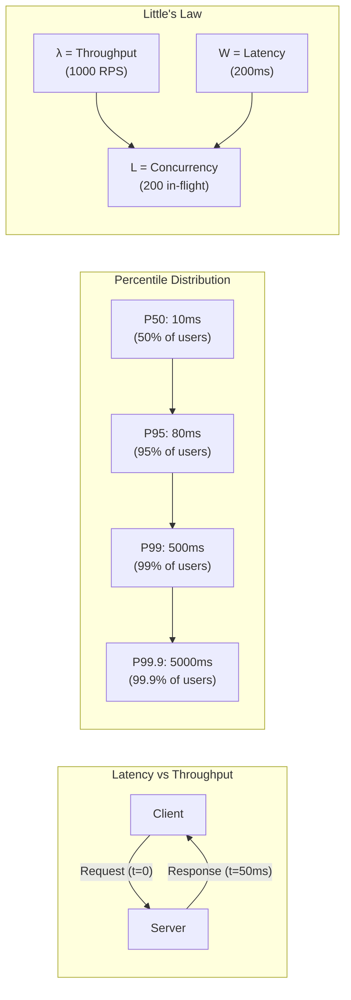

# Latency vs Throughput

## Why This Topic Exists

Every conversation about system performance starts with two numbers: how fast is it, and how many can it handle? These two questions sound similar but they measure completely different things. Confusing them — or not understanding how they interact — leads to wrong diagnoses, wrong solutions, and failed interviews.

Engineers who cannot speak precisely about latency and throughput cannot communicate clearly with teammates, cannot debug production incidents correctly, and cannot design systems that meet real service-level objectives. This topic is the vocabulary foundation for everything else in performance engineering.

---

## Learning Objectives

By the end of this file you will be able to:

- Define latency and throughput precisely and give examples of each
- Explain why average latency is misleading and use percentiles correctly
- Explain what tail latency is and why it matters to end users
- Apply Little's Law to reason about concurrency, latency, and throughput
- Describe the relationship between latency and throughput with real numbers

---

## Prerequisites

- Basic understanding of client-server communication
- Familiarity with the concept of a request and a response
- No math beyond multiplication and division is required

---

## Introduction

Imagine you own a pizza restaurant. Two questions matter to your business:

1. How long does one customer wait from ordering to receiving their pizza? (**Latency**)
2. How many pizzas can you make per hour? (**Throughput**)

These are related but independent. A very efficient kitchen might make 200 pizzas per hour (high throughput) but each pizza still takes 15 minutes (high latency). A slow artisan pizzeria might take 5 minutes per pizza (low latency) but only make 20 per hour (low throughput) because there is only one oven.

In computing, latency and throughput behave the same way. Understanding them — and understanding how to measure them correctly — is the first step toward any performance work.

---

## Real-World Analogy

Think of a highway:

- **Latency** is how long it takes one car to drive from city A to city B. If traffic is light, that is 2 hours. If there is a traffic jam, that might be 5 hours.
- **Throughput** is how many cars pass through the toll booth per hour. A 4-lane highway has higher throughput than a 2-lane road, but the travel time (latency) does not automatically improve.

You can widen the highway (add lanes, increase throughput) without making the individual journey faster. You can also clear traffic jams (reduce latency) without changing the number of lanes.

---

## Core Concepts

### Latency

**Latency** is the time from when a request is sent to when the response is fully received. It is measured in milliseconds (ms) or microseconds (µs) for fast systems.

Typical latency targets:

| Operation | Typical Latency |
|---|---|
| L1 cache reference | 0.5 ns |
| RAM reference | 100 ns |
| SSD random read | 100 µs |
| Network round-trip (same datacenter) | 0.5 ms |
| Network round-trip (cross-continent) | 100 ms |
| Database query (simple) | 1–10 ms |
| Database query (complex, no index) | 100–8000 ms |
| HTTP API call (typical) | 50–300 ms |

These numbers matter. Memorize the orders of magnitude. RAM is 200x faster than SSD. A cross-continent network call is 200x slower than a datacenter round-trip. These gaps determine where your optimization efforts should go.

### Throughput

**Throughput** is the number of requests (or units of work) completed per unit of time. It is usually measured in:

- **RPS** — requests per second (web services)
- **TPS** — transactions per second (databases)
- **QPS** — queries per second (databases, search engines)
- **Mbps/Gbps** — megabits or gigabits per second (networks)

Examples of throughput targets:

| System | Approximate Throughput |
|---|---|
| Small startup API | 100–500 RPS |
| Mid-size web service | 1,000–10,000 RPS |
| Twitter at peak | ~300,000 TPS |
| Visa payment network | ~65,000 TPS |
| Google Search | ~99,000 QPS |

### Why Averages Lie: Percentiles

This is one of the most important concepts in performance engineering. Most engineers, when asked "what is your latency?" will say something like "our average response time is 50ms." This number is almost always misleading.

Here is why. Suppose you have 1,000 requests:
- 990 requests complete in 10ms
- 9 requests complete in 100ms
- 1 request takes 5,000ms (5 seconds)

The average latency = (990 × 10 + 9 × 100 + 1 × 5000) / 1000 = (9900 + 900 + 5000) / 1000 = **15.8ms**

The average looks great. But one user waited 5 full seconds. If you report "15ms average" to your product team, they think everything is fine. The 5-second experience is invisible.

Percentiles solve this problem.

**P50 (median):** 50% of requests complete within this time. In the example above, P50 = 10ms. Half of users experience this or better.

**P95:** 95% of requests complete within this time. 5% of users experience this or worse. P95 is a useful "mostly good" target.

**P99:** 99% of requests complete within this time. 1% of users experience this or worse. In a system handling 10,000 RPS, 1% is 100 users per second seeing bad performance.

**P99.9:** 99.9% of requests complete within this time. In a system with 1,000,000 daily users, 0.1% is 1,000 users per day with a terrible experience.

In the example above:
- P50 = 10ms
- P95 = 10ms (still within the fast bucket)
- P99 = 100ms
- P99.9 = 5,000ms

Now the picture is clear. Reporting all four numbers gives you a complete view of the user experience.

### Tail Latency

**Tail latency** refers to the high-percentile latencies — the P99, P99.9, and beyond. The name comes from the "long tail" of a latency distribution curve.

Why does the slow 1% matter so much?

1. **Fan-out effect:** Suppose a user request triggers 100 backend calls. The overall response is as slow as the slowest individual call. If each backend call has a 1% chance of being slow, the probability that at least one of the 100 calls is slow is: 1 - (0.99)^100 = 63%. So over half of all user requests will hit a slow backend call. The 1% tail becomes a 63% user problem.

2. **SLA violations:** Service Level Agreements are typically expressed at P99 or P99.9. Missing them has financial and contractual consequences.

3. **User perception:** Research by Google and Amazon shows that a 100ms increase in latency reduces sales by 1%. Users feel latency even when they cannot articulate it.

### Little's Law

Little's Law is a mathematical relationship from queuing theory that applies to any stable system:

```
L = λ × W
```

Where:
- **L** = the average number of requests in the system at any moment (concurrency)
- **λ** (lambda) = the average arrival rate (throughput, requests per second)
- **W** = the average time a request spends in the system (latency, in seconds)

This is powerful because it lets you calculate any one of the three values if you know the other two.

**Example 1:** Your web server handles 1,000 RPS. Each request takes an average of 200ms (0.2 seconds). How many concurrent requests are in flight at any moment?

```
L = λ × W
L = 1000 × 0.2
L = 200 concurrent requests
```

Your server needs to be able to hold 200 simultaneous open connections.

**Example 2:** Your database can handle 100 concurrent connections (L = 100). Each query takes 50ms (W = 0.05s). What is the maximum throughput?

```
λ = L / W
λ = 100 / 0.05
λ = 2,000 queries per second
```

If you want more than 2,000 QPS, you must either reduce query latency (W) or add more connections (L).

**Example 3:** You want to handle 5,000 RPS (λ = 5000) with a latency of 100ms (W = 0.1s). How many concurrent workers do you need?

```
L = 5000 × 0.1 = 500 concurrent workers
```

Little's Law also explains why high latency kills throughput. If your queries suddenly get slow (W increases), the number of in-flight requests (L) grows. When L exceeds your connection pool limit, new requests queue up, increasing latency further. This is a performance death spiral.

---

## Visual Diagram (Mermaid)



---

## Deep Explanation

### The Latency-Throughput Trade-off

Latency and throughput have a nuanced relationship. In general:

- **More concurrency** increases throughput up to a point, then latency starts rising
- **Batching** increases throughput but adds latency (you wait to fill a batch)
- **Caching** reduces latency and, because each request is faster, also increases throughput
- **Queueing** absorbs traffic spikes, keeping throughput stable at the cost of increased latency

The relationship is often visualized as a curve: as you push throughput toward the system's limit, latency stays flat for a while, then rises sharply. This sharp rise happens because queues start forming when the system is near capacity.

### Sources of Latency

Latency comes from multiple places, and diagnosing which one is the problem requires measurement:

| Source | Typical Cause |
|---|---|
| **Network** | Physical distance, routing hops, packet loss |
| **Serialization** | Converting objects to JSON/protobuf takes CPU time |
| **Queue wait** | Request waits for a worker thread to be available |
| **Processing** | CPU-intensive computation |
| **Database** | Missing index, lock contention, slow disk I/O |
| **External API** | Third-party service is slow |
| **GC pauses** | Garbage collector stops the world (Java/Go) |

### Throughput Ceilings

Every system has a theoretical maximum throughput. The ceiling is determined by the slowest component in the chain:

- If your database can handle 10,000 QPS and your API server can handle 100,000 RPS, your system throughput ceiling is 10,000 RPS (the database is the bottleneck).
- If your network bandwidth is 1 Gbps and each response is 100KB, your maximum throughput is 10,000 RPS regardless of how fast your server is.

Finding and lifting the bottleneck is the core of throughput optimization.

---

## Step-by-Step Example

**Scenario:** You are designing a product detail page API. Product managers require P99 latency under 200ms and support for 2,000 RPS.

**Step 1: Break down the request path**

Each API call involves:
1. Network: client → load balancer → app server (5ms)
2. Auth token validation (3ms)
3. Database query for product data (40ms)
4. Database query for inventory (40ms)
5. External API call to pricing service (80ms)
6. Response serialization (2ms)
7. Network: app server → load balancer → client (5ms)

Total: 5 + 3 + 40 + 40 + 80 + 2 + 5 = **175ms** (in sequence)

**Step 2: Check if the P99 target is achievable**

175ms average means P99 will likely be 300–500ms due to natural variance. We need to cut time.

**Step 3: Identify parallelizable work**

The two database queries and the pricing API call are independent. Run them in parallel:
- Parallel bucket: max(40ms, 40ms, 80ms) = 80ms (pricing dominates)
- Sequential: 5 + 3 + 80 + 2 + 5 = **95ms**

Now P99 target of 200ms is achievable.

**Step 4: Apply Little's Law to size the system**

With λ = 2,000 RPS and W = 95ms = 0.095s:
```
L = 2000 × 0.095 = 190 concurrent requests
```

The application server needs to support 190 concurrent threads or async coroutines. The database connection pool needs enough connections to sustain those 190 concurrent requests.

---

## Advantages / Disadvantages / Trade-offs

| Optimization | Latency Impact | Throughput Impact | Cost |
|---|---|---|---|
| Parallelizing calls | Reduces (by max, not sum) | Slight increase | Engineering time |
| Caching results | Reduces significantly | Increases | Memory cost |
| Batching requests | Increases (wait for batch) | Increases | Complexity |
| Adding replicas | May reduce (less contention) | Increases | Infrastructure cost |
| Async processing | Increases (result delayed) | Increases significantly | Complexity |

---

## When to Use / When NOT to Use

**When to focus on latency:**
- Interactive user-facing applications (search, e-commerce, dashboards)
- Real-time systems (payments, trading, gaming)
- Microservice calls within a fan-out (tail latency problem)

**When to focus on throughput:**
- Batch processing systems (ETL pipelines, data imports)
- Background jobs (email sending, report generation)
- Data streaming pipelines

**When NOT to over-optimize:**
- When the system already meets SLA with comfortable headroom
- When optimization cost exceeds business value
- Before measuring — premature optimization wastes time and adds complexity

---

## Common Interview Questions

**Q: What is the difference between latency and throughput?**

Latency is the time to complete one request. Throughput is the number of requests completed per second. They are related but not the same — you can have high throughput with high latency (batch processing) or low latency with low throughput (a single-threaded server doing fast work).

**Q: Why is P99 more important than average latency?**

Average hides outliers. In a system handling 1,000 RPS, a P99 of 2 seconds means 10 users per second are having a terrible experience. Average latency could still look good at 20ms while hiding this. SLAs are defined at P99 because it captures the worst common experience.

**Q: What is Little's Law and how do you use it?**

L = λ × W. It relates concurrency (L), throughput (λ), and latency (W). You use it to size thread pools, connection pools, and queue capacities. If you know your target throughput and expected latency, you can calculate how much concurrency your system needs.

**Q: What is tail latency and why does it matter in microservices?**

Tail latency is the latency at high percentiles (P99, P99.9). In a microservice system where one user request triggers 50 backend calls, if each call has 1% tail latency, the probability of hitting at least one slow call is 1 - 0.99^50 = 39%. So tail latency in individual services amplifies to hit most user requests in a distributed system.

---

## Common Beginner Mistakes

1. **Reporting average latency only.** Always report P50, P95, and P99 at minimum. Averages hide the tail.

2. **Confusing latency and throughput.** "Our system is slow" (latency problem) and "our system cannot handle the load" (throughput problem) require different solutions.

3. **Optimizing without measuring.** Engineers often guess the bottleneck and optimize the wrong thing. Always profile first.

4. **Ignoring Little's Law when sizing.** Under-provisioning connection pools leads to queueing, which worsens latency, which (by Little's Law) requires even more connections.

5. **Thinking low latency always means high throughput.** A single-core system might have 1ms latency but only 100 RPS throughput because it is single-threaded. Throughput also requires concurrency.

---

## Summary

Latency and throughput are the two fundamental axes of performance. Latency measures how fast one request completes; throughput measures how many complete per second. Averages lie — use percentiles (P50, P95, P99) to understand the full distribution. Tail latency at P99 amplifies dangerously in distributed systems due to the fan-out effect. Little's Law (L = λW) is the mathematical bridge between concurrency, latency, and throughput, and is essential for sizing any component in your system.

---

## Key Takeaways

- **Latency** = time for one request. **Throughput** = requests per second. They are independent.
- **Never report average latency.** Use P50, P95, P99.
- **Tail latency** at 1% becomes a 63% user problem when one request fans out to 100 backend calls.
- **Little's Law:** L = λW. Concurrency = Throughput × Latency. Use this to size thread pools and connection pools.
- High latency causes queuing, which reduces throughput — the performance death spiral.
- The bottleneck determines the system's throughput ceiling. Find it and lift it.

---

## Related Topics

- [Performance Optimization Techniques](./02.%20Performance%20Optimization%20Techniques%20%28INTERMEDIATE%29.md) — what to do once you know your bottleneck
- [Database Performance](./03.%20Database%20Performance%20%28INTERMEDIATE%29.md) — the most common source of high latency
- [Load Testing and Benchmarking](./05.%20Load%20Testing%20and%20Benchmarking%20%28INTERMEDIATE%29.md) — how to measure latency and throughput in practice
- [Chapter 06: Caching](../06.%20Caching/README.md) — the single most effective latency reducer
- [Chapter 15: Scalability](../15.%20Scalability/README.md) — scaling strategies that affect throughput
