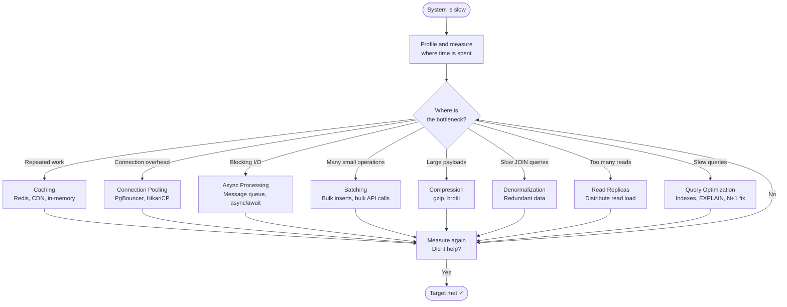

# Performance Optimization Techniques

## Why This Topic Exists

Knowing that your system is slow is only half the battle. The other half is knowing which tool to reach for. There are dozens of techniques for improving performance — caching, batching, async I/O, compression, denormalization, and more. Applied blindly, they add complexity without benefit. Applied correctly, they can reduce latency by 10x or increase throughput by 100x.

This file gives you a systematic framework: measure first, find the real bottleneck, then choose the right technique from the toolkit. Senior engineers are recognized not by knowing every optimization trick, but by knowing which trick solves which class of problem.

---

## Learning Objectives

By the end of this file you will be able to:

- Follow a structured process for finding and fixing performance bottlenecks
- Explain eight core performance optimization techniques and when to apply each
- Understand the trade-offs each technique introduces
- Describe a complete optimization decision flow from symptom to solution

---

## Prerequisites

- [Latency vs Throughput](./01.%20Latency%20vs%20Throughput%20%28BEGINNER%29.md) — you must understand what you are measuring
- Basic understanding of databases, HTTP, and caching
- Familiarity with the client-server request cycle

---

## Introduction

The golden rule of performance optimization is: **measure first, optimize second**.

The majority of performance issues come from a small number of root causes. Donald Knuth's famous quote — "premature optimization is the root of all evil" — warns against the trap of optimizing code that is not actually the bottleneck. Engineers who skip profiling often spend weeks improving the wrong component.

The correct process looks like this:

1. Define your performance target (e.g., P99 < 200ms at 5,000 RPS)
2. Measure the current baseline
3. Identify the bottleneck (where time is actually being spent)
4. Apply the appropriate technique
5. Measure again to confirm improvement
6. Repeat until the target is met

This file covers step 4 — the toolkit. But steps 1-3 and 5-6 are equally important.

---

## Real-World Analogy

Think of a restaurant kitchen that is falling behind on orders. Before you solve the problem, you need to watch the kitchen and find out what is actually slow:

- Is the grill overwhelmed? (CPU bottleneck — add parallelism)
- Is the waiter writing orders by hand slowly? (Serialization bottleneck — use a faster format)
- Does the chef walk to the freezer for every single ingredient? (N+1 problem — batch the retrieval)
- Is the dishwasher running one dish at a time? (Throughput bottleneck — batch processing)
- Does the sous chef make the same sauce from scratch every hour? (Caching opportunity)

Each problem has a different solution. Solving the grill problem when the real bottleneck is the sauce is wasted effort.

---

## Core Concepts

### The Performance Optimization Toolkit

Here are the eight most important techniques, roughly in order of impact for typical web systems.

---

#### Technique 1: Caching

**What it is:** Storing the result of an expensive computation or database query so the next request can get the answer instantly without repeating the work.

**When to use it:** When the same data is requested many times and it does not change frequently.

**Caching levels:**

| Level | Where | Latency | Example |
|---|---|---|---|
| In-process cache | Application memory | ~0.1ms | Guava Cache, Python dict |
| Distributed cache | Redis, Memcached | ~1ms | Cache user profiles |
| CDN cache | Edge servers | ~5ms | Cache static HTML, images |
| Database query cache | DB layer | ~1ms | MySQL query cache (deprecated) |
| HTTP cache | Browser, proxy | ~0ms | Cache-Control headers |

**Trade-off:** Cached data can become stale. Cache invalidation is one of the hardest problems in computing.

---

#### Technique 2: Connection Pooling

**What it is:** Reusing a set of pre-established connections to a database or external service, rather than creating a new connection for every request.

**Why it matters:** Creating a TCP connection + TLS handshake + database authentication takes 50–200ms. For a system handling 1,000 RPS, creating a new connection per request adds massive overhead.

**How it works:**

```
App Server starts → creates 20 DB connections → stores them in a pool
Request arrives → borrows a connection from pool → runs query → returns connection
Next request → borrows the same connection → no connection setup cost
```

Popular tools:
- **PgBouncer** — connection pooler for PostgreSQL
- **HikariCP** — high-performance JDBC connection pool (Java)
- **pgpool-II** — PostgreSQL middleware with pooling
- **RDS Proxy** — AWS-managed connection pooler

**Sizing the pool:** Use Little's Law. If you need to handle 2,000 QPS at 50ms per query, you need L = 2000 × 0.05 = 100 concurrent connections. Set your pool size to 100–120.

**Trade-off:** Too many connections exhausts the database. PostgreSQL struggles above ~500 concurrent connections because each connection is a process.

---

#### Technique 3: Asynchronous Processing

**What it is:** Executing work without blocking the caller. The caller continues immediately; the result comes back later.

**Synchronous (blocking):**
```
Client → send email request → wait 300ms for email to be sent → response
Total latency: 300ms
```

**Asynchronous (non-blocking):**
```
Client → put "send email" job on a queue → response (2ms)
Background worker → picks up job → sends email 300ms later
Total latency for user: 2ms
```

**Two flavors:**

1. **Async I/O (non-blocking I/O):** Instead of blocking a thread while waiting for a database response, the thread handles other requests and gets notified when the DB responds. Node.js's entire model is built on this. Python's asyncio and Java's virtual threads achieve the same thing.

2. **Message queues (async processing):** Work that does not need to be done synchronously is placed on a queue (Kafka, RabbitMQ, SQS). Background workers process it. Examples: sending emails, generating thumbnails, running analytics.

**Trade-off:** The response to the user is immediate, but the result is not. This changes user experience — the user sees "your email is being sent" rather than "your email was sent." Not appropriate for operations where the user needs an immediate result.

---

#### Technique 4: Batching

**What it is:** Combining multiple small operations into a single larger operation to amortize overhead.

**Without batching:**
```
Insert user 1 → DB roundtrip (5ms)
Insert user 2 → DB roundtrip (5ms)
Insert user 3 → DB roundtrip (5ms)
Total: 15ms for 3 inserts
```

**With batching:**
```
Collect users 1, 2, 3 → single INSERT with 3 rows → DB roundtrip (5ms)
Total: 5ms for 3 inserts (3x faster)
```

At 1,000 inserts, the difference is 5,000ms vs 5ms — a 1,000x improvement.

**Where batching applies:**
- Database bulk inserts
- Sending multiple API calls in one HTTP request (GraphQL batching)
- Flushing log entries to disk in chunks instead of one at a time
- Message queue batch consumption

**Trade-off:** Batching introduces latency — you wait to fill a batch before processing. In real-time systems, this delay may be unacceptable. The trade-off is higher throughput in exchange for higher individual request latency.

---

#### Technique 5: Compression

**What it is:** Reducing the size of data before transmitting or storing it.

**HTTP response compression:**
- Server compresses response with gzip or brotli (typically 60–80% size reduction for text)
- Client decompresses
- Net effect: less bandwidth, faster transfer for large payloads

**When compression helps:**
- Large JSON responses (API payloads)
- HTML, CSS, JavaScript files
- Log files stored on disk
- Messages in queues

**When compression does NOT help:**
- Already compressed data (JPEG, PNG, MP4 — no benefit)
- Very small responses (< 1KB overhead from compression exceeds benefit)
- CPU-constrained servers (compression takes CPU time)

**Trade-off:** CPU cost to compress and decompress. For large text payloads over slow networks, the bandwidth savings are worth it. For small payloads on fast internal networks, compression overhead may exceed the benefit.

---

#### Technique 6: Denormalization

**What it is:** Adding redundant data to your database schema to avoid expensive joins at query time.

**Normalized schema (correct, but slow):**
```sql
-- To show a comment with author name, you need a JOIN:
SELECT comments.text, users.name
FROM comments
JOIN users ON comments.user_id = users.id
WHERE comments.post_id = 123;
```

**Denormalized schema (redundant, but fast):**
```sql
-- Author name is stored directly on the comment row:
SELECT text, author_name
FROM comments
WHERE post_id = 123;  -- no JOIN needed
```

**Trade-off:** Data is duplicated. If a user changes their name, you must update it in every comment row. This creates write complexity. Denormalization trades storage and write overhead for read speed.

Use denormalization when your system is read-heavy (most social feeds, product pages, dashboards are 95% reads and 5% writes).

---

#### Technique 7: Read Replicas

**What it is:** Running additional read-only copies of the database. Writes go to the primary; reads are distributed across replicas.

**Without read replicas:**
```
All 10,000 QPS → single DB (overwhelmed)
```

**With read replicas:**
```
Writes (200 QPS) → primary DB
Reads (9,800 QPS) → 3 read replicas (3,267 QPS each)
```

This is effective because most web applications are heavily read-biased. Instagram, Twitter, and Amazon serve far more reads than writes.

**Trade-off:** Replication lag. After a write on the primary, replicas may be 10–100ms behind. If a user writes data and immediately reads it back, they might get stale data from a replica. Solutions: read from primary immediately after write, or use consistent reads with explicit routing.

---

#### Technique 8: Database Query Optimization

**What it is:** Making individual queries faster through better SQL, indexes, and query structure.

**Key techniques:**
- **Add indexes** on columns used in WHERE, JOIN, and ORDER BY clauses
- **Covering indexes** include all columns needed by the query — no table lookup needed
- **Avoid SELECT *** — fetch only the columns you need
- **Avoid N+1 queries** — a loop that runs one query per item (covered deeply in the DB performance file)
- **Use LIMIT** to avoid fetching millions of rows when you need 10
- **Analyze with EXPLAIN** — see the query execution plan and identify full table scans

**Lazy Loading:**
Do not load data until it is needed. In object-relational mappers (ORMs), lazy loading means related records are only fetched when accessed, not when the parent is loaded. This reduces unnecessary queries when the related data is often not needed.

---

## Visual Diagram (Mermaid)



---

## Deep Explanation

### The Profiling-First Principle

Before applying any technique, you need profiling data. Profiling tools by layer:

| Layer | Tool |
|---|---|
| Application code (Python) | cProfile, py-spy |
| Application code (Java) | JProfiler, async-profiler |
| Application code (Node.js) | Node.js built-in profiler, clinic.js |
| Database | EXPLAIN ANALYZE, slow query log, pg_stat_statements |
| HTTP/Network | Chrome DevTools, Wireshark, curl with timing |
| System level | perf, flamegraphs, top/htop |

A flamegraph is especially useful — it shows exactly what your program is spending CPU time on, as a visual stack of function calls. The widest bars are where the most time is spent.

### Combining Techniques

Real-world optimizations often combine multiple techniques. Consider an e-commerce product page:

1. **CDN** caches the static HTML at the edge (eliminates server round-trip entirely for most users)
2. **Redis cache** stores the product data (eliminates DB query for hot products)
3. **Read replica** handles DB reads for cache misses (reduces load on primary)
4. **Compression** reduces the HTTP response size by 70%
5. **Async** analytics event recording (does not block the response)
6. **Connection pooling** means the cache miss DB query does not pay connection setup cost

The combined effect might take a 500ms page load down to 40ms.

### Prioritizing Optimizations

Not all optimizations give the same bang for the buck. A rough priority order for typical web services:

1. **Caching** — highest impact, often 10-100x improvement for hot data
2. **Fixing N+1 queries** — often hidden and causes dramatic slowdowns at scale
3. **Adding indexes** — can take a 5-second query to 5ms, zero infrastructure cost
4. **Connection pooling** — low-effort, high-impact if not already in place
5. **Async processing** — moves work off the critical path
6. **Read replicas** — needed when the DB is the throughput bottleneck
7. **Denormalization** — last resort, introduces write complexity
8. **Compression** — easy win for large payloads, minimal engineering effort

---

## Step-by-Step Example

**Scenario:** A social media app's "get user feed" endpoint is slow. P99 latency is 4 seconds. Target is P99 under 300ms.

**Step 1: Profile**

Add timing logs to every stage:
- Auth check: 2ms
- Fetch followed users: 800ms (DB query on unindexed column)
- Fetch posts for each user: N+1 problem, 50 queries × 80ms = 4,000ms
- Serialize response: 10ms

**Step 2: Identify bottlenecks**

Two problems:
1. The "fetch followed users" query is slow because the `user_id` column in the `follows` table has no index.
2. The code fetches posts one user at a time in a loop (N+1 problem).

**Step 3: Fix the index**

```sql
CREATE INDEX idx_follows_user_id ON follows(user_id);
```
Fetch followed users: 800ms → 3ms

**Step 4: Fix the N+1 problem**

Instead of a loop, fetch all posts in one query:
```sql
SELECT * FROM posts
WHERE user_id IN (1, 2, 3, ..., 50)  -- all followed users at once
ORDER BY created_at DESC
LIMIT 20;
```
50 queries × 80ms → 1 query × 85ms

**Step 5: Add caching for hot feeds**

Cache the feed result in Redis for 60 seconds. 80% of reads are now cache hits at 1ms.

**Result:** P99 latency: 4,000ms → 90ms. Target of 300ms met and exceeded.

---

## Advantages / Disadvantages / Trade-offs

| Technique | Advantage | Disadvantage |
|---|---|---|
| Caching | Massive latency reduction for hot data | Stale data, cache invalidation complexity |
| Connection Pooling | Eliminates connection setup overhead | Pool exhaustion under extreme load |
| Async Processing | Keeps response fast, improves throughput | User does not see immediate result |
| Batching | Reduces I/O operations dramatically | Added latency while filling a batch |
| Compression | Reduces bandwidth, faster transfer | CPU cost; no benefit for binary data |
| Denormalization | Fast reads, simple queries | Data duplication, complex writes |
| Read Replicas | Scales read throughput linearly | Replication lag, routing complexity |
| Query Optimization | Free (no infra cost), immediate | Requires expertise, schema knowledge |

---

## When to Use / When NOT to Use

**Use caching when:** The same data is fetched repeatedly and changes infrequently.
**Do not cache when:** Data is personalized per user, changes every second, or correctness is critical.

**Use async processing when:** The operation does not need to complete before the response is sent.
**Do not use async when:** The user expects an immediate, synchronous result (e.g., payment confirmation).

**Use denormalization when:** Your system is read-heavy and joins are causing measurable slowness.
**Do not denormalize when:** Your data changes frequently (high write load makes keeping duplicates consistent expensive).

---

## Common Interview Questions

**Q: Walk me through how you would optimize a slow API endpoint.**

Measure first with profiling tools. Identify where time is spent. Common culprits: missing database index, N+1 query, no caching for repeated data, missing connection pool, synchronous calls that could be async. Fix the bottleneck, re-measure, repeat.

**Q: What is the difference between caching and connection pooling?**

Caching avoids re-doing computation or re-fetching data. Connection pooling avoids re-establishing database connections. Both save time, but for different reasons. Caching helps when data does not change. Connection pooling always helps when connecting to a database.

**Q: When would batching hurt performance instead of help it?**

When real-time response is required. Batching holds work until a batch is full or a timer fires. In a payment system or a live chat, waiting 100ms to batch requests would be unacceptable. Batching is great for analytics, logging, and bulk data processing.

---

## Common Beginner Mistakes

1. **Optimizing without profiling.** Fixing the wrong bottleneck wastes time and adds complexity with no benefit.

2. **Over-caching.** Caching everything increases memory usage and creates stale data bugs. Cache selectively based on access patterns.

3. **Setting the connection pool too large.** More connections is not always better. PostgreSQL has per-connection overhead, and too many connections degrade performance.

4. **Forgetting about cache invalidation.** What happens when the data changes? If you do not have a strategy for invalidating or expiring cache entries, users see stale data.

5. **Using async for everything.** Not all operations should be asynchronous. Payment processing, user registration, and anything requiring a synchronous result must remain synchronous.

---

## Summary

Performance optimization is a systematic process, not a bag of tricks to apply randomly. Profile first to find the real bottleneck. Then apply the right tool: caching for repeated data access, connection pooling to eliminate connection overhead, async processing to move work off the critical path, batching to amortize I/O costs, compression for large payloads, denormalization for read-heavy workloads, read replicas for read throughput scaling, and query optimization for database inefficiency. Measure after each change. Stop when the target is met.

---

## Key Takeaways

- Always **profile before optimizing**. Fixing the wrong bottleneck is wasted effort.
- **Caching** is the highest-leverage technique for most read-heavy systems.
- **Connection pooling** eliminates hidden connection overhead that is easy to miss.
- **Async processing** trades response immediacy for throughput — only appropriate when the user does not need an instant result.
- **Batching** trades latency for throughput — great for bulk operations.
- **N+1 queries** are the most common hidden performance killer in ORM-based applications.
- Every optimization introduces a trade-off. Know the cost before applying the technique.

---

## Related Topics

- [Latency vs Throughput](./01.%20Latency%20vs%20Throughput%20%28BEGINNER%29.md) — measuring performance before optimizing
- [Database Performance](./03.%20Database%20Performance%20%28INTERMEDIATE%29.md) — deep dive on query optimization and indexing
- [Load Testing and Benchmarking](./05.%20Load%20Testing%20and%20Benchmarking%20%28INTERMEDIATE%29.md) — how to measure your optimization's effect
- [Chapter 06: Caching](../06.%20Caching/README.md) — full deep dive on caching strategies
- [Chapter 07: Databases](../07.%20Databases/README.md) — database internals that inform optimization
