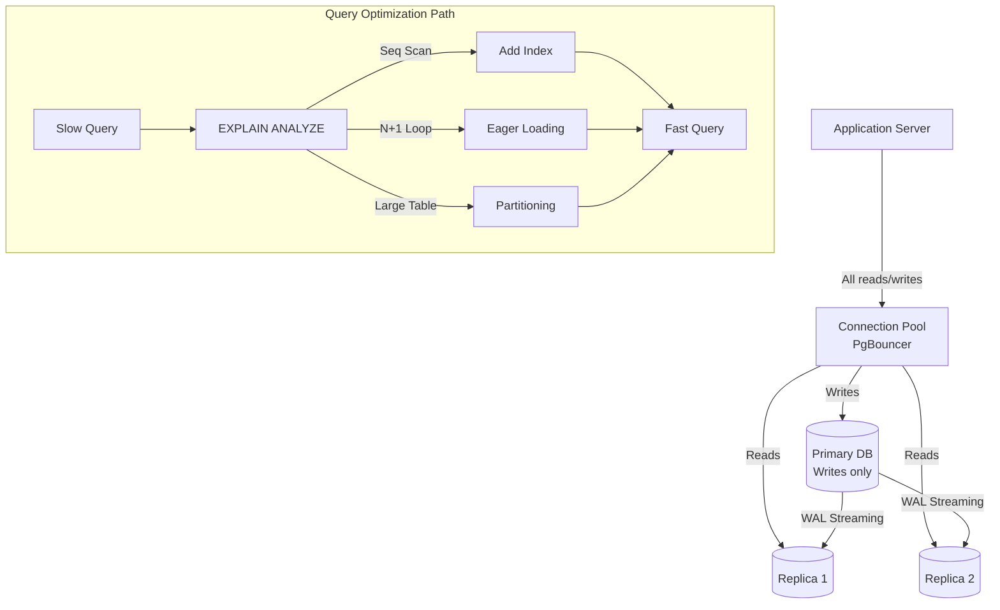

# Database Performance

## Why This Topic Exists

In almost every web application, the database is where performance goes to die. The application server can be horizontally scaled to dozens of machines in minutes. Adding a new database node is hard, slow, and expensive. The database has global shared state — every write must go through it. The database holds locks. The database does disk I/O.

This is why database performance gets its own chapter. A poorly written query can take down a production system that handles millions of users. An added index can take a query from 8,000ms to 8ms — a 1,000x improvement — with zero infrastructure cost. Understanding database performance is one of the highest-leverage skills in systems engineering.

---

## Learning Objectives

By the end of this file you will be able to:

- Read an EXPLAIN plan and identify slow operations
- Know when to add an index and which type to use
- Understand the N+1 query problem and how to fix it
- Configure connection pooling to protect your database
- Design a read replica strategy for read-scaling
- Optimize write operations with bulk inserts and batching
- Walk through a real example of optimizing a slow feed query from 8 seconds to 80 milliseconds

---

## Prerequisites

- [Performance Optimization Techniques](./02.%20Performance%20Optimization%20Techniques%20%28INTERMEDIATE%29.md)
- Basic knowledge of SQL (SELECT, WHERE, JOIN, ORDER BY)
- Basic understanding of database indexes (what they are, not how they work internally)

---

## Introduction

Consider this scenario: your startup just crossed 100,000 users. The app worked fine at 1,000 users. Now the feed page is timing out. The servers show 20% CPU. The network is fine. But the database CPU is at 98% and queries that used to take 5ms now take 8 seconds.

Nothing in the application code changed. The data grew, and the database started paying the price for architectural decisions made when the data was small. This is the database performance trap — it hides until it does not.

This file gives you the tools to avoid that trap and to escape it when you fall in.

---

## Real-World Analogy

A database index is like the index at the back of a book. Without the index, finding every mention of "circuit breaker" in a 1,000-page book means reading every page (full table scan). With the index, you go to "C" in the back, find "circuit breaker: pages 45, 302, 788," and go straight there.

A full table scan on a table with 100 million rows is reading a 100,000-page book from cover to cover every time someone asks a question. That is what happens when you query without an index.

---

## Core Concepts

### 1. Query Optimization: The EXPLAIN Plan

Every major database has an EXPLAIN command that shows how it plans to execute a query. This is the most important tool in database performance work.

**Example (PostgreSQL):**
```sql
EXPLAIN ANALYZE SELECT * FROM posts
WHERE user_id = 1234
ORDER BY created_at DESC
LIMIT 20;
```

**Output (bad — no index):**
```
Seq Scan on posts  (cost=0.00..89432.00 rows=23 width=256)
                   (actual time=0.042..7834.221 rows=23 loops=1)
  Filter: (user_id = 1234)
  Rows Removed by Filter: 9999977
Planning Time: 0.8 ms
Execution Time: 7834.5 ms
```

The key things to look for:

| Term | Meaning | Good or Bad? |
|---|---|---|
| **Seq Scan** | Reading every row in the table | Bad for large tables |
| **Index Scan** | Using an index to find rows | Good |
| **Bitmap Heap Scan** | Using index, then fetching from table | Usually good |
| **Hash Join** | Joining by building a hash table | Context-dependent |
| **Nested Loop** | For each row in A, scan B | Bad if B is large |
| **rows removed by filter** | How many rows were read and discarded | High number = missing index |

In the example above, the DB read 9,999,977 rows and discarded all but 23. That is a full table scan. Adding an index on `user_id` fixes this immediately.

**EXPLAIN ANALYZE** runs the query and gives you actual timing. Use this in development/staging, not in production on expensive queries.

### 2. The Slow Query Log

Most databases have a slow query log that automatically records queries that take longer than a threshold (e.g., 100ms).

**PostgreSQL:**
```sql
-- In postgresql.conf:
log_min_duration_statement = 100  -- log queries taking over 100ms
```

**MySQL:**
```sql
SET GLOBAL slow_query_log = 'ON';
SET GLOBAL long_query_time = 0.1;  -- 100ms
```

The slow query log is invaluable in production. Run `pt-query-digest` (Percona Toolkit) or `pgBadger` to analyze the log and find the most impactful queries to optimize.

---

### 3. Index Strategies

#### When to Add an Index

Add an index when:
- A column is used frequently in WHERE clauses
- A column is used in JOIN conditions
- A column is used in ORDER BY or GROUP BY
- The table has more than ~10,000 rows and queries are slow

Do NOT add an index on every column. Indexes have costs:
- Every INSERT, UPDATE, DELETE must also update the index
- Indexes consume disk space and memory
- The query planner may choose a bad index

#### Basic Index
```sql
-- Find posts by user quickly
CREATE INDEX idx_posts_user_id ON posts(user_id);
```

#### Composite Index

A composite index covers multiple columns. The order of columns matters — the index is useful for queries that filter on the leftmost column(s).

```sql
-- Find posts by user, sorted by date
CREATE INDEX idx_posts_user_created ON posts(user_id, created_at DESC);
```

This index is used by:
```sql
SELECT * FROM posts WHERE user_id = 123 ORDER BY created_at DESC;
-- Fast: uses index for both filtering and sorting
```

But NOT efficiently used by:
```sql
SELECT * FROM posts WHERE created_at > '2024-01-01';
-- Slow: created_at is not the leftmost column
```

Rule: put the most selective column (the one that filters out the most rows) first, unless query patterns demand otherwise.

#### Covering Index

A covering index includes all columns the query needs — the database can answer the query from the index alone, without touching the main table at all. This is called an "index-only scan."

```sql
-- A query that only needs user_id, created_at, and title
SELECT user_id, created_at, title FROM posts WHERE user_id = 123;

-- Create an index that covers all needed columns
CREATE INDEX idx_posts_covering ON posts(user_id, created_at DESC, title);
```

Covering indexes dramatically reduce I/O because the heap (main table) is never read.

---

### 4. Connection Pooling for Databases

Creating a new database connection is expensive: TCP handshake, TLS negotiation, authentication, session setup. This can take 50–200ms per connection.

**Without pooling:**
- 1,000 requests per second = up to 1,000 new connections per second
- PostgreSQL crashes above ~500 concurrent connections

**With pooling (PgBouncer):**
- PgBouncer maintains a fixed pool of (say) 100 connections to PostgreSQL
- Application servers connect to PgBouncer instead of Postgres directly
- PgBouncer routes application queries over the 100 real connections
- Application can have 10,000 "connections" to PgBouncer, but Postgres sees only 100

```
10,000 app connections → PgBouncer → 100 Postgres connections
```

**PgBouncer modes:**

| Mode | Description | Use Case |
|---|---|---|
| Session pooling | One real connection per client session | Simple, compatible, less efficient |
| Transaction pooling | Real connection assigned per transaction | Most common, high concurrency |
| Statement pooling | Real connection assigned per statement | Highest efficiency, limited compatibility |

---

### 5. The N+1 Query Problem

The N+1 problem is one of the most common and most damaging performance issues in ORM-based applications.

**The problem:**

You want to display 20 blog posts with each author's name. With an ORM:
```python
posts = Post.objects.all().limit(20)   # Query 1: get 20 posts

for post in posts:
    print(post.author.name)  # Query 2, 3, 4, ... 21: get author for EACH post
```

This runs **21 queries** instead of 1. At 20 posts, it is annoying. At 1,000 posts, it is 1,001 queries and the page takes 10 seconds.

**Why it happens:** ORMs use lazy loading by default. `post.author` fetches the author only when accessed, one by one.

**The fix — Eager Loading:**
```python
# Django
posts = Post.objects.select_related('author').all().limit(20)
# ONE query with a JOIN — fetches posts and authors together

# SQLAlchemy
posts = session.query(Post).options(joinedload(Post.author)).limit(20)
```

**The fix — DataLoader (for GraphQL):**

DataLoader batches and deduplicates data fetches. Instead of running a query for each item in a loop, it collects all the IDs and runs one batched query:

```javascript
// Without DataLoader: 20 separate queries
// With DataLoader: 1 batched query
const authorLoader = new DataLoader(async (userIds) => {
    return await User.findAll({ where: { id: userIds } });
});
```

**Rule:** Any time you have a loop that queries the database, you probably have an N+1 problem.

---

### 6. Read Replicas for Read Scaling

PostgreSQL primary handles all writes. Read replicas stream the WAL (Write-Ahead Log) from the primary and apply changes in near-real-time.

```
Writes → Primary DB (1 instance)
Reads  → Replica 1 / Replica 2 / Replica 3 (3 instances, each handling 1/3 of reads)
```

**Routing strategies:**
- Application-level routing: write queries go to primary, read queries go to replicas
- Middleware proxy: ProxySQL or PgPool-II routes automatically based on query type
- ORM support: Rails `connects_to`, Django multi-DB routing

**Replication lag:** Replicas are typically 10–200ms behind the primary. For most use cases (reading a product catalog, fetching a news feed), this is acceptable. For cases where you must read your own writes immediately (e.g., "you just updated your profile — reload the page"), route those reads to the primary.

---

### 7. Write Optimization: Batch Inserts and Bulk Operations

Single-row inserts are expensive because each one requires a round-trip and a transaction commit.

**Slow (1,000 separate inserts):**
```sql
INSERT INTO events (user_id, type, ts) VALUES (1, 'click', now());
INSERT INTO events (user_id, type, ts) VALUES (2, 'view', now());
-- ... 998 more times
-- Total: 1000 roundtrips + 1000 fsync operations
```

**Fast (1 bulk insert):**
```sql
INSERT INTO events (user_id, type, ts) VALUES
  (1, 'click', now()),
  (2, 'view', now()),
  -- ... 998 more rows
;
-- Total: 1 roundtrip + 1 fsync
```

At scale, bulk inserts are 100-500x faster than row-by-row inserts.

**PostgreSQL COPY command** — even faster than bulk INSERT for large data loads:
```sql
COPY events (user_id, type, ts) FROM '/tmp/events.csv' CSV;
```

**Batch updates:** Instead of updating rows one by one in a loop, use a single UPDATE with a CASE expression or temporary table.

---

### 8. Database Partitioning for Performance

When a table gets very large (hundreds of millions of rows), even indexed queries slow down because the index itself becomes large and may not fit in memory.

**Table partitioning** splits one logical table into multiple physical partitions, typically by date range or hash of a key.

**Range partitioning by date:**
```sql
CREATE TABLE events (
    id BIGINT,
    created_at TIMESTAMP,
    ...
) PARTITION BY RANGE (created_at);

CREATE TABLE events_2024_q1 PARTITION OF events
  FOR VALUES FROM ('2024-01-01') TO ('2024-04-01');

CREATE TABLE events_2024_q2 PARTITION OF events
  FOR VALUES FROM ('2024-04-01') TO ('2024-07-01');
```

A query for "events in Q1 2024" now only scans the Q1 partition. If each partition has 10 million rows instead of 1 billion, queries are 100x faster. Old partitions can be dropped instantly (no DELETE overhead).

---

## Visual Diagram (Mermaid)



---

## Deep Explanation: Optimizing a Slow Instagram Feed Query

**Scenario:** An Instagram-like app. The "get home feed" endpoint shows posts from followed users, newest first. At 1 million users, the endpoint takes 8 seconds. It needs to be under 100ms.

**Initial Schema:**
```sql
users (id, username, bio, avatar_url, created_at)
follows (follower_id, followee_id, created_at)
posts (id, user_id, image_url, caption, created_at, like_count)
```

**Initial Query:**
```python
# Python/Django — naive implementation
user = User.objects.get(id=current_user_id)
followed_ids = Follow.objects.filter(
    follower_id=user.id
).values_list('followee_id', flat=True)  # Query 1: get who I follow

posts = []
for followee_id in followed_ids:  # N+1 begins
    user_posts = Post.objects.filter(
        user_id=followee_id
    ).order_by('-created_at')[:5]  # Query 2..N: get posts per user
    posts.extend(user_posts)

posts.sort(key=lambda p: p.created_at, reverse=True)
posts = posts[:20]

for post in posts:  # Another N+1
    post.author_name = User.objects.get(id=post.user_id).username  # Query N+1..2N
```

**Step 1: Count the queries**

If the user follows 500 people: 1 + 500 + 20 = **521 queries**. At 15ms per query: 7,815ms ≈ 8 seconds.

**Step 2: Eliminate N+1 with a single JOIN query**

```sql
SELECT posts.id, posts.image_url, posts.caption, posts.created_at,
       posts.like_count, users.username, users.avatar_url
FROM posts
JOIN users ON posts.user_id = users.id
WHERE posts.user_id IN (
    SELECT followee_id FROM follows WHERE follower_id = ?
)
ORDER BY posts.created_at DESC
LIMIT 20;
```

Now it is 1 query. But with no indexes, it does a full table scan on `follows` and `posts`.

**Step 3: Add indexes**

```sql
CREATE INDEX idx_follows_follower ON follows(follower_id);
CREATE INDEX idx_posts_user_created ON posts(user_id, created_at DESC);
CREATE INDEX idx_posts_covering ON posts(user_id, created_at DESC, id, image_url, caption, like_count);
-- Covering index: answers the query without touching the posts table heap
```

Result after indexes: 1 query at 80ms.

**Step 4: Cache the feed**

The feed for most users does not change every millisecond. Cache it in Redis for 60 seconds:

```python
cache_key = f"feed:{user_id}"
cached_feed = redis.get(cache_key)
if cached_feed:
    return json.loads(cached_feed)  # ~1ms

feed = run_feed_query(user_id)  # 80ms on cache miss
redis.setex(cache_key, 60, json.dumps(feed))  # cache for 60s
return feed
```

For a user who views their feed 10 times per minute, 9 out of 10 requests are now 1ms instead of 80ms.

**Result summary:**

| Version | Queries | Time |
|---|---|---|
| Naive (N+1) | 521 queries | ~8,000ms |
| Single JOIN (no index) | 1 query | ~3,000ms |
| Single JOIN + indexes | 1 query | ~80ms |
| With Redis cache (hit) | 0 DB queries | ~1ms |

---

## Step-by-Step Example: Adding an Index

**Symptom:** The `GET /api/orders?customer_id=1234` endpoint is slow (2,000ms).

```sql
EXPLAIN ANALYZE
SELECT * FROM orders WHERE customer_id = 1234 ORDER BY created_at DESC;
```

Output shows: `Seq Scan on orders, rows removed by filter: 4,999,892`

The table has 5 million orders. Every request scans all 5 million rows.

**Fix:**
```sql
CREATE INDEX CONCURRENTLY idx_orders_customer_created
ON orders(customer_id, created_at DESC);
```

(`CONCURRENTLY` creates the index without locking the table — safe for production)

**After:**
```
Index Scan using idx_orders_customer_created on orders
  actual time=0.043..1.234 rows=8 loops=1
Execution Time: 1.4 ms
```

2,000ms → 1.4ms. A 1,400x improvement. Zero infrastructure cost.

---

## Advantages / Disadvantages / Trade-offs

| Technique | Benefit | Cost |
|---|---|---|
| Indexes | Massive query speed improvement | Slower writes, more disk space, memory |
| Covering indexes | Eliminates table heap access | Very large index, expensive to maintain |
| Connection pooling | Prevents connection exhaustion, eliminates overhead | Another component to manage |
| Read replicas | Scales read throughput linearly | Replication lag, routing complexity |
| Eager loading | Eliminates N+1, fewer roundtrips | More data fetched than needed if relation is unused |
| Table partitioning | Fast queries on large tables | Schema complexity, cross-partition queries are slower |
| Bulk inserts | 100-500x faster writes | More complex application code |

---

## When to Use / When NOT to Use

**Add an index when:** A query is slow, EXPLAIN shows a Seq Scan, and the table has more than ~100,000 rows.

**Do not add an index when:** The table is small, the column has very low cardinality (e.g., a boolean column), or you have too many indexes already slowing down writes.

**Use read replicas when:** Your DB CPU is high and the majority of load is reads (typical for content-heavy apps).

**Do not use read replicas when:** Your application cannot tolerate any replication lag (financial transactions, inventory management for limited-stock items).

---

## Common Interview Questions

**Q: What is the N+1 query problem and how do you fix it?**

N+1 happens when code fetches N records and then issues one additional query per record (to fetch related data). Fix with eager loading (JOIN or IN clause) to fetch all related data in one query, or DataLoader for GraphQL APIs to batch and deduplicate requests.

**Q: When would you use a composite index vs a single-column index?**

Use a composite index when queries filter or sort on multiple columns together. The leftmost column should be the one used most frequently in WHERE clauses. Single-column indexes are simpler and sufficient when queries only filter on one column.

**Q: What is a covering index?**

A covering index includes all columns a query needs, so the database can satisfy the query entirely from the index without reading the table. This eliminates heap fetches and is especially powerful for read-heavy queries.

**Q: How does PgBouncer help database performance?**

PgBouncer is a connection pooler. It maintains a small number of real Postgres connections (e.g., 100) and allows many more application connections (e.g., 10,000) to multiplex through them. This prevents Postgres from being overwhelmed by connection setup overhead and prevents the per-connection memory cost from crashing the database.

---

## Common Beginner Mistakes

1. **Adding an index on every column.** More indexes = slower writes and larger storage. Only index columns used in WHERE, JOIN, or ORDER BY clauses in slow queries.

2. **Using SELECT *.** Fetching all columns when you need three is wasteful. It prevents covering indexes from working, increases network overhead, and pulls more data into memory.

3. **Running EXPLAIN without ANALYZE.** Plain EXPLAIN shows estimates. EXPLAIN ANALYZE actually runs the query and shows real timings. Always use ANALYZE (on non-production environments for expensive queries).

4. **Forgetting to use CONCURRENTLY when creating indexes on live tables.** A plain `CREATE INDEX` locks the table for the duration. On a large production table, that lock could be hours. Always use `CREATE INDEX CONCURRENTLY`.

5. **Not setting connection pool size based on Little's Law.** Pool size = concurrency needed = throughput × latency. Under-sizing leads to connection queuing and latency spikes; over-sizing wastes database resources.

---

## Summary

The database is almost always the bottleneck. The toolkit to fix it: use EXPLAIN ANALYZE to find full table scans, add composite and covering indexes to eliminate them, fix N+1 problems with eager loading or DataLoader, use PgBouncer for connection pooling, add read replicas to scale read throughput, and use bulk inserts and partitioning for write-heavy and very large tables. The Instagram feed example shows these techniques can together reduce latency from 8,000ms to 1ms — a 8,000x improvement — without changing infrastructure.

---

## Key Takeaways

- **EXPLAIN ANALYZE** is your primary diagnostic tool. A Seq Scan on a large table is the number one performance culprit.
- **Indexes** are free performance — adding the right index can give 1,000x speedups at zero infra cost.
- **N+1 queries** are the silent killer of ORM applications. Always use eager loading.
- **Connection pooling** (PgBouncer) protects Postgres from connection exhaustion and eliminates setup overhead.
- **Read replicas** scale read throughput linearly — use them for read-heavy workloads.
- **Bulk inserts** are 100-500x faster than row-by-row inserts for large data operations.
- Always add production indexes with `CREATE INDEX CONCURRENTLY` to avoid table locks.

---

## Related Topics

- [Performance Optimization Techniques](./02.%20Performance%20Optimization%20Techniques%20%28INTERMEDIATE%29.md) — the broader optimization toolkit
- [Load Testing and Benchmarking](./05.%20Load%20Testing%20and%20Benchmarking%20%28INTERMEDIATE%29.md) — validating your database optimizations under load
- [Chapter 06: Caching](../06.%20Caching/README.md) — putting a cache in front of the database
- [Chapter 07: Databases](../07.%20Databases/README.md) — database types, replication, and sharding
- [Chapter 15: Scalability](../15.%20Scalability/README.md) — horizontal scaling strategies including database sharding
