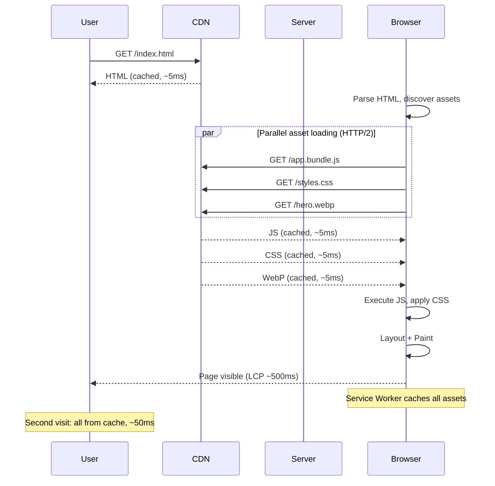

# Frontend Performance

## Why This Topic Exists

System design is not only about backend servers, databases, and message queues. The system includes everything from the moment a user types a URL to the moment they see a working page. That journey includes DNS lookups, TCP connections, HTTP requests, HTML parsing, CSS application, JavaScript execution, and screen painting.

Senior and staff engineers are expected to understand this full path. Frontend performance is also increasingly measurable and consequential — Google uses Core Web Vitals as a ranking signal in search results. A 100ms increase in page load time costs Amazon roughly 1% in sales, based on their own research. This topic gives you the vocabulary and techniques to design systems with fast frontends.

---

## Learning Objectives

By the end of this file you will be able to:

- Describe the critical rendering path and identify where slowness occurs
- Explain each Core Web Vital (LCP, INP, CLS) and what causes poor scores
- List six key techniques for improving frontend performance
- Explain how CDNs, HTTP/2, and service workers each reduce load time
- Describe how Netflix used these techniques to dramatically cut startup time

---

## Prerequisites

- Basic understanding of HTML, CSS, and JavaScript
- Basic understanding of how browsers work (requesting pages, rendering)
- No backend experience required for this file

---

## Introduction

When a user visits a website, their experience is shaped by dozens of micro-decisions made by engineers: where the servers are, whether assets are compressed, whether JavaScript is blocking, how images are sized, and whether the browser can use a cached version. Each decision compounds — a page that gets all of them right loads in under a second; one that gets them wrong can take 10 seconds.

The stakes are real. Research by Google found that 53% of mobile users abandon a page that takes more than 3 seconds to load. The same research found that every second of load time reduces conversions by 7%. Frontend performance is a business metric as much as a technical one.

---

## Real-World Analogy

Think of loading a web page like assembling furniture from a flat-pack box. The critical rendering path is the assembly instructions. The HTML is the parts list. CSS is the paint and finish. JavaScript is the powered screwdriver.

If you have to go back to the store to get missing parts (blocking resources), assembly stops. If the paint is still wet when you try to screw parts together (render-blocking CSS), everything waits. If you load the wrong-sized drill bit (unoptimized assets), every screw takes longer.

Optimizing frontend performance is about removing every unnecessary trip to the store and making every tool available before you need it.

---

## Core Concepts

### 1. The Critical Rendering Path

The critical rendering path (CRP) is the sequence of steps the browser must complete before it can display any pixels on screen.

**Step-by-step:**

1. **DNS Resolution** — Browser looks up the IP address for the domain (~10–100ms depending on DNS cache)
2. **TCP + TLS Handshake** — Browser establishes a secure connection (~50–200ms round-trip)
3. **HTTP Request** — Browser requests the HTML document
4. **HTML Parsing** — Browser reads HTML and builds the DOM (Document Object Model)
5. **CSS Parsing** — Browser reads CSS files and builds the CSSOM (CSS Object Model). **CSS is render-blocking** — no pixels are painted until all CSS is downloaded and parsed.
6. **JavaScript Execution** — If a `<script>` tag is encountered without `async` or `defer`, parsing stops and JS executes. **Synchronous JS is parser-blocking.**
7. **Render Tree Construction** — DOM + CSSOM are combined into the Render Tree
8. **Layout (Reflow)** — Browser calculates the size and position of every element
9. **Paint** — Browser fills in pixels on screen
10. **Compositing** — Layers are combined into the final image

**Critical path is the shortest path through all required steps.** Anything that makes any step wait extends the critical path.

**What blocks the critical path:**

| Blocker | Impact | Fix |
|---|---|---|
| Large CSS files | Delays rendering | Inline critical CSS, defer non-critical CSS |
| Synchronous `<script>` tags in `<head>` | Stops HTML parsing | Use `async` or `defer` attributes |
| Large images | Delays Largest Contentful Paint | Lazy load, use WebP, add srcset |
| Multiple sequential round-trips | Adds up to 200ms each | HTTP/2 multiplexing, preconnect hints |
| Uncompressed assets | Slower download | gzip / brotli compression |

---

### 2. Core Web Vitals

Google's Core Web Vitals are three metrics that measure real user experience. They are used as ranking signals in Google Search and are widely adopted as the standard for measuring frontend performance.

#### LCP — Largest Contentful Paint

**What it measures:** How long it takes for the largest visible element on screen (usually a hero image or large heading) to appear.

**Why it matters:** LCP represents when the page "feels loaded" to the user. A fast page with a slow LCP still feels slow.

**Target:** LCP under **2.5 seconds** for "Good" rating.

**Common causes of slow LCP:**
- Large hero images not optimized (high-resolution JPEGs instead of WebP)
- Image not preloaded — browser discovers it late in the HTML
- Server-side rendering is slow (time-to-first-byte is high)
- Render-blocking JavaScript delays when the browser can paint

**Fixes:**
- Add `<link rel="preload" as="image" href="hero.webp">` in the `<head>`
- Use WebP format (30-50% smaller than JPEG at same quality)
- Server-side render or statically generate the initial HTML

#### INP — Interaction to Next Paint

**What it measures:** The time from a user interaction (click, tap, key press) to when the browser paints the visual response.

*(Note: INP replaced FID — First Input Delay — as a Core Web Vital in 2024. INP is a better measure of overall responsiveness throughout the page lifecycle.)*

**Why it matters:** Users expect visual feedback within 100ms of an interaction. Slow INP makes the page feel sluggish and unresponsive.

**Target:** INP under **200ms** for "Good" rating.

**Common causes of slow INP:**
- Heavy JavaScript running on the main thread (blocking all input processing)
- Long tasks — any JavaScript that runs for more than 50ms without yielding
- Inefficient React/Vue re-renders that update too much of the DOM

**Fixes:**
- Break long tasks into smaller chunks with `setTimeout(() => {}, 0)` or `scheduler.postTask()`
- Use web workers to move heavy computation off the main thread
- Use React's `useDeferredValue` or `startTransition` for non-urgent updates

#### CLS — Cumulative Layout Shift

**What it measures:** How much the page layout shifts unexpectedly after the initial render. Measured as a score (0 is perfect, higher is worse).

**Why it matters:** Layout shifts cause users to click the wrong thing when an element moves at the last moment. This is one of the most frustrating user experiences on the web.

**Target:** CLS under **0.1** for "Good" rating.

**Common causes of high CLS:**
- Images without explicit `width` and `height` attributes — browser does not know the size until the image loads, causing a reflow
- Ads or embeds that load asynchronously and push content down
- Custom fonts that cause text to reflow when they finish loading (FOUT — Flash of Unstyled Text)

**Fixes:**
- Always set `width` and `height` on images: ``
- Reserve space for ads and embeds with a fixed-size container
- Use `font-display: optional` or `font-display: swap` with `size-adjust` to prevent text reflow

---

### 3. CDN for Static Assets

A Content Delivery Network (CDN) is a globally distributed network of servers that caches and serves static assets — JavaScript, CSS, images, fonts, and static HTML — from locations close to the user.

**Without CDN:**
```
User in Sydney → HTTP request → Origin server in Virginia → 200ms round-trip
```

**With CDN:**
```
User in Sydney → HTTP request → CDN edge in Sydney → 5ms round-trip
```

The first time a user in Sydney requests an asset, the CDN fetches it from the origin and caches it in Sydney. All subsequent requests from Sydney are served from the local cache.

CDNs also protect the origin server by absorbing traffic. 95% of requests for static assets never reach the origin.

Popular CDNs: Cloudflare, AWS CloudFront, Fastly, Akamai.

---

### 4. Code Splitting and Lazy Loading

Modern JavaScript applications can be very large. A single-page app (SPA) can ship a 5MB JavaScript bundle. Loading 5MB before showing anything is catastrophic for performance.

**Code splitting** breaks the JavaScript bundle into smaller chunks that load on demand.

**Without code splitting:**
```
/app.js (5MB) — loads everything on first visit
```

**With code splitting:**
```
/app.bundle.js (200KB) — only the code needed for the current page
/admin.chunk.js (800KB) — loaded only when user visits /admin
/checkout.chunk.js (300KB) — loaded only when user visits /checkout
```

**React lazy loading example:**
```javascript
// Before: always loads AdminPanel even for non-admin users
import AdminPanel from './AdminPanel';

// After: only loads AdminPanel when it is rendered
const AdminPanel = React.lazy(() => import('./AdminPanel'));
```

**Image lazy loading:** Images below the fold should not load until the user scrolls to them.

```html

```

This defers loading until the image is near the viewport. A page with 50 product images can save 90% of initial image bytes.

---

### 5. Image Optimization

Images are typically the largest assets on a web page and the biggest contributor to slow LCP.

**Key techniques:**

| Technique | Impact | How |
|---|---|---|
| Use WebP format | 30-50% smaller than JPEG | `` with JPEG fallback |
| Responsive images (srcset) | Mobile devices load smaller images | `` |
| Lazy loading | Defer off-screen images | `loading="lazy"` attribute |
| Set explicit dimensions | Prevents layout shift (CLS) | Always set width and height |
| Serve correct size | No 2000px image for a 200px element | Use image CDN for on-the-fly resizing |

**Image CDNs** (Cloudinary, Imgix, Vercel Image) resize, convert, and optimize images on the fly based on URL parameters. Instead of maintaining multiple versions of every image, you request `image.jpg?width=400&format=webp` and the CDN serves the right version.

---

### 6. HTTP/2 Multiplexing

HTTP/1.1 limits browsers to 6 concurrent connections per domain. Loading 30 assets (CSS, JS, images, fonts) requires queuing — some assets wait for others to finish. Each new connection needs a TCP + TLS handshake.

**HTTP/2** changes this fundamentally:
- **Multiplexing:** Multiple requests and responses travel over a single connection simultaneously. No queuing.
- **Header compression (HPACK):** Repeated headers (like cookies and User-Agent) are compressed. Reduces overhead.
- **Server Push:** Server can proactively send assets the client will need before it asks.

**Practical impact:** Moving from HTTP/1.1 to HTTP/2 typically reduces page load time by 10–30% for asset-heavy pages, with no code changes required — just a server or CDN configuration.

HTTP/3 (built on QUIC, UDP-based) goes further, eliminating head-of-line blocking at the transport layer. Cloudflare and most major CDNs already support HTTP/3.

---

### 7. Service Workers and Offline Caching

A service worker is a JavaScript file that runs in the background, intercepts network requests, and can serve responses from a local cache. This enables:

- **Offline support** — the app works without internet
- **Instant second-visit load** — all assets come from local cache, 0ms network latency
- **Background sync** — actions queue offline and sync when connectivity returns

**How it works:**
```
First visit: browser downloads assets → service worker caches them
Second visit: service worker intercepts requests → serves from cache → instant load
```

Service workers are the foundation of Progressive Web Apps (PWAs). Apps like Twitter Lite and Pinterest PWA report 40–60% improvements in engagement after implementing service workers.

---

### 8. Minification and Compression

**Minification** removes whitespace, comments, and renames variables to single characters. A 200KB JavaScript file might minify to 70KB. This is done at build time by tools like webpack, Rollup, or esbuild.

**Compression** (gzip, brotli) reduces the transmission size of files:
- gzip: typically 60–70% size reduction for text files
- brotli: typically 70–80% size reduction (better than gzip, supported by all modern browsers)

These work together: minify first, then compress. A 200KB file → 70KB (minified) → 20KB (brotli compressed). The browser downloads 20KB and decompresses it in microseconds.

---

## Visual Diagram (Mermaid)



---

## Deep Explanation: How Netflix Optimized Web Client Startup

Netflix's web client faces an unusual challenge: before any video plays, users must download the Netflix web app, authenticate, browse the catalog, and select a title. In 2015, Netflix discovered their startup time (time to interactive) on slow connections was 6–8 seconds. Their optimization story is a masterclass in applying these techniques.

**Key changes Netflix made:**

**1. Pre-fetching and Pre-rendering**

Netflix moved from a single-page app that fetched all data on the client to server-side rendering for the initial page. The HTML response includes the rendered catalog HTML, eliminating the client-side data fetch step. Time-to-first-meaningful-paint dropped by ~50%.

**2. Prefetching on the Login Page**

While the user is typing their email and password on the login page, Netflix uses the idle time to prefetch JavaScript bundles and data needed for the home page. By the time login completes, the home page loads from cache.

```html
<link rel="prefetch" href="/home.bundle.js">
<link rel="preconnect" href="https://api.netflix.com">
```

**3. Code Splitting by Route**

The Netflix app was split into per-route bundles. The login page, home page, player, and settings each load their own bundle. Only the code needed for the current screen loads. Total initial JS dropped from ~500KB to ~150KB for the login screen.

**4. HTTP/2 Push**

Netflix configured their CDN to server-push critical CSS and fonts along with the HTML response. By the time the browser parses the HTML and discovers `<link rel="stylesheet">`, the CSS is already in the browser's local buffer.

**5. Critical CSS Inlining**

The CSS needed to render the above-the-fold content is inlined in the HTML `<head>`. The browser can render the initial view without waiting for an external CSS file to download.

**Result:** Netflix reduced perceived startup time from ~6 seconds to under 1 second on broadband, and from ~20 seconds to ~4 seconds on slow 3G connections. These optimizations also reduced CDN bandwidth costs by 40%.

---

## Step-by-Step Example

**Goal:** Improve LCP on a product page from 4.2 seconds to under 2.5 seconds.

**Step 1: Measure with Chrome DevTools Lighthouse**
- LCP: 4.2s (from a 1.8MB hero JPEG that starts downloading 3.2s into load)
- CLS: 0.3 (bad — images without dimensions cause layout shifts)
- INP: 450ms (slow — a synchronous JavaScript file is blocking the main thread)

**Step 2: Fix LCP**
- Convert hero JPEG to WebP: 1.8MB → 380KB
- Add `<link rel="preload" as="image" href="hero.webp">` in `<head>` so browser discovers the image immediately
- Set `width="1200" height="600"` on the image tag

After: LCP 4.2s → 1.4s

**Step 3: Fix CLS**
- Add `width` and `height` to all images on the page
- Reserve space for the ad slot with a fixed-height container

After: CLS 0.3 → 0.02

**Step 4: Fix INP**
- Move the synchronous third-party analytics script from `<head>` to end of `<body>` with `defer`
- Replace synchronous image gallery initialization with a lazy `IntersectionObserver`

After: INP 450ms → 90ms

**Step 5: Verify**
Run Lighthouse again. All Core Web Vitals are now "Good."

---

## Advantages / Disadvantages / Trade-offs

| Technique | Advantage | Disadvantage |
|---|---|---|
| CDN | Global fast delivery, protects origin | CDN cost, cache invalidation when content changes |
| Code splitting | Smaller initial bundles | Build complexity, risk of loading wrong chunks |
| Image WebP | 30-50% smaller | Requires fallback for very old browsers |
| Service Worker | Instant repeat visits, offline support | Complex to update (caching bugs are hard to debug) |
| HTTP/2 | Parallel asset loading, no roundtrip per asset | Requires HTTPS |
| SSR | Faster LCP, better SEO | More complex infrastructure, server load |
| Critical CSS inline | Eliminates CSS render blocking | Duplicates CSS in HTML, increases HTML size |

---

## When to Use / When NOT to Use

**Use service workers when:** You are building a PWA, have many repeat users, or need offline support.
**Do not use service workers when:** Your content changes very frequently and you cannot manage cache invalidation carefully.

**Use code splitting when:** Your JavaScript bundle is over 150KB or you have features only some users access.
**Do not code-split aggressively when:** Each extra chunk requires a round-trip — too many small chunks can hurt more than help.

**Use SSR when:** SEO matters, LCP must be fast, or initial data is the same for all users.
**Do not use SSR when:** The page is fully behind authentication and SEO does not matter, or your team lacks SSR infrastructure expertise.

---

## Common Interview Questions

**Q: What is the critical rendering path?**

The sequence of steps the browser must complete before it can display pixels: DNS → TCP → HTTP request → HTML parse → CSS parse (render-blocking) → JS execution (parser-blocking) → Render Tree → Layout → Paint.

**Q: What are Core Web Vitals?**

LCP (Largest Contentful Paint) — how fast the biggest element appears; INP (Interaction to Next Paint) — how fast the page responds to user input; CLS (Cumulative Layout Shift) — how much the layout shifts unexpectedly. These are Google's ranking signals and the standard for measuring user experience.

**Q: How does a CDN improve performance?**

A CDN caches static assets at edge servers near users worldwide. Instead of a user in Tokyo fetching assets from a server in Virginia (150ms round-trip), they fetch from a Tokyo edge server (2ms round-trip). CDNs also absorb traffic, protecting origin servers.

**Q: What is code splitting and why does it matter?**

Code splitting divides a large JavaScript bundle into smaller chunks loaded on demand. A 5MB bundle that loads entirely on first visit can become a 200KB initial chunk with the rest loaded lazily. This dramatically reduces initial page load time and improves LCP and Time to Interactive.

---

## Common Beginner Mistakes

1. **Not setting image dimensions.** This is the single most common cause of high CLS. Always set `width` and `height` on all images.

2. **Loading large JavaScript in `<head>` without `async` or `defer`.** This blocks HTML parsing and dramatically increases Time to Interactive. Move scripts to the end of `<body>` or use `defer`.

3. **Not using lazy loading for below-fold images.** Every image on the page loads by default. Adding `loading="lazy"` to below-fold images reduces initial page weight by 50-90% on image-heavy pages.

4. **Serving JPEG when WebP is available.** WebP is supported by all modern browsers (>96% global usage). Using it by default saves 30-50% bandwidth.

5. **Serving the same large image to mobile users.** A 2000px hero image on a 400px mobile screen is 25x more data than needed. Use srcset or an image CDN to serve appropriately sized images.

---

## Summary

Frontend performance is the last mile of system design — it determines the actual user experience. The critical rendering path shows where delays accumulate from DNS to paint. Core Web Vitals (LCP, INP, CLS) are the standardized, SEO-impacting measurements of that experience. CDNs, code splitting, image optimization, HTTP/2 multiplexing, service workers, and compression are the primary tools to improve these metrics. Netflix's optimization story shows that applying these techniques together can cut startup time from 6+ seconds to under 1 second.

---

## Key Takeaways

- The **critical rendering path** is the sequence DNS → TCP → HTML → CSS (render-blocking) → JS (parser-blocking) → Paint.
- **LCP** should be under 2.5s, **INP** under 200ms, **CLS** under 0.1.
- **CDNs** serve assets from edge locations near users, reducing round-trip time by 10-100x.
- **Code splitting** loads only the JS needed for the current page, reducing initial bundle size.
- **WebP + srcset + lazy loading** is the image optimization stack that reduces image bytes by 70-90%.
- **HTTP/2** eliminates the 6-connection-per-domain limit via multiplexing.
- **Service workers** enable instant repeat visits by serving assets from local cache.
- Always set **width and height** on images to prevent CLS.

---

## Related Topics

- [Latency vs Throughput](./01.%20Latency%20vs%20Throughput%20%28BEGINNER%29.md) — understanding the performance metrics behind these techniques
- [Performance Optimization Techniques](./02.%20Performance%20Optimization%20Techniques%20%28INTERMEDIATE%29.md) — the backend counterpart to frontend optimization
- [Load Testing and Benchmarking](./05.%20Load%20Testing%20and%20Benchmarking%20%28INTERMEDIATE%29.md) — measuring the impact of frontend changes
- [Chapter 06: Caching](../06.%20Caching/README.md) — CDN caching and HTTP caching in detail
- [Chapter 09: Load Balancing](../09.%20Load%20Balancing/README.md) — infrastructure that serves static assets
