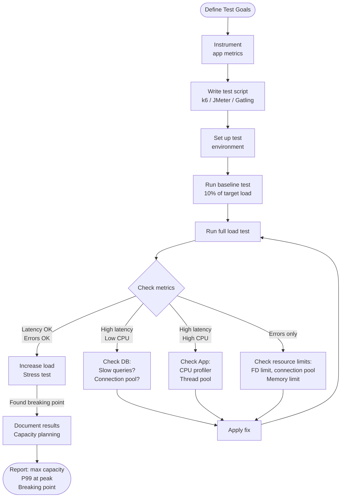

# Load Testing and Benchmarking

## Why This Topic Exists

Every performance optimization claim needs evidence. "Our system can handle 10,000 requests per second" is a guess without a load test behind it. "Our P99 latency is under 200ms" is a hope without benchmarking data to prove it.

Load testing is how you find out if your system actually behaves the way you think it does — before your users find out the hard way. Systems that look fine in development routinely fall apart at scale: a database query that takes 5ms with 1,000 rows takes 8 seconds with 50 million rows. A server that handles 100 concurrent users gracefully crashes at 5,000. Connection pools exhaust. Caches evict hot keys. Queues back up. None of this is visible until load arrives.

This topic teaches you to simulate load safely, measure results correctly, and work backwards from test results to find the actual bottleneck.

---

## Learning Objectives

By the end of this file you will be able to:

- Describe the four types of load tests and when to use each
- Choose the right load testing tool for a given scenario
- Interpret a load test result and identify bottlenecks from the data
- Design and execute a complete load test for a URL shortener
- Understand production traffic mirroring (shadow mode testing)

---

## Prerequisites

- [Latency vs Throughput](./01.%20Latency%20vs%20Throughput%20%28BEGINNER%29.md) — you must understand percentiles to interpret results
- Basic understanding of HTTP requests and responses
- Basic command-line familiarity

---

## Introduction

Consider two engineering teams. Team A deploys a new feature and says "we tested it in development, it looked good." Team B deploys the same feature after running load tests at 3x expected peak traffic, confirming P99 latency stays under their SLA with a 10% error budget to spare.

Which team would you rather be on at 2 AM when traffic spikes?

Load testing is not glamorous, but it is what separates teams that prevent incidents from teams that react to them. At senior and staff level, you are expected to design systems that have been load tested and to know what the results mean.

---

## Real-World Analogy

A structural engineer who designs a bridge does not just calculate that it should hold 10 cars. They test it with a load machine that simulates 100 cars, dynamic loads, vibrations, temperature changes, and extreme stress. They watch where the bridge bends, where bolts show stress, and what happens at the breaking point.

Load testing a web service is the same thing. You simulate users until the system breaks, watch where it bends (latency rises, error rate climbs), find the breaking point, and then build headroom above it.

The bridge analogy extends further: you test in a controlled environment (staging) before opening to traffic (production). But unlike bridges, you can also test production carefully — with shadow traffic.

---

## Core Concepts

### The Four Types of Load Tests

#### Type 1: Load Testing

**What it is:** Simulating the expected peak traffic your system will receive, to confirm it meets performance targets.

**Goal:** Verify the system meets SLAs at normal expected load.

**Traffic pattern:**
```
Requests
  |
  |          _______________
  |         /               \
  |________/                 \________
  Time →
     ramp-up  sustained peak  ramp-down
```

**Example:** Your e-commerce site normally handles 500 RPS, with peaks to 2,000 RPS during sales. A load test simulates a 30-minute window at 2,000 RPS and confirms P99 latency stays under 300ms with < 0.1% error rate.

**Duration:** 15–60 minutes at peak load to let the system stabilize and to capture realistic behavior (caches warm up, JVM JIT compiles, connection pools fill).

---

#### Type 2: Stress Testing

**What it is:** Pushing the system beyond its expected limits to find the breaking point.

**Goal:** Find the maximum load before degradation occurs. Understand failure modes — does the system fail gracefully (shed load, return errors) or catastrophically (crash, corrupt data)?

**Traffic pattern:**
```
Requests
  |
  |                          /
  |                    /
  |              /
  |        /
  |  /
  |/_________________
  Time →   (continuously increasing load)
```

**Example:** You know the system handles 2,000 RPS. You increase load 500 RPS every 5 minutes: 2,000 → 2,500 → 3,000 → 3,500... until error rate exceeds 5% or latency exceeds 5 seconds. You find the system fails at 4,200 RPS and plan capacity accordingly.

**What to look for:** At what load does latency start rising sharply? What is the maximum RPS before errors appear? What fails first — the app server, the database, the cache?

---

#### Type 3: Spike Testing

**What it is:** Simulating a sudden, dramatic surge in traffic — far above normal — then returning to normal.

**Goal:** Verify the system can absorb a sudden spike without crashing, and recovers after the spike passes.

**Traffic pattern:**
```
Requests
  |          |
  |          |
  |          |
  |__________|__________
  Time →
     normal  spike  normal
```

**Example:** A product is featured on national TV at 8 PM. Traffic spikes from 500 RPS to 15,000 RPS in 30 seconds, lasts 5 minutes, then drops back to 500 RPS. Does the system hold? Does auto-scaling kick in fast enough? After the spike, does the system recover to normal latency?

**Why it is different from stress testing:** Stress testing gradually increases load. Spike testing is sudden. The sudden nature exposes different failure modes: auto-scaling may not respond fast enough, connection pools may not have time to grow, circuit breakers may trip.

---

#### Type 4: Soak Testing (Endurance Testing)

**What it is:** Running the system at normal or slightly elevated load for an extended period — hours or days.

**Goal:** Find problems that only appear over time: memory leaks, connection leaks, log file growth, cache degradation, database connection pool exhaustion.

**Traffic pattern:**
```
Requests
  |          ___________________________
  |         /                           \
  |________/                             \
  Time →
  12+ hours of sustained load
```

**Example:** You run 1,000 RPS for 12 hours. After 2 hours, memory usage starts climbing. After 6 hours, the heap is 90% full and GC pauses are causing latency spikes. You found a memory leak in your ORM that would have caused an outage in production after 12 hours of traffic.

**What soak testing finds that other tests miss:**
- Memory leaks (process grows slowly until it runs out of memory)
- File descriptor leaks (log files not rotated, temp files not cleaned up)
- Connection leaks (connections not returned to pool correctly)
- Database lock accumulation
- Cache invalidation issues that compound over time

---

### Load Testing Tools

#### k6

**Best for:** Modern developer-friendly load testing; scripting tests in JavaScript.

```javascript
// k6 test script
import http from 'k6/http';
import { check, sleep } from 'k6';

export const options = {
  stages: [
    { duration: '2m', target: 100 },  // ramp up to 100 users
    { duration: '5m', target: 100 },  // stay at 100 users
    { duration: '2m', target: 0 },    // ramp down
  ],
  thresholds: {
    http_req_duration: ['p(99)<200'],   // P99 must be under 200ms
    http_req_failed: ['rate<0.01'],      // less than 1% errors
  },
};

export default function() {
  const res = http.get('https://api.example.com/shorten/abc123');
  check(res, {
    'status 200': (r) => r.status === 200,
    'response time < 200ms': (r) => r.timings.duration < 200,
  });
  sleep(1);  // think time between requests
}
```

k6 is lightweight (runs as a single binary), outputs detailed percentile data, and integrates with Grafana for real-time dashboards.

---

#### Apache JMeter

**Best for:** Complex scenarios, GUI-based test building, Java ecosystem integration.

JMeter has a graphical interface for building test plans without code. It supports HTTP, databases (JDBC), message queues, and many other protocols. More setup overhead than k6 but very powerful for complex user journey simulations.

**Typical use:** Testing a multi-step checkout flow: login → browse → add to cart → checkout → payment.

---

#### Gatling

**Best for:** High-throughput tests, Scala/Java teams, detailed HTML reports.

Gatling is written in Scala and can generate extremely high load from a single machine (100,000+ RPS from one instance). It produces beautiful detailed HTML reports. Tests are written in a Scala DSL.

```scala
// Gatling DSL
val scn = scenario("URL Shortener")
  .exec(http("Redirect Request")
    .get("/shorten/abc123")
    .check(status.is(301)))

setUp(
  scn.inject(
    rampUsers(1000).during(60.seconds),
    constantUsersPerSec(500).during(300.seconds)
  )
).protocols(http.baseUrl("https://api.example.com"))
 .assertions(
   global.responseTime.percentile(99).lt(200),
   global.successfulRequests.percent.gt(99)
 )
```

---

#### wrk / wrk2

**Best for:** Quick, raw HTTP benchmarks to establish a throughput baseline.

wrk is a simple command-line tool for raw HTTP load generation. It does not have complex scripting but is extremely fast and good for getting a quick sense of maximum throughput.

```bash
# Send requests to a URL using 12 threads, 400 connections, for 30 seconds
wrk -t12 -c400 -d30s https://api.example.com/shorten/abc123
```

wrk2 adds rate-limiting to generate constant load (useful for realistic simulations instead of "as fast as possible" benchmarks).

---

### Comparison Table

| Tool | Language | Learning Curve | Max Throughput | Best Use Case |
|---|---|---|---|---|
| k6 | JavaScript | Low | ~50k RPS/instance | Modern APIs, CI/CD integration |
| JMeter | GUI / XML | Medium | ~5k RPS/instance | Complex user journeys |
| Gatling | Scala DSL | Medium | ~100k RPS/instance | High-volume benchmarks |
| wrk/wrk2 | CLI | Very low | ~200k RPS/instance | Quick baseline benchmarks |

---

### Interpreting Results

A load test produces a stream of data. Here is how to read it:

**Key metrics to watch:**

| Metric | What it tells you | Alert when |
|---|---|---|
| P50 latency | Typical user experience | Rising over time (memory leak, cache miss) |
| P95 latency | "Almost everyone" experience | Approaching SLA limit |
| P99 latency | Tail latency | Exceeds SLA |
| Error rate | Request failures | > 0.1% for normal load |
| Throughput (RPS) | How much load is hitting the system | Drops unexpectedly (server rejecting load) |
| Active connections | Current concurrency | Plateaus (connection pool exhausted) |

**The latency curve shape tells a story:**

```
Latency
  |
  |                               /---  (high load: queue forms, latency spikes)
  |                         /----/
  |                   /----/
  |_________________/              (normal load: latency flat, system has headroom)
  |
  0------------------------------> Load (RPS)
        "knee"
```

The "knee" in the curve is where the system transitions from "has headroom" to "approaching capacity." This is where latency starts rising. You want your peak production load to be left of the knee — ideally at 60-70% of the system's capacity.

**Reading error patterns:**

- **Sudden error spike at fixed load:** Usually a fixed resource limit (thread pool, connection pool, open file limit)
- **Gradual error increase as load grows:** System is capacity-limited (add more resources or scale out)
- **Errors spike then recover:** Auto-scaling kicked in, or a brief resource saturation event
- **Errors only during ramp-up:** Caches cold — warm-up period before steady state

---

### Finding Bottlenecks From Test Results

When a load test shows high latency or errors, you must work backwards to find which component is saturated.

**Step 1: Check application server metrics**
- CPU > 80%? Application code is the bottleneck. Profile the code.
- Memory growing? Memory leak. Use a heap profiler.
- Thread pool exhausted? Add more threads, or switch to async I/O.

**Step 2: Check database metrics**
- DB CPU > 80%? Missing index or expensive queries. Use slow query log.
- Connection pool at max? Add connection pool capacity or read replicas.
- Lock waits increasing? Write contention. Reduce transaction scope or use optimistic locking.

**Step 3: Check cache hit rate**
- Cache hit rate < 80%? Cache is too small or TTLs are too short. Increase cache size.
- Cache evictions spiking? Cache is being overwhelmed with new keys (cold start, spike traffic).

**Step 4: Check network and I/O**
- Network bandwidth near capacity? Compress responses, reduce payload size.
- Disk I/O maxed? Move to faster storage, cache more aggressively.

**Step 5: Check external dependencies**
- External API latency spiking? Add a circuit breaker to fail fast. Cache responses.

---

### Production Traffic Mirroring (Shadow Mode)

Shadow mode testing duplicates real production traffic and sends a copy to a new system under test, without affecting real users.

```
Real user request
        │
        ├──→ Production system (real response sent to user)
        │
        └──→ Shadow system (response discarded, but metrics collected)
```

**Why use shadow mode instead of synthetic load tests?**
- Real traffic patterns are more complex than any synthetic test
- Real cache hit ratios, real data distribution, real request variety
- No risk to users — the shadow system's responses are never returned

**When to use shadow mode:**
- Before a major database migration (is the new DB keeping up?)
- Before switching from one service to another
- To validate a new infrastructure setup before cutting over

**Tools:** AWS Traffic Mirroring, Goreplay (open-source), Shadowtraffic.

---

## Visual Diagram (Mermaid)



---

## Deep Explanation: Load Testing a URL Shortener

**System:** A URL shortener service. Users visit `short.ly/abc123` and are redirected to the original URL.

**Architecture:**
- Nginx load balancer
- 2 application servers (Node.js)
- Redis cache (stores short code → original URL)
- PostgreSQL database (source of truth)
- Target: 10,000 RPS, P99 < 100ms, error rate < 0.01%

**Step 1: Define the test scenarios**

The real traffic pattern for a URL shortener is:
- 95% redirect requests (GET /abc123)
- 4% create requests (POST /shorten)
- 1% analytics reads (GET /stats/abc123)

Simulate this mix. Testing only the fastest endpoint produces misleading results.

**Step 2: Write the k6 script**

```javascript
import http from 'k6/http';
import { check, sleep } from 'k6';

const BASE_URL = 'https://short.ly';
const SHORT_CODES = ['abc123', 'xyz789', 'def456', /* 100 more */];

export const options = {
  stages: [
    { duration: '2m', target: 1000 },   // warm up to 1,000 VUs
    { duration: '10m', target: 5000 },  // ramp to 5,000 VUs
    { duration: '10m', target: 10000 }, // ramp to 10,000 VUs
    { duration: '5m', target: 10000 },  // hold at peak
    { duration: '2m', target: 0 },      // ramp down
  ],
  thresholds: {
    'http_req_duration{type:redirect}': ['p(99)<100'],
    'http_req_duration{type:create}': ['p(99)<500'],
    http_req_failed: ['rate<0.0001'],
  },
};

export default function () {
  const rand = Math.random();

  if (rand < 0.95) {
    // Redirect request (95% of traffic)
    const code = SHORT_CODES[Math.floor(Math.random() * SHORT_CODES.length)];
    const res = http.get(`${BASE_URL}/${code}`, {
      tags: { type: 'redirect' },
      redirects: 0,  // don't follow redirect, measure only the response time
    });
    check(res, { 'redirect 301': (r) => r.status === 301 });

  } else if (rand < 0.99) {
    // Create request (4% of traffic)
    const res = http.post(`${BASE_URL}/shorten`, JSON.stringify({
      url: 'https://www.example.com/some/long/url',
    }), {
      headers: { 'Content-Type': 'application/json' },
      tags: { type: 'create' },
    });
    check(res, { 'created 201': (r) => r.status === 201 });

  } else {
    // Analytics (1% of traffic)
    const code = SHORT_CODES[Math.floor(Math.random() * SHORT_CODES.length)];
    http.get(`${BASE_URL}/stats/${code}`, { tags: { type: 'stats' } });
  }

  sleep(Math.random() * 2);  // think time: 0-2 seconds (realistic user behavior)
}
```

**Step 3: Monitor during the test**

While k6 runs, watch these dashboards:
- Application server: CPU, memory, active connections, event loop lag
- Redis: hit rate, memory usage, evictions per second, connected clients
- PostgreSQL: active connections, queries per second, slow query count
- Load balancer: active connections, request rate, error rate

**Step 4: Analyze results**

**First run output (problems found):**

```
✗ redirect 301 — 4.2% failed
  ✗ p(99)<100 — p(99)=892ms at 8,000 VUs (failed)

Bottleneck indicators:
  - Redis hit rate dropped from 98% to 61% at 6,000 VUs
  - PostgreSQL connections: 450/500 (near pool limit)
  - DB queries per second: 12,400 (DB at 95% CPU)
```

**Root cause analysis:**

The Redis cache is sized at 1GB. At 6,000 concurrent users, it is being asked to hold more unique short codes than fit in memory. Cache evictions increase. More requests miss cache and hit PostgreSQL. PostgreSQL is overwhelmed.

**Step 5: Fix and re-test**

1. Increase Redis memory from 1GB to 8GB (cost: $50/month extra)
2. Add a read replica to PostgreSQL (takes read load off primary)
3. Increase PostgreSQL connection pool (PgBouncer) from 500 to 200 real connections (adds a second pooler)

**Second run results:**

```
✓ redirect 301 — 100% pass
✓ p(99)<100 — p(99)=67ms at 10,000 VUs (passed!)
✓ error rate: 0.003% (passed)

Redis hit rate: 97% at 10,000 VUs
PostgreSQL connections: 180/200 (comfortable headroom)
DB CPU: 42% (healthy)
```

The system now meets the 10,000 RPS target with P99 under 100ms.

**Step 6: Stress test to find the breaking point**

Continue pushing load beyond 10,000 VUs to find the maximum:
- 12,000 VUs: P99 = 98ms, 0% errors
- 15,000 VUs: P99 = 145ms, 0.01% errors
- 18,000 VUs: P99 = 380ms, 0.8% errors ← breaking point
- 20,000 VUs: P99 = 1,200ms, 5.2% errors ← system saturated

The system breaks at ~17,000 RPS. Target is 10,000 RPS. This gives a safety factor of 1.7x — good headroom for unexpected traffic spikes.

---

## Step-by-Step Example: Quick Benchmark with wrk

For a quick baseline before a full load test:

```bash
# Test 1: Find maximum throughput (as fast as possible)
wrk -t12 -c400 -d30s https://short.ly/abc123

# Output:
# Running 30s test @ https://short.ly/abc123
# 12 threads and 400 connections
# Thread Stats   Avg    Stdev     Max   +/- Stdev
#   Latency    38.45ms  12.3ms   231ms    89.12%
#   Req/Sec  867.23    234.12   1.23k    68.45%
# 311,421 requests in 30.00s, 52.13MB read
# Requests/sec:  10,380.70
# Transfer/sec:  1.74MB

# Test 2: Constant rate (wrk2) — more realistic
wrk2 -t12 -c400 -d30s -R 5000 https://short.ly/abc123
# -R 5000 means exactly 5,000 RPS (not "as fast as possible")
```

The wrk output above tells you: at full blast, the system handles ~10,380 RPS with average latency 38ms. This is your upper bound before you design a proper multi-stage load test.

---

## Advantages / Disadvantages / Trade-offs

| Test Type | Best For | Limitation |
|---|---|---|
| Load test | Validating SLA at expected peak | Does not reveal maximum capacity |
| Stress test | Finding breaking point and failure mode | Requires careful coordination (can crash staging) |
| Spike test | Validating auto-scaling and burst resilience | Hard to replicate exactly in staging |
| Soak test | Finding memory/connection leaks | Time-consuming (12-24 hours) |
| Shadow mode | Real traffic patterns with zero risk | Infrastructure overhead, does not test new features |

---

## When to Use / When NOT to Use

**Run load tests:**
- Before every major release that changes database queries or API contracts
- Before expected traffic events (Black Friday, product launches, marketing campaigns)
- After major infrastructure changes (database migration, caching layer change)

**Do NOT run load tests:**
- Against production without careful isolation and rate-limiting — you will take it down
- Without monitoring in place — you need to see what is happening during the test
- Without a defined success criterion — "run a load test" without knowing what "pass" means is wasted effort

---

## Common Interview Questions

**Q: What is the difference between load testing and stress testing?**

Load testing validates that the system meets performance targets at expected peak traffic. Stress testing pushes beyond expected limits to find the breaking point and understand failure modes. Load testing confirms the system works; stress testing finds where it breaks.

**Q: What is soak testing and what does it find that other tests miss?**

Soak testing runs sustained load for an extended period (hours to days). It finds problems that compound over time: memory leaks (the process slowly grows in memory), connection leaks (connections not returned to pool), log file growth, and cache degradation. These are invisible in short load tests but cause production outages after hours of real traffic.

**Q: How do you interpret P99 latency rising during a load test?**

P99 rising means the tail is getting worse — a small fraction of requests are taking much longer. This typically means a resource is being saturated: a database connection pool is exhausting (requests queue waiting for a connection), a cache is evicting hot keys (more requests miss cache and hit the DB), or a thread pool is full (requests wait for a thread). The fix depends on which resource is saturated, which you find by checking metrics dashboards.

**Q: What is shadow mode testing and why is it useful?**

Shadow mode duplicates real production traffic and sends it to a new system without returning the new system's response to users. It tests a new system against real, complex production traffic patterns without any risk to users. It is valuable before database migrations or major service replacements because it catches edge cases that synthetic tests miss.

---

## Common Beginner Mistakes

1. **Testing from a single machine without rate limiting.** Running "as fast as possible" load is not realistic. Real users have think time between requests. Use `sleep()` in your test scripts or a constant-rate tool like wrk2 or k6 with stages.

2. **Not warming up the system.** The first minute of a load test has cold caches, cold JIT compilation, and cold connection pools. Do not start measuring until the system has warmed up (at least 2 minutes at target load).

3. **Testing only the happy path.** Real systems handle authentication failures, validation errors, and different request types. A mix of request types (like the URL shortener example above) produces realistic results.

4. **Ignoring the database during the test.** Most performance problems under load are in the database. Always watch DB CPU, connection count, and slow query rate during load tests.

5. **Not running soak tests.** Memory leaks and connection leaks are invisible in 5-minute load tests. Soak tests over 12+ hours are the only way to catch them before production.

---

## Summary

Load testing is the science of verifying performance claims with data. The four test types cover different scenarios: load testing validates SLAs at expected peak, stress testing finds the breaking point, spike testing validates burst resilience, and soak testing finds time-based degradation. Tools like k6, JMeter, Gatling, and wrk each serve different use cases. Interpreting results means watching latency percentiles, error rates, and infrastructure metrics together — then working backwards from symptoms to identify the saturated resource. Shadow mode testing complements synthetic tests by using real production traffic. The URL shortener example shows the complete cycle: write the test, run it, find the bottleneck (Redis cache too small), fix it, and re-verify.

---

## Key Takeaways

- **Load test** = validate SLA at expected peak. **Stress test** = find the breaking point. **Spike test** = validate burst resilience. **Soak test** = find time-based leaks.
- Always define **pass/fail criteria** (e.g., "P99 < 200ms, error rate < 0.1%") before running the test.
- **Warm up the system** before measuring. Cold caches produce unrepresentative results.
- Watch **database metrics** (CPU, connections, slow queries) during every load test — the DB is almost always the first thing to saturate.
- The **latency curve knee** is where you want your production peak to stay to the left of.
- **Shadow mode testing** uses real traffic with zero user risk — ideal before major infrastructure changes.
- A load test result without monitoring dashboards is half a result. You need to know why, not just what.

---

## Related Topics

- [Latency vs Throughput](./01.%20Latency%20vs%20Throughput%20%28BEGINNER%29.md) — the metrics you are measuring during a load test
- [Performance Optimization Techniques](./02.%20Performance%20Optimization%20Techniques%20%28INTERMEDIATE%29.md) — what to apply after finding a bottleneck
- [Database Performance](./03.%20Database%20Performance%20%28INTERMEDIATE%29.md) — the most common bottleneck you will find in load tests
- [Chapter 06: Caching](../06.%20Caching/README.md) — cache sizing and eviction behavior under load
- [Chapter 15: Scalability](../15.%20Scalability/README.md) — scaling strategies to increase the breaking point
