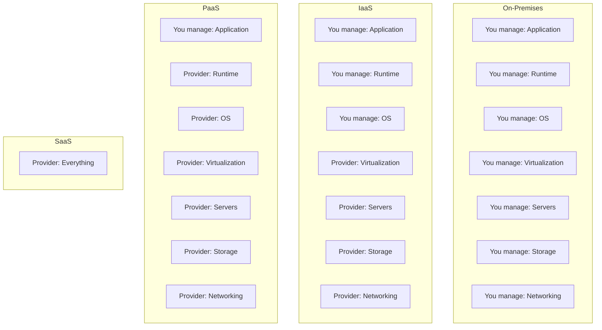

# Cloud Computing Basics

## Why This Topic Exists

For decades, companies built and maintained their own servers. You bought hardware, installed it in a data center, hired people to maintain it, and paid for electricity and cooling whether you used the machines or not. Then Amazon, Google, and Microsoft started renting out their infrastructure — and everything changed.

Today, virtually every startup and most large companies run some or all of their infrastructure on the cloud. Understanding what the cloud is, what you get from it, and what the trade-offs are is the foundation of all modern system design. You cannot design a scalable system without understanding the environment it runs in.

---

## Learning Objectives

By the end of this file you will be able to:

- Explain what "the cloud" actually means in simple terms
- Distinguish between IaaS, PaaS, and SaaS and give examples of each
- Name the three dominant cloud providers and their market positions
- Describe the core benefits of cloud computing with real examples
- Articulate the genuine trade-offs, especially vendor lock-in and cost at scale

---

## Prerequisites

- Basic understanding of what a server is (a computer that listens for and responds to requests)
- Basic understanding of networking (HTTP, IP addresses)
- No prior cloud experience required

---

## Introduction

The word "cloud" sounds abstract, but it just means someone else's computers. When you use the cloud, you rent compute power, storage, and networking from a provider who already owns the physical machines, the data centers, the cooling systems, and the internet connections. You pay for what you use, and you can get more or less of it at any time.

This is a genuinely big deal. It changed the economics of building software. A team of two engineers can now spin up infrastructure in minutes that would have taken a dedicated operations team months to build and manage in 2005.

---

## Real-World Analogy

**Buying a car vs. taking Uber.**

Owning a car (running your own servers):
- Large upfront cost to buy
- You pay for insurance, maintenance, and parking whether you drive or not
- You are responsible for repairs when it breaks
- You know exactly what you have and can customize it fully

Taking Uber (using the cloud):
- No upfront cost
- You pay only when you need a ride
- The car is maintained by someone else
- You can get a bigger car (SUV) or a cheaper option depending on what you need right now
- You are dependent on Uber being available

Neither model is always better. It depends on how much you drive, your budget, and how much you want to be in control. The same logic applies to cloud vs. on-premises infrastructure.

---

## Core Concepts

### IaaS — Infrastructure as a Service

You rent the raw infrastructure: virtual machines, storage, networking. You are responsible for everything that runs on top — the operating system, runtime, your application code, scaling logic.

**Examples**: AWS EC2, Google Compute Engine, Azure Virtual Machines

**Who uses it**: Teams that need full control over the environment, running specialized workloads, or migrating existing on-prem applications.

**Analogy**: Renting an empty apartment. You get the space, but you furnish it and pay the utilities yourself.

### PaaS — Platform as a Service

You rent a managed platform. You bring your code; the provider handles the operating system, runtime, patching, and often scaling. You do not manage virtual machines directly.

**Examples**: Heroku, AWS Elastic Beanstalk, Google App Engine, Render, Railway

**Who uses it**: Teams that want to deploy applications quickly without managing servers. Excellent for startups and small teams.

**Analogy**: Renting a fully furnished apartment. You bring your clothes and plug in your laptop. Someone else handles maintenance.

### SaaS — Software as a Service

You rent the entire application. You do not manage any infrastructure or even the software itself. You just use it.

**Examples**: Gmail, Salesforce, Slack, Dropbox, Figma

**Who uses it**: Everyone. You are probably using multiple SaaS products right now.

**Analogy**: Staying in a hotel. You bring nothing. Everything is provided, cleaned, and managed. You just show up.

---

## Visual Diagram (Mermaid)

---

## Deep Explanation

### The Three Big Cloud Providers

**Amazon Web Services (AWS)** — Market leader with the widest service catalog. Launched in 2006, AWS has the largest ecosystem, the most documentation, and the most engineers who know how to use it. If you are uncertain which cloud to learn, learn AWS first.

**Google Cloud Platform (GCP)** — Strong in data and machine learning (BigQuery, Vertex AI). Many companies choose GCP specifically for data workloads. Also notable for Kubernetes, which was invented at Google.

**Microsoft Azure** — Dominant in enterprise accounts because of deep integration with Microsoft products (Active Directory, Office 365, Windows Server). If a company is already all-in on Microsoft tools, Azure is the natural choice.

All three offer similar core services. The differences are in breadth, pricing, support, and ecosystem maturity for specific workloads.

### Elasticity

One of the most important cloud benefits is elasticity: the ability to automatically scale up when demand increases and scale down when demand drops.

A traditional data center forces you to provision for peak load. If you expect a traffic spike on Black Friday, you buy enough servers to handle that peak — and then those servers sit largely idle the other 364 days of the year. You pay for idle capacity.

On the cloud, you can run 10 servers normally and automatically scale to 200 servers during a spike, then scale back down when it is over. You only pay for the 200 servers during the hours you need them.

### Pay-As-You-Go Pricing

Cloud providers charge you by usage: per hour of compute time, per gigabyte of storage, per million API calls. There is typically no upfront commitment required (though you can save money with reserved capacity).

This fundamentally changes the economics of a startup. In 2005, launching a new service might require $50,000 to $100,000 in upfront hardware costs before you write a single line of code. In 2024, you can launch on AWS and pay a few dollars a month until you start getting real traffic.

### Global Availability

The major providers have data centers (called "regions") all over the world. AWS has over 30 regions as of 2024, including North America, Europe, Asia Pacific, South America, and the Middle East.

This means you can deploy your application to a region close to your users, reducing latency. It also means you can design for fault tolerance across regions — if one region goes down, traffic routes to another.

### Managed Services

Perhaps the most underappreciated benefit of cloud is managed services. Instead of running your own PostgreSQL server, patching it, handling backups, and managing failover, you use AWS RDS — a managed relational database. AWS handles all of that. You just connect to it.

Managed services exist for almost everything: databases, message queues, caches, search indexes, monitoring, machine learning, video transcoding, DNS, CDN, and more. This drastically reduces the operational work your team needs to do.

---

## Step-by-Step Example

**Scenario**: A small team wants to launch a web app.

**On-premises approach (2005)**:
1. Estimate peak traffic requirements
2. Purchase physical servers — takes 4-8 weeks for delivery
3. Rack and cable servers in a data center — requires physical access
4. Install OS, configure network, set up firewall
5. Deploy application
6. Pray that the traffic estimates were accurate
7. If traffic exceeds estimates, repeat steps 1-4

**Cloud approach (2024)**:
1. Create an AWS account
2. Launch an EC2 instance (virtual machine) — takes 2 minutes
3. Deploy application
4. Configure auto-scaling to handle traffic spikes automatically
5. If needs change, resize or add instances in minutes

The cloud approach is not just faster. It is fundamentally more forgiving of uncertainty. You do not need to predict the future accurately.

---

## Advantages / Disadvantages / Trade-offs

| Dimension | Cloud | On-Premises |
|-----------|-------|-------------|
| Upfront cost | Very low | Very high |
| Operational overhead | Low (managed services) | High |
| Elasticity | Excellent | Poor |
| Control | Limited | Full |
| Long-term cost (at scale) | Can be high | Can be lower |
| Vendor dependence | High | None |
| Time to provision | Minutes | Weeks |
| Security responsibility | Shared model | Fully yours |
| Global reach | Built-in | Requires investment |

**Vendor lock-in** is the most serious long-term trade-off. If you build your entire system using AWS-specific services (DynamoDB, SQS, Lambda, etc.), migrating to another cloud or to on-premises becomes very expensive. Large companies invest heavily in avoiding lock-in by using open standards and cloud-agnostic tools.

**Cost at scale** is the other major trade-off. AWS is economical when you are small. When you are at Netflix or Dropbox scale, the economics often favor owning hardware. Dropbox famously saved $75 million over two years by migrating off AWS onto their own infrastructure. This is not common advice for most companies — it only makes sense at very large scale with dedicated infrastructure teams.

---

## When to Use / When NOT to Use

**Use the cloud when**:
- You are a startup or small team without infrastructure expertise
- Your traffic is unpredictable or seasonal
- You need to launch fast
- You need global reach without massive investment
- You want to use managed services to reduce operational burden

**Do NOT use (or reconsider) the cloud when**:
- You have massive, predictable, and stable workloads at scale
- You have regulatory requirements that prohibit third-party data hosting
- Your data has specific hardware requirements (certain GPU configurations, for example)
- The fully-loaded cloud bill exceeds what owning hardware would cost over 3-5 years

---

## Common Interview Questions

**Q: What is the difference between IaaS, PaaS, and SaaS?**
Walk through the stack: IaaS gives you virtual machines, PaaS gives you a deployment platform, SaaS gives you the finished software. Give one concrete example of each.

**Q: What are the advantages of cloud over on-premises?**
Elasticity, pay-as-you-go, speed of provisioning, managed services, global availability, reduced operational burden. Do not just list them — explain why each matters.

**Q: What are the downsides of the cloud?**
Vendor lock-in and cost at scale are the two most important ones. Showing awareness of trade-offs signals maturity.

**Q: Why might a large company move off the cloud?**
Cost. At sufficient scale (Dropbox, Twitter, others), owning hardware can be significantly cheaper. This requires stable, predictable load and a dedicated infrastructure team.

---

## Common Beginner Mistakes

**Thinking "cloud" means "always better"**: The cloud is a tool with trade-offs. Know when the trade-offs are acceptable.

**Not understanding the shared responsibility model**: Cloud providers secure the infrastructure. You are responsible for securing what runs on it — your data, your application, your access controls. A misconfigured S3 bucket is your fault, not AWS's.

**Ignoring cost**: Cloud bills can grow unexpectedly. Leaving an instance running, not configuring auto-scaling down, storing too much data — costs accumulate. Always set billing alerts.

**Treating IaaS as on-premises**: One common mistake is using EC2 instances exactly like physical servers — manually SSH-ing in, making changes by hand, not using auto-scaling or infrastructure as code. You lose most of the cloud's benefits this way.

---

## Summary

The cloud means renting compute, storage, and networking from a provider instead of owning it. The three service models are IaaS (raw infrastructure), PaaS (managed platform), and SaaS (finished software). The three dominant providers are AWS, GCP, and Azure.

The core benefits are elasticity, pay-as-you-go pricing, fast provisioning, managed services, and global reach. The core trade-offs are vendor lock-in and potential cost disadvantage at very large scale.

---

## Key Takeaways

- Cloud = someone else's computers that you rent and pay for by usage
- IaaS: you manage OS and above; PaaS: you manage app only; SaaS: you manage nothing
- AWS has the broadest service catalog; GCP excels in data; Azure dominates enterprise
- Elasticity is the single most important cloud advantage for scaling systems
- Vendor lock-in is real — design with portability in mind if it matters to you
- Cloud is economical at small-to-medium scale; own hardware can win at massive scale

---

## Related Topics

- [Key AWS Services for System Design](./02.%20Key%20AWS%20Services%20for%20System%20Design%20(INTERMEDIATE).md)
- [Serverless Architecture](./03.%20Serverless%20Architecture%20(INTERMEDIATE).md)
- [Infrastructure as Code](./04.%20Infrastructure%20as%20Code%20(INTERMEDIATE).md)
- [CI/CD Pipelines](./05.%20CI-CD%20Pipelines%20(BEGINNER).md)
- [Multi-Region Architecture](./06.%20Multi-Region%20Architecture%20(INTERMEDIATE).md)
