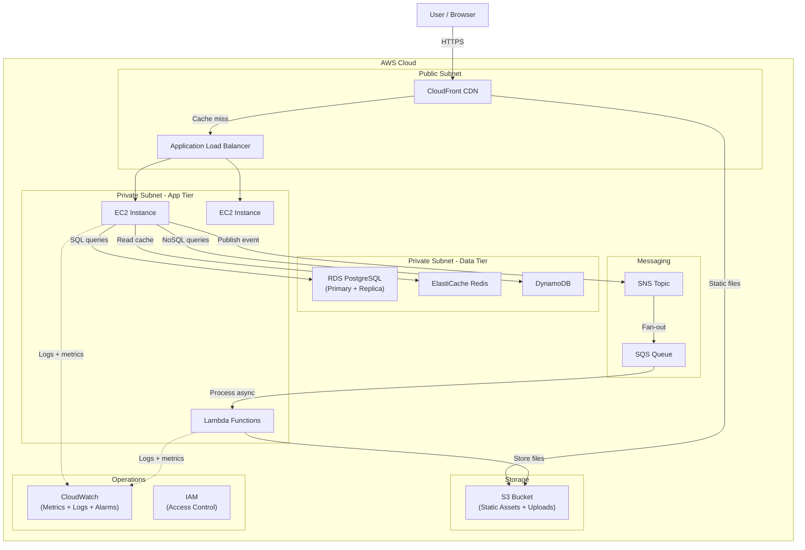

# Key AWS Services for System Design

## Why This Topic Exists

When you walk into a system design interview and say "I'd use a message queue here," the follow-up question is often "which one and why?" Interviewers at companies that run on AWS — which is most of them — expect you to have working knowledge of the core AWS service catalog. You do not need to know every configuration option. You need to know what each service does, when to reach for it, and what the trade-offs are.

This file is a curated map of the AWS services that come up most often in system design interviews. Think of it as the vocabulary list you need before you can design real systems.

---

## Learning Objectives

By the end of this file you will be able to:

- Name the core AWS services across compute, storage, database, networking, and messaging categories
- Explain what each service does in one or two sentences
- Choose the right service for a given system design problem
- Draw a basic AWS architecture diagram for a typical web application

---

## Prerequisites

- [Cloud Computing Basics](./01.%20Cloud%20Computing%20Basics%20(BEGINNER).md) — especially IaaS vs PaaS
- Basic understanding of HTTP and DNS
- Basic understanding of databases (SQL vs NoSQL)
- Basic understanding of message queues (what a producer and consumer are)

---

## Introduction

AWS launched in 2006 with three services: S3, SQS, and EC2. Today it offers over 200 services. The good news is that you only need to know about 20-30 of them to handle the vast majority of system design scenarios.

This file organizes those services into categories: compute, storage, database, networking, messaging, and operations. For each service, you will get a one-line description, a "when to use it" note, and a comparison to alternatives where relevant.

---

## Real-World Analogy

Think of AWS as a city of specialized shops. There is a bakery, a post office, a hardware store, a bank, a telephone company, and so on. You do not need to know everything every shop does — but you do need to know which shop to go to when you need something. A good system designer knows the city layout.

---

## Core Concepts

### Compute Services

**EC2 — Elastic Compute Cloud**
The foundational compute service. You get a virtual machine (called an instance) running Linux, Windows, or another OS. You choose the instance type (CPU, memory, GPU), install software, and manage it yourself.

- When to use: Any workload that needs full control over the runtime environment. Long-running processes. Stateful applications.
- Instance types: `t3.micro` (cheap, burstable), `m6i.xlarge` (general purpose), `c6i.2xlarge` (compute-optimized), `r6i.large` (memory-optimized)
- Key feature: Auto Scaling Groups (ASG) let you automatically add/remove instances based on load

**Lambda**
Serverless functions. You upload code; AWS runs it in response to events. You pay per invocation and per millisecond of runtime. No servers to manage. Scales to zero when not in use.

- When to use: Event-driven processing, webhooks, scheduled jobs, image resizing, lightweight APIs. See [Serverless Architecture](./03.%20Serverless%20Architecture%20(INTERMEDIATE).md) for full detail.
- Key limitation: 15-minute maximum execution time, stateless, cold start latency

**ECS — Elastic Container Service**
Run Docker containers on AWS without managing the underlying container orchestration layer. You can run ECS on EC2 instances you manage, or on Fargate (serverless containers — AWS manages the underlying hosts).

- When to use: Containerized workloads where you do not want to manage Kubernetes, microservices, batch processing
- ECS vs Fargate: ECS on EC2 gives cost control; Fargate removes server management

**EKS — Elastic Kubernetes Service**
Managed Kubernetes. AWS runs the Kubernetes control plane for you; you manage the worker nodes (or use Fargate).

- When to use: Large container fleets, teams already familiar with Kubernetes, complex orchestration requirements
- Trade-off: More operational complexity than ECS; Kubernetes has a steep learning curve

---

### Storage Services

**S3 — Simple Storage Service**
Object storage for any type of file. Infinitely scalable, highly durable (99.999999999% — eleven nines). Files are stored as "objects" in "buckets." Not a file system — you cannot mount S3 like a hard drive and read/write individual bytes.

- When to use: Images, videos, backups, static website assets, data lake files, anything you would store in a file system and access by URL
- Key features: Versioning, lifecycle policies (auto-archive to Glacier), pre-signed URLs for temporary access, event notifications to Lambda
- Pricing: ~$0.023/GB/month for standard storage

**EBS — Elastic Block Store**
Block storage attached to EC2 instances. Acts like a hard drive — you format it with a filesystem and mount it. Data persists when the instance stops.

- When to use: Database storage (the underlying disk for RDS), application data that an EC2 instance needs to read/write with filesystem semantics
- Key limitation: Only attachable to one EC2 instance at a time (standard volumes)

**EFS — Elastic File System**
Managed NFS (Network File System) that multiple EC2 instances can mount simultaneously. Think of it as a shared network drive.

- When to use: Shared content between multiple instances (shared uploads folder, configuration files, media content), home directories for users
- Key difference vs EBS: Many instances can read/write to EFS at the same time

---

### Database Services

**RDS — Relational Database Service**
Managed SQL databases. Supports PostgreSQL, MySQL, MariaDB, Oracle, and SQL Server. AWS handles backups, patching, failover, and replication.

- When to use: Any application that needs relational data with ACID transactions — user accounts, orders, financial records, anything with foreign keys and joins
- Key feature: Multi-AZ deployment for automatic failover; Read Replicas for read scaling
- Aurora: AWS's own MySQL/PostgreSQL-compatible engine with better performance and auto-scaling storage

**DynamoDB**
Fully managed NoSQL key-value and document database. Single-digit millisecond latency at any scale. No servers to manage.

- When to use: High-throughput applications where you need consistent low latency at scale — shopping carts, user sessions, leaderboards, IoT event storage
- Key concepts: Partition key, sort key, Global Secondary Indexes (GSI), DynamoDB Streams
- Trade-off: No joins, no complex queries; you must design your access patterns upfront

**ElastiCache**
Managed in-memory caching. Supports Redis and Memcached.

- Redis: Richer data structures (lists, sets, sorted sets), persistence, pub-sub messaging, clustering
- Memcached: Simpler, purely a key-value cache, multi-threaded
- When to use: Caching database query results, session storage, rate limiting counters, leaderboards, pub-sub messaging

---

### Networking Services

**VPC — Virtual Private Cloud**
Your private, isolated network inside AWS. Every resource you create (EC2, RDS, Lambda) runs inside a VPC. You define subnets (public-facing vs private), routing tables, and security groups (firewall rules).

- Public subnet: Resources here can talk to the internet directly (web servers, load balancers)
- Private subnet: Resources here are not directly internet-accessible (databases, internal services)

**Route 53**
AWS's DNS service. Translates domain names (example.com) to IP addresses. Also supports advanced routing policies:

- Latency-based routing: Route users to the AWS region with lowest latency
- Geolocation routing: Route EU users to EU region
- Failover routing: Send traffic to a secondary endpoint when primary is unhealthy
- Weighted routing: Send 10% of traffic to new version, 90% to old version (canary deployments)

**CloudFront**
AWS's CDN (Content Delivery Network). Caches content at edge locations close to users worldwide. Reduces latency and offloads traffic from your origin.

- When to use: Static assets (images, CSS, JS), video streaming, API acceleration, protecting your origin from traffic spikes
- Key feature: Integrates with S3 (serve static files globally), Lambda@Edge (run code at the edge)

**API Gateway**
Managed service for building and publishing REST APIs, HTTP APIs, and WebSocket APIs. Handles authentication, rate limiting, request transformation, and routing to backend services (Lambda, EC2, other HTTP endpoints).

- When to use: Building serverless APIs with Lambda, exposing microservices externally, WebSocket connections
- Key feature: Throttling, API keys, usage plans, request/response transformation

**ELB/ALB/NLB — Elastic/Application/Network Load Balancer**
Load balancers distribute incoming traffic across multiple targets.

- ALB (Application Load Balancer): HTTP/HTTPS routing, can route based on URL path or hostname. Most common choice for web apps.
- NLB (Network Load Balancer): TCP/UDP routing, ultra-low latency, handles millions of requests per second. Used for gaming, real-time applications.
- CLB (Classic Load Balancer): Legacy, avoid for new designs.

---

### Messaging Services

**SQS — Simple Queue Service**
Managed message queue. Producers send messages; consumers poll and process them. Decouples services.

- Standard queue: At-least-once delivery, best-effort ordering, maximum throughput
- FIFO queue: Exactly-once processing, strict ordering, lower throughput (up to 300 TPS)
- When to use: Decoupling microservices, background job processing, smoothing out traffic spikes

**SNS — Simple Notification Service**
Managed pub-sub messaging. Publishers send messages to a topic; all subscribers receive a copy. Fan-out pattern.

- When to use: Broadcasting events to multiple consumers (send to SQS + Lambda + Email simultaneously), push notifications, alerting
- SNS + SQS together: Fan-out pattern where SNS pushes to multiple SQS queues, each consumed independently

**Kinesis**
Managed streaming data platform. Handles real-time data streams at massive scale.

- Kinesis Data Streams: Real-time stream processing, replay data within 7 days, multiple consumers
- Kinesis Firehose: Load streaming data into S3, Redshift, Elasticsearch — no code required
- When to use: Log aggregation, real-time analytics, click streams, IoT sensor data, financial transactions

---

### Operations Services

**CloudWatch**
Monitoring and observability. Collects metrics (CPU, memory, request count), logs, and traces. Set alarms on metrics. Create dashboards. Trigger Auto Scaling.

- When to use: Always. Every production system should have CloudWatch dashboards and alarms.

**IAM — Identity and Access Management**
Controls who (users, services) can do what (actions) on which AWS resources. Everything in AWS is controlled through IAM.

- Principle of least privilege: Grant only the permissions actually needed
- IAM Roles: Assigned to services (an EC2 instance assumes a role that lets it read from S3)
- Key mistake: Using overly permissive policies (never use `*` for actions or resources in production)

---

## Visual Diagram (Mermaid)

---

## Deep Explanation

### Choosing Between Storage Types

A common interview mistake is treating all storage the same. Here is the decision logic:

- Need to store a file (image, video, document) accessible via URL? **S3**
- Need a disk attached to your EC2 instance for a database or application? **EBS**
- Need multiple EC2 instances to share a directory? **EFS**

### Choosing Between Database Services

- Need SQL with joins, transactions, foreign keys? **RDS**
- Need massive throughput, simple lookups by key, serverless scaling? **DynamoDB**
- Need to cache results of expensive database queries? **ElastiCache**

### Choosing Between Messaging Services

- Need a work queue for background jobs? **SQS**
- Need to broadcast an event to multiple consumers at once? **SNS**
- Need real-time streaming of high-velocity data (millions of events/second)? **Kinesis**

### The VPC Mental Model

Every production AWS architecture should have at minimum:
- A VPC with public and private subnets
- Load balancers in the public subnet
- Application servers in private subnets (not directly accessible from the internet)
- Databases in private subnets with no internet access at all
- Security groups acting as firewalls around each tier

---

## Step-by-Step Example

**Designing a URL shortener on AWS:**

1. User sends `POST /shorten` with a long URL
2. Request hits **CloudFront** (CDN)
3. Routed to **ALB** (Application Load Balancer)
4. **EC2** or **Lambda** processes the request
5. Checks **ElastiCache (Redis)** for existing short code
6. If not found, generates short code, stores in **DynamoDB** (key-value, high throughput)
7. Returns short URL to user

For the redirect flow:
1. User visits `short.url/abc123`
2. **CloudFront** edge node handles it
3. Cache miss — routed to **Lambda**
4. Lambda looks up `abc123` in **DynamoDB** (single-digit ms latency)
5. Returns HTTP 301 redirect to the original URL
6. **CloudWatch** captures metrics and logs throughout

---

## Advantages / Disadvantages / Trade-offs

| Service Category | AWS Advantage | Trade-off |
|-----------------|---------------|-----------|
| Managed databases (RDS) | No DBA work, automatic failover | Less control than self-managed, higher cost |
| Lambda | No servers, pay per use, zero scaling work | Cold starts, 15-min timeout, harder debugging |
| S3 | Infinite scale, 11 nines durability | Not a file system — sequential byte access is slow |
| DynamoDB | Consistent low latency at any scale | No joins, must design access patterns upfront |
| CloudFront | Global edge caching, DDoS protection | Cache invalidation complexity, cost for high-volume transfers |

---

## When to Use / When NOT to Use

**When to use AWS services in a design interview**:
- When the interviewer has not specified a cloud provider — AWS is the safe default
- When you are designing at scale and need to explain how scaling works
- When you want to cite specific, credible service names rather than vague "a cache" or "a queue"

**When NOT to default to the most complex option**:
- Do not use Kinesis when SQS would do — match the tool to the problem
- Do not use EKS if the team is small and ECS or Lambda would work — operational complexity has a cost
- Do not over-engineer: a simple RDS + Redis stack handles most web apps

---

## Common Interview Questions

**Q: When would you use DynamoDB instead of RDS?**
DynamoDB when you have high-throughput, simple key-value access patterns with known access paths. RDS when you need complex queries, joins, transactions, or your data model is not yet fully defined.

**Q: What is the difference between SQS and SNS?**
SQS is a queue — one consumer reads and processes each message. SNS is pub-sub — all subscribers receive every message. Often combined: SNS fan-outs to multiple SQS queues.

**Q: How would you serve static assets globally with low latency?**
Store in S3, distribute via CloudFront. CloudFront caches at 400+ edge locations globally, reducing both latency and origin load.

**Q: How do you handle database scaling on AWS?**
For read-heavy workloads: RDS Read Replicas + ElastiCache. For massive scale: consider DynamoDB or Aurora Serverless. For write-heavy: sharding or moving hot data to DynamoDB.

---

## Common Beginner Mistakes

**Putting databases in public subnets**: Databases should always be in private subnets with no public internet access. Security groups alone are not enough protection.

**Using a single EC2 instance**: Always design for failure. Use an Auto Scaling Group with a minimum of 2 instances across multiple Availability Zones.

**Not using a CDN for static assets**: Serving images and JS files from your application servers wastes compute and increases latency. Put them in S3 behind CloudFront.

**Confusing SQS and SNS**: These are frequently confused in interviews. Remember: SQS is a queue (one consumer per message), SNS is pub-sub (all subscribers get the message).

---

## Summary

AWS provides managed services for every layer of a modern application. The key services to know are: EC2 (VMs), Lambda (serverless), ECS/EKS (containers), S3 (object storage), RDS (SQL), DynamoDB (NoSQL), ElastiCache (cache), CloudFront (CDN), Route 53 (DNS), ALB (load balancer), SQS (queue), SNS (pub-sub), Kinesis (streaming), CloudWatch (monitoring), and IAM (access control).

In a design interview, do not just name services — explain why you chose them and what trade-offs you are accepting.

---

## Key Takeaways

- EC2 for full-control VMs; Lambda for event-driven serverless; ECS/EKS for containers
- S3 for files; EBS for instance disks; EFS for shared filesystems
- RDS for SQL with transactions; DynamoDB for NoSQL at scale; ElastiCache for caching
- ALB for HTTP traffic; Route 53 for DNS and routing policies; CloudFront for CDN
- SQS for work queues; SNS for pub-sub fan-out; Kinesis for high-velocity streams
- Always put databases in private subnets; always use multiple Availability Zones for production

---

## Related Topics

- [Cloud Computing Basics](./01.%20Cloud%20Computing%20Basics%20(BEGINNER).md)
- [Serverless Architecture](./03.%20Serverless%20Architecture%20(INTERMEDIATE).md)
- [Infrastructure as Code](./04.%20Infrastructure%20as%20Code%20(INTERMEDIATE).md)
- [Multi-Region Architecture](./06.%20Multi-Region%20Architecture%20(INTERMEDIATE).md)
