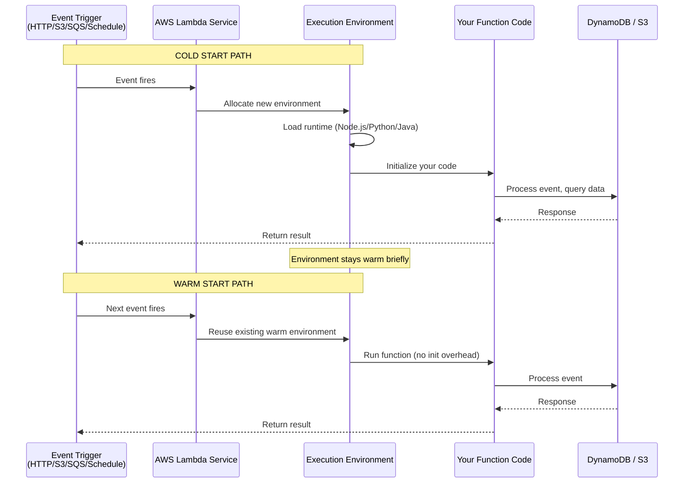

# Serverless Architecture

## Why This Topic Exists

Every server requires someone to manage it. You need to patch the OS, monitor disk space, handle crashes, plan capacity, and configure security. For years, this operational overhead was just the cost of building software. Then came serverless: the idea that you should be able to write a function, deploy it, and have it run — without thinking about the server at all.

Serverless changed how teams build event-driven and asynchronous systems. It also introduced new problems: cold starts, hard timeouts, and stateless constraints. Understanding the benefits and the limitations is what separates a senior engineer from a junior one when this topic comes up in an interview.

---

## Learning Objectives

By the end of this file you will be able to:

- Explain how AWS Lambda (and FaaS in general) works at a conceptual level
- Describe the pricing model and why it matters
- Explain the cold start problem and how to mitigate it
- List concrete use cases where serverless excels
- Articulate the limitations and when serverless is the wrong choice
- Name serverless database options and explain the FaaS model

---

## Prerequisites

- [Cloud Computing Basics](./01.%20Cloud%20Computing%20Basics%20(BEGINNER).md)
- [Key AWS Services for System Design](./02.%20Key%20AWS%20Services%20for%20System%20Design%20(INTERMEDIATE).md) — especially Lambda, API Gateway, S3, DynamoDB
- Basic understanding of what a function is and what event-driven programming means

---

## Introduction

"Serverless" is a misleading name. There are still servers — you just do not see them. What serverless really means is: you do not manage, provision, or think about servers. You write a function, deploy it, and the cloud provider handles everything else.

The canonical example is AWS Lambda. You write a Python, Node.js, Java, or Go function. You define what triggers it (an HTTP request, a message in SQS, a file uploaded to S3, a scheduled time). AWS runs your function when that event happens, scales it automatically to handle concurrent invocations, and charges you only for the time your code actually runs.

---

## Real-World Analogy

Imagine you run a pizza shop. You have two options:

**Option A — Hire a full-time kitchen staff**: You pay them 8 hours a day whether customers come in or not. You manage their schedules, handle sick days, and rent a kitchen around the clock. This is traditional server-based computing.

**Option B — Use a catering service on demand**: When a customer orders, the catering service sends a chef, the chef makes the pizza, and leaves when done. You pay only for the time spent making pizzas. No staff costs when there are no orders. This is serverless.

The catering service has limits: they cannot handle a 10,000-pizza rush instantly (there is ramp-up time), and the chef does not leave your ingredients in the kitchen between visits (stateless).

---

## Core Concepts

### FaaS — Function as a Service

FaaS is the compute model behind serverless. You deploy individual functions, not applications. Each function is:

- **Event-triggered**: It runs in response to an event, not continuously
- **Stateless**: No memory of previous invocations (each call starts fresh)
- **Ephemeral**: The execution environment may be discarded after the function finishes
- **Automatically scaled**: The provider runs as many copies as needed to handle concurrent events

AWS Lambda is the most widely used FaaS platform. Alternatives include Google Cloud Functions, Azure Functions, and Cloudflare Workers.

### How Lambda Works Internally

When you deploy a Lambda function:

1. AWS stores your code (or container image) in its internal storage
2. When an event triggers your function, AWS finds or creates an execution environment (a lightweight container-like sandbox)
3. Your code runs inside that environment
4. The environment may be kept "warm" for a short time to handle subsequent invocations
5. If no invocations come, the environment is eventually discarded

This "warm" vs "cold" distinction is the source of the cold start problem.

### The Cold Start Problem

A **cold start** happens when your function is invoked but no warm execution environment is available. AWS must:
1. Allocate a new container
2. Load the Lambda runtime (e.g., the JVM for Java, or the Node.js process)
3. Load and initialize your code
4. Run the function

Steps 1-3 add latency — typically 100ms to several seconds depending on the runtime and the size of your deployment package.

A **warm start** is when a previous execution environment is reused. Only step 4 runs, so the latency is just your function's own execution time.

**Cold start latency by runtime (approximate)**:
| Runtime | Cold Start Latency |
|---------|-------------------|
| Node.js | 100 - 500ms |
| Python | 100 - 500ms |
| Go | 100 - 400ms |
| Java (JVM) | 1 - 5 seconds |
| Java (GraalVM native) | 100 - 400ms |

**Mitigation strategies**:
- Use lightweight runtimes (Node.js or Python over Java when latency matters)
- Keep deployment packages small (fewer dependencies = faster initialization)
- Use **Provisioned Concurrency** (Lambda keeps N warm environments pre-initialized — you pay for them continuously)
- Use container images with SnapStart (AWS Lambda SnapStart for Java restores from a snapshot)

### Pricing Model

Lambda charges on two dimensions:
1. **Invocations**: $0.20 per 1 million requests (first 1M/month free)
2. **Duration**: $0.0000166667 per GB-second (memory × execution time)

**Example**: A function using 128MB of memory that runs for 100ms, invoked 10 million times per month:
- Invocation cost: (10M - 1M free) / 1M × $0.20 = $1.80
- Duration cost: 0.128 GB × 0.1s × 9M billable invocations × $0.0000166667 ≈ $1.92
- Total: ~$3.72/month

Compare this to running an EC2 `t3.micro` continuously: ~$8.47/month at $0.0116/hour. For 9 million real executions in a month, Lambda often wins. At much higher sustained throughput, EC2 can be cheaper.

---

## Visual Diagram (Mermaid)



---

## Deep Explanation

### Stateless Constraints

Lambda functions are stateless by design. Each invocation gets a fresh environment. You cannot store data in a global variable and expect it to be there for the next invocation.

What this means in practice:
- You cannot use in-memory session state
- You cannot use local file storage for data that must persist (the `/tmp` directory exists but is not shared across instances and may be discarded)
- All persistent state must go to an external store: DynamoDB, RDS, S3, ElastiCache

This constraint is actually a feature for horizontal scaling — because there is no shared state, Lambda can run thousands of concurrent instances without any coordination.

### Concurrency Model

Lambda scales by running multiple instances concurrently. If 1,000 requests arrive simultaneously, Lambda can run 1,000 instances of your function at the same time (subject to account-level concurrency limits, which default to 1,000 and can be increased).

This is fundamentally different from a traditional server where you have a fixed number of worker threads. Lambda scales to match demand automatically.

**Concurrency limit**: AWS accounts have a default concurrency limit of 1,000 per region. You can request an increase. Each function can be configured with a **reserved concurrency** (guarantees that X instances are always available) or **provisioned concurrency** (keeps X environments warm).

### Timeout Limit

Lambda functions have a maximum execution time of **15 minutes**. For most use cases (API calls, event processing, image resizing) this is plenty. For long-running jobs (video transcoding, large data transforms), you need a different tool: ECS tasks, AWS Batch, or Step Functions.

### Serverless Databases

Serverless compute needs a database that can scale to zero and scale up instantly. Traditional relational databases have connection pools of limited size — if Lambda scales to 1,000 concurrent instances, each trying to open a database connection, you quickly exhaust the connection pool.

**DynamoDB**: The native serverless database on AWS. HTTP-based API (no persistent connections), scales automatically, no connection pool limits. Perfect match for Lambda.

**Aurora Serverless v2**: MySQL/PostgreSQL-compatible relational database that scales capacity automatically. More expensive than standard Aurora at high load, but scales to near-zero when idle.

**PlanetScale**: MySQL-compatible serverless database built on Vitess. HTTP API, scales to zero, no connection limits.

**RDS Proxy**: A proxy that sits in front of RDS and manages the connection pool. Multiple Lambda instances connect to the proxy, which maintains a smaller real pool to RDS. Solves the connection exhaustion problem at a small latency cost.

---

## Step-by-Step Example

**Image Upload and Processing Pipeline using Serverless**:

```
User uploads photo
      |
      v
API Gateway (HTTP endpoint)
      |
      v
Lambda: Upload Handler
  - Validates file type and size
  - Generates unique filename
  - Returns pre-signed S3 URL
      |
      v
Client uploads directly to S3 (bypassing Lambda entirely)
      |
      v
S3 Event Notification triggers Lambda: Image Processor
  - Downloads original from S3
  - Resizes to 3 variants: thumbnail, medium, large
  - Saves variants back to S3
  - Writes metadata to DynamoDB
      |
      v
DynamoDB item created triggers Lambda: Notifier (via DynamoDB Streams)
  - Sends notification to user via SNS
```

In this pipeline:
- No servers to manage
- Each step scales independently
- You pay only when images are uploaded and processed
- Idle time costs nothing
- Peak traffic (viral photo sharing event) handled automatically

---

## Advantages / Disadvantages / Trade-offs

| Dimension | Serverless (Lambda) | Traditional Server (EC2) |
|-----------|--------------------|-----------------------|
| Operational overhead | Near zero | High |
| Cost at low/medium traffic | Very low | Higher (idle time) |
| Cost at sustained high traffic | Can be higher | Lower |
| Scaling | Automatic, instant | Requires auto-scaling config |
| Cold starts | Yes — latency on first call | No — always warm |
| Max execution time | 15 minutes | Unlimited |
| State management | External only | Can use local memory |
| Debugging | Harder (distributed, ephemeral) | Easier (SSH, local tools) |
| Concurrency model | Automatic | Thread pools, manual config |

---

## When to Use / When NOT to Use

**Serverless is a great choice for**:
- Webhook handlers (Stripe payment notifications, GitHub webhooks)
- Scheduled/cron jobs (daily reports, database cleanup, batch sends)
- Image and video processing pipelines
- Event-driven architectures (processing SQS messages, S3 events, DynamoDB streams)
- Lightweight REST APIs with low-to-moderate traffic
- Microservices with infrequent invocations (the idle cost savings are significant)

**Serverless is a poor choice for**:
- Long-running jobs (>15 minutes) — use ECS tasks or AWS Batch
- Low-latency APIs where cold starts are unacceptable — use EC2 or ECS with Provisioned Concurrency
- Stateful workloads (game servers, WebSocket-heavy apps) — though API Gateway + Lambda supports WebSockets, persistent state is awkward
- Very high sustained throughput — at millions of requests per hour continuously, EC2 can be significantly cheaper
- Applications that need to maintain database connection pools efficiently at scale — use RDS Proxy or switch to DynamoDB

---

## Common Interview Questions

**Q: What is a cold start in Lambda and how do you reduce it?**
A cold start is the initialization overhead when AWS creates a new execution environment for your function. Mitigations: use lightweight runtimes (Node.js/Python over Java), keep packages small, use Provisioned Concurrency for latency-sensitive functions.

**Q: How does Lambda scale?**
Lambda automatically runs additional instances of your function to handle concurrent invocations. If 500 requests arrive simultaneously, it can run 500 instances concurrently (subject to account limits). You do not configure thread counts or server counts — it is fully automatic.

**Q: Why is Lambda stateless and why does that matter?**
Each Lambda invocation may run on a different execution environment. You cannot rely on in-memory state persisting between invocations. This matters because all persistent state must be external (DynamoDB, S3, ElastiCache), but it also enables near-infinite horizontal scaling.

**Q: When would you use EC2 instead of Lambda?**
Long-running workloads (>15 min), stateful applications, applications requiring persistent connections, very high sustained throughput where per-hour EC2 pricing beats per-invocation Lambda pricing, or workloads with specialized hardware requirements.

---

## Common Beginner Mistakes

**Treating Lambda like a server**: Lambda is not a persistent process. Do not design as though the function is always running. Assume each invocation is independent and may start from scratch.

**Using Lambda for long-running jobs**: The 15-minute limit is hard. Streaming video transcodes or large batch jobs must run on ECS, EC2, or AWS Batch instead.

**Connecting Lambda directly to RDS without a proxy**: RDS has a finite connection pool. Lambda can scale to thousands of concurrent instances; each opening a database connection exhausts the pool instantly. Use RDS Proxy or DynamoDB.

**Large deployment packages**: Every additional dependency increases cold start time. Use Lambda Layers for shared dependencies, and strip unnecessary packages from your deployment bundle.

---

## Summary

Serverless (FaaS) lets you run code in response to events without managing servers. AWS Lambda is the dominant FaaS platform. You pay per invocation and per millisecond of runtime. Lambda is stateless, limited to 15-minute executions, and subject to cold start latency on new environments.

Serverless excels for event-driven, intermittent workloads: webhooks, image processing, scheduled tasks, and lightweight APIs. It is a poor fit for long-running jobs, high-sustained-throughput applications, and latency-critical paths where cold starts cannot be tolerated.

---

## Key Takeaways

- Serverless = run code without managing servers; FaaS = deploy individual functions triggered by events
- Lambda scales automatically to match concurrent demand — no manual scaling configuration
- Cold starts add initialization latency; mitigate with lightweight runtimes, small packages, or Provisioned Concurrency
- Lambda is stateless — all persistent data must live in an external store (DynamoDB, S3, etc.)
- Pay per invocation + duration: economical for bursty workloads, potentially expensive for sustained high throughput
- 15-minute hard timeout — long-running jobs must use ECS or EC2
- Serverless databases (DynamoDB, Aurora Serverless, PlanetScale) pair best with Lambda

---

## Related Topics

- [Key AWS Services for System Design](./02.%20Key%20AWS%20Services%20for%20System%20Design%20(INTERMEDIATE).md)
- [Cloud Computing Basics](./01.%20Cloud%20Computing%20Basics%20(BEGINNER).md)
- [Infrastructure as Code](./04.%20Infrastructure%20as%20Code%20(INTERMEDIATE).md)
- [CI/CD Pipelines](./05.%20CI-CD%20Pipelines%20(BEGINNER).md)
