# Infrastructure as Code

## Why This Topic Exists

Picture this: you spend three days clicking through the AWS console to set up a production environment — VPCs, subnets, EC2 instances, load balancers, security groups, RDS. Everything is working. Then you need to create a staging environment that looks exactly like production. Can you recreate it? You have no record of what you clicked. You would have to do it again from memory, making mistakes and creating subtle differences between environments.

Now imagine your production environment has a catastrophic failure and needs to be rebuilt from scratch. Without documentation of the configuration, recovery could take days.

Infrastructure as Code (IaC) solves this. Your infrastructure is described in code files that you check into version control. Spinning up a new environment is a single command. The staging environment is identical to production because they are both generated from the same code. Recovery is automated. Changes go through pull requests with review. This is how professional engineering teams operate.

---

## Learning Objectives

By the end of this file you will be able to:

- Explain why IaC exists and what problem it solves
- Describe the three major IaC tools and their differences
- Explain the Terraform plan/apply cycle and the concept of state
- Read and write a basic Terraform configuration
- Explain what GitOps means and why it matters
- Articulate the trade-offs of IaC

---

## Prerequisites

- [Cloud Computing Basics](./01.%20Cloud%20Computing%20Basics%20(BEGINNER).md)
- [Key AWS Services for System Design](./02.%20Key%20AWS%20Services%20for%20System%20Design%20(INTERMEDIATE).md)
- Basic familiarity with version control (git)
- Some exposure to configuration files (YAML, JSON) is helpful

---

## Introduction

Infrastructure as Code is the practice of managing and provisioning infrastructure (servers, databases, networks, DNS records, IAM roles — everything) through machine-readable configuration files instead of manual processes.

The core idea is simple: if you can describe your infrastructure in a file, you can:
- Store it in version control (git history of every infrastructure change)
- Review changes before applying them (pull requests for infrastructure)
- Reproduce environments reliably (same code → same environment every time)
- Automate provisioning (deploy a new region in one command)
- Roll back to a previous state (git revert)

---

## Real-World Analogy

Think about cooking. If you make a dish by improvising — a bit of this, a bit of that — and it comes out great, you might not be able to recreate it. Someone else certainly cannot make it without you walking them through it personally.

Now write down the recipe. Suddenly anyone can make the same dish. You can improve the recipe over time. You can make multiple batches simultaneously. You can compare your recipe to last month's version and see exactly what changed.

Infrastructure as Code is the recipe for your infrastructure. A `.tf` file (Terraform) or a CloudFormation template is the recipe. Clicking through the AWS console is cooking without writing it down.

---

## Core Concepts

### Declarative vs. Imperative IaC

**Declarative**: You describe the desired end state. The tool figures out how to get there.

```hcl
# Terraform (declarative) — "I want an S3 bucket named my-app-data"
resource "aws_s3_bucket" "data" {
  bucket = "my-app-data"
}
```

**Imperative**: You write the steps to take.

```bash
# AWS CLI (imperative) — "run this command to create the bucket"
aws s3api create-bucket --bucket my-app-data --region us-east-1
```

Most modern IaC tools are declarative. Terraform, CloudFormation, and Pulumi (in its structured form) all work this way. You declare what you want; the tool compares it to what exists and makes only the changes needed.

### The Three Major IaC Tools

**Terraform** — The most widely adopted IaC tool. Cloud-agnostic (works with AWS, GCP, Azure, and hundreds of other providers). Uses its own configuration language called HCL (HashiCorp Configuration Language), which is declarative and readable. Maintained by HashiCorp (now IBM-owned). Large community, extensive module ecosystem.

- Pros: Cloud-agnostic, massive ecosystem, excellent documentation, widely understood
- Cons: HCL is a new language to learn, state management requires care, recent licensing change (BSL) has caused some controversy

**AWS CloudFormation** — AWS's native IaC tool. Uses JSON or YAML templates. Deeply integrated with AWS — changes are tracked as "stacks" in the CloudFormation service. No additional tooling required beyond the AWS CLI.

- Pros: Native to AWS, no external state management (AWS handles it), deep AWS integration
- Cons: AWS-only, verbose YAML/JSON syntax, slower feedback loop than Terraform, complex change sets

**Pulumi** — Write infrastructure in TypeScript, Python, Go, or other general-purpose languages. Uses the actual language's features (loops, conditionals, functions) rather than a separate DSL.

- Pros: Use existing language skills, powerful abstraction, great for complex logic
- Cons: Smaller ecosystem than Terraform, learning curve around Pulumi SDK

For interviews and most teams: **Terraform is the default choice to learn and reference**.

### The Terraform Plan/Apply Cycle

Terraform works in three phases:

1. **Write**: Author `.tf` files describing your desired infrastructure
2. **Plan**: Run `terraform plan` — Terraform shows you exactly what it will create, change, or destroy. No changes are made yet.
3. **Apply**: Run `terraform apply` — Terraform executes the plan

```
terraform init    # Download providers and modules
terraform plan    # Preview changes (produces a "plan")
terraform apply   # Execute the plan (requires confirmation)
terraform destroy # Destroy all managed resources
```

The plan output looks like:
```
+ aws_instance.web will be created
  + instance_type = "t3.micro"
  + ami           = "ami-0c02fb55956c7d316"

~ aws_security_group.app will be updated in-place
  ~ ingress.0.from_port: 80 -> 443

- aws_s3_bucket.old_bucket will be destroyed
```

`+` means create, `~` means update, `-` means destroy. This gives you a clear preview of the impact before anything changes.

### State Files

Terraform maintains a **state file** that maps your configuration to the real-world resources that exist in your cloud account. When you run `terraform apply`, Terraform consults the state file to know what already exists and what needs to change.

By default, state is stored locally in `terraform.tfstate`. In teams, state must be stored remotely (in S3, Terraform Cloud, or another backend) so everyone is working against the same state.

```hcl
# Remote state backend configuration
terraform {
  backend "s3" {
    bucket = "my-terraform-state"
    key    = "prod/terraform.tfstate"
    region = "us-east-1"
  }
}
```

**State locking**: If two people run `terraform apply` simultaneously, they could corrupt the state. Terraform supports state locking (using DynamoDB for the S3 backend) to prevent concurrent modifications.

### Modules

Terraform **modules** are reusable packages of configuration. Instead of repeating the same VPC setup for every environment, you create a module and call it with different parameters.

```hcl
module "vpc" {
  source = "terraform-aws-modules/vpc/aws"
  name   = "production-vpc"
  cidr   = "10.0.0.0/16"
}
```

The Terraform Registry hosts thousands of community modules for common patterns (VPC, EKS cluster, RDS, etc.).

---

## Visual Diagram (Mermaid)

```mermaid
graph LR
    Dev["Developer writes\n.tf files"]
    Git["Git Repository\n(version control)"]
    PR["Pull Request\n(peer review)"]
    CI["CI Pipeline\nruns terraform plan"]
    Plan["Plan output\nshows exact changes"]
    Merge["Merge to main"]
    CD["CD Pipeline\nruns terraform apply"]
    State["State Backend\n(S3 + DynamoDB lock)"]
    AWS["AWS Resources\n(actual infrastructure)"]

    Dev --> Git
    Git --> PR
    PR --> CI
    CI --> Plan
    Plan -->|"Review and approve"| Merge
    Merge --> CD
    CD <-->|"Read/write state"| State
    CD -->|"Provision/update"| AWS
    AWS -.->|"Real state"| State
```



---

## Deep Explanation

### Why State is the Hard Part

The state file is simultaneously Terraform's superpower and its biggest pain point. It enables the plan/apply cycle (Terraform knows what exists and what to change), but it can also cause problems:

- **State drift**: Someone manually changes a resource in the AWS console. Terraform's state no longer reflects reality. Next `terraform plan` will show unexpected changes.
- **Sensitive data in state**: Terraform state files can contain sensitive values (passwords, keys). The state backend must be secured and encrypted.
- **Corrupted state**: If the state file becomes corrupted, you need to reconcile it manually using `terraform import` (import existing resources into state) or `terraform state` commands.

Best practices:
- Always use remote state with locking
- Never manually modify the state file
- Use `terraform import` to bring manually-created resources under Terraform management
- Enable encryption on the S3 bucket storing state

### GitOps

GitOps is the practice of using git as the single source of truth for both application code and infrastructure. Every change to infrastructure must go through a pull request — no manual changes in the AWS console.

The workflow:
1. Engineer opens a PR with a Terraform change
2. CI pipeline runs `terraform plan` and posts the plan output as a PR comment
3. Teammates review the plan (what gets created, changed, or destroyed)
4. PR is merged
5. CD pipeline runs `terraform apply` automatically

Benefits:
- Full audit trail of every infrastructure change (who changed what, when, why)
- Peer review of infrastructure changes
- Automated rollback: revert the PR to roll back the change
- No manual changes that bypass review

### Real Terraform Configuration Example

A basic web application setup:

```hcl
# main.tf

terraform {
  required_providers {
    aws = {
      source  = "hashicorp/aws"
      version = "~> 5.0"
    }
  }
}

provider "aws" {
  region = "us-east-1"
}

# S3 bucket for static assets
resource "aws_s3_bucket" "static_assets" {
  bucket = "my-app-static-assets-${var.environment}"
}

resource "aws_s3_bucket_public_access_block" "static_assets" {
  bucket                  = aws_s3_bucket.static_assets.id
  block_public_acls       = true
  block_public_policy     = true
  ignore_public_acls      = true
  restrict_public_buckets = true
}

# CloudFront distribution in front of S3
resource "aws_cloudfront_distribution" "cdn" {
  origin {
    domain_name = aws_s3_bucket.static_assets.bucket_regional_domain_name
    origin_id   = "s3-origin"
  }

  enabled             = true
  default_root_object = "index.html"

  default_cache_behavior {
    allowed_methods        = ["GET", "HEAD"]
    cached_methods         = ["GET", "HEAD"]
    target_origin_id       = "s3-origin"
    viewer_protocol_policy = "redirect-to-https"
  }

  restrictions {
    geo_restriction {
      restriction_type = "none"
    }
  }

  viewer_certificate {
    cloudfront_default_certificate = true
  }
}

# RDS PostgreSQL database
resource "aws_db_instance" "main" {
  engine            = "postgres"
  engine_version    = "15.4"
  instance_class    = "db.t3.medium"
  allocated_storage = 20

  db_name  = "myapp"
  username = var.db_username
  password = var.db_password  # Should come from AWS Secrets Manager in production

  skip_final_snapshot = var.environment != "production"

  tags = {
    Environment = var.environment
  }
}

# variables.tf
variable "environment" {
  type    = string
  default = "staging"
}

variable "db_username" {
  type      = string
  sensitive = true
}

variable "db_password" {
  type      = string
  sensitive = true
}
```

With this configuration, `terraform apply` creates the S3 bucket, locks it down, sets up CloudFront, and provisions the RDS database. Anyone with the code and AWS credentials can recreate this exact environment.

---

## Step-by-Step Example

**Adding a new environment (e.g., staging) to an existing Terraform codebase**:

1. The production config uses `var.environment = "production"`
2. Create `staging.tfvars`:
   ```hcl
   environment  = "staging"
   db_username  = "stagingadmin"
   db_password  = "..."
   ```
3. Run: `terraform workspace new staging`
4. Run: `terraform plan -var-file=staging.tfvars`
5. Review plan — should show creating new resources for the staging environment
6. Run: `terraform apply -var-file=staging.tfvars`
7. Staging environment is now live and identical in configuration to production

---

## Advantages / Disadvantages / Trade-offs

| Dimension | IaC | Manual (Console/CLI) |
|-----------|-----|---------------------|
| Reproducibility | Excellent | Poor |
| Audit trail | Full (git history) | None (or CloudTrail only) |
| Review process | PR workflow | None |
| Learning curve | High (new tools/syntax) | Low (point and click) |
| Speed for one-off exploration | Slow | Fast |
| Team collaboration | Excellent | Error-prone |
| Drift detection | Built-in (terraform plan) | Manual |
| Rollback | Easy (git revert + apply) | Difficult |

---

## When to Use / When NOT to Use

**Use IaC when**:
- You have more than one environment (dev, staging, prod)
- More than one engineer manages infrastructure
- You need to recreate or replicate environments
- You need an audit trail of infrastructure changes
- You are building for production (essentially always)

**Do NOT require IaC when**:
- You are experimenting in a personal sandbox account
- You are doing a one-time migration and the resource will not need to be recreated
- Very early prototype stage before any architecture is finalized

Even in the prototype stage, adopting IaC early is usually worth the small investment.

---

## Common Interview Questions

**Q: What is Infrastructure as Code and why does it matter?**
IaC means defining infrastructure in code files that are version-controlled. It matters because it enables reproducibility, audit trails, peer review, and automated provisioning.

**Q: What is the difference between Terraform and CloudFormation?**
Terraform is cloud-agnostic, uses HCL, and is the most widely adopted. CloudFormation is AWS-native, uses YAML/JSON, and is fully managed by AWS with no external state management. For multi-cloud or cloud-agnostic strategies, Terraform wins. For AWS-only with tight integration, CloudFormation is a valid choice.

**Q: What is a Terraform state file?**
A state file maps Terraform configuration to real cloud resources. It is how Terraform knows what already exists so it can compute a diff (plan). State must be stored remotely in a team setting and protected against concurrent modification.

**Q: What is GitOps?**
Using git as the single source of truth for infrastructure. All changes go through PRs, CI runs `terraform plan`, CD runs `terraform apply` on merge. No manual console changes.

---

## Common Beginner Mistakes

**Committing secrets to Terraform files**: Database passwords, API keys, and other secrets should not appear in `.tf` files or `terraform.tfstate`. Use AWS Secrets Manager, HashiCorp Vault, or environment variables.

**Using local state in teams**: Local state means each engineer has their own view of what infrastructure exists. Always use a remote backend with state locking.

**Making manual changes to resources managed by Terraform**: If you change something in the AWS console and then run `terraform apply`, Terraform may revert your change. Infrastructure managed by Terraform should only be changed through Terraform.

**Not reviewing terraform plan output carefully**: `terraform destroy` changes are shown in the plan with `-`. Applying without reviewing the plan can delete production resources.

---

## Summary

Infrastructure as Code solves the problem of manual, non-reproducible infrastructure management by expressing infrastructure as version-controlled code files. The three main tools are Terraform (cloud-agnostic, most popular), CloudFormation (AWS-native), and Pulumi (general-purpose languages). Terraform's plan/apply cycle gives you a safe preview of changes before they are applied. State files track what exists. GitOps applies git-based workflows (PRs, CI/CD) to infrastructure changes.

---

## Key Takeaways

- IaC = define infrastructure in code, store in git, provision automatically
- Terraform is the dominant tool — learn HCL, understand plan/apply/state
- State files are critical and must be stored remotely with locking in team environments
- GitOps means all infrastructure changes go through PRs — no manual console changes
- CloudFormation is the AWS-native alternative with no external state management
- IaC dramatically reduces "it works on my machine" problems for infrastructure

---

## Related Topics

- [Cloud Computing Basics](./01.%20Cloud%20Computing%20Basics%20(BEGINNER).md)
- [Key AWS Services for System Design](./02.%20Key%20AWS%20Services%20for%20System%20Design%20(INTERMEDIATE).md)
- [CI/CD Pipelines](./05.%20CI-CD%20Pipelines%20(BEGINNER).md)
- [Multi-Region Architecture](./06.%20Multi-Region%20Architecture%20(INTERMEDIATE).md)
