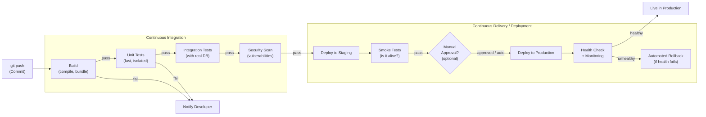

# CI/CD Pipelines

## Why This Topic Exists

Before CI/CD, shipping software was a painful event. Teams would accumulate weeks or months of changes, then spend days manually testing and deploying — praying that nothing broke. Bugs found late in the process were expensive to fix. Rollbacks were manual and risky. Deployments happened on Friday afternoons (and engineers worked through the weekend cleaning up).

CI/CD changed this. It is the engineering discipline of shipping code to production frequently, safely, and automatically. Companies like Amazon deploy to production thousands of times a day. Google, Netflix, and Meta all rely on CI/CD pipelines to ship changes continuously without sacrificing reliability.

Understanding CI/CD is not just for DevOps engineers — every software engineer works with these systems daily. In a system design interview, knowing how your service will be deployed and maintained is part of a complete answer.

---

## Learning Objectives

By the end of this file you will be able to:

- Explain the difference between CI, CD (Continuous Delivery), and CD (Continuous Deployment)
- Describe the stages of a typical deployment pipeline
- Explain feature flags and how they decouple deployment from release
- Compare blue-green and canary deployment strategies
- Read a basic GitHub Actions pipeline definition

---

## Prerequisites

- Basic understanding of git (commits, branches, merges)
- Basic understanding of what a build and test suite does
- [Cloud Computing Basics](./01.%20Cloud%20Computing%20Basics%20(BEGINNER).md) is helpful but not required

---

## Introduction

The question CI/CD answers is: how does code on a developer's laptop safely reach production?

Without automation, this process involves many manual steps that are error-prone, slow, and inconsistent. CI/CD automates these steps so that every commit goes through the same checks every time, and promotion to production happens through a defined, repeatable process.

CI/CD is not one thing — it is a set of practices and tools:
- **CI (Continuous Integration)**: Merge code frequently, run automated tests on every commit
- **CD (Continuous Delivery)**: Keep the codebase always deployable; deploy to production on-demand with a button click
- **CD (Continuous Deployment)**: Go further — automatically deploy every passing commit to production

---

## Real-World Analogy

Imagine a factory assembly line for cars. A car enters at one end as raw parts and exits at the other end fully assembled and quality-checked. Each station on the assembly line performs one specific task. If a quality check fails at any station, the car stops and the issue is fixed before it continues.

Before assembly lines, cars were built by hand, one at a time, with no standardized process. Defects were found late (or never). Quality was inconsistent.

A CI/CD pipeline is the software equivalent of an assembly line. Code enters as a git commit and exits as a running production deployment. Each stage is automated. If a test fails, the pipeline stops. The car does not ship with a broken engine.

---

## Core Concepts

### CI — Continuous Integration

CI is the practice of frequently merging code changes from multiple developers into a shared main branch, with automated builds and tests running on every merge.

**The problem CI solves**: In the old world, developers worked on long-lived feature branches (weeks or months). Merging was painful — the branches had diverged so much that integrating them required days of work. "Integration hell" was a real phenomenon.

**How CI solves it**: Developers merge small changes frequently (daily or more). Every commit triggers an automated pipeline that builds the code and runs the test suite. If anything breaks, the developer who made the change is notified immediately, while the context is still fresh.

**The rule**: The main branch must always be in a releasable state. No one merges broken code.

### CD — Continuous Delivery

Continuous Delivery extends CI: not only is the code always tested, it is always ready to be deployed. The deployment to production is a manual decision (someone clicks a button) but the actual deployment process is fully automated.

**Why the manual button**: Some teams need human judgment before shipping to production — business reasons, regulatory requirements, or simply "we want someone to confirm this is ready."

### CD — Continuous Deployment

Continuous Deployment goes all the way: every commit that passes all automated tests is automatically deployed to production with no human intervention. This requires high confidence in your test suite and robust monitoring with automated rollback.

Companies like Etsy, Flickr, and Spotify pioneered this approach. Amazon famously deploys to production every second.

### Pipeline Stages

A typical pipeline looks like this:

```
Code Commit
    |
    v
Build (compile, bundle)
    |
    v
Unit Tests (fast, no external dependencies)
    |
    v
Integration Tests (tests with real DB, services)
    |
    v
Security Scan (dependency vulnerabilities, secrets scanning)
    |
    v
Deploy to Staging
    |
    v
Smoke Tests (is the app alive and responding?)
    |
    v
[Manual approval gate — optional]
    |
    v
Deploy to Production
    |
    v
Post-Deploy Health Check
```

Each stage is a gate. If a stage fails, the pipeline stops and does not proceed to the next stage. This ensures that broken code never reaches production.

---

## Visual Diagram (Mermaid)



---

## Deep Explanation

### Feature Flags

Feature flags (also called feature toggles) let you deploy code to production without enabling the feature for users. The code is live in production, but a configuration value controls whether it runs.

```python
# Example: show new checkout flow only to 10% of users
if feature_flag_enabled("new_checkout_flow", user_id=user.id, rollout_percentage=10):
    return new_checkout_flow(cart)
else:
    return old_checkout_flow(cart)
```

Benefits:
- **Deploy any time**: Decouple code deployment from feature release. Deploy on a Tuesday; flip the flag on launch day.
- **Gradual rollout**: Enable for 1%, then 10%, then 50%, then 100%. Monitor metrics at each step.
- **Instant rollback**: If something goes wrong, disable the flag. No code deployment needed.
- **Kill switch**: If a feature causes problems in production, disable it instantly.

Popular feature flag services: LaunchDarkly, Unleash (open source), AWS AppConfig.

### Blue-Green Deployments

In a blue-green deployment, you maintain two identical production environments: **blue** (currently live) and **green** (new version).

1. Deploy the new version to the green environment
2. Run smoke tests against green
3. Switch the load balancer to point traffic to green (this is near-instant)
4. Blue is now idle but intact — it is your instant rollback option
5. Monitor green. If something goes wrong, switch the load balancer back to blue
6. Once confident in green, decommission blue (or use it for the next deployment)

The traffic switch is a configuration change (pointing Route 53 or the ALB to a different target group). It takes seconds. If the new version has a critical bug, rollback is equally fast.

**Trade-off**: You need to run two full production environments simultaneously during the switch. This doubles the infrastructure cost during the deployment window. For large systems, this can be significant.

### Canary Deployments

A canary deployment gradually shifts traffic from the old version to the new version.

1. New version is deployed alongside the old version
2. 1% of traffic is routed to the new version
3. Monitor: error rates, latency, business metrics
4. If metrics look good, increase to 5%, then 25%, then 50%, then 100%
5. If metrics degrade, route 0% back to old version (rollback) and investigate

The name comes from the historical practice of coal miners bringing a canary into mines — if the canary died, there was dangerous gas, and miners could escape before breathing it themselves. The small percentage of "canary" traffic detects problems before they affect all users.

AWS CodeDeploy, Kubernetes (with multiple deployments), and NGINX all support canary deployments natively.

**Canary vs blue-green**: Blue-green is instant (flip a switch). Canary is gradual (slowly shift traffic). Use blue-green when you want speed and can afford double infrastructure. Use canary when you want safety and gradual confidence-building.

### GitHub Actions Pipeline Example

GitHub Actions is a popular CI/CD tool that runs pipelines defined in YAML files inside your repository.

```yaml
# .github/workflows/deploy.yml

name: Build and Deploy

on:
  push:
    branches:
      - main

jobs:
  build-and-test:
    runs-on: ubuntu-latest
    steps:
      - name: Checkout code
        uses: actions/checkout@v4

      - name: Set up Node.js
        uses: actions/setup-node@v4
        with:
          node-version: '20'

      - name: Install dependencies
        run: npm ci

      - name: Run unit tests
        run: npm test

      - name: Run integration tests
        run: npm run test:integration
        env:
          DATABASE_URL: ${{ secrets.TEST_DATABASE_URL }}

  deploy-staging:
    needs: build-and-test
    runs-on: ubuntu-latest
    environment: staging
    steps:
      - name: Deploy to staging
        run: |
          aws ecs update-service \
            --cluster my-app-staging \
            --service my-app \
            --force-new-deployment
        env:
          AWS_ACCESS_KEY_ID: ${{ secrets.AWS_ACCESS_KEY_ID }}
          AWS_SECRET_ACCESS_KEY: ${{ secrets.AWS_SECRET_ACCESS_KEY }}

      - name: Run smoke tests against staging
        run: npm run smoke-test -- --url https://staging.myapp.com

  deploy-production:
    needs: deploy-staging
    runs-on: ubuntu-latest
    environment: production  # Requires manual approval in GitHub settings
    steps:
      - name: Deploy to production
        run: |
          aws ecs update-service \
            --cluster my-app-production \
            --service my-app \
            --force-new-deployment
```

This pipeline:
1. Triggers on every push to `main`
2. Runs tests
3. Deploys to staging and runs smoke tests
4. Waits for manual approval (configured in GitHub environment settings)
5. Deploys to production

---

## Step-by-Step Example

**A developer ships a bug fix:**

1. Developer creates a branch: `git checkout -b fix/login-error`
2. Makes the change, pushes the branch
3. Opens a Pull Request — this triggers the CI pipeline:
   - Build succeeds
   - Unit tests pass (42/42)
   - Integration tests pass
   - Security scan: no new vulnerabilities
4. A teammate reviews and approves the PR
5. Developer merges to `main`
6. Merge to `main` triggers the CD pipeline:
   - Staging deployment completes in 3 minutes
   - Smoke tests pass
   - Manual approval is given (or auto-deploys based on team policy)
   - Production deployment completes in 3 minutes
   - Health checks pass — error rate is normal
7. The bug fix is live in production 10 minutes after merge

With no CI/CD, this same fix might wait for the next scheduled deployment window (next Thursday), sit in a queue with 20 other changes, and get deployed with a manual process that takes hours.

---

## Advantages / Disadvantages / Trade-offs

| Dimension | With CI/CD | Without CI/CD |
|-----------|-----------|---------------|
| Deployment frequency | Multiple times per day | Weekly or monthly |
| Time to fix a bug in production | Minutes | Days |
| Confidence in changes | High (tested automatically) | Low (tested manually) |
| Rollback speed | Seconds (blue-green) to minutes | Hours of manual work |
| Upfront investment | High (pipeline setup, test writing) | None |
| Ongoing developer discipline | Required (keep tests green) | Not enforced |
| Risk per deployment | Low (small changes, frequent) | High (large batches, infrequent) |

---

## When to Use / When NOT to Use

**Always use CI/CD for**:
- Any production software with real users
- Any team with more than one engineer
- Any system where downtime has a business cost

**CI without full CD is acceptable when**:
- Deploying to production requires regulatory review (banking, healthcare)
- Customers are on fixed release cycles and cannot accept arbitrary updates (enterprise software)

**You can simplify CI/CD when**:
- A personal project or prototype — basic CI (run tests on PR) is often enough
- Internal tools with no SLA — manual deployment may be acceptable

---

## Common Interview Questions

**Q: What is the difference between Continuous Integration, Continuous Delivery, and Continuous Deployment?**
CI: merge frequently, run tests automatically. Continuous Delivery: always deployable, manual trigger to release. Continuous Deployment: automatically deploy every passing commit to production.

**Q: What is a blue-green deployment?**
Two identical environments (blue and green). New version goes to green, traffic switches instantly from blue to green. Rollback is equally instant. Requires double infrastructure during the switch window.

**Q: What is a canary deployment?**
Gradually shifting traffic to a new version — start at 1%, monitor, increase if metrics are healthy. Slower than blue-green but safer for high-risk changes.

**Q: What is a feature flag and why would you use it?**
A runtime configuration that enables/disables a feature without code deployment. Decouples deployment from release, allows gradual rollout, and enables instant rollback by disabling the flag.

---

## Common Beginner Mistakes

**Confusing CI with CD**: CI runs tests on commits. CD deploys to environments. They are distinct practices that often work together, but CI alone (tests without deployment automation) is valuable even without CD.

**Writing tests only after setting up CI**: CI amplifies the value of tests that already exist. Teams sometimes set up the pipeline first and plan to add tests later — this defeats the purpose.

**Not using staging environments**: Deploying directly from tests to production skips an important validation step. Always deploy to a staging environment first.

**Long-lived feature branches**: Feature flags exist precisely to avoid long-lived branches. A branch that is not merged for weeks will always cause integration pain. Merge small, frequent, and use feature flags to hide unfinished work.

---

## Summary

CI/CD pipelines automate the journey from code commit to production. CI runs automated tests on every commit, keeping the main branch always deployable. CD automates the deployment itself — either with a manual approval gate (Continuous Delivery) or fully automatically (Continuous Deployment).

Pipeline stages include build, unit tests, integration tests, security scans, staging deployment, smoke tests, and production deployment. Feature flags decouple deployment from release. Blue-green deployments enable instant rollback. Canary deployments enable gradual, safe rollouts.

---

## Key Takeaways

- CI = merge often + run tests automatically; CD = automate deployment
- Every commit should trigger the same pipeline: build, test, scan, deploy
- Feature flags let you deploy code without releasing features — great for safety
- Blue-green: instant traffic switch, requires double infrastructure during switch
- Canary: gradual traffic shift, slower but safer for high-risk changes
- GitHub Actions, CircleCI, Jenkins, and AWS CodePipeline are common CI/CD tools
- The goal: make deployment a non-event — small, frequent, automated, and safe

---

## Related Topics

- [Infrastructure as Code](./04.%20Infrastructure%20as%20Code%20(INTERMEDIATE).md)
- [Cloud Computing Basics](./01.%20Cloud%20Computing%20Basics%20(BEGINNER).md)
- [Key AWS Services for System Design](./02.%20Key%20AWS%20Services%20for%20System%20Design%20(INTERMEDIATE).md)
- [Multi-Region Architecture](./06.%20Multi-Region%20Architecture%20(INTERMEDIATE).md)
