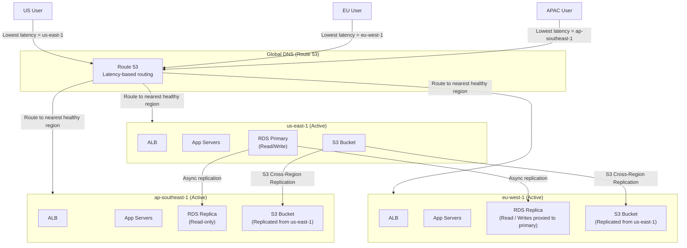

# Multi-Region Architecture

## Why This Topic Exists

On December 7, 2021, AWS's US-EAST-1 region (Northern Virginia) had a major outage. It took down parts of Amazon's own retail site, Disney+, Netflix, Slack, Hulu, and thousands of other services. All because their systems ran in a single AWS region that happened to have a failure.

Running in a single region is a single point of failure. For most companies that is an acceptable risk — the probability of a full regional outage is low, and the engineering cost to fix it is high. But for large-scale, high-availability systems — the kind you design in senior/staff-level interviews — multi-region is the expected answer.

Multi-region architecture also solves latency. A user in Singapore hitting a server in Virginia adds 200ms of round-trip time before your application even processes their request. Deploying to an Asia Pacific region cuts that latency dramatically.

---

## Learning Objectives

By the end of this file you will be able to:

- Explain the difference between active-active and active-passive multi-region architectures
- Describe the data replication challenges that make multi-region hard
- Explain DNS routing strategies for multi-region (latency-based, geolocation, failover)
- Describe data residency requirements (GDPR) and why they force geographic architecture decisions
- Articulate the cost trade-offs of multi-region
- Describe how Netflix serves global users across multiple AWS regions

---

## Prerequisites

- [Cloud Computing Basics](./01.%20Cloud%20Computing%20Basics%20(BEGINNER).md)
- [Key AWS Services for System Design](./02.%20Key%20AWS%20Services%20for%20System%20Design%20(INTERMEDIATE).md) — especially Route 53, RDS, DynamoDB, S3
- Basic understanding of DNS
- Basic understanding of database replication

---

## Introduction

A "region" in AWS is a geographic cluster of data centers. As of 2024, AWS has over 30 regions globally — us-east-1 (Virginia), eu-west-1 (Ireland), ap-southeast-1 (Singapore), ap-northeast-1 (Tokyo), and so on. Each region is designed to be fully independent — a failure in one should not affect others.

Within a region, there are multiple **Availability Zones (AZs)** — physically separate data centers with independent power, cooling, and networking. Deploying across multiple AZs within one region protects against a single data center failure. Deploying across multiple regions protects against an entire geographic failure.

Multi-region architecture means your application runs in two or more AWS regions simultaneously.

---

## Real-World Analogy

A bank has branches. If one branch closes for renovations, customers can go to another branch. They still have access to their money.

Now imagine the bank's entire headquarters (where all records are stored) is in one city. If that city has a disaster, no branch can access account information. The bank is effectively shut down.

Multi-region is the equivalent of the bank keeping its records in multiple cities. Any branch can access any record, and a disaster in one city does not stop operations.

The challenge: when a customer makes a deposit in branch A, the records in city B need to be updated. If city A is temporarily unreachable, does branch B use potentially out-of-date records? This is the core data synchronization challenge of multi-region.

---

## Core Concepts

### Active-Active Architecture

In active-active multi-region, all regions serve live production traffic simultaneously. There is no "primary" region — any region can handle any request.

```
US Users ──────> us-east-1 (Active)
EU Users ──────> eu-west-1 (Active)
APAC Users ────> ap-southeast-1 (Active)
```

**Benefits**:
- Maximum availability: if one region goes down, others continue serving traffic
- Lowest latency: users are routed to the nearest region
- Full capacity utilization: all regions serve real traffic, no idle standby cost

**Challenges**:
- Data consistency: writes happening in multiple regions simultaneously must be synchronized. Conflict resolution is hard.
- Operational complexity: much harder to reason about than a single-region system
- Cost: full infrastructure in each region

**Best for**: Applications with global users, very high availability requirements (99.99%+), read-heavy workloads (reads can be served locally; writes may go to one primary region or use conflict-free data structures).

### Active-Passive Architecture

In active-passive multi-region, one region is the primary (active) and one or more regions are on standby (passive). Traffic normally goes to the primary region. If the primary fails, DNS is updated to route traffic to the secondary.

```
Normal:    All traffic ──> us-east-1 (Active Primary)
                           eu-west-1 (Passive Standby, replicating from primary)

Failover:  All traffic ──> eu-west-1 (Now Active)
                           us-east-1 (Down or recovering)
```

**Benefits**:
- Simpler data model: one primary writer, secondary is read-only replica
- Lower operational complexity than active-active
- Lower cost than full active-active (secondary runs at reduced capacity)

**Challenges**:
- Failover is not instant (DNS propagation, application warm-up)
- Secondary region may have stale data (replication lag)
- Capacity in secondary must handle the full load during failover

**Variations**:
- **Warm standby**: Secondary is running at reduced capacity, ready to scale up
- **Cold standby (Pilot Light)**: Secondary has minimal running infrastructure; takes longer to bring up but costs less
- **Hot standby**: Secondary is at full capacity, ready for instant failover

### Recovery Time Objective (RTO) and Recovery Point Objective (RPO)

These are the two most important metrics for disaster recovery:

**RTO (Recovery Time Objective)**: How long can your service be down before it causes unacceptable business impact? Minutes? Hours? Days?

**RPO (Recovery Point Objective)**: How much data loss is acceptable? If a disaster struck right now and you had to restore from a backup from 30 minutes ago, would you lose 30 minutes of data? Is that acceptable?

| Strategy | RTO | RPO | Cost |
|----------|-----|-----|------|
| Cold standby | Hours | Hours | Low |
| Warm standby | Minutes | Minutes | Medium |
| Hot standby (active-passive) | Seconds to minutes | Near-zero | High |
| Active-active | Near-zero | Near-zero | Very high |

---

## Visual Diagram (Mermaid)



---

## Deep Explanation

### DNS Routing Strategies with Route 53

Route 53 provides several routing policies for multi-region:

**Latency-based routing**: Route 53 routes each user to the region that will provide the lowest network latency based on historical data. A user in Singapore is automatically routed to ap-southeast-1 rather than us-east-1.

**Geolocation routing**: Route based on the user's geographic location. All requests from Germany go to eu-west-1. All requests from Brazil go to sa-east-1. This is essential for data residency compliance (GDPR).

**Failover routing**: Route to a primary endpoint; automatically switch to a secondary if the primary fails health checks.

**Weighted routing**: Send X% of traffic to one endpoint and (100-X)% to another. Used for canary deployments across regions.

These can be combined. For example: geolocation routing to send EU users to eu-west-1, with failover within the EU group to eu-central-1 if eu-west-1 fails.

### Data Synchronization Challenges

The hardest part of multi-region is data. Stateless services (HTTP API servers) can run in any region without coordination. Stateful data (databases) must be synchronized across regions, and synchronization introduces trade-offs.

**Replication lag**: When a write happens in region A, it takes time (typically 50-200ms for cross-region replication) for region B to see that write. During that window, a read from region B returns stale data.

**Read-your-writes consistency**: A user who just posted something expects to see it immediately. If they wrote to us-east-1 but their next read is served from eu-west-1 which has not yet received the replication, they see stale data. Session stickiness (route the same user to the same region) or read-after-write guarantees are needed.

**Write conflicts**: In active-active, two users might write to the same record from different regions simultaneously. Which write wins? Options:
- **Last-write-wins (LWW)**: The write with the latest timestamp wins. Simple but can lose data.
- **Multi-version conflict resolution**: Both writes are preserved as versions; application logic resolves the conflict.
- **CRDTs (Conflict-free Replicated Data Types)**: Data structures designed to merge automatically without conflicts (counters, sets). Used in systems like Amazon's shopping cart.

**DynamoDB Global Tables** is AWS's answer to this: a fully managed active-active multi-region NoSQL table that handles replication and conflict resolution automatically (using last-writer-wins per item).

### Data Residency Requirements (GDPR)

The **General Data Protection Regulation (GDPR)** is a European Union law that governs how personal data of EU citizens must be handled. A key requirement: personal data about EU citizens must not be stored or processed outside the EU without specific legal mechanisms.

This forces architectural decisions:
- EU user data must be stored in EU-region databases (eu-west-1 in Ireland, eu-central-1 in Frankfurt, etc.)
- Even if your primary database is in us-east-1, EU user records must stay in EU regions
- Data cannot be replicated to non-EU regions

Other regions have similar requirements: China has the Cybersecurity Law (data about Chinese citizens must stay in China), Russia has data localization laws, and various other countries are enacting similar regulations.

**Architectural implications**:
- Separate data stores per geographic region ("data partitioning by geography")
- Users are assigned to a "home region" based on their location at registration
- Cross-region data access (e.g., a US employee viewing EU user data for support) must go through legal frameworks

### Cost Considerations

Multi-region is expensive. You are essentially running N copies of your infrastructure:

- Compute: EC2, Lambda, ECS in each region
- Storage: S3 replicated across regions (you pay for storage in each region + data transfer for replication)
- Database: RDS multi-region read replicas or DynamoDB Global Tables (pricing premium)
- Data transfer: Cross-region data transfer costs $0.02-0.09 per GB depending on regions
- Management complexity: More infrastructure means more operational overhead

Rule of thumb: multi-region roughly doubles infrastructure costs, plus additional data transfer costs. Only justify this with a clear business case: global users who need low latency, or SLA requirements that demand 99.99%+ availability.

---

## Step-by-Step Example

**How Netflix serves global users across multiple AWS regions:**

Netflix uses AWS with multiple regions globally. Here is a simplified model:

1. **Content delivery**: Video files are stored in S3 and distributed via a custom CDN (Open Connect Appliances placed in ISP networks) rather than CloudFront. The actual video data lives as close to the user as possible.

2. **API tier**: Netflix runs microservices in multiple AWS regions (us-east-1, eu-west-1, ap-northeast-1, and others). Stateless services can run in any region.

3. **User data**: Account data, watch history, and preferences are replicated across regions using a combination of Cassandra (their primary NoSQL database) with multi-region replication.

4. **Regional failover**: Netflix uses a technique called "Chaos Engineering" — deliberately killing services and regions to test resilience. Their architecture is designed to degrade gracefully (e.g., if recommendations fail, show a default list rather than returning an error).

5. **DNS routing**: Route 53 latency-based routing sends users to the nearest healthy region.

6. **Stateless API**: Netflix's API servers are designed to be completely stateless. Any server in any region can handle any request. Session state is stored in a distributed cache.

---

## Advantages / Disadvantages / Trade-offs

| Dimension | Single Region | Active-Passive Multi-Region | Active-Active Multi-Region |
|-----------|--------------|----------------------------|--------------------------|
| Availability | 99.9-99.99% | 99.99%+ | 99.999%+ |
| Latency for global users | High (all in one region) | Medium (failover region exists) | Low (routed to nearest) |
| Operational complexity | Low | Medium | Very high |
| Cost | Low | Medium (1.5x-2x) | High (2x-3x+) |
| Data consistency | Simple | Eventual (cross-region lag) | Complex (conflict resolution) |
| Regulatory compliance | May not meet data residency requirements | Can be structured to comply | Can be structured to comply |
| Recovery on regional failure | Hours to manual recovery | Minutes to failover | No recovery needed |

---

## When to Use / When NOT to Use

**Use multi-region when**:
- You have significant user bases in multiple continents (latency reduction)
- Your SLA requires 99.99%+ availability (single region cannot guarantee this)
- Data residency regulations (GDPR, local data laws) require it
- Your business cannot tolerate hours of downtime from a regional outage

**Do NOT invest in multi-region when**:
- Your users are all in one geography
- A 30-minute to 2-hour recovery time from a regional outage is acceptable
- Your team is small and the operational overhead would hurt more than it helps
- You have not yet solved reliability within a single region

A common mistake is jumping to multi-region before solving basic reliability (redundancy within a region, proper database backups, health checks). Fix single-region reliability first.

---

## Common Interview Questions

**Q: What is the difference between active-active and active-passive multi-region?**
Active-active: all regions serve live traffic simultaneously. Active-passive: one primary region serves traffic; secondary region is on standby for failover. Active-active is more expensive and complex but provides lower latency globally and higher availability.

**Q: What is GDPR and how does it affect system design?**
GDPR requires that personal data of EU citizens be stored and processed within the EU. This forces geographic partitioning of data — EU user records must stay in EU regions. Systems must route EU users to EU data stores and cannot replicate their data to non-EU regions.

**Q: How do you handle database writes in an active-active multi-region setup?**
Options: designate one region as the primary writer (all writes go there, reads served locally), use DynamoDB Global Tables (managed conflict resolution with last-writer-wins), or use CRDTs for data structures that can merge automatically. Write conflicts are the hardest problem in active-active.

**Q: What is RTO and RPO?**
RTO (Recovery Time Objective): maximum acceptable downtime. RPO (Recovery Point Objective): maximum acceptable data loss. These business requirements drive the choice of disaster recovery strategy (cold/warm/hot standby, active-passive, active-active).

---

## Common Beginner Mistakes

**Thinking multi-region is only about failover**: Multi-region is equally about latency reduction for global users. A 200ms round-trip penalty for APAC users is a real product problem, not just a reliability concern.

**Ignoring replication lag**: Active-passive setups have replication lag. If the primary fails and you fail over to a secondary with 30 seconds of lag, you lose 30 seconds of writes. Design for this: what data must be protected, and what is acceptable to lose?

**Treating multi-region as a "later" problem**: Retrofitting multi-region onto a system not designed for it is extremely difficult. If you anticipate global users or high availability requirements, design for multi-region from the start.

**Forgetting data transfer costs**: Each GB of data replicated across regions costs money. Video platforms and data-heavy applications must account for significant cross-region data transfer costs in their architecture.

---

## Summary

Multi-region architecture runs your system in multiple geographic AWS regions for two reasons: resilience (protect against regional outages) and latency (serve users from nearby regions). Active-active means all regions serve live traffic simultaneously — highest availability but most complex. Active-passive means one primary with a standby — simpler but slower failover.

DNS routing with Route 53 (latency-based, geolocation, failover) directs users to the right region. Data synchronization is the hard part: replication lag, write conflicts, and data residency requirements (GDPR) all complicate the data layer. Cost roughly doubles versus single-region but may be unavoidable for global-scale systems.

---

## Key Takeaways

- Multi-region solves two problems: resilience against regional failure, and latency for global users
- Active-active: all regions live; active-passive: primary + standby
- Route 53 supports latency-based, geolocation, failover, and weighted routing
- Data replication lag (50-200ms cross-region) causes eventual consistency — design for it
- GDPR and similar laws force data to stay in specific geographies — use geolocation routing and separate regional data stores
- DynamoDB Global Tables is AWS's managed solution for active-active NoSQL multi-region
- RTO and RPO are the business requirements that drive your DR strategy
- Multi-region roughly doubles infrastructure cost — justify it with a real availability or latency requirement

---

## Related Topics

- [Cloud Computing Basics](./01.%20Cloud%20Computing%20Basics%20(BEGINNER).md)
- [Key AWS Services for System Design](./02.%20Key%20AWS%20Services%20for%20System%20Design%20(INTERMEDIATE).md)
- [Infrastructure as Code](./04.%20Infrastructure%20as%20Code%20(INTERMEDIATE).md)
- [CI/CD Pipelines](./05.%20CI-CD%20Pipelines%20(BEGINNER).md)
