# Designing for Scale: Principles

## Why This Topic Exists

Every successful product eventually hits a wall. The database starts slowing down. The single server crashes under load. A marketing campaign drives a 10x traffic spike and the whole system goes dark. Engineers scramble, add hardware, and things limp back to life — until the next spike.

This is not a hardware problem. It is an architecture problem. Systems that scale do not do so by accident. They are deliberately designed with scaling in mind from the start — or they are carefully refactored to follow specific principles as they grow.

Understanding these principles is the difference between an engineer who writes code that works and one who designs systems that survive.

---

## Learning Objectives

By the end of this chapter, you will be able to:
- Explain the 10 core principles of designing for scale
- Describe how real systems like Amazon, Google, and Netflix evolved architecturally
- Draw the evolution from a single server to a multi-region global system
- Identify which principles apply to a given system design problem in an interview
- Explain trade-offs between each principle and when to break the rules

---

## Prerequisites

- Basic understanding of web servers and databases
- Familiarity with the client-server model
- Some exposure to caching concepts
- Understanding of what "stateful" vs "stateless" means in HTTP

---

## Introduction

Building software that works for a handful of users is relatively straightforward. Building software that works for 100 million users, spread across the globe, running 24 hours a day, seven days a week, with zero tolerance for downtime, is one of the hardest engineering problems in the world.

The companies that have solved this problem — Google, Amazon, Netflix, Meta, Uber — did not stumble into solutions. They developed a set of repeatable architectural principles that have become the foundation of modern large-scale system design.

These principles are not laws. They are hard-won lessons. Most of them were discovered the painful way: by building something that broke at scale and then figuring out why.

---

## Real-World Analogy

Think about how a city handles transportation as it grows.

A small town has one road. Everyone uses it. That works fine for a few hundred people. As the town becomes a city, that single road becomes a bottleneck. The city adds more roads (horizontal scaling). It adds traffic lights to coordinate (orchestration). It builds highways that bypass the center (separation of concerns). It creates bus lanes so buses do not sit in the same traffic as cars (dedicated resources for critical paths). It builds multiple routes between any two points so one road being closed does not strand everyone (redundancy and design for failure).

No one expects a single road to handle millions of daily trips. But engineers routinely design single-server architectures that are expected to handle millions of users. The solution is the same: build more lanes, add redundancy, separate concerns, and plan for failures.

---

## Core Concepts

### 1. Horizontal Scaling at Every Layer

**Vertical scaling** means adding more CPU and RAM to your existing server. It is easy but has limits — there is only so powerful a single machine can be, and it is expensive.

**Horizontal scaling** means adding more servers. It has no theoretical upper limit. But it requires your application to be designed for it.

The key rule: **every layer of your system must be horizontally scalable.**

- Application servers: stateless, so any request can go to any server
- Databases: use read replicas, sharding, or distributed databases
- Cache: use distributed caches like Redis Cluster
- Message queues: use partitioned queues like Kafka
- Load balancers: use DNS-based load balancing across multiple LBs

| Layer | Horizontal Scaling Strategy |
|---|---|
| Web/API servers | Add more instances behind a load balancer |
| Cache | Redis Cluster, consistent hashing |
| Database reads | Read replicas |
| Database writes | Sharding by user ID or geography |
| File storage | Distributed object storage (S3) |

### 2. Stateless Services

A stateless service does not store any information about a user's session or request state in memory. Every request contains all the information the server needs to process it.

If Server A handles your first request and Server B handles your second request, both servers should be able to handle either request identically.

**Why this matters:** If your application server holds session state in memory, every request from a user must go to the same server. This is called "sticky sessions." It breaks horizontal scaling because you cannot freely add or remove servers without affecting users.

**Solution:** Store session state externally — in Redis, a database, or a JWT token that the client carries.

```
BAD:  Server holds session in RAM → can't scale horizontally
GOOD: Server is stateless → any server can handle any request
```

### 3. Async Over Sync Where Possible

A synchronous operation blocks the caller until it completes. An asynchronous operation allows the caller to continue immediately, with the work happening in the background.

**Example:** A user submits a photo to Instagram. The synchronous approach: resize the photo, apply filters, generate thumbnails, and then return a response. The user waits 5 seconds. The async approach: accept the photo, put a job in a queue, return immediately to the user with a "processing" status. Background workers handle the heavy work.

Benefits of async:
- Better user experience (fast response)
- Better resource utilization (workers can process at their own rate)
- Natural retry mechanism (jobs stay in queue if a worker dies)
- Decouples producers from consumers

### 4. Loose Coupling

Tightly coupled systems are systems where components depend directly on each other. If Service A calls Service B directly and Service B goes down, Service A breaks.

Loosely coupled systems communicate through abstractions — typically message queues or event streams. Service A publishes an event. Service B consumes it whenever it can. Neither knows about the other's internal state.

**Amazon's rule:** Every team exposes its data and functionality through service interfaces only. No direct database access between teams. No back-door connections. This is what became their microservices culture — and eventually AWS.

### 5. Design for Failure

At scale, failure is not an exception — it is the default state. Google's infrastructure runs on commodity hardware where drives fail constantly. Netflix's chaos engineering deliberately kills servers in production to verify that systems can self-heal.

The mindset shift: stop asking "how do I prevent failure?" and start asking "how does my system behave when components fail?"

Design techniques:
- Circuit breakers: stop calling a failing service to allow it to recover
- Retries with exponential backoff: retry failed requests but back off so you do not hammer a recovering service
- Bulkheads: isolate failures so one bad component does not bring down the whole system
- Timeouts: never wait forever for a response
- Fallbacks: degrade gracefully when a dependency is unavailable

### 6. Idempotency Everywhere

An operation is idempotent if performing it multiple times has the same effect as performing it once.

**Why this matters at scale:** Networks are unreliable. Clients retry requests. Workers process jobs more than once. If your operations are not idempotent, retries cause duplicate data, double charges, or inconsistent state.

**Example:** A payment API. The client sends a charge request. The network drops the response. The client retries. Without idempotency, the customer is charged twice. With idempotency (using a unique idempotency key per request), the second request is a no-op.

Rule: **Any operation that can be retried must be idempotent.**

### 7. Eventual Consistency Acceptance

Strong consistency means every read immediately sees the latest write. This requires coordination between all nodes — which is slow and limits scalability.

Eventual consistency means that, given enough time with no new writes, all nodes will converge to the same value. In practice, this means you might read slightly stale data for a brief period.

Most large-scale systems choose eventual consistency because it allows massive horizontal scaling. DNS is eventually consistent. Your Facebook feed is eventually consistent. Your bank balance, however, is strongly consistent — because the domain requires it.

**The skill:** knowing which data in your system needs strong consistency vs which can tolerate eventual consistency.

### 8. Data Locality: Keep Compute Near Data

Moving data across a network is expensive and slow. Processing data where it already lives is fast.

**MapReduce principle:** Instead of moving 1 TB of data to your processing server, send your code to where the data lives and process it there. Each storage node runs the computation on its local data, then returns results.

**Regional data locality:** Keep user data in the region where the user lives. A European user's data in European data centers means low latency reads. It also helps with GDPR compliance.

### 9. Avoid Distributed Transactions

A distributed transaction is one that spans multiple databases or services and requires all-or-nothing behavior. The classic solution is the two-phase commit protocol (2PC), which requires a coordinator to lock resources across multiple systems.

The problem: 2PC is slow, fragile, and kills scalability. If the coordinator crashes mid-commit, all participating systems are locked until it recovers.

**The pattern at scale:** Break operations into smaller, independent steps. Use compensating transactions (sagas) to handle failures. Accept that some business operations will be eventually consistent rather than immediately consistent.

### 10. Shared Nothing Architecture

In a shared-nothing architecture, each node is independent and self-sufficient. Nodes do not share disk, memory, or CPU with other nodes. They communicate only through the network.

This is the architecture of systems like Cassandra, Kafka, and Google Bigtable. Because nodes do not share resources, you can add new nodes without coordinating with existing ones. Removing a node does not affect others. Failures are isolated.

---

## Visual Diagram (Mermaid)

The evolution of system architecture from a startup to a global platform:

```mermaid
graph TB
    subgraph Stage1["Stage 1: Single Server (1-1K users)"]
        U1[User] --> SS[Single Server + DB]
    end

    subgraph Stage2["Stage 2: Web + DB Split (1K-10K users)"]
        U2[Users] --> LB1[Load Balancer]
        LB1 --> WS1[Web Server 1]
        LB1 --> WS2[Web Server 2]
        WS1 --> DB1[(Primary DB)]
        WS2 --> DB1
    end

    subgraph Stage3["Stage 3: Caching + Read Replicas (10K-100K users)"]
        U3[Users] --> LB2[Load Balancer]
        LB2 --> WS3[App Servers]
        WS3 --> Cache[Redis Cache]
        WS3 --> DB2[(Primary DB)]
        DB2 --> DR1[(Read Replica)]
        DB2 --> DR2[(Read Replica)]
    end

    subgraph Stage4["Stage 4: Microservices + Sharding (100K-1M users)"]
        U4[Users] --> CDN[CDN]
        CDN --> LB3[API Gateway]
        LB3 --> S1[User Service]
        LB3 --> S2[Order Service]
        LB3 --> S3[Product Service]
        S1 --> DB3[(User DB Shard 1)]
        S1 --> DB4[(User DB Shard 2)]
        S2 --> MQ[Message Queue]
        MQ --> S4[Notification Service]
    end

    subgraph Stage5["Stage 5: Multi-Region (1M+ users)"]
        DNS[Global DNS / GeoDNS]
        DNS --> R1[US-East Region]
        DNS --> R2[EU-West Region]
        DNS --> R3[Asia-Pacific Region]
        R1 <-->|Async Replication| R2
        R2 <-->|Async Replication| R3
    end
```



---

## Deep Explanation

### How Amazon Evolved

Amazon started as a single PHP application on a single server. As it grew, they hit the same scaling walls that every company hits. Their solution, described in Jeff Bezos's famous 2002 "API mandate" memo, was to decompose the monolith into services:

1. All teams expose data and functionality through service APIs
2. No direct database access between teams
3. No shared memory, no back-door connections
4. The network is the only communication mechanism

This mandate forced loose coupling across Amazon. Each team owned its own database. Each team scaled its own service independently. This eventually became the foundation of AWS — because teams started building general-purpose infrastructure to support their own services, then realized they could sell that infrastructure to others.

### How Netflix Evolved

Netflix started as a DVD rental service with a traditional monolithic application on Oracle databases. When they moved to streaming, they anticipated scale they could not handle. Between 2008 and 2016, they migrated their entire system from a single data center to AWS, decomposed their monolith into hundreds of microservices, and pioneered chaos engineering.

The principles they applied:
- Stateless microservices (any instance can handle any request)
- Design for failure (Chaos Monkey randomly kills instances in production)
- Eventual consistency for recommendations and personalization (it is fine if your recommendations are a few minutes stale)
- Strong consistency only for critical paths (billing, account authentication)

### How Google Scales Search

Google's search infrastructure is built on the shared-nothing principle at an extreme scale. Every query is handled by thousands of machines in parallel, each responsible for a fraction of the index. No machine depends on any other. Results are merged at the end. If a thousand machines fail during your search query, the remaining machines return slightly less comprehensive results — but the system does not go down.

### The CAP Theorem in Practice

The CAP theorem says that in a distributed system, you can have at most two of: Consistency, Availability, Partition tolerance. Since network partitions always happen in real distributed systems, you are really choosing between consistency and availability during a partition.

Large-scale systems mostly choose availability:
- They can show you slightly stale data
- They can write to whatever nodes are available and reconcile later
- They prioritize staying online over being perfectly correct

The exception is financial systems — they choose consistency over availability because showing a wrong balance is worse than a brief outage.

---

## Step-by-Step Example

### Designing for Scale: An E-Commerce Product Page

**Scenario:** 10 million users visit your product page every day. Peak traffic is 100,000 requests per minute.

**Apply the principles:**

1. **Stateless app servers** — store user sessions in Redis, not in server memory. Now you can add 50 app server instances behind a load balancer.

2. **Horizontal scaling** — configure your load balancer to auto-scale app servers based on CPU usage. Spin up new instances during peak, spin down during off-peak.

3. **Data locality** — cache product data (descriptions, prices, images URLs) in Redis near your app servers. A product page should not make a database call for data that changes once a day.

4. **Design for failure** — if your recommendation service is down, show the product page without recommendations. Do not fail the entire page because one non-critical component is unavailable.

5. **Async operations** — when a user adds an item to their cart, return immediately. Process inventory reservation asynchronously via a message queue.

6. **Eventual consistency** — product review counts and ratings can be eventually consistent. The product price and availability must be strongly consistent.

7. **Avoid distributed transactions** — do not try to update inventory, create an order, and charge the payment card in a single transaction across three services. Use a saga pattern: each step publishes events, and compensating transactions handle failures.

---

## Advantages / Disadvantages / Trade-offs

| Principle | Advantage | Disadvantage / Trade-off |
|---|---|---|
| Horizontal scaling | No theoretical limit | Requires stateless design, more complex infrastructure |
| Stateless services | Freely scalable, easy failover | Must externalize session state, slight latency for external storage |
| Async processing | Better user experience, decoupled | Harder to debug, eventual consistency, harder to reason about order |
| Loose coupling | Independent scaling, isolated failures | More complex infrastructure, harder to trace request flows |
| Eventual consistency | Massive scalability | Complexity in handling stale reads, harder to reason about correctness |
| Idempotency | Safe retries, resilient | More complex implementation (idempotency keys, deduplication) |
| Shared nothing | Linear scalability | Complex distributed algorithms, eventual consistency required |

---

## When to Use / When NOT to Use

**Use these principles when:**
- You expect significant user growth
- Your system has more than one server
- You are designing a system for a high-traffic product
- Downtime is costly
- Your system spans multiple geographic regions

**Do NOT blindly apply all principles when:**
- Building a prototype or MVP (premature optimization)
- Your traffic is genuinely small (< 10K users)
- The domain requires strong consistency (banking, healthcare) — some principles like eventual consistency must be applied carefully
- Your team is small and the operational overhead of distributed systems is not justified

---

## Common Interview Questions

1. **"What does 'stateless' mean and why does it matter for scaling?"**
   A stateless service holds no session data in memory. It matters because stateless services can be scaled horizontally — any instance can handle any request, so you can freely add or remove instances.

2. **"What is the CAP theorem? Which would you choose for a social media feed?"**
   Consistency, Availability, Partition tolerance — choose two. For a social media feed, choose availability over consistency. It is better to show a feed that is 30 seconds stale than to fail the request entirely.

3. **"How would you design an idempotent payment API?"**
   Accept a client-generated idempotency key. Store it in a database. On the first request, process and store the result with that key. On duplicate requests with the same key, return the stored result without re-processing.

4. **"Walk me through how Amazon handles a purchase — what happens asynchronously?"**
   The purchase confirmation is immediate (synchronous). Inventory reservation, warehouse routing, carrier notification, email confirmation, and fraud analysis all happen asynchronously via message queues.

5. **"What is a 'shared nothing' architecture?"**
   Nodes do not share disk, memory, or CPU. They only communicate via the network. This allows linear scalability and strong failure isolation.

---

## Common Beginner Mistakes

- **Designing for today's traffic only** — build in headroom; your 10x growth moment might come from a single viral post
- **Storing session state in application server memory** — breaks horizontal scaling entirely
- **Treating distributed transactions as normal transactions** — they are slow, fragile, and should be avoided at scale
- **Making everything synchronous** — any slow downstream dependency becomes your user's problem
- **Ignoring failure modes** — every network call can fail; every service can go down; designing as if they will not is a mistake
- **Over-engineering from day one** — a startup with 100 users does not need a multi-region active-active deployment; apply these principles as you grow into them

---

## Summary

Designing for scale is not about using the newest technology. It is about applying a set of well-understood principles that allow your system to grow without being rewritten.

The ten principles — horizontal scaling, stateless services, async over sync, loose coupling, design for failure, idempotency, eventual consistency, data locality, avoiding distributed transactions, and shared-nothing architecture — form a mental framework. Not every principle applies to every system. The skill is knowing which ones matter for your specific context and trade-off.

The companies that have built the world's largest systems did not discover these principles by accident. They discovered them by breaking things at scale and learning from it. Reading this chapter means you can learn from their failures without repeating them.

---

## Key Takeaways

- Horizontal scaling requires stateless services; stateful services break horizontal scaling
- Asynchronous communication decouples services and improves resilience
- Design for failure — not against it; assume components will fail and build recovery in
- Eventual consistency is the right choice for most large-scale systems; strong consistency is reserved for financial/medical domains
- Idempotency makes your system safe to retry, which is essential at scale
- Shared-nothing architecture enables linear scalability with no coordination overhead
- The evolution from single server to global system follows a predictable path; knowing the stages helps you make the right architectural decision at the right time

---

## Related Topics

- [02. Data Pipelines and ETL](./02.%20Data%20Pipelines%20and%20ETL%20%28INTERMEDIATE%29.md)
- [03. Search Systems](./03.%20Search%20Systems%20%28INTERMEDIATE%29.md)
- [04. Recommendation Systems](./04.%20Recommendation%20Systems%20%28INTERMEDIATE%29.md)
- [05. Web Crawlers](./05.%20Web%20Crawlers%20%28INTERMEDIATE%29.md)
- [Chapter 14: Distributed Systems Concepts](../14.%20Distributed%20Systems%20Concepts/README.md)
- [Chapter 11: Message Queues](../11.%20Message%20Queues/README.md)
