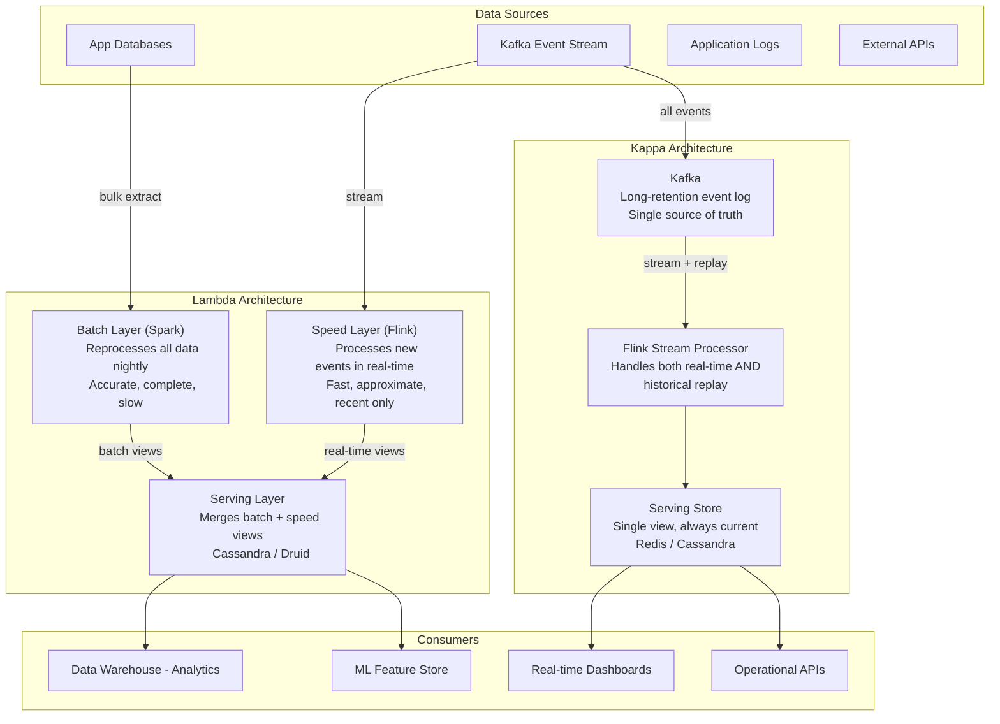

# Data Pipelines and ETL

## Why This Topic Exists

Every large company has two different kinds of data needs that are fundamentally at odds with each other.

The first is **operational data** — the live data that runs the business. An Uber driver accepts a trip. A customer places an order. A tweet gets a like. This data needs to be written and read with millisecond latency, because users are waiting.

The second is **analytical data** — the data that makes the business smarter. What is the demand for rides in downtown Chicago on Friday evenings? Which products should we discount? Which users are about to churn? These queries are complex, scan billions of rows, and would destroy an operational database if run directly against it.

Data pipelines are the systems that move data from the operational world to the analytical world. ETL — Extract, Transform, Load — is the classic pattern. Getting this right at scale is one of the most important engineering challenges in modern data infrastructure.

---

## Learning Objectives

By the end of this chapter, you will be able to:
- Explain the difference between batch ETL and streaming pipelines
- Describe the Lambda architecture and its components
- Explain the Kappa architecture and why it was proposed
- Understand what Apache Spark and Apache Flink do and when to use each
- Differentiate between data warehouses and data lakes
- Understand the Lakehouse pattern and why it was created
- Walk through how Uber uses data pipelines for surge pricing and analytics

---

## Prerequisites

- Basic understanding of databases (SQL and NoSQL)
- Familiarity with message queues (Kafka conceptually)
- Understanding of what "batch processing" and "streaming" mean at a high level
- Comfort with the idea that data can exist in multiple forms (raw, transformed, aggregated)

---

## Introduction

When Netflix wants to know which shows to produce next year, they cannot query the live user database with a `GROUP BY` that scans 200 million user records. That query would take hours and cripple the production system.

When Uber needs to calculate surge pricing, they need to know ride demand in real time — within seconds, not hours. A batch report that runs overnight is useless for that use case.

These two scenarios — analytical reporting and real-time decision making — have driven the evolution of data pipeline architectures. The field has gone from simple nightly batch jobs to sophisticated hybrid architectures that combine batch and stream processing, and is now converging on a unified approach that handles both.

---

## Real-World Analogy

Think of a river and a water treatment system.

**The river** is your production data — raw, continuous, flowing in real time. You cannot drink it directly. You cannot run queries against it. It is too raw and too fast.

**Batch ETL** is like pumping the river into a reservoir every night. You collect a full day's worth of water, treat it, and store it in a clean form. Great for drinking. Not great if you need water right now — you have to wait until tomorrow.

**Streaming pipelines** are like a continuous filtration system on the riverbank. Water flows through filters in real time. You can drink it as fast as it flows. But setting it up and maintaining it is more complex.

**Lambda architecture** has both systems running in parallel — a reservoir for the clean historical view, and a real-time filter for the latest data. You combine both when you need an answer.

**Kappa architecture** says: just use the real-time filter for everything. Modern stream processing is powerful enough that you do not need the reservoir.

---

## Core Concepts

### Batch ETL: The Classic Approach

ETL stands for **Extract, Transform, Load**:
- **Extract:** pull raw data from source systems (databases, APIs, logs)
- **Transform:** clean it, join it, aggregate it, change its format
- **Load:** write it into the destination (data warehouse, analytics database)

Batch ETL runs on a schedule — typically nightly. It processes a day's worth of data at once. It is simpler to build and reason about, but the data is always at least hours old.

**Tools:** Apache Spark, AWS Glue, dbt, traditional SQL scripts

### Streaming Pipelines: Real-Time Processing

Streaming pipelines process data as it arrives — event by event, with milliseconds of latency. Instead of collecting a batch and processing it, you write code that reacts to each event.

**Example:** For every ride completed on Uber, update the running total of trips for that driver, update the demand map for that neighborhood, and emit a surge pricing event if demand in that zone crosses a threshold. All within 500ms of the trip ending.

**Tools:** Apache Kafka (transport), Apache Flink, Apache Spark Streaming, Apache Kafka Streams

### Lambda Architecture

The Lambda architecture, proposed by Nathan Marz in 2011, solves a real problem: batch processing gives you complete, accurate, historical views. Streaming gives you current, near-real-time views. You need both.

Lambda has three layers:

| Layer | Purpose | Technology |
|---|---|---|
| Batch Layer | Reprocesses all historical data periodically | Spark, Hadoop |
| Speed Layer | Processes recent data in real time | Flink, Spark Streaming |
| Serving Layer | Merges batch and speed views for queries | Cassandra, HBase, Druid |

When a user queries, the serving layer combines the batch view (accurate, complete, but older) with the speed layer view (recent, real-time, possibly incomplete) to give a current answer.

**Problem with Lambda:** you maintain two separate code paths (batch and streaming) that must produce the same results. Keeping them in sync is a maintenance nightmare.

### Kappa Architecture

Kappa architecture, proposed by Jay Kreps (co-creator of Kafka) in 2014, says: run everything as a stream. Do not maintain a separate batch layer.

The key insight: if your streaming system is powerful enough, you can replay historical data through it. Kafka retains events for configurable periods (days, weeks, forever). When you need to reprocess history, just replay the Kafka topic from the beginning.

| Architecture | Pros | Cons |
|---|---|---|
| Lambda | Batch layer is accurate and complete; well-understood | Two code paths to maintain; complex operations |
| Kappa | Single code path; simpler operations | Stream replay must match batch output exactly; requires long Kafka retention |

---

## Visual Diagram (Mermaid)



---

## Deep Explanation

### Apache Spark: The Batch Processing Giant

Apache Spark is the dominant framework for large-scale batch data processing. It replaced Hadoop MapReduce as the standard because it processes data in memory (instead of writing intermediate results to disk) and supports a rich API.

**How Spark works:**
1. Data is partitioned across a cluster of worker nodes
2. Spark sends computation to where the data lives (data locality)
3. Operations like `filter`, `map`, `groupBy`, `join` are executed in parallel across all partitions
4. Intermediate data is kept in memory when possible
5. Results are written to a destination (S3, data warehouse, HDFS)

**Key concepts:**
- **RDD (Resilient Distributed Dataset):** Spark's core abstraction — a distributed collection of data split across nodes
- **DataFrame/Dataset API:** higher-level, SQL-like interface built on RDDs
- **DAG execution:** Spark builds a directed acyclic graph of operations and optimizes them before executing
- **Lazy evaluation:** nothing happens until an action is called (like `.collect()` or `.write()`)

**Spark is used for:** nightly ETL jobs, historical data analysis, ML model training on large datasets

### Apache Flink: The Streaming Processor

Apache Flink is the leading framework for stateful stream processing. While Spark was designed for batch and added streaming later, Flink was designed for streaming from the start.

**Key capabilities:**
- **Exactly-once semantics:** even if a worker fails and restarts, each event is processed exactly once, not twice
- **Stateful operators:** maintain state across events (e.g., rolling counts, running averages, session windows)
- **Event time processing:** process events based on when they occurred, not when they arrived. If a mobile app is offline and sends 10 events when it reconnects, Flink can place them correctly in the timeline
- **Watermarks:** Flink uses watermarks to know when it is safe to close a time window even with late-arriving data

**Flink is used for:** real-time fraud detection, real-time recommendations, stream aggregations, monitoring systems

### Data Warehouses: Optimized for Analytics

A data warehouse is a database optimized for complex analytical queries, not transactional operations. Key properties:

- **Columnar storage:** instead of storing rows together (like a transactional DB), columns are stored together. This means a query that reads only 3 out of 100 columns only reads 3% of the data
- **Massively parallel processing (MPP):** queries are distributed across hundreds of nodes in parallel
- **Denormalized schemas:** joins are expensive at scale; data warehouses often denormalize data (star schema, snowflake schema) to minimize joins

| Warehouse | Hosted By | Key Strength |
|---|---|---|
| Snowflake | Cloud-agnostic | Separation of storage and compute; pay per query |
| BigQuery | Google Cloud | Serverless; no cluster management; fast on large scans |
| Redshift | AWS | Deep AWS integration; good for existing AWS users |
| Databricks SQL | Cloud-agnostic | Built on Spark; good for ML workloads |

### Data Lakes: Raw Data at Scale

A data lake stores raw, unprocessed data in its native format — CSVs, JSON, Parquet, images, video — in cheap object storage (typically S3 or GCS).

**Philosophy:** store everything now, figure out what questions to ask later.

**Advantages:**
- Extremely cheap storage
- Store any format (structured, semi-structured, unstructured)
- Never discard raw data; you can always re-derive processed data

**Disadvantages:**
- No schema enforcement → data quality problems ("data swamp")
- No ACID transactions → hard to update or delete specific records
- Slow query performance compared to a warehouse

### The Lakehouse: Combining Both

The Lakehouse pattern, pioneered by Databricks and Apache Delta Lake, combines the best of data lakes and data warehouses:
- Raw data lives in cheap object storage (like a data lake)
- A metadata/transaction layer (Delta Lake, Apache Iceberg, Apache Hudi) provides ACID transactions, schema enforcement, and time travel
- Query engines (Spark, Presto, Databricks SQL) can run fast analytical queries directly on this storage

```
Data Lake:     cheap storage + any format - ACID transactions - performance
Data Warehouse: fast queries + ACID + schema enforcement - cheap raw storage
Lakehouse:     cheap storage + fast queries + ACID + schema enforcement + raw data
```

---

## Step-by-Step Example

### How Uber Processes Trip Data

Uber handles millions of trips per day across hundreds of cities. Here is how their data flows:

**Step 1: Event generation**
When a trip ends, the Uber app emits an event to Kafka: `{trip_id, driver_id, rider_id, pickup, dropoff, distance, duration, fare, city, timestamp}`

**Step 2: Real-time stream processing (Flink)**
A Flink job consumes the Kafka stream:
- Aggregates trips per city per 5-minute window
- Calculates demand-to-supply ratio for each geohash zone
- If ratio crosses a threshold, emits a surge pricing event
- Surge multiplier is written to Redis within ~500ms of the trip ending

**Step 3: Surge pricing delivery**
When a rider opens the app and requests a fare estimate:
- The pricing service reads the current multiplier from Redis
- Response time: < 20ms

**Step 4: Batch ETL for analytics (Spark)**
Every night, a Spark job runs:
- Reads all trip events from Kafka (24 hours of retention) or from S3 (raw log archive)
- Joins with driver, rider, and city dimension tables
- Calculates accurate aggregates: revenue by city, average trip duration, driver utilization
- Writes cleaned, denormalized data to Snowflake (data warehouse)

**Step 5: Analytics queries**
Data analysts run SQL queries on Snowflake:
- "What is the revenue trend in Chicago over the last 90 days?"
- "Which cities have the lowest driver utilization on Tuesday mornings?"

**Step 6: ML feature store**
A separate pipeline:
- Reads from Kafka in real time and from Spark batch jobs
- Builds features for ML models: rider demand patterns, driver behavior, pricing elasticity
- Writes features to an online feature store (low latency reads for model serving) and an offline store (for model training)

---

## Advantages / Disadvantages / Trade-offs

| Approach | Best For | Trade-offs |
|---|---|---|
| Batch ETL | Large, complex historical analysis | Data is hours old; not suitable for real-time decisions |
| Streaming | Real-time decisions, monitoring, alerts | More complex, harder to debug, requires idempotency |
| Lambda Architecture | Systems needing both accurate history and real-time | Two code paths to maintain; operational complexity |
| Kappa Architecture | Stream-first teams; simpler operational model | Requires powerful stream processor; long Kafka retention |
| Data Warehouse | Complex analytical queries on structured data | Expensive; not good for raw/unstructured data |
| Data Lake | Cheap storage of any data; exploratory analysis | Schema enforcement needed; can become a data swamp |
| Lakehouse | Modern analytics platforms; ML + analytics | Complex setup; emerging tooling still maturing |

---

## When to Use / When NOT to Use

**Use batch ETL when:**
- Your analytics queries tolerate data that is hours old
- You need complex multi-join transformations that are easier to express in batch
- You are processing a full historical backfill

**Use streaming when:**
- Decisions need to be made in seconds (fraud detection, surge pricing, monitoring)
- You are triggering notifications or alerts based on events

**Use a data warehouse when:**
- Your primary use case is SQL analytics on structured, historical data
- You have data analysts who are SQL-proficient but not Spark engineers

**Use a data lake when:**
- You need to store raw data of any format
- You do not yet know all the questions you will ask
- Cost is a constraint

**Do NOT use streaming for:**
- Large historical reprocessing jobs — use Spark batch
- Analytics queries that touch months of data — use a warehouse

---

## Common Interview Questions

1. **"What is the difference between batch processing and stream processing?"**
   Batch processes a fixed dataset all at once, typically on a schedule. Stream processing processes individual events as they arrive, with millisecond latency. Batch is used for complex historical analysis; stream for real-time decisions.

2. **"Explain the Lambda architecture."**
   Lambda has three layers: a batch layer that reprocesses all historical data periodically, a speed layer that processes new events in real time, and a serving layer that merges both views for queries. It trades operational complexity for accurate historical data plus real-time freshness.

3. **"What is the difference between a data lake and a data warehouse?"**
   A data warehouse is optimized for structured analytical queries with schema enforcement and fast performance. A data lake stores raw data in any format cheaply, without schema enforcement. A data lake prioritizes flexibility; a warehouse prioritizes query performance.

4. **"How does Apache Spark differ from a relational database?"**
   Spark is a distributed processing engine, not a database. It has no persistent storage; it reads from and writes to external storage. It excels at processing terabytes to petabytes in parallel using hundreds of machines. A relational database is optimized for transactional operations on gigabytes to terabytes of data.

5. **"How would you design the data pipeline for a ride-sharing app?"**
   Real-time trip events go to Kafka. A Flink job reads the stream and updates surge pricing in Redis (< 500ms). A nightly Spark job processes all events, joins with dimension tables, and loads a data warehouse for analytics and ML feature generation.

---

## Common Beginner Mistakes

- **Running analytics queries directly on the production database** — this will slow down or crash your user-facing service
- **Building batch-only pipelines when real-time is required** — a nightly job cannot power real-time pricing or fraud detection
- **Ignoring late-arriving events** — mobile apps go offline; events arrive out of order; streaming systems must handle this
- **Treating the data lake as a data warehouse** — unstructured data without schema enforcement leads to data quality problems
- **Not planning for schema evolution** — data formats change; your pipeline must handle new fields being added or old ones removed
- **Ignoring idempotency in pipelines** — network failures cause job retries; if your transformations are not idempotent, you get duplicate data

---

## Summary

Data pipelines move data from operational systems to analytical systems. The ETL pattern (Extract, Transform, Load) is the foundation. Batch ETL uses Spark to process large datasets periodically. Streaming pipelines use Flink to process events in real time.

The Lambda architecture combines both, at the cost of maintaining two code paths. The Kappa architecture simplifies this by treating everything as a stream. Modern data infrastructure uses data warehouses (Snowflake, BigQuery) for fast analytical queries and data lakes (S3) for cheap raw storage, with the Lakehouse pattern converging the two.

Uber's pipeline is a perfect real-world example: Kafka for transport, Flink for real-time surge pricing, Spark for nightly analytics, Snowflake for analyst queries, and an ML feature store for model serving.

---

## Key Takeaways

- Never run complex analytics directly on your production database
- Batch ETL is simple and accurate but produces data that is hours old
- Streaming is real-time but complex; use it when seconds matter
- Lambda architecture solves the freshness + accuracy problem but doubles operational complexity
- Kappa architecture simplifies Lambda but requires replaying streams for historical processing
- Data warehouses are for fast SQL analytics on structured data; data lakes are for cheap raw storage
- The Lakehouse pattern adds ACID transactions and schema enforcement to data lakes, giving you the best of both worlds

---

## Related Topics

- [01. Designing for Scale - Principles](./01.%20Designing%20for%20Scale%20-%20Principles%20%28INTERMEDIATE%29.md)
- [04. Recommendation Systems](./04.%20Recommendation%20Systems%20%28INTERMEDIATE%29.md)
- [Chapter 11: Message Queues](../11.%20Message%20Queues/README.md)
- [Chapter 09: Databases and Storage](../09.%20Databases%20and%20Storage/README.md)
