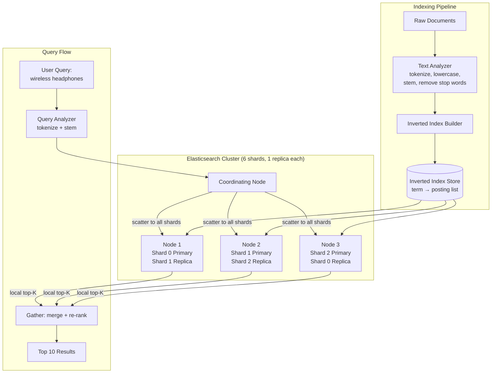

# Search Systems

## Why This Topic Exists

Search is one of the most deceptively complex problems in computer science. It looks simple to a user: type some words, get results in half a second. Under the hood, billions of documents must be matched, ranked, and returned, faster than a human blink.

The naive approach — `SELECT * FROM products WHERE description LIKE '%wireless headphones%'` — works for a thousand products. It fails catastrophically for a million. It is not even in the realm of possibility for 50 billion web pages.

Search systems are a core component of almost every large product: e-commerce sites, job boards, document management platforms, code search tools, and of course, web search. Understanding how they work at scale is essential for any senior or staff engineer.

---

## Learning Objectives

By the end of this chapter, you will be able to:
- Explain why SQL LIKE queries cannot scale for full-text search
- Describe how an inverted index works and why it is fast
- Explain Elasticsearch's architecture (shards, replicas, distributed search)
- Understand relevance scoring at a conceptual level (TF-IDF, BM25)
- Describe key text analysis decisions: tokenization, stemming, stop words, fuzzy matching
- Explain how type-ahead/autocomplete works using tries
- Design a search system for an e-commerce site in an interview

---

## Prerequisites

- Familiarity with relational databases and basic SQL
- Understanding of indexes in databases
- Basic graph/tree data structure knowledge (for trie)
- Conceptual understanding of distributed systems (sharding, replication)

---

## Introduction

When you search for "wireless noise cancelling headphones" on Amazon, you get relevant results in milliseconds. Amazon has hundreds of millions of products. There is no database index that makes a LIKE query on 500 million product descriptions fast.

Google indexes approximately 50 billion web pages. A single search query must match against this corpus and return the 10 most relevant results in roughly 500 milliseconds. The most powerful single computer on earth cannot do this. The solution requires a fundamentally different data structure than anything in a traditional relational database: the **inverted index**.

---

## Real-World Analogy

Imagine you have a library with a million books and someone asks you to find every book that contains the word "photosynthesis."

**The naive approach (SQL LIKE):** Open every book, scan every page, note which books contain the word. For a million books, this takes weeks.

**The smart approach (inverted index):** Before you ever answer a question, you build a master index at the back of the library. This index lists every significant word in alphabetical order, and next to each word, the list of every book (and even the page number) that contains it. Now, "photosynthesis" points to books 42, 1337, 88201, 204567. You have your answer in seconds.

The inverted index is exactly that master index. The work happens upfront (at index time), so queries are instant (at search time).

---

## Core Concepts

### Why SQL LIKE Does Not Scale

When you run `WHERE description LIKE '%wireless%'`, the database must:
1. Read every row in the table
2. Check each row's description column for the pattern
3. Return matching rows

This is a **full table scan** — O(N) where N is the number of rows. A B-tree index (the standard database index) cannot help with leading wildcards (`%wireless%`). Even without leading wildcards, text matching is complex: "Wireless" does not equal "wireless" unless you handle case, "headphone" does not equal "headphones" unless you handle morphology.

| Approach | 1M rows | 10M rows | 100M rows |
|---|---|---|---|
| SQL LIKE full scan | ~1 second | ~10 seconds | ~100 seconds |
| Inverted index lookup | < 10ms | < 10ms | < 10ms |

The inverted index lookup time is essentially constant because you look up a word in a sorted index (O(log N)) and retrieve a precomputed list of documents.

### The Inverted Index

An inverted index is a mapping from **terms** (words) to **posting lists** (documents that contain the term).

```
Term        -> Posting List (document IDs)
------------------------------------------
wireless    -> [doc:1, doc:5, doc:12, doc:890]
headphone   -> [doc:1, doc:5, doc:23]
noise       -> [doc:5, doc:12, doc:44]
cancelling  -> [doc:5, doc:44]
```

**Building the index (indexing pipeline):**
1. Take a document: "Sony WH-1000XM5 Wireless Noise Cancelling Headphone"
2. Tokenize: split into tokens: `["sony", "wh-1000xm5", "wireless", "noise", "cancelling", "headphone"]`
3. Normalize: lowercase, stem, remove stop words
4. For each token, add the document ID to that token's posting list

**Querying:**
For "wireless headphones":
1. Look up `wireless` in the index
2. Look up `headphone` (stemmed from "headphones")
3. Intersect (AND query): documents in both posting lists
4. Score and rank the results by relevance

### Text Analysis: Tokenization, Stemming, Stop Words

Text analysis converts raw text into tokens for the index. The decisions you make here dramatically affect search quality.

**Tokenization:** splitting text into tokens. "San Francisco" should be one token for a city search but two tokens for general search. Hyphens in "state-of-the-art" — split on them or not?

**Normalization:** lowercase everything so "Wireless" and "wireless" match.

**Stop word removal:** remove common words that carry no search value: "the," "is," "a," "of." A query for "the best wireless headphones" should not match documents that only contain the word "the."

**Stemming:** reduce words to their root form.
- "cancelling," "cancelled," "cancellation" all become "cancel"
- "headphones," "headphone" both become "headphon"
- Now a search for "cancel" matches all forms

**Lemmatization:** more linguistically accurate than stemming — maps words to their dictionary base form. "better" maps to "good." Slower but more accurate.

**Synonyms:** "sofa" should match documents containing "couch." Configured in the analyzer and expanded at query time.

### Relevance Scoring: TF-IDF and BM25

Not all matching documents are equally relevant. The search engine must rank them. The two classic algorithms:

**TF-IDF (Term Frequency - Inverse Document Frequency)**

- **TF (Term Frequency):** how often does the query term appear in this document? More occurrences = more relevant.
- **IDF (Inverse Document Frequency):** how rare is this term across all documents? "wireless" appears in millions of documents (low IDF). "XM5" appears in very few (high IDF). Rare terms are more discriminating.
- **TF-IDF score:** TF x IDF. Rare terms that appear frequently in a document score highest.

**BM25 (Best Match 25)**

BM25 improves on TF-IDF in two ways:
1. **Document length normalization:** TF-IDF rewards long documents because they have more occurrences. BM25 normalizes so a 1000-word document does not automatically beat a 100-word document just for being longer.
2. **Diminishing returns on term frequency:** going from 1 to 2 occurrences matters a lot; going from 50 to 51 barely matters.

BM25 is the default relevance algorithm in Elasticsearch and Lucene.

### Elasticsearch Architecture

Elasticsearch is the most widely used search engine for application-level search. Built on Apache Lucene, it adds distribution, clustering, and a REST API.

**Core concepts:**
- **Index:** analogous to a database table. Contains documents.
- **Document:** analogous to a row. A JSON object with fields.
- **Shard:** an index is split into N shards. Each shard is a self-contained Lucene index. This is how Elasticsearch scales horizontally.
- **Replica:** each shard has R replicas — copies on different nodes. Replicas provide read scaling and fault tolerance.
- **Node:** a single Elasticsearch server.
- **Cluster:** a group of nodes working together.

**How a distributed search query works:**
1. Client sends query to any node (the coordinating node)
2. Coordinating node broadcasts the query to all shards — the **scatter** phase
3. Each shard executes the query locally and returns its top-K results
4. Coordinating node merges and re-ranks all results — the **gather** phase
5. Final top-K results returned to the client

This is called the **scatter-gather** pattern.

**The challenge:** to get global top-10 results, each shard must return more than 10 results, because shard 1's 10th result might globally rank 3rd. This is called the "deep pagination problem" and gets expensive for deep pages (page 1000 of results).

### Fuzzy Matching

Users make typos. "wirless" should match "wireless." Fuzzy matching uses **edit distance** (Levenshtein distance) — the number of character insertions, deletions, or substitutions needed to transform one word into another.

- "wirless" to "wireless": 1 deletion. Edit distance = 1.
- "hdphone" to "headphone": 2 insertions. Edit distance = 2.

Elasticsearch supports fuzzy queries with configurable maximum edit distance, computed efficiently using automaton-based approaches rather than comparing every token in the index.

---

## Visual Diagram (Mermaid)



---

## Deep Explanation

### How Google Search Works at a High Level

Google's search is more complex than application search, but the fundamentals are the same.

1. **Crawling:** Googlebot fetches billions of web pages and stores them (see Chapter 05 on Web Crawlers)
2. **Indexing:** the inverted index for 50 billion documents is so large it cannot fit in a single machine. Google shards the index across thousands of machines. Each machine holds a portion of the posting lists.
3. **Query serving:** a single query touches thousands of machines in parallel — each responsible for a slice of the index. Results are merged.
4. **Ranking:** Google's ranking algorithm goes far beyond TF-IDF. It considers link authority (PageRank), freshness, user location, search history, and machine-learned ranking models (RankBrain, BERT, MUM).

The key insight: the per-machine computation is simple (look up terms in a local index). The complexity is in orchestrating thousands of machines and merging results. Total query time is bounded by the slowest shard — the classic tail latency problem in distributed systems.

### Autocomplete / Type-Ahead Search

When you type "wir" into a search box and see suggestions like "wireless headphones" and "wired earbuds," that is autocomplete.

**The data structure: Trie (Prefix Tree)**

A trie is a tree where each node represents a character. Paths from root to nodes spell out words. Every node can store metadata like word frequency.

```
Root
 └── w
      └── i
           └── r
                ├── e → d → "wired" [count: 80,000]
                └── e → l → e → s → s → "wireless" [count: 200,000]
```

To autocomplete "wir":
1. Navigate to the "wir" node in the trie
2. Do a DFS/BFS from that node, collecting all words
3. Return the top-N words by frequency/popularity

**Scaling autocomplete:**
- Tries become large for large vocabularies. Store only the top-K suggestions at each node rather than traversing the full subtree at query time.
- Use Redis sorted sets: key = prefix, value = sorted set of {word, score}. A query for "wir" hits a single Redis key and returns top completions in O(log N).
- Pre-compute popular prefixes. Recalculate nightly from search logs.

**The search-as-you-type pattern with Elasticsearch:**

Use **edge n-grams**. For "wireless," store all edge n-grams in the index at index time:
- w, wi, wir, wire, wirel, wirele, wireles, wireless

When the user types "wir," the query matches documents containing the edge n-gram "wir" — which was generated from "wireless." This avoids the trie complexity at the cost of a larger index.

---

## Step-by-Step Example

### Designing Search for an E-Commerce Site

**Requirements:** 50 million products. Full-text search on title and description. Filters on price, brand, rating. Relevance ranking. Autocomplete. Under 200ms response time.

**Step 1: Choose the stack**

Elasticsearch for search. Primary database (PostgreSQL) for authoritative product data. Kafka for propagating updates to Elasticsearch.

**Step 2: Design the document schema**
```json
{
  "product_id": "12345",
  "title": "Sony WH-1000XM5 Wireless Headphones",
  "title_autocomplete": "Sony WH-1000XM5 Wireless Headphones",
  "description": "Industry-leading noise cancellation...",
  "brand": "Sony",
  "category": ["Electronics", "Headphones"],
  "price": 349.99,
  "rating": 4.8,
  "review_count": 12500,
  "in_stock": true
}
```

**Step 3: Design the index settings**
- Shard count: 5 shards (10M docs per shard is a reasonable size)
- Replicas: 1 replica per shard (total 10 shard copies — for read scaling and high availability)
- Text analyzer for title and description: lowercase, English stemmer, stop words removed
- Keyword analyzer for brand and category (exact match, not analyzed)
- Edge n-gram analyzer for the autocomplete field

**Step 4: Index update pipeline**

When a product is created or updated in PostgreSQL:
1. Publish an event to Kafka
2. A consumer reads from Kafka and calls Elasticsearch's index API
3. Elasticsearch updates the relevant shard
4. Propagation delay: typically 1-5 seconds (near-real-time)

**Step 5: Query design**

User query: "wireless headphones under $200 by Sony"
1. Parse filters: price less than 200, brand equals Sony
2. Text query: "wireless headphones" — run as BM25 multi-match against title (with higher boost) and description
3. Apply filters in filter context (does not affect scoring, is cached by Elasticsearch)
4. Sort by relevance score by default; expose sort by price, rating as options

**Step 6: Handle scaling**

At 50M products and high QPS:
- Read scaling: each shard has a replica, so read traffic splits across 10 shard copies
- Cache popular queries in Redis (top 1% of queries account for roughly 50% of traffic)
- Use Elasticsearch's request cache for filter-only queries

---

## Advantages / Disadvantages / Trade-offs

| Approach | Advantage | Disadvantage |
|---|---|---|
| SQL LIKE | Simple, no extra infrastructure | Full table scan, no relevance ranking, no stemming |
| Inverted index (single node) | Fast, supports full-text features | Limited to one machine's storage and memory |
| Elasticsearch (distributed) | Horizontally scalable, rich feature set, managed REST API | Eventual consistency; not suitable for transactional data |
| Trie for autocomplete | Very fast prefix lookups | Memory-intensive; complex to update incrementally |
| Edge n-grams for autocomplete | Easy with Elasticsearch; no separate data structure | Larger index size |

---

## When to Use / When NOT to Use

**Use Elasticsearch when:**
- Full-text search on large datasets (more than 100K documents)
- Relevance ranking is required
- You need filters combined with text search
- Autocomplete or type-ahead is a requirement
- Faceted search (filter + count per filter value) is needed

**Use SQL LIKE when:**
- Dataset is small (under 10K rows)
- Search is simple prefix or exact match
- You cannot justify the operational overhead of a separate search system

**Do NOT use Elasticsearch as:**
- Your primary authoritative database (eventual consistency; data loss risk without proper configuration)
- A transactional database (no multi-document ACID transactions)
- A real-time analytics store (use ClickHouse or Druid for that)

---

## Common Interview Questions

1. **"Why can't you use SQL for full-text search at scale?"**
   SQL LIKE with leading wildcards requires a full table scan — O(N) regardless of indexes. At millions of rows, this is too slow. SQL databases also lack stemming, relevance scoring, and fuzzy matching.

2. **"What is an inverted index?"**
   A data structure mapping each unique term to the list of documents containing it. Lookup is O(log N) to find the term, then you retrieve the precomputed posting list. It is the data structure that makes fast full-text search possible.

3. **"How does Elasticsearch scale horizontally?"**
   It shards each index across multiple nodes. A query fans out to all shards in parallel (scatter), each returns its top-K results, and the coordinating node merges them (gather).

4. **"How would you implement autocomplete at scale?"**
   Options: a trie storing top-K completions at each prefix node; Redis sorted sets keyed by prefix; or Elasticsearch edge n-grams. For high QPS, cache top prefixes in Redis and recompute nightly from search logs.

5. **"What is BM25 and how is it better than TF-IDF?"**
   BM25 improves on TF-IDF by normalizing for document length (so long documents do not automatically score higher) and applying diminishing returns to term frequency (the 50th occurrence matters less than the first).

---

## Common Beginner Mistakes

- **Using SQL LIKE for full-text search on large tables** — this is a performance anti-pattern at scale
- **Not synchronizing the search index with the source of truth** — Elasticsearch is a derived index; the primary database is the source of truth; updates must be propagated or you serve stale results
- **Using Elasticsearch as the primary database** — it is not designed for this; use it alongside a primary database
- **Inconsistent text analysis between indexing and querying** — if you stem at index time but not at query time, terms will not match
- **Ignoring the deep pagination problem** — returning page 1000 requires fetching top (1000 x page_size) from every shard, which is very expensive; use cursor-based search (search after) instead
- **Not planning for re-indexing** — schema changes require zero-downtime re-indexing: create new index, reindex data, swap alias

---

## Summary

Search systems are powered by the inverted index — a precomputed mapping from terms to documents. Building this index is work done upfront at index time, which is why search queries return results in milliseconds even against billions of documents.

Elasticsearch distributes the inverted index across many nodes using sharding, scales reads using replicas, and uses the scatter-gather pattern to execute queries in parallel. Relevance is scored using BM25.

Text analysis decisions — tokenization, stemming, stop words, synonyms — dramatically affect search quality. Autocomplete uses tries or edge n-grams to suggest completions as the user types.

A well-designed search system uses Elasticsearch as a derived read index, with a primary database as the source of truth, kept in sync via an event-driven pipeline.

---

## Key Takeaways

- SQL LIKE is a full table scan; it cannot scale for large full-text search use cases
- The inverted index is the data structure that makes fast full-text search possible
- Elasticsearch shards the inverted index for horizontal scalability and uses scatter-gather for distributed queries
- BM25 is the standard relevance algorithm, improving on TF-IDF with document length normalization and diminishing returns
- Text analysis must be consistent at index time and query time
- Elasticsearch is a derived index, not a source of truth — always keep it in sync with your primary database
- Autocomplete can be built with tries, Redis sorted sets, or edge n-grams

---

## Related Topics

- [01. Designing for Scale - Principles](./01.%20Designing%20for%20Scale%20-%20Principles%20%28INTERMEDIATE%29.md)
- [05. Web Crawlers](./05.%20Web%20Crawlers%20%28INTERMEDIATE%29.md)
- [Chapter 09: Databases and Storage](../09.%20Databases%20and%20Storage/README.md)
- [Chapter 10: Caching](../10.%20Caching/README.md)
