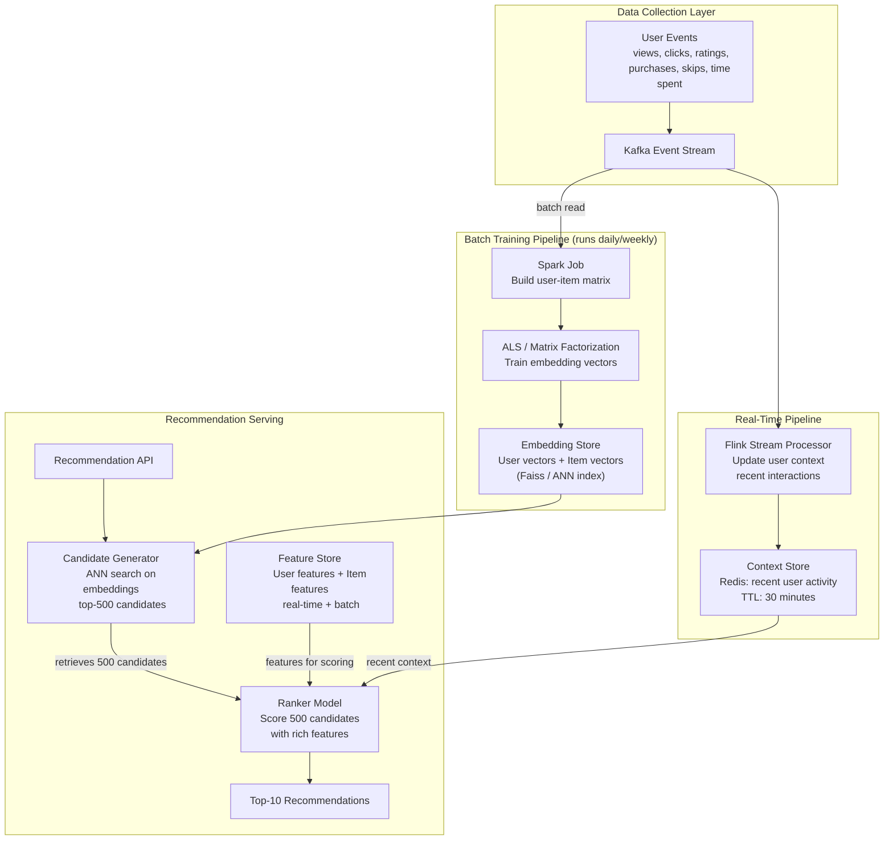

# Recommendation Systems

## Why This Topic Exists

Recommendations are one of the most commercially valuable features in modern software. Netflix claims that 80% of content watched on its platform comes from recommendations, not user searches. Amazon attributes 35% of its revenue to its recommendation engine. Spotify's Discover Weekly playlist retains users better than almost any other product feature.

A recommendation system is an algorithm that predicts what a specific user will want, based on what they and similar users have done in the past. Getting this right at scale — for hundreds of millions of users, across millions of items, with real-time personalization — is a significant engineering and machine learning challenge.

Understanding how recommendation systems are designed is increasingly important for senior and staff engineers, as nearly every product company now operates one.

---

## Learning Objectives

By the end of this chapter, you will be able to:
- Explain the difference between collaborative filtering and content-based filtering
- Describe matrix factorization and why it works for recommendations
- Explain the cold start problem and strategies to address it
- Describe the difference between real-time and batch recommendation pipelines
- Understand what a feature store is and why it matters for recommendations
- Explain A/B testing in the context of recommendation systems
- Sketch a high-level architecture for a recommendation system at scale

---

## Prerequisites

- Basic understanding of machine learning concepts (training, inference, model, features)
- Familiarity with databases and data pipelines
- Understanding of batch vs stream processing (see Chapter 02 on Data Pipelines)
- Comfort with the concept of a vector/embedding at a high level

---

## Introduction

When you finish a Netflix show, the home screen immediately presents 10 shows you might enjoy. Netflix does not know your tastes because it read your mind. It knows your tastes because millions of people with similar watching patterns have been there before you, and their behavior provides a signal about what you will enjoy.

This is the core idea behind recommendations: **use the collective behavior of all users to make personalized predictions for any individual user.**

Implementing this at scale — 200 million Netflix subscribers, 250 million daily Amazon shoppers, 400 million Spotify users — requires combining sophisticated ML algorithms with careful system design.

---

## Real-World Analogy

Imagine a new bookstore employee trying to recommend books to customers.

**Method 1 (Content-based):** The employee learns your favorite genres, authors, and themes, then recommends books with similar content. "You liked this thriller by James Patterson? Here is another thriller with a similar pace and style."

**Method 2 (Collaborative filtering):** The employee looks at which customers have similar purchase histories and recommends what those customers bought. "Everyone who bought the same three books as you also loved this fourth book you have not read yet."

**Method 3 (Hybrid):** The smart employee uses both: similar content for new users without much history, and similar users for established customers.

**The cold start problem:** A brand new customer walks in. The employee knows nothing about them yet. They cannot use collaborative filtering (no purchase history). They fall back to demographics, popular items, or a few onboarding questions.

---

## Core Concepts

### Collaborative Filtering

Collaborative filtering is the most powerful and widely used recommendation approach. The idea: users who agreed in the past will agree in the future.

There are two types:

**User-based collaborative filtering:**
- Find users most similar to the target user (measured by their rating/behavior overlap)
- Recommend items that those similar users liked but the target user has not seen

**Item-based collaborative filtering:**
- Find items most similar to items the target user liked (based on which users liked them)
- Recommend those similar items
- This is what Amazon uses: "Customers who bought X also bought Y"
- More stable than user-based (items change less frequently than user behavior)

**The user-item matrix:**

The raw material for collaborative filtering is a matrix where rows are users, columns are items, and values are ratings or interaction scores.

```
         Movie A  Movie B  Movie C  Movie D
User 1      5       4        ?        1
User 2      4       ?        2        1
User 3      ?       5        4        ?
User 4      1       2        5        4
```

The question marks are what we are trying to predict.

**The sparsity problem:** In practice, this matrix is extremely sparse. Netflix has 200M users and 15K titles. Each user watches maybe 50-100 titles. The matrix is 99.9% empty. Traditional similarity calculations on a sparse matrix are expensive and inaccurate.

### Matrix Factorization

Matrix factorization is the solution to the sparsity problem. Instead of working with the raw user-item matrix, we decompose it into two smaller matrices:
- A user matrix (one row per user, K columns representing latent factors)
- An item matrix (one row per item, K columns representing latent factors)

The K latent factors are not manually defined — they are learned by the model. For movies, latent factors might correspond to genre, mood, pacing, or actor style, but you do not tell the model this. It discovers the relevant factors automatically.

**How it works:**
1. Start with random values for both matrices
2. For every known rating in the original matrix, multiply the user's factor vector by the item's factor vector and compare to the actual rating
3. Adjust both vectors to reduce the error (gradient descent)
4. Repeat until the model converges

**At inference time:**
- User 1's recommendation: multiply User 1's factor vector by every item's factor vector
- The items with the highest predicted scores are recommended
- This is essentially a dot product computation — extremely fast

**ALS (Alternating Least Squares)** is the standard algorithm for matrix factorization at scale. It is what Netflix's recommendation model historically used and is implemented in Apache Spark's MLlib.

### Content-Based Filtering

Instead of using other users' behavior, content-based filtering uses the attributes of items themselves to make recommendations.

**How it works:**
1. Build a feature vector for each item (for a movie: genre, director, cast, synopsis keywords, release year, runtime)
2. Build a user profile: a weighted average of the feature vectors of items the user liked
3. Recommend items whose feature vectors are most similar to the user profile (using cosine similarity)

**Advantages:**
- Works without any other users' data (no cold start for items)
- Explainable: "We recommended this because you liked action movies with Tom Hanks"
- Good for niche content that few users have seen (no collaborative signal available)

**Disadvantages:**
- Limited to what is in the item's feature representation
- Cannot surface serendipitous discoveries (only recommends more of the same)
- Requires good item feature extraction

### Hybrid Approaches

Real systems at scale use hybrid approaches that combine collaborative filtering and content-based signals, along with many other signals:

| Signal Type | Example |
|---|---|
| Collaborative | Users with similar watch history also liked X |
| Content-based | Similar genre, director, themes |
| Context-aware | Time of day (comedy in the evening, news in the morning) |
| Trending | What is popular right now |
| Social | What friends are watching |
| Sequential | What you watch right after finishing a series |
| Diversity | Avoid recommending 10 thrillers in a row |

Netflix uses a two-stage approach:
1. **Candidate generation:** fast, approximate algorithms generate thousands of candidate items
2. **Ranking:** a more expensive ML model ranks the candidates with many features

### The Cold Start Problem

The cold start problem occurs when the recommendation system has insufficient data to make good recommendations.

**New user cold start:** A new user has no history. Solutions:
- Ask onboarding questions: "What genres do you like?"
- Use demographic data: age, location, device type
- Show trending/popular items (popularity-based fallback)
- Explore mode: recommend diverse items to learn preferences quickly

**New item cold start:** A new movie or product has no ratings. Solutions:
- Use content features to find similar items and inherit their recommendations
- Boost new items in recommendations to gather interaction data quickly
- Use metadata signals: same director, same genre, same brand

**New user + new item (double cold start):** Hardest case. Rely entirely on content features and popularity.

---

## Visual Diagram (Mermaid)



---

## Deep Explanation

### Embeddings and Vector Search

Modern recommendation systems represent users and items as dense vectors (embeddings) in a shared vector space. Items a user likes are close to that user's vector. Items they dislike are far away.

**Why this matters:**
- Once you have embeddings, recommendation = nearest neighbor search
- Nearest neighbor search in high-dimensional vector space is a well-studied problem
- Libraries like Faiss (Facebook), ScaNN (Google), and HNSW can search billions of vectors in milliseconds using approximate nearest neighbor (ANN) algorithms

**Two-tower model:** The most widely used embedding architecture today. One neural network tower for users, one for items. Both towers project their inputs into the same embedding space. Training: minimize distance between user and items they interacted with, maximize distance from items they did not. Used by YouTube, Airbnb, and Pinterest.

### Real-Time vs Batch Recommendations

**Batch recommendations** (computed offline, stored, served from cache):
- Compute recommendations for all users overnight with Spark
- Store results in Redis or a database: `user_id -> [item_id_1, item_id_2, ...]`
- Serving = simple cache lookup, < 5ms
- Problem: stale. Your recommendation list does not update after you watch something new today.

**Real-time recommendations** (computed on request):
- At request time, fetch the user's current context (recent watches from Redis)
- Query the ANN index with the user's current embedding
- Score candidates with a ranking model
- Return fresh, personalized results
- Problem: expensive (model inference on every request), requires low-latency feature stores

**Hybrid approach (what Netflix, YouTube, and Spotify use):**
- Pre-compute user and item embeddings in batch (daily)
- At request time, do fast ANN search (< 20ms) for candidate generation
- Apply a lightweight re-ranking model with real-time context (last 5 interactions)
- Cache final results per user for a short TTL (30 minutes) to reduce duplicate computations

### Feature Stores

A feature store is a data system that manages features (inputs) for ML models. For recommendations, features include:
- **User features:** age, country, subscription tier, 30-day watch count, favorite genres
- **Item features:** genre, runtime, release year, content rating, popularity score
- **Context features:** time of day, device type, what the user just watched (session context)

The feature store has two layers:
- **Offline store:** batch-computed features stored in a data warehouse, used for model training
- **Online store:** real-time features in a low-latency store (Redis, DynamoDB), used for model serving

The challenge: the offline training data and online serving features must be computed the same way, or you get "training-serving skew" — the model trained on one distribution of data and served on a different one.

### A/B Testing Recommendations

You have two recommendation algorithms. Which one is better? A/B testing splits users into groups and measures outcomes.

**Key metrics for recommendation A/B tests:**
- Click-through rate (CTR): how often users click a recommendation
- Conversion rate: how often they complete the action (watch, purchase)
- Engagement time: how long they spend with the recommended content
- Long-term retention: do users come back more often?

**Challenges in A/B testing recommendations:**
- **Network effects:** if user A and user B are connected, treating them differently in A/B tests introduces interference
- **Novelty effects:** a new recommendation system always looks better initially because it shows users new things. Over time, it must be genuinely better.
- **Metrics conflict:** higher CTR might come from clickbait that drives low engagement time
- **Long feedback loops:** the best metric for a recommendation system is long-term retention, which takes months to measure

### How Netflix's Recommendation System Works

Netflix uses a multi-stage recommendation pipeline:

1. **Offline batch training (weekly/monthly):**
   - Train matrix factorization models on all user-item interactions
   - Train two-tower neural networks on recent interactions
   - Generate user and item embeddings

2. **Batch candidate generation (daily):**
   - For each user, run ANN search on the user's embedding against all item embeddings
   - Pre-compute 500-1000 candidate titles per user
   - Store in a fast key-value store (EVCache, Netflix's Redis-based system)

3. **Real-time re-ranking (per request):**
   - Fetch the pre-computed candidates
   - Update with the user's most recent session context
   - Score each candidate with a ranking model (takes features like what the user just finished watching, time of day, device)
   - Apply diversity rules (do not show 10 thrillers in a row)
   - Return the top 40 titles for the home screen

4. **Row assembly:**
   - The Netflix home screen has multiple rows: "Continue Watching," "Because You Watched X," "Top Picks for You," "New Releases"
   - Different ML models power different rows
   - The order of rows is itself personalized

---

## Step-by-Step Example

### Designing Spotify's Discover Weekly

Discover Weekly is a personalized playlist of 30 songs delivered every Monday. 40 million Spotify users get a new playlist each week.

**Step 1: Build the interaction matrix**
- Collect user-song interactions: play count, skip, save, share, playlist add
- Weight interactions: a save (strong positive) > a full play (positive) > a skip (negative)

**Step 2: Train collaborative filtering model (weekly Spark job)**
- Run ALS matrix factorization on the full user-song interaction matrix
- Output: 128-dimensional embedding vector for every user and every song
- Index song embeddings in Faiss for fast ANN search

**Step 3: Candidate generation**
- For each user, perform ANN search: find the 2000 songs closest to their user embedding
- Filter out songs they have already heard (saved in their interaction history)
- Filter out songs they skipped (negative signal)
- Remaining candidates: 500-1000 songs

**Step 4: Audio feature enrichment (content-based layer)**
- For each candidate song, add content features: audio analysis (tempo, key, energy, danceability), genre, artist popularity
- This ensures diversity: if the user's collaborative signal is mostly hip-hop, content features can surface similar-energy songs in different genres

**Step 5: Ranking and playlist generation**
- Rank 500 candidates by predicted score
- Apply diversity constraints: no more than 2 songs per artist, mix of familiar and new artists
- Select the top 30 songs
- Order within the playlist is also optimized (audio flow from song to song)

**Step 6: Cold start handling**
- New user: no embedding yet. Use genre preferences from signup questionnaire + popularity within those genres
- After 10-15 listens: enough signal to compute a real embedding

---

## Advantages / Disadvantages / Trade-offs

| Approach | Advantage | Disadvantage |
|---|---|---|
| Collaborative filtering | Discovers non-obvious patterns; serendipitous recommendations | Cold start problem; sparsity problem; popularity bias |
| Content-based filtering | Works for new items; explainable; no cold start for items | Filter bubble (only more of the same); needs good feature extraction |
| Matrix factorization | Handles sparsity; scalable; good accuracy | Not interpretable; cold start; requires periodic retraining |
| Real-time recommendations | Fresh, context-aware | Expensive; requires low-latency infrastructure |
| Batch recommendations | Fast serving; cheap | Stale; cannot react to session context |
| Hybrid | Best accuracy; handles cold start | Complex to build and maintain |

---

## When to Use / When NOT to Use

**Use collaborative filtering when:**
- You have substantial user interaction data (thousands of users, thousands of items)
- Serendipitous discovery is valuable (finding things users did not know they wanted)
- You want to leverage the collective intelligence of your user base

**Use content-based filtering when:**
- Item catalog has good structured metadata
- Many new items enter the catalog frequently (cold start for new items is a real problem)
- Explainability is required

**Do NOT use complex ML recommendation models when:**
- You have fewer than tens of thousands of users or items (a simple rule-based or popularity-based system works better and is easier to maintain)
- You have no interaction data yet (start collecting data first, build the ML later)

---

## Common Interview Questions

1. **"What is collaborative filtering?"**
   Collaborative filtering recommends items by finding users with similar behavior. "Users who liked what you liked also liked X." It works by computing similarity between users or items based on their interaction history.

2. **"What is the cold start problem?"**
   When a new user or new item has no interaction history, there is no collaborative signal. Solutions include content-based fallback, onboarding questions, demographic-based recommendations, or boosting new items to collect data quickly.

3. **"How does Netflix generate recommendations for 200 million users?"**
   Netflix uses a two-stage system: offline embedding generation (batch, weekly), candidate generation (daily, ANN search on embeddings), and real-time re-ranking (per request, with session context). Results are cached per user with a short TTL.

4. **"What is a feature store and why is it needed?"**
   A feature store manages ML model inputs. It has an offline layer (for training, warehouse-backed) and an online layer (for serving, Redis-backed). It solves training-serving skew: ensuring the model is trained and served on features computed the same way.

5. **"How do you A/B test a recommendation system?"**
   Split users randomly into control and test groups. Measure CTR, conversion, engagement, and long-term retention. Be aware of network effects (users influence each other), novelty effects (new systems initially look better), and conflicting metrics.

---

## Common Beginner Mistakes

- **Jumping straight to complex ML before collecting enough data** — a popularity-based recommender often beats a poorly-trained collaborative filter
- **Ignoring the cold start problem** — what does your system show to new users? Design this deliberately.
- **Optimizing for CTR instead of long-term engagement** — high CTR from clickbait is worse for the product than lower CTR from genuinely good recommendations
- **Training-serving skew** — computing features differently in training vs serving causes the model to perform poorly in production
- **Not retraining models regularly** — user tastes and item catalogs change; a model trained six months ago degrades over time
- **Ignoring diversity** — a model that only recommends the same type of content drives users away over time; add diversity constraints

---

## Summary

Recommendation systems predict what users want based on the collective behavior of all users. Collaborative filtering finds patterns across users; content-based filtering finds patterns within items. Matrix factorization handles the sparsity problem by learning latent embedding vectors for users and items. Modern systems use neural two-tower models and vector search for efficient candidate generation.

The cold start problem — insufficient data for new users or items — is one of the central challenges. Hybrid systems that combine collaborative, content-based, and contextual signals handle it best.

At scale, recommendations use a two-stage pipeline: offline batch training and embedding generation, followed by real-time candidate generation and re-ranking. Feature stores manage the training-serving consistency problem. A/B testing drives continuous improvement.

---

## Key Takeaways

- Collaborative filtering uses the collective behavior of similar users to make personalized recommendations
- Matrix factorization solves the sparsity problem by learning compact embedding vectors for users and items
- Content-based filtering recommends items similar to what the user already liked, using item features
- The cold start problem affects new users and new items; hybrid approaches and fallback strategies are essential
- Modern systems use a two-stage pipeline: fast candidate generation (ANN search on embeddings) + expensive re-ranking
- Feature stores ensure training and serving use the same feature computation, preventing training-serving skew
- Always test recommendations with long-term engagement metrics, not just short-term CTR

---

## Related Topics

- [01. Designing for Scale - Principles](./01.%20Designing%20for%20Scale%20-%20Principles%20%28INTERMEDIATE%29.md)
- [02. Data Pipelines and ETL](./02.%20Data%20Pipelines%20and%20ETL%20%28INTERMEDIATE%29.md)
- [03. Search Systems](./03.%20Search%20Systems%20%28INTERMEDIATE%29.md)
- [Chapter 09: Databases and Storage](../09.%20Databases%20and%20Storage/README.md)
- [Chapter 11: Message Queues](../11.%20Message%20Queues/README.md)
