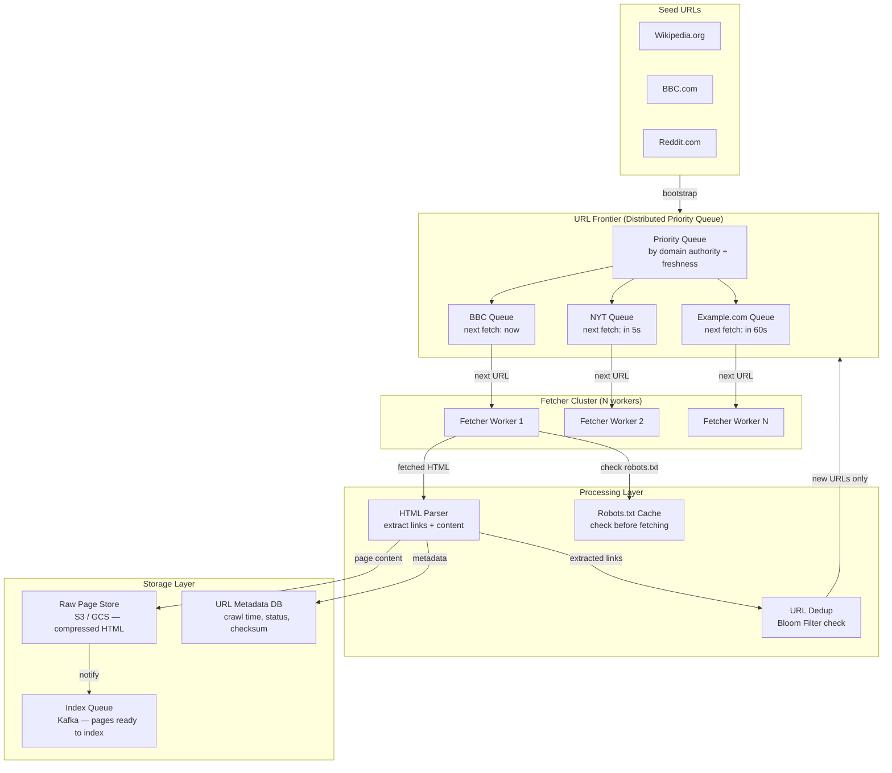

# Web Crawlers

## Why This Topic Exists

Before Google can search the internet, it must first read the internet. Before any price comparison site can show you the cheapest laptop, it must first visit thousands of retailer websites and extract prices. Before any news aggregator can surface today's headlines, it must discover and fetch those articles.

The system that does this automated reading is called a **web crawler** (also called a spider or bot). Building a web crawler that works reliably at a small scale is straightforward. Building one that can crawl a billion pages, respect site owners' wishes, handle adversarial content, and keep up with a web that changes every second — that is a significant engineering challenge.

Web crawler design is a classic senior-level system design interview question because it combines so many interesting problems: distributed systems, URL deduplication, politeness, storage, and prioritization.

---

## Learning Objectives

By the end of this chapter, you will be able to:
- Describe the core components of a web crawler
- Explain the URL frontier and how crawl priority is managed
- Describe BFS vs priority-based crawling strategies
- Explain politeness: robots.txt, crawl-delay, and why it matters
- Explain URL deduplication using Bloom filters
- Describe the challenges unique to large-scale crawling
- Design a web crawler for 1 billion pages in an interview

---

## Prerequisites

- Understanding of HTTP (GET requests, status codes, HTML parsing)
- Basic graph traversal concepts (BFS)
- Familiarity with distributed systems concepts
- Understanding of hashing (for Bloom filters)

---

## Introduction

The World Wide Web is a graph. Web pages are nodes. Hyperlinks are directed edges. A web crawler performs a traversal of this graph: start at a set of seed URLs, fetch the page, extract the links, add new links to the queue, fetch the next page, repeat.

This sounds simple. The complexity comes from the scale and constraints:
- The web has over 50 billion indexed pages. A single machine cannot crawl them all in any reasonable time.
- Many sites have millions of URLs that generate infinite or near-infinite content (calendars, search results, parametrized queries). You could crawl forever without ever getting to the valuable content.
- Site owners have legitimate expectations about how often you can hit their servers. Crawling aggressively can be an attack.
- The same content appears at multiple URLs. You need to deduplicate at billion-page scale.
- The web changes. Pages added yesterday need to be crawled. Pages updated last week need to be re-crawled.

---

## Real-World Analogy

Imagine you are tasked with reading and cataloging every book in every library in the world. Each book contains a list of references to other books.

**The crawler:** You start at one library. You read a book, write down its catalog entry, and note all the books it references. You add those references to your reading list. You visit those libraries, find those books, read them, note their references, and so on.

**Politeness:** You cannot check out every book from one library simultaneously. You wait your turn, take a few books, and let other patrons use the library. You also check the library's rules — some say "no photocopying," which is analogous to robots.txt saying "do not index this section."

**Deduplication:** Many books are reprinted in multiple libraries. You keep a list of every book you have already read (by ISBN, like a hash). When you encounter a book whose ISBN is already in your list, you skip it.

**Prioritization:** You crawl the most famous libraries first (high-authority domains). Within a library, you read the most popular books first (high-PageRank pages).

---

## Core Concepts

### The Five Core Components

A web crawler has five main components:

| Component | Role |
|---|---|
| Fetcher | Downloads the raw HTML of a URL via HTTP |
| Parser | Extracts links and content from the raw HTML |
| URL Frontier | Queue of URLs to crawl; manages priority and scheduling |
| Deduplication | Ensures we do not crawl the same URL twice |
| Storage | Stores the crawled content for downstream processing |

### The URL Frontier

The URL frontier is the brain of the crawler — it is the data structure that decides which URL to crawl next and when.

A naive implementation is just a FIFO queue: add URLs to the back, pop from the front, crawl in order of discovery. This works for small crawls.

At scale, the URL frontier must be much more sophisticated:

**Priority queue:** Not all pages are equally important. High-authority domains (Wikipedia, BBC, NYT) should be crawled before random personal blogs. PageRank, domain authority, and freshness (how recently the page changed) are used to prioritize.

**Per-domain queuing:** To enforce politeness (see below), the frontier groups URLs by domain. Each domain has its own sub-queue with a minimum delay between fetches.

**Freshness scheduling:** The frontier must also schedule re-crawls. A news site's homepage changes every minute. A Wikipedia article might change once a month. The frontier assigns different re-crawl frequencies based on historical change rates.

### BFS vs Priority Crawling

**Breadth-First Search (BFS):** Crawl all pages discovered at distance 1 from the seeds before crawling pages at distance 2. Guarantees you explore the web breadth-first. Good for discovering all pages reachable within N hops.

**Priority crawling:** Crawl pages in order of a priority score (importance, freshness, etc.) rather than discovery order. Better for maximizing the quality of the crawl when you cannot crawl everything.

In practice, large-scale crawlers use a hybrid:
- Use priority to decide which domains to crawl first
- Use BFS within a domain to discover all pages
- Apply politeness constraints to throttle per domain

### Politeness: robots.txt and Crawl-Delay

Web crawlers that ignore politeness constraints are effectively performing denial-of-service attacks. A crawler that hits a small website with 100 requests per second can bring it down.

**robots.txt:** A standard file that every website can place at the root of their domain (`https://example.com/robots.txt`). It specifies which parts of the site can be crawled and by whom.

```
User-agent: *          # applies to all crawlers
Disallow: /admin/      # do not crawl /admin/
Disallow: /private/    # do not crawl /private/
Crawl-delay: 5         # wait 5 seconds between requests

User-agent: Googlebot  # applies only to Google's crawler
Allow: /               # Google can crawl everything
```

A well-behaved crawler must:
1. Fetch and cache `robots.txt` for every domain before crawling it
2. Respect `Disallow` directives
3. Respect `Crawl-delay` (or apply a default politeness delay, typically 1-10 seconds per domain)
4. Identify itself with a legitimate User-Agent string that includes a contact email

**Crawl delay implementation:** The URL frontier must enforce that two consecutive requests to the same domain are at least `crawl-delay` seconds apart. This is typically implemented by maintaining a "next available time" timestamp per domain.

### URL Deduplication with Bloom Filters

At billion-page scale, you will encounter the same URL through many different paths. Without deduplication, you would crawl the same page millions of times.

**Naive approach:** Store every crawled URL in a hash set. Check before adding to the frontier. The problem: 1 billion URLs at ~50 bytes each = ~50 GB. This does not fit in a single machine's RAM.

**Bloom filter:** A probabilistic data structure that answers "have I seen this element before?" with:
- **No false negatives:** if the Bloom filter says "not seen," the URL definitely has not been crawled
- **Possible false positives:** if it says "seen," the URL probably has been crawled (but there is a small chance it has not been)

How it works:
1. A Bloom filter is a bit array of size M, initially all zeros
2. To add an element, hash it with K different hash functions. Set the K bit positions to 1.
3. To check if an element exists, hash it with the same K functions. If all K bit positions are 1, it probably exists. If any bit is 0, it definitely does not exist.

**Why Bloom filters are perfect for URL deduplication:**
- Memory-efficient: 1 billion URLs with a 1% false positive rate requires only ~1.2 GB (versus 50 GB for a hash set)
- Fast: O(K) hash computations — essentially O(1)
- False positives only mean you occasionally skip a URL you have not actually seen, which is acceptable

**For duplicate content detection (not just URL):** hash the page content using MD5 or SHA-256 and store those hashes. If two different URLs produce the same content hash, only index one.

---

## Visual Diagram (Mermaid)



---

## Deep Explanation

### Challenges at Scale

**Challenge 1: Infinite URL traps**

Some websites generate infinite URLs. A calendar site might have:
```
/calendar/2024/01
/calendar/2024/02
...
/calendar/9999/12
```

A search results site might have:
```
/search?q=foo&page=1
/search?q=foo&page=2
...
/search?q=foo&page=999999
```

**Solutions:**
- Set a maximum crawl depth per domain
- Detect parametrized URL patterns and limit unique parameter values per pattern
- Normalize URLs (remove tracking parameters like `utm_source`, `session_id`)
- Set a maximum number of URLs crawled per domain

**Challenge 2: Duplicate and near-duplicate content**

The same article might appear at:
- `https://www.example.com/article`
- `https://example.com/article`
- `https://www.example.com/article?ref=homepage`
- `https://www.example.com/article/` (trailing slash)

URL normalization handles simple cases:
- Lowercase the scheme and host
- Remove default ports (`:80`, `:443`)
- Remove common tracking parameters
- Normalize trailing slashes

**SimHash for near-duplicate detection:** Two articles that are 95% the same (one is a syndicated copy of the other) should not both be indexed. SimHash is a locality-sensitive hash: similar documents produce similar hash values. By comparing SimHash values, you can detect near-duplicates without comparing full content.

**Challenge 3: Dynamic content (JavaScript-rendered pages)**

Traditional crawlers fetch HTML via HTTP. But modern SPAs (Single Page Applications) render content via JavaScript. A simple HTTP fetch returns an empty shell with `<div id="app"></div>` — no content.

**Solutions:**
- Use a headless browser (Chrome headless via Puppeteer) to render JavaScript before parsing
- This is expensive: 10-100x more CPU per page than simple HTTP fetching
- Reserve headless rendering for pages that warrant it (high-authority domains, pages that fail to parse without JavaScript)
- Google has dedicated resources for JavaScript rendering; smaller crawlers avoid it

**Challenge 4: The Deep Web**

The "deep web" is content that is not reachable via links — content behind login walls, forms, paywalls, databases queried by search forms. Traditional link-following crawlers cannot access it.

Googlebot does not index your LinkedIn messages or your private Google Docs for this reason.

**Challenge 5: Keeping up with the changing web**

The web changes constantly. A news site publishes 1000 articles per day. A social media site adds billions of new URLs per day. Your crawler must re-crawl pages that have changed and discover new pages quickly.

**Solutions:**
- **Sitemaps:** many websites publish XML sitemaps at `sitemap.xml` listing all their URLs and last-modified dates. The crawler can use these for efficient discovery and freshness detection.
- **HTTP caching headers:** `Last-Modified` and `ETag` headers allow the crawler to ask the server "has this page changed since my last crawl?" The server responds with `304 Not Modified` if nothing changed — saving bandwidth.
- **Change frequency estimation:** track how often each page changes and schedule re-crawls accordingly.

### Distributed Crawler Architecture

A single machine cannot crawl a billion pages in any reasonable timeframe. Crawling 1000 pages/second (aggressive but respectful) would take ~12 days for 1 billion pages — and the web changes while you crawl.

**Distributed design:**
1. Partition URLs by domain across crawler workers. All URLs from `bbc.com` go to Worker 3. This ensures politeness (each domain's queue is handled by one worker) and avoids cross-worker coordination.
2. Use consistent hashing to assign domains to workers. When adding new workers, only re-route a fraction of domains.
3. Each worker independently fetches, parses, and stores pages for its assigned domains.
4. Workers share a central URL deduplication store (distributed Bloom filter or Redis).
5. Parsed URLs from any worker flow back into the central frontier, which routes them to the appropriate worker.

### DNS Resolution at Scale

At 10,000 pages/second, DNS resolution becomes a bottleneck. A lookup for every URL would saturate DNS infrastructure.

**Solution:**
- Maintain an in-process DNS cache per crawler worker
- Pre-resolve DNS for all domains in the frontier
- Use a dedicated DNS service (not the OS resolver) with higher TTL caching

---

## Step-by-Step Example

### Designing a Crawler for 1 Billion Pages

**Assumptions:**
- Target: 1 billion pages crawled in 7 days
- Average page size: 100 KB (compressed)
- Total data: 100 TB
- Required throughput: 1 billion / (7 x 24 x 3600) = ~1,650 pages/second

**Component sizing:**

**Fetcher cluster:**
- Each fetcher machine handles ~100 pages/second (accounting for network latency, DNS, parsing)
- Need ~17 machines for 1,650 pages/second
- Use 25 machines for headroom

**URL Frontier:**
- Store in a distributed queue backed by Kafka (partitioned by domain)
- Estimated active URL queue: ~10 billion URLs (1B pages x 10 links each)
- At 50 bytes per URL: ~500 GB of queue data
- Use Kafka with high retention and multiple partitions

**Bloom filter:**
- 1 billion URLs, 1% false positive rate
- Memory: ~1.2 GB — fits in Redis
- Use a distributed Redis cluster for shared access across all fetcher workers

**robots.txt cache:**
- ~100 million distinct domains in a 1B page crawl
- Cache robots.txt per domain with TTL of 24 hours
- Store in Redis: ~10 GB

**Storage:**
- Raw HTML: 100 TB of compressed HTML in S3
- URL metadata: 1 billion rows, ~200 bytes each = ~200 GB in a distributed database (Cassandra or DynamoDB)
- Content checksums for deduplication: 1 billion x 32 bytes = ~32 GB in Redis or a database

**Crawl schedule:**
- Day 1: seed frontier with 100M high-authority URLs (from a domain list or existing index)
- Days 1-3: crawl high-priority domains (news, reference sites)
- Days 4-7: crawl long-tail domains at lower priority

**Politeness enforcement:**
- Minimum 1-second delay per domain by default
- Respect `Crawl-delay` from robots.txt
- Per-domain rate limiting enforced in the URL frontier scheduler
- With 1-second delay and 25 workers, maximum throughput per domain = 25 fetches/second; across all domains, aggregate is 1,650/second

---

## Advantages / Disadvantages / Trade-offs

| Design Decision | Advantage | Disadvantage |
|---|---|---|
| BFS crawl order | Ensures breadth of discovery | Does not prioritize important pages |
| Priority crawl | Higher quality index for given bandwidth | Some pages may never be reached |
| Bloom filter deduplication | Memory-efficient at scale | False positives (occasionally miss a URL) |
| Per-domain partitioning | Simplifies politeness enforcement | Worker rebalancing needed when domains grow |
| Headless browser rendering | Crawls JavaScript content | 10-100x more expensive per page |
| Sitemap-driven discovery | Fast, efficient for cooperative sites | Many sites do not publish sitemaps |

---

## When to Use / When NOT to Use

**Use a web crawler when:**
- You need to index or aggregate content from many external websites
- Building a search engine, price comparison, news aggregator, or SEO analysis tool
- You need to monitor websites for changes

**Do NOT crawl without:**
- Checking and respecting robots.txt
- Identifying your crawler with a legitimate User-Agent
- Enforcing per-domain rate limits
- A contact email for site owners to reach you

**Do NOT crawl:**
- Sites that explicitly forbid crawling in their Terms of Service
- Sites behind login walls (unauthorized access)
- Sites at rates that cause performance degradation (legal liability)

---

## Common Interview Questions

1. **"Walk me through the components of a web crawler."**
   Fetcher downloads pages. Parser extracts links and content. URL frontier is the priority queue of URLs to crawl. Deduplication checks whether a URL has already been crawled (Bloom filter). Storage saves crawled content.

2. **"What is a Bloom filter and why is it used in web crawlers?"**
   A Bloom filter is a memory-efficient probabilistic data structure that answers "have I seen this URL?" It can have false positives (says "seen" when it has not) but never false negatives (never says "not seen" when it has been). 1 billion URLs require ~1.2 GB in a Bloom filter vs ~50 GB in a hash set.

3. **"What is robots.txt?"**
   A standard file at the root of a website that tells crawlers which paths they may or may not crawl, and how often. A well-behaved crawler fetches and respects robots.txt before crawling any page on a domain.

4. **"How do you handle infinite URL traps?"**
   Set maximum crawl depth per domain, detect and canonicalize parametrized URL patterns, limit maximum unique URLs per domain, remove session parameters and tracking tokens from URLs before adding to the frontier.

5. **"How would you scale a web crawler to crawl 1 billion pages in a week?"**
   Distribute fetchers across multiple machines, partition the URL frontier by domain for politeness, use a distributed Bloom filter in Redis for deduplication, store raw HTML in object storage (S3), use Kafka as the URL frontier backend, and enforce per-domain crawl-delay.

---

## Common Beginner Mistakes

- **Not checking robots.txt** — this is both ethically wrong and legally risky
- **No per-domain rate limiting** — hitting any site at 1000 req/sec is effectively a DDoS attack
- **No URL normalization** — crawling `http://example.com/page`, `https://example.com/page`, and `https://example.com/page/` as three separate URLs
- **Storing all URLs in a hash set in memory** — does not scale to billions of URLs; use a Bloom filter
- **Single-threaded fetching** — network I/O is the bottleneck; you need many concurrent fetchers
- **Ignoring JavaScript-rendered content** — may be acceptable for a first implementation but misses a large portion of modern web content
- **No freshness strategy** — crawling each page exactly once produces a static snapshot; real crawlers continuously re-crawl based on change frequency

---

## Summary

A web crawler is a distributed system that traverses the web graph by fetching pages, extracting links, and scheduling those links for future fetching. The five core components are: fetcher, parser, URL frontier, deduplication, and storage.

Politeness — respecting robots.txt and enforcing per-domain rate limits — is both an ethical and legal requirement. URL deduplication at billion-page scale uses Bloom filters, which are memory-efficient probabilistic data structures that accept small false positive rates in exchange for 50x memory savings.

The URL frontier manages priority (high-authority pages first), scheduling (re-crawl frequencies), and politeness (per-domain delays). Challenges at scale include infinite URL traps, duplicate content, JavaScript-rendered pages, and keeping up with a constantly changing web.

A billion-page crawler needs roughly 25 fetcher machines, a Kafka-backed distributed URL frontier, a Redis Bloom filter, and 100 TB of object storage.

---

## Key Takeaways

- A web crawler traverses the web graph: fetch, parse, extract links, enqueue, repeat
- The URL frontier is the most complex component — it manages priority, scheduling, and politeness
- Always check and respect robots.txt; always enforce per-domain crawl-delay
- Bloom filters provide memory-efficient URL deduplication at billion-URL scale with acceptable false positive rates
- URL normalization is essential to avoid crawling the same content at multiple URLs
- JavaScript-rendered content requires a headless browser, which is expensive
- At scale, distribute fetchers across many machines, partition by domain, and use shared state (Redis) for deduplication

---

## Related Topics

- [01. Designing for Scale - Principles](./01.%20Designing%20for%20Scale%20-%20Principles%20%28INTERMEDIATE%29.md)
- [03. Search Systems](./03.%20Search%20Systems%20%28INTERMEDIATE%29.md)
- [Chapter 14: Distributed Systems Concepts](../14.%20Distributed%20Systems%20Concepts/README.md)
- [Chapter 09: Databases and Storage](../09.%20Databases%20and%20Storage/README.md)
- [Chapter 10: Caching](../10.%20Caching/README.md)
