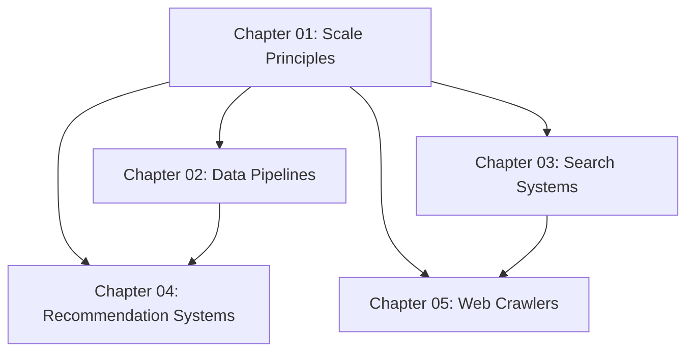

# 18. Large Scale Architecture

## Chapter Overview

This chapter covers the architectural patterns, tools, and design decisions that power systems at internet scale — systems handling millions of users, petabytes of data, and thousands of requests per second. These are the concepts that separate senior engineers from mid-level ones and are central to staff-level system design interviews.

---

## Why This Chapter Exists

Building a system that works for 100 users is fundamentally different from building one that works for 100 million users. The database queries that run fine in development choke under real traffic. The single server that served your startup becomes a single point of failure. The synchronous API that worked great for one region starts timing out when users are on the other side of the planet.

Large-scale architecture is about **anticipating problems before they happen** and making deliberate design choices that let your system grow without being rewritten from scratch every year.

This chapter answers questions like:
- How does Google search 50 billion pages in half a second?
- How does Netflix know what show to recommend to 200 million subscribers?
- How does Uber calculate surge pricing in real time across every city?
- How does Amazon index hundreds of millions of products for search?
- How does Google index the entire internet without visiting the same page twice?

---

## Who This Chapter Is For

| Level | What You Will Get |
|---|---|
| Intermediate | Understand what these systems are and why they are built the way they are |
| Senior | Be able to design these systems in interviews and make trade-off decisions |
| Staff | Understand the full operational complexity and evolution paths |

---

## Prerequisites

Before starting this chapter, make sure you are comfortable with:
- Database indexing and query optimization
- Horizontal vs vertical scaling
- Caching strategies (Redis, Memcached)
- Message queues (Kafka, RabbitMQ)
- REST APIs and microservices basics
- CAP theorem and consistency models

---

## Topics in This Chapter

### 01. Designing for Scale: Principles
**File:** [01. Designing for Scale - Principles (INTERMEDIATE).md](./01.%20Designing%20for%20Scale%20-%20Principles%20%28INTERMEDIATE%29.md)

The foundational mental models for large-scale system design. Before you can design any specific large system, you need to understand the principles that apply to all of them. This chapter covers horizontal scaling at every layer, stateless services, async over sync, loose coupling, design for failure, idempotency, eventual consistency, data locality, shared-nothing architecture, and how real companies like Amazon, Google, and Netflix evolved their systems from single servers to global platforms.

**Key Concepts:** Horizontal scaling, stateless design, shared-nothing architecture, idempotency, eventual consistency, design for failure

---

### 02. Data Pipelines and ETL
**File:** [02. Data Pipelines and ETL (INTERMEDIATE).md](./02.%20Data%20Pipelines%20and%20ETL%20%28INTERMEDIATE%29.md)

Data is only valuable if you can move it, transform it, and make it accessible. This chapter covers how companies move petabytes of data from production systems into analytics platforms. Covers batch ETL vs streaming pipelines, Lambda architecture, Kappa architecture, Apache Spark, Apache Flink, data warehouses (Snowflake, BigQuery, Redshift), data lakes (S3), and the emerging Lakehouse pattern. Real example: how Uber processes trip data for surge pricing and analytics.

**Key Concepts:** ETL, Lambda architecture, Kappa architecture, Spark, Flink, data warehouse, data lake, Lakehouse

---

### 03. Search Systems
**File:** [03. Search Systems (INTERMEDIATE).md](./03.%20Search%20Systems%20%28INTERMEDIATE%29.md)

How does Google search 50 billion web pages in 0.5 seconds? The answer is an inverted index. This chapter covers why traditional database LIKE queries cannot scale, how inverted indexes work, Elasticsearch architecture (shards, replicas, distributed search), relevance scoring (TF-IDF, BM25), tokenization and stemming, fuzzy matching, type-ahead/autocomplete with tries, and a full design walkthrough for e-commerce search.

**Key Concepts:** Inverted index, Elasticsearch, sharding, TF-IDF, BM25, autocomplete, trie, full-text search

---

### 04. Recommendation Systems
**File:** [04. Recommendation Systems (INTERMEDIATE).md](./04.%20Recommendation%20Systems%20%28INTERMEDIATE%29.md)

Netflix recommends shows. Amazon recommends products. Spotify creates personalized playlists. How do these systems work at scale? This chapter covers collaborative filtering (matrix factorization), content-based filtering, hybrid approaches, the cold start problem, feature engineering, real-time vs batch recommendations, A/B testing, and how Netflix's recommendation system is architected at a high level.

**Key Concepts:** Collaborative filtering, content-based filtering, matrix factorization, cold start problem, real-time recommendations, A/B testing

---

### 05. Web Crawlers
**File:** [05. Web Crawlers (INTERMEDIATE).md](./05.%20Web%20Crawlers%20%28INTERMEDIATE%29.md)

Before Google can search the internet, it must first read the internet. Web crawlers are the automated systems that fetch billions of web pages, extract links, and follow them continuously. This chapter covers crawler components (fetcher, parser, URL frontier, storage), BFS vs priority crawling, politeness rules (robots.txt, crawl-delay), URL deduplication with Bloom filters, distributed crawling, and the full design of a system that can crawl 1 billion pages.

**Key Concepts:** Web crawler, inverted index, Bloom filter, URL frontier, robots.txt, distributed crawling, deduplication

---

## How to Use This Chapter

1. **Read the principles chapter first** (01) — it sets the mental models you need for all the others
2. **Then read in any order** based on what you are preparing for or find most interesting
3. **After each chapter**, try to sketch the architecture from memory before looking back
4. **For interview prep**, study the "Common Interview Questions" section of each chapter and practice answering out loud

---

## Chapter Learning Path

---

## Key Themes Across All Topics

| Theme | Where It Appears |
|---|---|
| Distributed processing | Data Pipelines, Search, Web Crawlers |
| Indexing for fast reads | Search, Recommendation Systems |
| Async over sync | Scale Principles, Data Pipelines |
| Horizontal scaling | All topics |
| Avoiding single points of failure | All topics |
| Trade-offs between consistency and availability | Scale Principles, Data Pipelines |

---

## Related Chapters

- [Chapter 09: Databases and Storage](../09.%20Databases%20and%20Storage/README.md)
- [Chapter 10: Caching](../10.%20Caching/README.md)
- [Chapter 11: Message Queues](../11.%20Message%20Queues/README.md)
- [Chapter 14: Distributed Systems Concepts](../14.%20Distributed%20Systems%20Concepts/README.md)
- [Chapter 17: Real-World System Designs](../17.%20Real-World%20System%20Designs/README.md)
