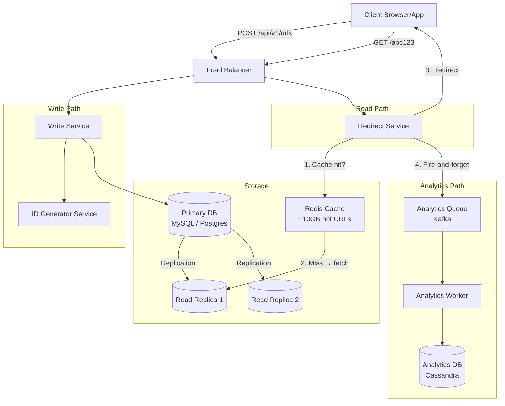

# Design: URL Shortener (TinyURL / bit.ly)

## Problem Statement

Build a service that takes a long URL and returns a short alias (e.g., `https://tinyurl.com/abc123`). When users visit the short URL, they are redirected to the original long URL. The system must handle massive read traffic since short URLs are shared publicly and clicked millions of times.

---

## Why This System is Interesting

The URL shortener is the "Hello World" of system design. It looks trivial on the surface — just a key-value lookup — but it hides several interesting problems:

- How do you generate short codes that are globally unique without a central coordinator?
- Do you use a 301 (permanent) or 302 (temporary) redirect? The answer has business consequences.
- How do you handle a 1000:1 read-to-write ratio efficiently?
- How do you provide analytics (clicks, geography, referrers) without slowing down the redirect path?
- How do you handle custom aliases, expiry, and abuse prevention?

This system exercises: hashing, base encoding, caching, database design, and horizontal scaling.

---

## Functional Requirements

1. Given a long URL, generate a unique short URL (e.g., `tinyurl.com/abc123`).
2. Redirect users from the short URL to the original long URL.
3. Support custom aliases (user chooses the short code).
4. Support URL expiry (optional time-to-live).
5. Track analytics: total clicks, unique visitors, referrer, geographic location, device type.
6. Users can delete their own short URLs.

---

## Non-Functional Requirements

| Property | Target |
|----------|--------|
| Redirect latency | < 10ms at p99 |
| Availability | 99.99% (< 53 min downtime/year) |
| Durability | URL mappings must never be lost |
| Read:Write ratio | ~1000:1 |
| Short code length | 6–8 characters |
| Security | No ability to enumerate all URLs |

---

## Capacity Estimation

### Assumptions
- 100 million new URLs created per day
- Read:Write ratio = 1000:1
- Average long URL length = 100 bytes
- Short URL code = 7 characters
- Data retained for 5 years

### Write throughput
```
100M URLs/day ÷ 86,400 seconds/day ≈ 1,160 writes/second
Peak (3x): ~3,500 writes/second
```

### Read throughput
```
1000 × 1,160 = 1,160,000 reads/second
Peak (3x): ~3.5 million reads/second
```

### Storage
```
Per URL record:
  - short_code:    7 bytes
  - long_url:      100 bytes (avg)
  - user_id:       8 bytes
  - created_at:    8 bytes
  - expires_at:    8 bytes
  - click_count:   8 bytes
Total per record: ~140 bytes

5 years × 365 days × 100M URLs/day × 140 bytes
= 5 × 365 × 100M × 140
= ~25.6 TB of URL mapping data
```

### Cache sizing
```
80/20 rule: 20% of URLs get 80% of traffic
Cache top 20% of daily URLs:
20% × 100M × 140 bytes ≈ 2.8 GB/day
Use a 10 GB Redis cache — fits comfortably in memory
```

### Bandwidth
```
Read bandwidth:
  1.16M reads/sec × 100 bytes (redirect response) ≈ 116 MB/s outbound
```

---

## API Design

### Create Short URL
```
POST /api/v1/urls
Content-Type: application/json

Request:
{
  "long_url": "https://www.example.com/very/long/path?query=param",
  "custom_alias": "my-link",          // optional
  "expires_at": "2025-12-31T00:00:00Z" // optional
}

Response 201 Created:
{
  "short_url": "https://tinyurl.com/abc123",
  "short_code": "abc123",
  "long_url": "https://www.example.com/very/long/path?query=param",
  "created_at": "2024-01-15T10:30:00Z",
  "expires_at": "2025-12-31T00:00:00Z"
}

Errors:
  400 - Invalid URL format
  409 - Custom alias already taken
  422 - URL on blocklist
```

### Redirect
```
GET /{short_code}

Response 302 Found:
  Location: https://www.example.com/very/long/path?query=param

  (or 301 for permanent — see discussion below)

Errors:
  404 - Short code not found
  410 - Short code expired
```

### Get URL Analytics
```
GET /api/v1/urls/{short_code}/analytics
Authorization: Bearer <token>

Response 200:
{
  "short_code": "abc123",
  "total_clicks": 45231,
  "unique_visitors": 38104,
  "clicks_by_day": [{"date": "2024-01-15", "clicks": 1203}, ...],
  "top_referrers": [{"referrer": "twitter.com", "clicks": 12000}, ...],
  "top_countries": [{"country": "US", "clicks": 25000}, ...],
  "devices": {"mobile": 0.62, "desktop": 0.34, "tablet": 0.04}
}
```

### Delete URL
```
DELETE /api/v1/urls/{short_code}
Authorization: Bearer <token>

Response 204 No Content
```

---

## High-Level Architecture



---

## Core Components Deep Dive

### Short Code Generation

This is the central design challenge. We need 7-character codes that are:
- Globally unique
- Not sequential (prevents enumeration)
- Fast to generate

**Option 1: MD5/SHA1 Hash of Long URL**
Hash the long URL, take the first 7 characters of the hex output, encode in base62. Problem: different long URLs could hash to the same 7-character prefix (collision). Must check DB on every insert.

**Option 2: Counter + Base62 Encoding (Recommended)**

Use a globally unique integer ID (from a dedicated ID service or the database's auto-increment), then convert to base62.

Base62 alphabet: `0-9a-zA-Z` = 62 characters
7 digits in base62 = 62^7 = 3.5 trillion unique codes

```
ID:  1000000 (decimal)
     → Base62: "4c92"
     → Pad to 7 chars: "0004c92"
```

Use a centralized ID generator (like Twitter Snowflake, or a simple counter in Redis with `INCR`). The ID generator is a single point of failure, so run 3 replicas with pre-allocated ranges:

```
Server A: IDs 1 – 1,000,000
Server B: IDs 1,000,001 – 2,000,000
Server C: IDs 2,000,001 – 3,000,000
(each server fetches next range from DB when exhausted)
```

**Option 3: Random String**
Generate a random 7-char base62 string, check for collision in DB. With 3.5 trillion possibilities and 500 billion URLs, collision probability is ~14% — too high. Not recommended.

### 301 vs 302 Redirect

| | 301 Permanent | 302 Temporary |
|---|---|---|
| Browser behavior | Caches the redirect; subsequent requests skip the server | Always asks the server |
| Analytics | Cannot track repeat clicks (browser doesn't call server again) | Can track every click |
| Server load | Lower (browser caches) | Higher (every click hits server) |
| Use case | Static links that never change | Analytics-critical links |

**Decision**: Use 302 for analytics-enabled links (the default). Offer 301 as an option for users who explicitly want caching and don't need click tracking.

### Cache Strategy

The redirect service uses a **read-through cache**:
1. Check Redis for `short_code → long_url` mapping
2. On miss, fetch from read replica, populate cache with TTL = 24 hours
3. On delete/update, invalidate cache key

Cache hit rate target: >99%. Given the 80/20 rule, a 10 GB cache easily holds the top 20% of active URLs.

### Analytics Pipeline (Async, Decoupled)

Analytics must not slow down the critical redirect path. Use a fire-and-forget pattern:

1. Redirect service sends a click event to Kafka (non-blocking)
2. Analytics workers consume from Kafka and batch-write to Cassandra
3. Cassandra is chosen because: high write throughput, time-series data (clicks over time), easy to partition by `short_code + date`

The redirect path never waits for analytics. If Kafka is temporarily unavailable, use an in-memory buffer with overflow to disk.

---

## Database Design

### URL Mapping Table (MySQL / Postgres)

```sql
CREATE TABLE urls (
    id            BIGINT UNSIGNED NOT NULL AUTO_INCREMENT,
    short_code    VARCHAR(10)     NOT NULL UNIQUE,
    long_url      TEXT            NOT NULL,
    user_id       BIGINT UNSIGNED,
    created_at    DATETIME        NOT NULL DEFAULT CURRENT_TIMESTAMP,
    expires_at    DATETIME,
    is_deleted    BOOLEAN         NOT NULL DEFAULT FALSE,
    
    PRIMARY KEY (id),
    INDEX idx_short_code (short_code),
    INDEX idx_user_id (user_id),
    INDEX idx_expires_at (expires_at)  -- for cleanup jobs
);
```

### Why SQL Here?

URL mappings have a simple, stable schema. ACID guarantees matter — we must never create two URLs with the same short code. The insert rate (~1,160/sec) is easily handled by a single MySQL primary with read replicas. Only if write volume exceeds ~50,000/sec would we need to consider sharding or switching to a NoSQL store like DynamoDB.

### Analytics Table (Cassandra)

```
Table: url_clicks

Partition key: (short_code, date)
Clustering key: click_timestamp

Columns:
  short_code       TEXT
  date             DATE
  click_timestamp  TIMEUUID
  ip_address       TEXT
  country          TEXT
  referrer         TEXT
  device_type      TEXT
  user_agent       TEXT
```

Cassandra is ideal here because:
- Write-heavy (billions of click events/day)
- Time-series access pattern (aggregate by date range)
- No cross-partition transactions needed
- Horizontally scalable by adding nodes

---

## Scaling Strategy

### Phase 1: Single Server (0 → 10,000 users)
Single app server + single MySQL instance. Works fine. Focus on correctness.

### Phase 2: Read Replicas (10K → 1M users)
Read traffic dominates. Add MySQL read replicas. Direct all reads to replicas, writes to primary.

### Phase 3: Caching Layer (1M → 10M users)
Add Redis cluster. Cache hot short codes. Redirect service checks Redis first. Cache hit rate ~95% immediately reduces DB load by 20x.

### Phase 4: CDN for Redirects (10M → 100M users)
Configure CDN (Cloudflare, Fastly) to cache 301 redirects at the edge. For 302 (analytics), CDN cannot cache but can still absorb SSL termination and DDoS protection.

### Phase 5: Database Sharding (100M+ users)
Shard MySQL by `short_code` (first 2 characters → 3,844 shards). Use consistent hashing so adding shards doesn't require rehashing all keys. Each shard holds ~6.7 GB of URL data (25.6 TB / 3,844).

### Phase 6: Global Distribution
Multi-region deployment. Route users to the nearest region (GeoDNS). Each region has its own write primary + read replicas. Cross-region replication for durability.

---

## Key Bottlenecks and Solutions

### Bottleneck 1: ID Generation
**Problem**: If the ID generator is a single database auto-increment, it becomes a write bottleneck at scale.
**Solution**: Range-based pre-allocation. Each ID generator server pre-fetches a range of 1M IDs from a central coordinator. Generates IDs locally (no network call) until the range is exhausted, then fetches the next range. The coordinator only needs to handle ~1 request/million IDs generated.

### Bottleneck 2: Read Traffic on Redirect
**Problem**: 1.16M redirects/second — no single database can handle this.
**Solution**: Redis cache with 99%+ hit rate. Only ~11,600 requests/second reach the database — easily handled by 3 read replicas.

### Bottleneck 3: Hot Short Codes
**Problem**: A viral link might receive 1 million requests in a second (a "hot key" in Redis).
**Solution**: Local in-memory cache in each redirect service instance (LRU, ~1,000 entries). Viral links are served entirely from process memory. This is a two-tier cache: local → Redis → database.

### Bottleneck 4: Analytics Write Volume
**Problem**: 1.16M click events/second overwhelms any traditional database.
**Solution**: Kafka buffer + batch writes to Cassandra. Kafka absorbs bursts. Cassandra handles sustained high write throughput with its LSM-tree storage engine.

---

## Trade-offs Made

| Decision | Choice | What We Gave Up |
|----------|--------|----------------|
| 302 vs 301 redirect | 302 (default) | Browser caching (more server load) |
| Base62 counter vs random | Counter | Unpredictability (sequential codes) — mitigated by not exposing the counter |
| Async analytics | Fire-and-forget Kafka | Possible analytics data loss if Kafka is down (use buffer) |
| SQL for URL store | MySQL + replicas | Easier horizontal scaling of NoSQL (unnecessary at this scale) |
| Cache-aside vs read-through | Read-through | Slightly more complex cache logic |

---

## Real-World: How bit.ly Does It

- bit.ly uses **MySQL** as the primary store with a custom sharding layer
- They encode their auto-increment IDs in **base 36** (not base 62 — simpler but longer codes)
- The redirect service is built in **Go** for minimal latency overhead
- They use a **two-tier caching strategy**: Redis for warm URLs + local in-memory (LRU) for viral URLs
- Analytics are processed asynchronously through their own Kafka pipeline
- bit.ly has processed over **600 billion link clicks** total
- They use **Cloudflare** for DDoS protection and edge caching of static assets

---

## Interview Discussion Points

**Q: Why not just use a hash of the long URL?**
MD5 produces a 128-bit hash. Truncating to 7 characters gives 62^7 ≈ 3.5 trillion possibilities, but with 500 billion URLs you'd have ~14% collision rate. You'd need a DB roundtrip to check every insert and retry on collision. A monotonic counter avoids all collisions deterministically.

**Q: What happens if two users create a short URL for the same long URL simultaneously?**
Your system can either: (a) return the same short URL for the same long URL (deduplicate) — requires a unique index on `long_url`, which is expensive for TEXT fields; or (b) create two separate short codes for the same long URL — simpler, users get different analytics dashboards. Most services choose (b).

**Q: How do you handle malicious URLs?**
- Blocklist of known malicious domains (updated via threat intelligence feeds)
- On creation: check long_url against blocklist; reject if matched
- Post-creation: background scanner re-checks all URLs daily
- User reporting mechanism → manual review queue
- Rate limit URL creation by IP and account

**Q: How do you scale the write path to 100M URLs/day?**
1,160 writes/sec is trivially handled by a single MySQL instance (which can do ~10K writes/sec). Even at 10x growth (1,160 → 11,600 writes/sec), a single primary handles it. You would need sharding only if you hit ~50K writes/sec, which means 4.3 billion new URLs/day — well beyond current internet scale.

**Q: What is the risk of using Redis as a cache for URL lookups?**
If Redis goes down, all requests fall through to the database. With 1.16M requests/sec hitting MySQL directly, the database will be overwhelmed. Mitigation: Redis cluster with Sentinel/automatic failover (< 30 second recovery), circuit breaker to shed load during Redis recovery, read replicas scaled to handle 10% of peak traffic as emergency fallback.

---

## Summary

A URL shortener is a read-heavy key-value system. The core design decisions are:

1. **Code generation**: Use a distributed counter with base62 encoding for guaranteed uniqueness without collisions.
2. **Redirect type**: Use 302 for analytics; consider 301 for performance-critical, static links.
3. **Caching**: Two-tier cache (local memory + Redis) achieves 99%+ hit rate, keeping database load minimal.
4. **Analytics**: Decouple from the redirect path entirely using Kafka + Cassandra.
5. **Storage**: SQL is perfectly adequate for the URL mapping store at any realistic scale.

The system scales gracefully: most bottlenecks are in the read path, which is solved by caching, not by sharding. The write path is so light that it rarely needs special treatment.
