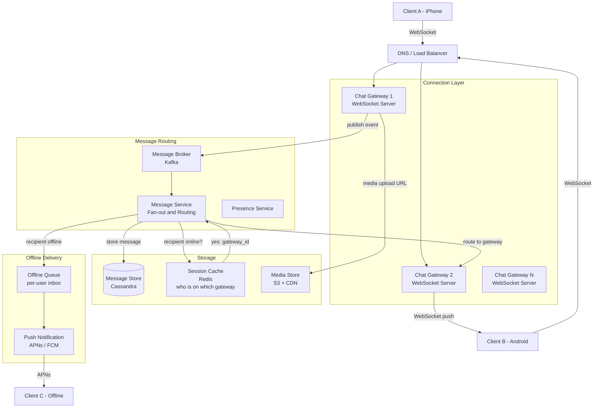
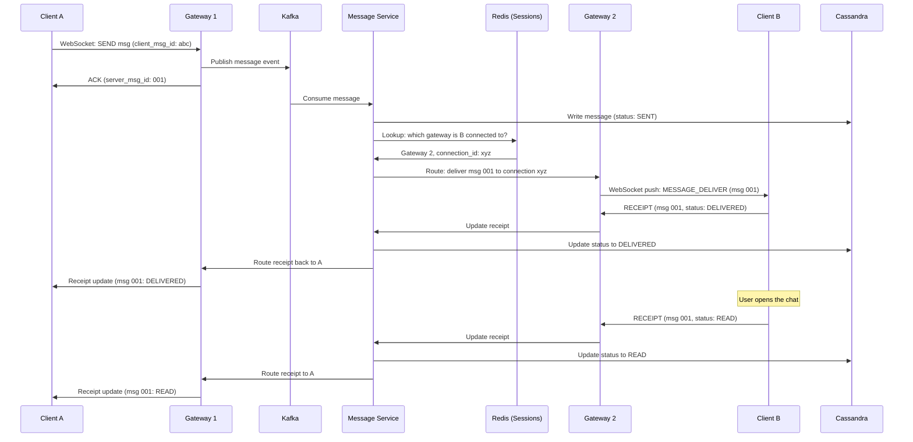

# Design: Chat System (WhatsApp)

## Problem Statement

Build a real-time messaging system that allows users to send text messages, media (photos, videos, documents), and voice notes to individuals and groups. Messages must be delivered reliably — even when the recipient is offline. The system must support read receipts, presence indicators (online/offline/last seen), and end-to-end encryption.

---

## Why This System is Interesting

Chat systems are among the most technically demanding systems to build because they require:

- **True real-time communication**: a 100ms delay feels broken to users
- **Delivery guarantees**: messages must not be silently lost
- **Offline handling**: recipients might be offline for days; messages must queue up
- **Scale asymmetry**: some group chats have 256 members; some broadcasts have 100K
- **Encryption**: messages must be unreadable by the platform itself
- **Presence at scale**: knowing which of your 500 contacts are online right now requires massive fan-out

This system exercises: WebSockets, message queues, database design, distributed ID generation, and event-driven architecture.

---

## Functional Requirements

1. One-to-one messaging (text, media, documents, voice notes)
2. Group messaging (up to 256 members)
3. Message delivery: sent → delivered → read receipts
4. Online/offline presence and "last seen" timestamp
5. Push notifications for offline users
6. Media storage (photos and videos up to 100MB)
7. Message history (searchable by sender/group, last 1 year)
8. End-to-end encryption

---

## Non-Functional Requirements

| Property | Target |
|----------|--------|
| Message delivery latency | < 500ms (online recipient) |
| Availability | 99.99% |
| Durability | Messages must not be lost after acknowledgment |
| Throughput | 65 billion messages/day |
| Offline storage | Up to 30 days of queued messages per user |
| Media storage | 5 years |
| Encryption | End-to-end (platform cannot read messages) |

---

## Capacity Estimation

### Assumptions
- 2 billion registered users, 1.5 billion daily active users (DAU)
- 65 billion messages/day (WhatsApp's real number as of 2023)
- Average message size: 100 bytes (text only; media is separate)
- 15% of messages contain media (photos/videos/documents)
- Average media size: 500 KB
- Average group has 20 members

### Message throughput
```
65B messages/day / 86,400 seconds/day ~= 752,000 messages/second
Peak (3x average): ~2.25 million messages/second
```

### Storage for messages (text)
```
85% text messages:
65B x 0.85 x 100 bytes = 5.5 TB/day text message data

Metadata (message_id, sender, recipient, timestamp, status):
65B x 50 bytes = 3.25 TB/day metadata

Total text + metadata: ~8.75 TB/day
1 year retention: 8.75 TB x 365 ~= 3.2 PB
```

### Storage for media
```
15% media messages:
65B x 0.15 x 500 KB = ~4.9 PB/day

Strategy: store media on S3 with lifecycle policy:
  - 90 days: S3 Standard ($0.023/GB)
  - 90 days -> 1 year: S3 Infrequent Access ($0.0125/GB)
  - After 1 year: deleted (or moved to Glacier if regulations require)
```

### Active connections
```
1.5 billion DAU x (30 min active/day / 1440 min/day)
~= 31 million concurrent WebSocket connections
```

---

## API Design

### Send Message
```
WebSocket message (binary, Protocol Buffers):

Type: MESSAGE_SEND
{
  "client_msg_id": "uuid-v4",    // client-generated, for deduplication
  "chat_id": "chat_abc123",
  "type": "TEXT",                // TEXT | IMAGE | VIDEO | AUDIO | DOCUMENT
  "content": "<encrypted blob>",
  "reply_to_msg_id": null,       // optional thread reply
  "timestamp": 1705315800000
}

Server acknowledgment (TYPE: MESSAGE_ACK):
{
  "client_msg_id": "uuid-v4",    // echoes client ID
  "server_msg_id": "srv_987654", // server-assigned canonical ID
  "timestamp": 1705315800123     // server-assigned timestamp
}
```

### Receive Message
```
WebSocket push (TYPE: MESSAGE_DELIVER):
{
  "server_msg_id": "srv_987654",
  "chat_id": "chat_abc123",
  "sender_id": "user_111",
  "type": "TEXT",
  "content": "<encrypted blob>",
  "timestamp": 1705315800123
}

Client sends receipt (TYPE: MESSAGE_RECEIPT):
{
  "server_msg_id": "srv_987654",
  "status": "DELIVERED"   // or "READ"
}
```

### Upload Media
```
POST /v1/media/upload
Content-Type: multipart/form-data

Request:
  file: <binary data>
  mime_type: "image/jpeg"
  encrypted: true

Response 200:
{
  "media_id": "media_xyz789",
  "cdn_url": "https://cdn.whatsapp.com/media/media_xyz789",
  "expires_at": "2025-01-15T00:00:00Z"
}
```

### Get Chat History (REST fallback for initial load)
```
GET /v1/chats/{chat_id}/messages?before_msg_id=srv_987654&limit=50
Authorization: Bearer <token>

Response 200:
{
  "messages": [
    {
      "server_msg_id": "srv_987654",
      "sender_id": "user_111",
      "type": "TEXT",
      "content": "<encrypted>",
      "timestamp": 1705315800123,
      "status": "READ"
    }
  ],
  "has_more": true
}
```

---

## High-Level Architecture



---

## Message Delivery Sequence



---

## Core Components Deep Dive

### Chat Gateway (WebSocket Servers)

Each gateway maintains persistent WebSocket connections with clients. A single server with 64 GB RAM can hold ~500,000 concurrent connections (each connection uses ~100-150 bytes of metadata). With 31 million concurrent connections, you need ~62 gateway servers minimum.

Gateways are stateful (each holds open connections) but the routing state is stored externally in Redis:

```
Redis key: session:{user_id}
Value: {
  "gateway_id": "gw-042",
  "connection_id": "conn-abc123",
  "connected_at": 1705315800
}
TTL: 30 seconds (heartbeat renews it)
```

When a gateway crashes, sessions expire and clients reconnect to another gateway.

### Message Service (Fan-out)

For a group message to 256 members:
1. Look up all group members in the Group Service
2. For each member, look up their gateway in Redis (batch lookup)
3. Fan-out the message to all connected gateways
4. For offline members, queue the message in their offline inbox

This is a 256-way fan-out per group message. At 752,000 messages/second, if 10% are group messages with 20 members average, that is 752,000 x 0.10 x 20 = 1.5 million routing decisions per second. This is manageable with horizontal scaling of the Message Service.

### Offline Message Queue

When a recipient is offline, messages are stored in their personal inbox:

```
Cassandra table: offline_inbox
  user_id      TEXT
  msg_id       TIMEUUID
  from_user    TEXT
  chat_id      TEXT
  content      BLOB (encrypted)
  created_at   TIMESTAMP

Partition key: user_id
Clustering: msg_id (time-ordered)
TTL: 30 days
```

When the user comes back online:
1. Client connects, sends its last-known `msg_id`
2. Server queries offline inbox for everything after that ID
3. Delivers messages in order
4. Clears the delivered messages from the inbox

### End-to-End Encryption (Signal Protocol)

WhatsApp uses the Signal Protocol for E2E encryption. Key concepts:

- **Key Exchange**: Each device generates a public/private key pair on first install. The public key is uploaded to WhatsApp's key server. The private key never leaves the device.
- **Session Establishment**: When A wants to message B for the first time, A fetches B's public key from the server and establishes an encrypted session. The server never sees the session key.
- **Double Ratchet Algorithm**: Each message uses a fresh encryption key derived from the previous one. Compromise of one key does not compromise past or future messages (forward secrecy + break-in recovery).
- **Group Messages**: WhatsApp sends individual encrypted copies to each group member using the Sender Key mechanism.

The platform stores only encrypted blobs. WhatsApp cannot read your messages.

### Presence System

Presence is high-fanout and high-frequency. When user A comes online:
- A's 500 contacts might all want to know
- A changes status every few seconds as they type, go idle, etc.

**Strategy**: Lazy fan-out with subscription model.
- When A opens a chat with B, A subscribes to B's presence updates
- B's gateway publishes presence events to a Pub/Sub topic
- Only users who have an active chat open with B receive updates
- "Last seen" is stored in Redis with 30-second TTL (the heartbeat interval)

This avoids the thundering herd of fanning out status to all 500 contacts every time someone opens the app.

---

## Database Design

### Message Storage (Cassandra)

```
Table: messages

  chat_id        TEXT        -- partition key (distributes load by conversation)
  msg_id         TIMEUUID    -- clustering key (time-ordered within chat)
  sender_id      TEXT
  msg_type       TEXT        -- TEXT, IMAGE, VIDEO, AUDIO, DOCUMENT
  content        BLOB        -- encrypted payload
  status         TEXT        -- SENT, DELIVERED, READ
  reply_to_id    TIMEUUID    -- optional
  created_at     TIMESTAMP
  deleted_at     TIMESTAMP   -- soft delete

PRIMARY KEY (chat_id, msg_id)
WITH CLUSTERING ORDER BY (msg_id DESC)
AND default_time_to_live = 31536000  -- 1 year TTL
```

Why Cassandra:
- **Write-heavy**: 752K writes/second -- Cassandra's LSM tree is optimized for this
- **Time-series access**: messages are always read in time order within a chat
- **No cross-partition transactions needed**: each message is independent
- **Tunable consistency**: use QUORUM for writes (durability), ONE for reads (speed)

### User and Group Tables (MySQL)

```sql
CREATE TABLE users (
    user_id      BIGINT UNSIGNED NOT NULL,
    phone_number VARCHAR(20) UNIQUE NOT NULL,
    display_name VARCHAR(100),
    avatar_url   VARCHAR(255),
    public_key   TEXT NOT NULL,
    last_seen    DATETIME,
    created_at   DATETIME NOT NULL DEFAULT CURRENT_TIMESTAMP,
    PRIMARY KEY (user_id)
);

CREATE TABLE group_members (
    group_id  BIGINT UNSIGNED NOT NULL,
    user_id   BIGINT UNSIGNED NOT NULL,
    role      ENUM('ADMIN', 'MEMBER') NOT NULL DEFAULT 'MEMBER',
    joined_at DATETIME NOT NULL DEFAULT CURRENT_TIMESTAMP,
    PRIMARY KEY (group_id, user_id),
    INDEX idx_user_id (user_id)
);
```

User and group data is relational and low-write. MySQL handles this well. Cache group membership in Redis (TTL = 5 minutes) since it is read on every group message send.

---

## Scaling Strategy

### Phase 1: Monolith (0 to 100K users)
Single server, single database. Use polling (HTTP long-polling) instead of WebSockets. Focus on correctness.

### Phase 2: WebSockets + Separation (100K to 1M users)
Introduce WebSocket gateways. Separate message storage from user/group metadata. Add Redis for session routing.

### Phase 3: Kafka + Async Delivery (1M to 10M users)
Introduce Kafka between gateways and message processing. This decouples the connection layer from the delivery logic and enables fan-out to scale independently.

### Phase 4: Cassandra + Sharding (10M to 100M users)
Move from MySQL for messages to Cassandra. MySQL cannot sustain 100K+ writes/second on a single node. Shard Cassandra across 50 nodes -- each handles ~15K writes/second.

### Phase 5: Multi-Region (100M+ users)
Deploy in 5+ regions (US-East, US-West, Europe, India, Southeast Asia). Route users to the nearest region. Cross-region messages use a global message bus.

---

## Key Bottlenecks and Solutions

### Bottleneck 1: Gateway Connection Limits
**Problem**: A single server has OS-level limits on open file descriptors.
**Solution**: Tune OS parameters (`ulimit -n`, `net.core.somaxconn`). Use epoll (Linux) for async I/O -- 1 thread handles thousands of connections. With modern hardware, 500K connections/server is achievable.

### Bottleneck 2: Group Message Fan-out
**Problem**: 256-member group chat generates 256 database writes and 256 routing lookups per message.
**Solution**: Write one message to Cassandra (with a single `chat_id` partition). Fan-out delivery is done by the Message Service in parallel. Use batched Redis lookups (MGET) to fetch all 256 gateway sessions in one round trip.

### Bottleneck 3: Redis Session Lookup Under Load
**Problem**: 750K messages/second x ~10 members each = 7.5 million Redis lookups/second.
**Solution**: Redis cluster (16+ shards). Sessions are distributed by `hash(user_id)`. Each shard handles ~470K ops/second -- well within Redis's capacity.

### Bottleneck 4: Media Storage Costs
**Problem**: 4.9 PB of media uploaded per day at standard S3 pricing is prohibitively expensive.
**Solution**: Hash-based deduplication (same file sent to multiple recipients stored once), aggressive lifecycle policies (delete after 90 days), compress images on upload.

---

## Trade-offs Made

| Decision | Choice | What We Gave Up |
|----------|--------|----------------|
| WebSockets over SSE | WebSockets | SSE is simpler but one-directional |
| At-least-once delivery | Messages may be delivered twice on retry | Exactly-once requires heavy coordination |
| Deduplication via client_msg_id | Client generates UUID | Server must store client_msg_ids to deduplicate |
| Media stored on S3 | S3 for media | Slightly more complex retrieval (two-step) |
| Async receipt updates | Better throughput | Receipts may lag slightly behind reality |
| Cassandra eventual consistency | High write throughput | Possible rare out-of-order delivery |

---

## Real-World: How WhatsApp Does It

- WhatsApp was built in **Erlang/OTP**, chosen for its actor model that handles millions of lightweight processes
- As of 2023: **2 billion users**, **65+ billion messages/day**
- The entire backend runs on a **relatively small fleet** (~1,500 servers at peak) -- Erlang's efficiency is legendary
- Uses the **XMPP protocol** (extended for WhatsApp's features) rather than a custom WebSocket protocol
- **Media** is stored on their own distributed file system, not S3 (at this scale, custom storage is cheaper)
- When Facebook acquired WhatsApp in 2014, WhatsApp had **55 engineers** serving **450 million users** -- 8 million users per engineer

---

## Interview Discussion Points

**Q: How do you guarantee at-least-once delivery?**
The sender keeps resending until it receives an ACK. The server writes the message to Cassandra before sending the ACK. If the sender never gets an ACK, it retries with the same `client_msg_id`. The server deduplicates using `client_msg_id` (store in a set with 24-hour TTL). This ensures the message is stored exactly once even if sent multiple times.

**Q: How do you handle the case where a user has multiple devices?**
Each device has its own key pair and WebSocket connection. When a message is sent, it must be delivered to all active devices of the recipient. The Message Service looks up all sessions for `user_id` (not just one) and delivers to each. All devices share the same chat history in Cassandra -- they both read from the same `chat_id` partition.

**Q: How do you handle a 256-member group at 65B messages/day?**
Assume 5% of messages are group messages (3.25B/day). Average group has 20 members. Total fan-out operations = 3.25B x 20 = 65B delivery events/day. Most are handled by the offline queue (members read later), not by simultaneous WebSocket delivery. The online fan-out for a typical 20-person group is 20 parallel WebSocket pushes -- trivial.

**Q: Why not use HTTP/2 multiplexing instead of WebSockets?**
HTTP/2 allows multiplexing on a single TCP connection but still follows a request-response model. The server cannot push to the client without a preceding request. WebSocket push was deprecated in most browsers. WebSockets are the right tool for bidirectional real-time communication.

---

## Summary

A chat system is a real-time, bidirectional, durability-critical system. The key architectural decisions are:

1. **WebSockets** for persistent bidirectional connections; session state in Redis for routing
2. **Kafka** as the central bus between gateways and message processing, enabling decoupled scaling
3. **Cassandra** for message storage: designed for the time-series, write-heavy access pattern
4. **Signal Protocol** for E2E encryption: the server never sees plaintext
5. **Two-tier fan-out**: online delivery via WebSocket, offline delivery via persistent queue + push notifications
6. **Presence**: subscription-based lazy fan-out, not broadcast to all contacts

The hardest part is not storage or throughput -- it is the correct interaction between delivery guarantees, deduplication, multi-device sync, and encryption, all while maintaining sub-second latency.
