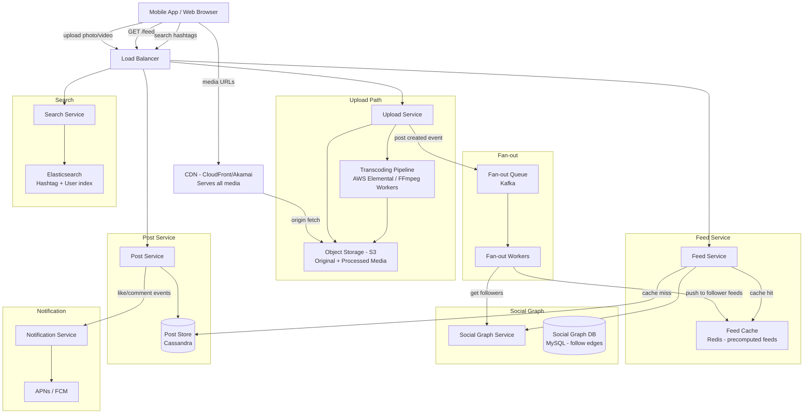

# Design: Photo Sharing Platform (Instagram)

## Problem Statement

Build a photo and video sharing platform where users can upload media, follow other users, and see a personalized feed of posts from the people they follow. The platform must support likes, comments, hashtag search, push notifications, and a story format (ephemeral 24-hour posts). The feed must feel instant.

---

## Why This System is Interesting

Instagram is the canonical example of a **fan-out problem**. The question "how do you build a news feed?" appears in virtually every senior engineering interview. It looks simple — show me the latest posts from people I follow — but it hides a fundamental tension:

- **Push model (fanout on write)**: when a user posts, immediately write to all followers' feeds. Reads are instant. But a celebrity with 100 million followers creates 100 million writes per post.
- **Pull model (fanout on read)**: when a user opens their feed, query all the people they follow and merge results. No expensive writes. But reads are slow (N queries for N followees).
- **Hybrid model**: push for regular users, pull for celebrities. This is what Instagram actually does.

Beyond the feed, this system exercises: CDN design, media storage and transcoding, social graph storage, notification systems, and search (hashtags).

---

## Functional Requirements

1. Upload photos and short videos (up to 60 seconds)
2. Follow/unfollow other users
3. View a personalized feed (photos/videos from followed users, in reverse chronological order with ranking)
4. Like and comment on posts
5. Stories: 24-hour ephemeral posts
6. Hashtag search and user search
7. Push notifications (new likes, comments, followers)
8. Explore page (trending content)
9. Direct messages (simplified -- see WhatsApp case study for deep dive)

---

## Non-Functional Requirements

| Property | Target |
|----------|--------|
| Feed load time | < 500ms |
| Photo upload | < 5 seconds (mobile, 4G) |
| Availability | 99.99% |
| Read:Write ratio | ~100:1 for posts; ~1000:1 for feed reads |
| Scale | 1 billion users, 100 million photos/day |
| Storage | Photos and videos retained indefinitely |
| Search | Hashtag results in < 200ms |

---

## Capacity Estimation

### Assumptions
- 1 billion registered users, 500 million daily active users (DAU)
- 100 million photos uploaded/day
- 10 million videos uploaded/day
- Average photo size (compressed): 200 KB
- Average video size (60 sec): 50 MB
- Average user follows 300 accounts
- Feed read: 50 million users open feed/hour during peak

### Upload throughput
```
Photos: 100M / 86,400 ~= 1,157 uploads/second
Videos: 10M / 86,400 ~= 116 uploads/second
Peak (3x): ~3,500 photo uploads/second
```

### Storage for media
```
Photos:
  100M/day x 200 KB = 20 TB/day
  1 year: 20 TB x 365 = 7.3 PB

Videos:
  10M/day x 50 MB = 500 TB/day
  1 year: 500 TB x 365 = 182 PB

Total media storage per year: ~190 PB
```

Note: Videos dominate storage. In practice, Instagram transcodes videos to multiple resolutions, which adds ~3x storage overhead but is offset by compression.

### Feed read throughput
```
50M feed opens/hour = 13,889 feed reads/second
Each feed read returns 20 posts -> 277,780 post lookups/second
Peak (3x): ~833K post lookups/second
```

### Social graph storage
```
1B users x 300 follows = 300B follow edges
Each edge: 16 bytes (user_id + followee_id + timestamp)
300B x 16 bytes = 4.8 TB for the social graph
```

---

## API Design

### Upload Photo
```
POST /v1/posts
Content-Type: multipart/form-data
Authorization: Bearer <token>

Request:
  image: <binary data>
  caption: "Sunset at the beach #travel #photography"
  location: {"lat": 37.7749, "lng": -122.4194, "name": "San Francisco"}
  tags: ["@friend1", "@friend2"]

Response 201 Created:
{
  "post_id": "post_abc123",
  "image_url": "https://cdn.instagram.com/p/abc123/800w.jpg",
  "thumbnail_url": "https://cdn.instagram.com/p/abc123/thumb.jpg",
  "created_at": "2024-01-15T10:30:00Z"
}
```

### Get Feed
```
GET /v1/feed?page_token=<cursor>&limit=20
Authorization: Bearer <token>

Response 200:
{
  "posts": [
    {
      "post_id": "post_xyz789",
      "user": {"user_id": "u123", "username": "john_doe", "avatar": "..."},
      "image_url": "https://cdn.instagram.com/p/xyz789/800w.jpg",
      "caption": "Beautiful sunset",
      "like_count": 4521,
      "comment_count": 89,
      "is_liked": false,
      "created_at": "2024-01-15T09:00:00Z"
    }
  ],
  "next_page_token": "eyJsYXN..."
}
```

### Like a Post
```
POST /v1/posts/{post_id}/like
Authorization: Bearer <token>

Response 200:
{
  "post_id": "post_xyz789",
  "like_count": 4522,
  "is_liked": true
}
```

### Search Hashtags
```
GET /v1/hashtags/search?q=travel&limit=10

Response 200:
{
  "hashtags": [
    {"tag": "travel", "post_count": 650000000},
    {"tag": "travelphotography", "post_count": 120000000},
    {"tag": "travelgram", "post_count": 98000000}
  ]
}
```

---

## High-Level Architecture



---

## Core Components Deep Dive

### Photo and Video Upload Pipeline

**Step 1: Upload to S3**
The Upload Service generates a pre-signed S3 URL and returns it to the client. The client uploads directly to S3 — the server is not in the data path. This reduces server load and uses S3's multipart upload for large files.

**Step 2: Transcoding**
After S3 receives the upload, it triggers a Lambda function that enqueues a transcoding job. FFmpeg workers produce:
- Photos: 3 sizes (150x150 thumbnail, 640px width, 1080px width)
- Videos: 4 bitrate variants (360p, 480p, 720p, 1080p) + thumbnail

**Step 3: CDN Propagation**
Processed files are stored in S3. A CDN (CloudFront) sits in front of S3. The first request for a new image misses the CDN and pulls from S3. Subsequent requests are served from the CDN edge node (cache TTL = 1 year for immutable media).

### Feed Generation: The Hardest Problem

**The Core Challenge**: User A follows 500 accounts. When A opens Instagram, they need a personalized, ranked list of recent posts. How?

**Option 1: Pull Model (Fan-out on Read)**
When A opens the feed:
1. Query the Social Graph for all 500 followees
2. Query the Post DB for the latest N posts from each followee
3. Merge and rank the results
4. Return top 20

Problem: 500 DB queries per feed open. At 13,889 feed opens/second, that is 6.9 million queries/second. Even with caching, this is prohibitive.

**Option 2: Push Model (Fan-out on Write)**
When user B posts:
1. Look up all of B's followers (say, 1,000)
2. For each follower, write B's post_id to their feed list in Redis
3. When A opens their feed, just read their pre-populated Redis list

Problem: if B has 100 million followers (a celebrity), one post creates 100 million writes. At 1,000 posts/second from celebrities, that is 100 billion writes/second -- impossible.

**Option 3: Hybrid Model (What Instagram Uses)**

Define a "celebrity" threshold: any user with > 1 million followers is a celebrity.

- **Regular users (< 1M followers)**: fan-out on write. When they post, write to all followers' feed caches in Redis. Fast reads.
- **Celebrity users (> 1M followers)**: no fan-out. When a user opens their feed, the Feed Service fetches the latest posts from celebrities they follow directly from the Post DB, then merges with their precomputed Redis feed.

The key insight: celebrities post infrequently but have massive follower counts. Regular users post frequently but have small follower counts. The hybrid model handles both cases efficiently.

**Feed Ranking**
The raw chronological feed is re-ranked by a machine learning model that considers:
- Recency of the post
- Your interaction history with the poster
- Engagement rate of the post (likes/comments per view in first hour)
- Relationship strength (do you DM this person?)

The ranked feed is cached in Redis per user (TTL = 5 minutes). Stale feeds are acceptable -- users won't notice if their feed is 5 minutes old.

### Social Graph Storage

```
Follow relationship: User A follows User B
- followers(B) = {A, C, D, ...}  -- who follows B (for fan-out)
- following(A) = {B, E, F, ...}  -- who A follows (for feed construction)
```

Store as a graph database (Neo4j) for complex queries, OR as two MySQL tables (simpler, scales fine up to hundreds of billions of edges):

**MySQL social graph tables:**
```sql
CREATE TABLE follows (
    follower_id  BIGINT UNSIGNED NOT NULL,
    followee_id  BIGINT UNSIGNED NOT NULL,
    created_at   DATETIME NOT NULL DEFAULT CURRENT_TIMESTAMP,
    PRIMARY KEY (follower_id, followee_id),
    INDEX idx_followee (followee_id)  -- for "get all followers of X"
);
```

For fan-out, the Fan-out Worker queries `SELECT follower_id FROM follows WHERE followee_id = ?`. With 100K followers, this returns 100K rows -- fast on a proper index.

For celebrity users with 100M+ followers, this query returns 100M rows. We do NOT execute this query for celebrities (fan-out is disabled for them). Instead, we read their posts at query time.

---

## Database Design

### Post Store (Cassandra)

```
Table: posts_by_user

  user_id     TEXT        -- partition key
  post_id     TIMEUUID    -- clustering key (time-ordered)
  media_url   TEXT
  caption     TEXT
  location    TEXT
  like_count  COUNTER
  created_at  TIMESTAMP
  is_deleted  BOOLEAN

PRIMARY KEY (user_id, post_id)
WITH CLUSTERING ORDER BY (post_id DESC)
```

Why Cassandra: posts are always read by user (for profile view) or by post_id (for individual post). Time-ordered within a user is natural for Cassandra's clustering columns. High write throughput from 100M uploads/day (1,157/sec) is handled comfortably.

### Feed Cache (Redis)

```
Key: feed:{user_id}
Type: Sorted Set
Members: post_id strings
Score: timestamp (for ordering)
Max size: 1,000 posts per user (trim on insertion)
TTL: 24 hours (stale feeds are regenerated on next open)
```

On fan-out write:
```
ZADD feed:{follower_id} {timestamp} {post_id}
ZREMRANGEBYRANK feed:{follower_id} 0 -1001  # keep top 1000
EXPIRE feed:{follower_id} 86400
```

### Hashtag Index (Elasticsearch)

```json
{
  "index": "hashtags",
  "mapping": {
    "properties": {
      "tag": {"type": "keyword"},
      "post_count": {"type": "long"},
      "last_24h_count": {"type": "long"},
      "trending_score": {"type": "float"}
    }
  }
}

{
  "index": "posts",
  "mapping": {
    "properties": {
      "post_id": {"type": "keyword"},
      "user_id": {"type": "keyword"},
      "caption": {"type": "text", "analyzer": "standard"},
      "hashtags": {"type": "keyword"},
      "created_at": {"type": "date"},
      "like_count": {"type": "integer"}
    }
  }
}
```

Elasticsearch provides inverted index on hashtags and caption text. Queries like "posts with #sunset sorted by like_count" are sub-100ms.

---

## Scaling Strategy

### Phase 1: Single Server (0 to 10K users)
Single server, MySQL, local file storage. No CDN. Push model for all fan-out.

### Phase 2: Separate Storage (10K to 1M users)
Move media to S3 + CDN. Add Redis for feed cache. Read replicas for MySQL.

### Phase 3: Microservices (1M to 50M users)
Split Post Service, Feed Service, Social Graph Service, Upload Service. Each scales independently. Add Kafka for fan-out.

### Phase 4: Cassandra + Hybrid Fan-out (50M to 500M users)
Move post storage to Cassandra. Introduce celebrity threshold. Fan-out workers scale horizontally.

### Phase 5: Global CDN + Multi-Region (500M+ users)
Multi-region deployment. Media served from 200+ CDN edge locations globally. Database replication across regions.

---

## Key Bottlenecks and Solutions

### Bottleneck 1: Celebrity Post Fan-out
**Problem**: A celebrity with 100M followers posts. 100M Redis writes in the fan-out path would take minutes.
**Solution**: Skip fan-out for celebrities. At read time, merge celebrity posts (fetched from Post DB) with precomputed feed from Redis. Instagram calls this approach "pull for celebrities, push for everyone else."

### Bottleneck 2: Feed Cache Miss on Cold Start
**Problem**: New user or user with expired feed cache -- must reconstruct the feed from scratch.
**Solution**: On cache miss, the Feed Service queries the Social Graph for the user's 300 followees, fetches the latest 10 posts from each (3,000 posts), ranks them, takes the top 20, and populates the cache. This is expensive but rare (once per 24 hours per user).

### Bottleneck 3: Hot Photos (Viral Content)
**Problem**: A viral photo receives 50 million requests in an hour. Even CDN edge nodes can be overwhelmed.
**Solution**: CDN shields S3 completely. The CDN itself uses consistent hashing to distribute viral content across its edge nodes. Additionally, clients can be given slightly different CDN URLs (e.g., cdn1.instagram.com vs cdn2.instagram.com) to avoid a single edge node becoming a hotspot.

### Bottleneck 4: Like Count Accuracy
**Problem**: A popular post receives 100K likes/second. Updating a counter in SQL 100K times/second is a bottleneck.
**Solution**: Use Redis INCR for real-time like counts (eventually consistent, extremely fast). Periodically (every 10 minutes) flush Redis counts to the persistent store. Cassandra has a native COUNTER column type that handles high-frequency increments with CRDTs.

---

## Trade-offs Made

| Decision | Choice | What We Gave Up |
|----------|--------|----------------|
| Hybrid fan-out | Push for regular, pull for celebrities | Complexity of maintaining the celebrity threshold |
| Feed cache TTL = 5 min | Fast reads, slight staleness | Real-time feed accuracy |
| Cassandra for posts | High write throughput | No complex joins or transactions |
| Like counts in Redis | Speed | Occasional count inaccuracy (±small %) |
| Direct S3 upload | Reduced server load | More complex client-side code |
| Pre-signed URLs for media | Security without proxy overhead | Short-lived URLs must be refreshed |

---

## Real-World: How Instagram Does It

- Instagram was originally built on **Django (Python)** and **PostgreSQL** by 13 engineers when acquired by Facebook in 2012 for $1 billion
- The feed is generated by a combination of **precomputed Redis lists** (fan-out on write for most users) + **celebrity post injection** at read time
- Instagram uses **Cassandra** for direct messages and activity feeds
- **Media storage**: petabytes on AWS S3, served through Instagram's own CDN infrastructure
- At peak, Instagram processes **1 billion stories/day** and **100 million photos uploaded/day**
- The **explore algorithm** uses a two-phase approach: candidate generation (collaborative filtering) + neural network ranking
- Instagram uses **Instagram Lite** (2MB APK) for markets with slow internet -- it uses aggressive lazy loading and lower-resolution images

---

## Interview Discussion Points

**Q: How do you handle a user with 500 followees, each posting 10 times/day?**
That is 5,000 posts to rank for each feed refresh. The Feed Service fetches these in batches, applies the ranking model, and caches the top 100 posts (not just top 20 -- the user might scroll). This is called "feed pre-fetching."

**Q: What happens if a user's fan-out workers are slow and their followers see the post late?**
This is acceptable. Instagram does not guarantee real-time feed delivery. The SLA is that a post appears in followers' feeds within a few seconds to a few minutes. The fan-out queue (Kafka) buffers bursts, and fan-out workers scale horizontally. In the worst case, the follower's next feed refresh will include the post.

**Q: How do you handle deleting a post that has already been fanned out to millions of feeds?**
Soft delete: mark the post as deleted in the Post DB. Do not remove from Redis feed caches (too expensive). When the Feed Service renders a post, it checks if the post is deleted and filters it out. The deleted post's entry in Redis will naturally expire (24-hour TTL).

**Q: Why not just use PostgreSQL for everything?**
PostgreSQL is excellent for relational data and complex queries. But for 100M uploads/day (~1,157 writes/sec) going to posts, plus the feed cache operations, a single PostgreSQL instance becomes a bottleneck. Cassandra's distributed write path (no single primary) scales linearly with nodes. Beyond ~50K writes/sec, Cassandra wins.

---

## Summary

Instagram's core complexity lives in the feed generation system. The key decisions are:

1. **Hybrid fan-out**: push for regular users (fast reads), pull for celebrities (avoids write amplification)
2. **Media pipeline**: S3 for storage, CDN for delivery, pre-signed URLs for secure direct upload
3. **Cassandra** for the post store: time-ordered writes at scale
4. **Redis sorted sets** for the feed cache: O(log N) insertion and O(1) range queries
5. **Elasticsearch** for hashtag and text search: inverted index, ranking, facets
6. **Asynchronous everything**: fan-out, transcoding, notifications -- all done via Kafka workers

The system is heavily optimized for reads. The 100:1 read-to-write ratio means every engineering decision tilts toward fast read paths, even at the cost of write complexity.
