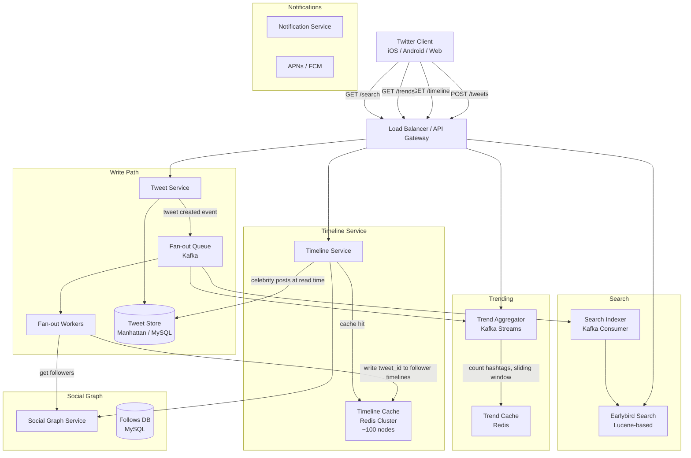

# Design: Social Network Feed (Twitter / X)

## Problem Statement

Build a microblogging platform where users post short text updates (tweets, up to 280 characters), follow other users, and see a real-time feed of tweets from people they follow. The platform must support retweets, replies, quote tweets, likes, trending topics, hashtag search, and full-text tweet search.

---

## Why This System is Interesting

Twitter is similar to Instagram's feed problem but with important differences that make it more interesting:

- **Tweets are tiny**: 280 characters vs photos. This makes caching the full content (not just IDs) in Redis feasible.
- **Home timeline = merge of N feeds**: Your timeline is the union of tweets from everyone you follow, sorted by time. This is a set-union problem at scale.
- **Trending topics**: Counting hashtags across 500M tweets/day in real time requires approximate counting (Count-Min Sketch) and sliding time windows.
- **Real-time search**: Full-text search over 500M tweets/day with sub-second latency.
- **The celebrity problem is more extreme**: Katy Perry has 108 million followers. Every tweet she sends requires 108 million fan-out operations.

Twitter is also interesting because their **actual architecture is well documented** -- they've published blog posts about their Gizzard sharding framework, Finagle RPC, and timeline storage. This case study closely mirrors their real system.

---

## Functional Requirements

1. Post tweets (text, images, videos, polls, up to 280 characters)
2. Follow/unfollow users
3. Home timeline: see tweets from people you follow, reverse chronological order with algorithmic ranking
4. Retweet, quote tweet, reply to tweets
5. Like tweets
6. Trending topics (top hashtags in the last 24 hours, by geography)
7. Full-text tweet search
8. Push notifications (likes, retweets, mentions, new followers)
9. Lists (curated groups of users to follow as a group)

---

## Non-Functional Requirements

| Property | Target |
|----------|--------|
| Timeline load time | < 500ms (pre-computed for most users) |
| Tweet post latency | < 200ms (acknowledgment) |
| Availability | 99.99% |
| Throughput | 500M tweets/day, 150B timeline views/day |
| Search latency | < 1 second for full-text search |
| Trending refresh rate | Every 30 seconds |
| Fanout SLA | Celebrity tweets delivered within 5 seconds |

---

## Capacity Estimation

### Assumptions
- 350 million monthly active users, 200 million daily active users (DAU)
- 500 million tweets/day
- Average tweet size: 300 bytes (text + metadata)
- Average user follows 200 accounts
- 150 billion timeline reads/day
- Average user's timeline cached: 800 tweets

### Tweet throughput
```
500M tweets/day / 86,400 ~= 5,787 tweets/second
Peak (3x): ~17,361 tweets/second
```

### Timeline read throughput
```
150B timeline reads/day / 86,400 ~= 1.74 million reads/second
Peak (5x during events): ~8.7 million reads/second
```

### Storage for tweets
```
500M tweets/day x 300 bytes = 150 GB/day
1 year: 150 GB x 365 = 54.75 TB (very manageable!)

Tweets are small. The entire 10-year tweet corpus is ~200 TB -- fits in a large database cluster.
```

### Timeline cache size
```
200M DAU, each with 800 tweets cached at 300 bytes each:
200M x 800 x 300 bytes = 48 TB of timeline cache in Redis

This is distributed across hundreds of Redis nodes (each holding ~500 GB).
~100 Redis nodes, each with 512 GB RAM, holding 48 TB total.
```

### Fan-out write volume
```
5,787 tweets/second.
Average follower count: 200.
Average fan-out per tweet: 200 writes.
Total fan-out writes: 5,787 x 200 = 1.16 million writes/second.

Exclude celebrities (> 1M followers, ~0.1% of accounts):
Regular user average followers: ~100.
99.9% of tweets x 100 followers = 5,781 x 100 = 578,100 writes/second (manageable).
```

---

## API Design

### Post Tweet
```
POST /v1/tweets
Authorization: Bearer <token>
Content-Type: application/json

Request:
{
  "text": "Hello, world! #firsttweet",
  "reply_to_tweet_id": null,
  "quote_tweet_id": null,
  "media_ids": [],
  "poll": null
}

Response 201 Created:
{
  "tweet_id": "1749234567890123456",
  "text": "Hello, world! #firsttweet",
  "user": {"user_id": "u_123", "username": "john_doe", "verified": false},
  "like_count": 0,
  "retweet_count": 0,
  "reply_count": 0,
  "created_at": "2024-01-15T10:30:00Z"
}
```

### Get Home Timeline
```
GET /v1/timelines/home?cursor=<cursor>&count=20
Authorization: Bearer <token>

Response 200:
{
  "tweets": [
    {
      "tweet_id": "1749234567890123456",
      "text": "Breaking: ...",
      "user": {"username": "nytimes", "verified": true},
      "like_count": 45231,
      "retweet_count": 12043,
      "created_at": "2024-01-15T09:58:00Z",
      "is_liked": false,
      "is_retweeted": false
    }
  ],
  "next_cursor": "eyJzaW5j..."
}
```

### Get Trending Topics
```
GET /v1/trends?location=woeid:23424977&count=10
(WOEID = Where on Earth IDentifier, e.g., 23424977 = USA)

Response 200:
{
  "trends": [
    {"name": "#SuperBowl", "tweet_count": 2100000, "rank": 1},
    {"name": "#Bitcoin", "tweet_count": 850000, "rank": 2},
    {"name": "Taylor Swift", "tweet_count": 720000, "rank": 3}
  ],
  "updated_at": "2024-01-15T10:29:30Z",
  "location": "United States"
}
```

### Search Tweets
```
GET /v1/search/tweets?q=ukraine+war&lang=en&since=2024-01-01&sort=recent&count=20

Response 200:
{
  "tweets": [...],
  "result_count": 150000,
  "next_cursor": "..."
}
```

---

## High-Level Architecture



---

## Core Components Deep Dive

### Tweet Store and IDs

Tweets use **Snowflake IDs**: 64-bit integers with embedded timestamp. This allows:
- Sorting by ID = sorting by time (no separate timestamp index needed)
- Generating IDs without a central coordinator (worker ID is embedded)
- Pagination by ID instead of offset (cursor-based pagination is O(1), not O(n))

```
Snowflake ID structure (64 bits):
  [1 bit: 0] [41 bits: millisecond timestamp] [10 bits: machine ID] [12 bits: sequence]

This generates up to 4,096 unique IDs per millisecond per machine.
```

### Timeline Storage: The Precomputed Timeline

Twitter's home timeline is stored in Redis as a sorted set per user:

```
Key: timeline:{user_id}
Type: Sorted Set
Members: tweet_id (Snowflake IDs, which sort chronologically by value)
Score: tweet_id (or timestamp)
Max size: 800 tweets per user
```

When you open Twitter:
1. Timeline Service reads `ZREVRANGE timeline:{user_id} 0 19` from Redis -- O(log N) -- instant
2. Fetches full tweet content for those 20 tweet IDs from the Tweet Store or Tweet Cache
3. Merges celebrity tweets fetched in real time
4. Returns ranked results

This is called the **timeline fanout** pattern. The write path is expensive (fan-out), but the read path is extremely fast (single Redis lookup).

### Fan-out Workers: Regular vs Celebrity Users

When a tweet is posted, a Kafka event triggers Fan-out Workers.

**For a regular user (< 1M followers)**:
1. Worker queries Social Graph Service: `GET followers of user_id`
2. For each follower, execute: `ZADD timeline:{follower_id} {tweet_id} {tweet_id}`
3. Trim: `ZREMRANGEBYRANK timeline:{follower_id} 0 -801` (keep latest 800)

At 5,787 tweets/second with average 100 followers, this is 578,700 Redis ZADD operations/second. Redis handles ~1 million ops/second per instance. With a cluster of ~100 nodes, each node handles ~5,787 ZADDs/second -- trivially easy.

**For a celebrity user (> 1M followers)**:
Fan-out is disabled. When a user opens their timeline, the Timeline Service:
1. Reads precomputed feed from Redis (regular users only)
2. Checks which celebrities the user follows
3. Fetches latest 20 tweets from each celebrity directly from Tweet Store
4. Merges (time-order interleave) celebrity tweets with precomputed feed
5. Re-ranks the final merged list

The key insight: celebrities have few tweets but many followers. Fetching 5 celebrity tweets at read time is cheap. Fanning out to 100 million followers would be catastrophic.

### Trending Topics: Count-Min Sketch

Trending topics requires counting hashtag occurrences across 500 million tweets/day. The naive approach (count all hashtags in a SQL table) is too slow and too large.

**Sliding Window with Count-Min Sketch**:

A Count-Min Sketch is a probabilistic data structure. It uses multiple hash functions and a matrix of counters to approximate the frequency of any element. It slightly over-counts but never under-counts.

For trending:
- Kafka Streams job processes every tweet in real time
- Extracts hashtags from tweet text
- For each hashtag, updates a Count-Min Sketch with a sliding 1-hour window
- Every 30 seconds, query the sketch for the top-K hashtags (using a min-heap)
- Results cached in Redis, served to clients

Space complexity: O(width x depth) instead of O(unique hashtags). A 10 MB sketch handles billions of counts with < 1% error rate.

Why not exact counting with Redis INCR?
- With 100 million unique hashtags, the memory requirement is prohibitive
- Count-Min Sketch achieves the same result with 1000x less memory
- Trending is inherently approximate anyway -- exact counts are not needed

**Geo-based trending**:
Separate Count-Min Sketches per country/region. Tweets carry a user's declared location (not precise GPS). Group by country code when updating sketches.

### Full-Text Tweet Search: Earlybird

Twitter built a custom search engine called **Earlybird** (based on Lucene). Unlike traditional web search (indexed hours/days after content is created), Earlybird indexes tweets within **15 seconds** of posting.

Architecture:
1. Fan-out Workers also publish tweet events to the Search Indexer Kafka topic
2. Search Indexers consume events and write to Earlybird Lucene shards in real time
3. Earlybird shards are partitioned by time (each shard covers a time window)
4. Recent tweets (last 7 days) are in hot shards (SSD, always in memory)
5. Older tweets are in cold shards (HDD, slower but rarely queried)

Query routing:
- Recent search ("last hour"): query only hot shards -- fast
- Comprehensive search: query all shards, merge results -- slower

---

## Database Design

### Tweet Store (MySQL / Manhattan)

```sql
CREATE TABLE tweets (
    tweet_id     BIGINT UNSIGNED NOT NULL,  -- Snowflake ID
    user_id      BIGINT UNSIGNED NOT NULL,
    text         VARCHAR(560) NOT NULL,     -- 280 chars, Unicode = up to 560 bytes
    reply_to_id  BIGINT UNSIGNED,
    quote_id     BIGINT UNSIGNED,
    media_ids    JSON,
    like_count   BIGINT UNSIGNED DEFAULT 0,
    retweet_count BIGINT UNSIGNED DEFAULT 0,
    reply_count  BIGINT UNSIGNED DEFAULT 0,
    is_deleted   BOOLEAN DEFAULT FALSE,
    created_at   DATETIME NOT NULL,
    
    PRIMARY KEY (tweet_id),
    INDEX idx_user_id_time (user_id, tweet_id DESC)  -- for profile timeline
);
```

Twitter uses MySQL for tweet storage (sharded by `tweet_id`). The tweet table is simple -- no complex relationships, just large volume. 54 TB/year with sharding across hundreds of MySQL instances is straightforward.

Twitter also built **Manhattan**, an internal key-value store optimized for high-throughput tweet reads. Manhattan is used for the authoritative tweet record; MySQL is the backup.

### Timeline Cache (Redis Sorted Sets)

```
Key: timeline:home:{user_id}
Score: tweet_id (Snowflake IDs are monotonically increasing, so they naturally sort by time)
Member: tweet_id

Operations:
  ZADD timeline:home:{user_id} {tweet_id} {tweet_id}   -- fan-out write
  ZREVRANGE timeline:home:{user_id} 0 19               -- read first page
  ZREVRANGEBYSCORE ... LIMIT {cursor} 20               -- cursor-based pagination
  ZCARD timeline:home:{user_id}                        -- count
  ZREMRANGEBYRANK timeline:home:{user_id} 0 -801       -- trim to 800
```

Memory per user: 800 tweets x ~50 bytes (tweet_id as member + score) = 40 KB
Total for 200M DAU: 200M x 40 KB = 8 TB

### Social Graph (MySQL, sharded)

```sql
CREATE TABLE follows (
    follower_id  BIGINT UNSIGNED NOT NULL,
    followee_id  BIGINT UNSIGNED NOT NULL,
    created_at   DATETIME NOT NULL,
    PRIMARY KEY (follower_id, followee_id),
    INDEX idx_followee (followee_id, follower_id)
);
```

With 350M users averaging 200 follows each: 70 billion rows. Sharded across MySQL instances by `follower_id % shard_count`. The reverse lookup (`followers of X`) uses the secondary index.

---

## Scaling Strategy

### Phase 1: Monolith (0 to 100K users)
Single server, MySQL, no Redis. Pull model: timeline is computed on request. Works fine.

### Phase 2: Caching + Read Replicas (100K to 1M users)
Add Redis timeline cache. MySQL read replicas for tweet fetches. Fan-out still synchronous.

### Phase 3: Async Fan-out + Kafka (1M to 10M users)
Move fan-out to async Kafka workers. Tweet post returns immediately; fan-out happens in background.

### Phase 4: Celebrity Threshold + Hybrid Timeline (10M to 100M users)
Introduce celebrity threshold (1M+ followers). Timeline Service merges precomputed + real-time celebrity tweets at read time.

### Phase 5: Search + Trends Infrastructure (100M+ users)
Deploy Earlybird search cluster. Add Count-Min Sketch trend aggregator in Kafka Streams. All other services already horizontally scale.

### Phase 6: Multi-Region (global)
Active-active multi-region. Timeline caches are regional (users read from nearest region). Tweet store is globally replicated with eventual consistency. Writes go to the nearest region.

---

## Key Bottlenecks and Solutions

### Bottleneck 1: Elon Musk Effect (Hot Celebrity Tweets)
**Problem**: @elonmusk tweets with 130M followers. Fan-out would create 130M Redis writes in seconds, causing a thundering herd.
**Solution**: Skip fan-out entirely for anyone with > 1M followers. Inject their tweets at read time. This is Twitter's actual solution.

### Bottleneck 2: Timeline Cache Staleness
**Problem**: If a followed user deletes a tweet, it may still be in your cached timeline.
**Solution**: Soft delete (mark deleted in Tweet Store). Timeline Service filters deleted tweets at render time. The tweet ID remains in Redis but is skipped when fetching tweet content.

### Bottleneck 3: Real-Time Search Indexing Lag
**Problem**: Earlybird must index 5,787 tweets/second in near real-time.
**Solution**: Earlybird uses an in-memory buffer. New tweets go into the in-memory index first (readable within 1 second) and are flushed to disk asynchronously. This is similar to Lucene's NRT (Near Real-Time) search.

### Bottleneck 4: Timeline Fetch for Users Following Many People
**Problem**: Power user following 5,000 accounts. Even with Redis cache, rendering 20 tweets requires 20 tweet fetches. But what about the cache miss on login after a week offline?
**Solution**: On cache miss, "timeline recovery" job rebuilds the cache by fetching the last 800 tweets from each followee (up to 5,000 accounts), merging them, and taking the top 800. This is expensive but rare. Twitter uses a background job to proactively refresh caches for users who are about to come online (predicted from notification clicks).

---

## Trade-offs Made

| Decision | Choice | What We Gave Up |
|----------|--------|----------------|
| Precomputed timelines | Fast read (< 5ms) | Write amplification (fan-out cost) |
| Celebrity pull at read time | No write amplification for celebrities | Slightly higher latency for timelines with many celebrity follows |
| Count-Min Sketch for trends | Small memory, fast | Approximate counts (slight overcounting) |
| Snowflake IDs | Distributed ID generation | IDs leak posting rate (could be a privacy concern) |
| Earlybird in-memory index | Sub-second search indexing | Higher memory cost; data loss risk on crash (mitigated by Kafka replay) |
| 800 tweet timeline limit | Bounded memory per user | Users following many active accounts may miss tweets between sessions |

---

## Real-World: How Twitter/X Does It

- **Timeline storage**: Twitter uses Redis Cluster with ~100 million keys, each holding a sorted set of Snowflake IDs -- essentially the architecture described above. This is documented in their 2013 blog post "The Infrastructure Behind Twitter: Scale."
- **Tweet store**: Twitter built **Manhattan**, an internal distributed key-value store, to replace MySQL for tweet storage. It uses SSTable files similar to LevelDB/RocksDB.
- **Fanout service**: Twitter's fan-out system processes millions of timeline writes per second using a service called **FlockDB** (a sharded MySQL-based graph store) + a Finagle-based fan-out coordinator.
- **Search**: **Earlybird** is Twitter's real-time search engine. It uses a modified version of Apache Lucene. In 2023, after Elon Musk's acquisition, they built features for searching all historical tweets (previously limited to 1 week) -- this required significant Earlybird infrastructure investment.
- **Trending**: Twitter processes trends using a pipeline similar to Kafka Streams + Count-Min Sketch. Trends are localized to 230+ countries and cities using user-declared locations.
- **Scale**: Twitter serves ~**500 million tweets/day** and ~**150 billion timeline requests/day**. The engineering team (post-2022 layoffs) is a fraction of its former size -- a major efficiency story.

---

## Interview Discussion Points

**Q: How is Twitter's feed different from Instagram's?**
Twitter is text-first (280 chars, no required media). Tweets are tiny enough to store the full text in the timeline cache, not just IDs. Instagram stores only image IDs in the feed cache and fetches URLs separately. Twitter's search is also vastly more sophisticated since text is the primary content.

**Q: Why is the timeline limit 800 tweets, not unlimited?**
Memory. With 200M DAU and 800 tweets each at ~50 bytes per tweet_id, that is already 8 TB of Redis data. Storing 8,000 tweets per user would require 80 TB. Beyond 800 tweets, users rarely scroll that far. The tail is served by the Tweet Store (slower but acceptable).

**Q: How does Twitter handle retweets in the fan-out?**
A retweet is stored as a new tweet record with `type = RETWEET` and `original_tweet_id` pointing to the original. It is treated exactly like a regular tweet in the fan-out pipeline -- it gets written to all followers' timeline caches with its Snowflake ID (not the original tweet's ID). When rendering, the Timeline Service fetches both the retweet record and the original tweet content.

**Q: How do trending topics account for bot activity?**
Bot tweets are filtered before the Count-Min Sketch is updated. A separate bot detection service flags suspicious accounts. The trend aggregator ignores tweets from flagged accounts. Additionally, the Count-Min Sketch weights tweets by account age and engagement history (a new account's tweet contributes 0.1x weight, not 1x).

---

## Summary

Twitter's home timeline system is an optimized precomputed cache architecture:

1. **Snowflake IDs** enable distributed ID generation with built-in time ordering
2. **Redis sorted sets** store precomputed timelines for fast O(log N) insertion and O(1) page reads
3. **Hybrid fan-out**: push to regular followers, pull celebrity tweets at read time -- the key innovation
4. **Count-Min Sketch** for trending: probabilistic but memory-efficient real-time aggregation
5. **Earlybird** for real-time search: in-memory Lucene index updated within seconds of posting
6. **Kafka** as the central event bus: fan-out, search indexing, and trend aggregation are all driven by the same tweet event stream

The key lesson: precompute at write time, so reads are instant. Accept the write amplification. For the celebrity edge case, flip the model to compute at read time.
