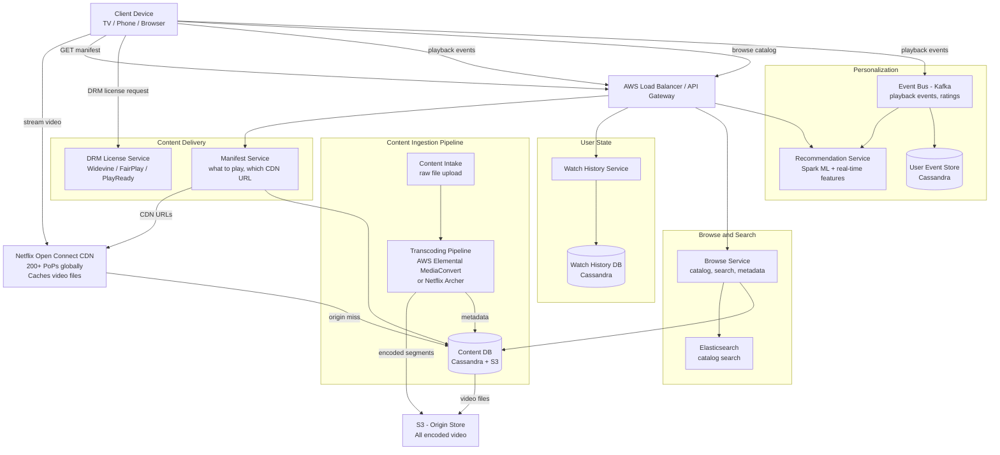

# Design: Video Streaming Platform (Netflix)

## Problem Statement

Build a video streaming platform where users can browse a catalog of movies and TV shows, play them instantly with high-quality adaptive streaming, and receive personalized recommendations. The system must handle 250 million subscribers across 190 countries, streaming simultaneously at peak hours, while ensuring smooth playback on devices ranging from 4K TVs to mobile phones on 3G connections.

---

## Why This System is Interesting

Netflix is one of the most data-intensive systems on the internet. At peak, it accounts for 15% of all global internet traffic. This makes it a gold mine of interesting engineering problems:

- **Video transcoding**: a single movie must be encoded into 100+ format/resolution/device combinations before a single user can watch it
- **CDN at scale**: 90%+ of traffic is video delivery -- caching is not optional, it is the entire strategy
- **Adaptive bitrate streaming**: the client dynamically switches video quality based on network conditions, mid-stream, without the user noticing
- **Content protection**: studios require DRM (Digital Rights Management); you cannot just serve MP4 files
- **Global availability**: content licensing varies by country; the system must enforce geo-restrictions at scale
- **Recommendations**: 80% of what people watch on Netflix comes from recommendations

This system exercises: distributed storage, CDN design, video codec knowledge, client-server protocol design, and large-scale ML pipelines.

---

## Functional Requirements

1. Browse the Netflix catalog (search by title, genre, actor, etc.)
2. Stream movies and TV shows with adaptive quality
3. Resume playback from where you left off (across devices)
4. Download content for offline viewing
5. Multiple profiles per account (different viewing histories, recommendations)
6. Continue watching list, personal watchlist
7. Personalized recommendations
8. Support 4K HDR, HD, SD, and mobile quality levels
9. Subtitles and audio tracks in multiple languages
10. Parental controls per profile

---

## Non-Functional Requirements

| Property | Target |
|----------|--------|
| Stream start time | < 2 seconds (buffering before first frame) |
| Buffering frequency | < 0.5% of total watch time |
| Availability | 99.99% |
| Concurrent streams | 250 million (peak: ~20 million simultaneous) |
| Catalog size | 17,000 titles (Netflix 2024) |
| Average video bitrate | 5 Mbps (varies from 0.5 Mbps mobile to 25 Mbps 4K) |
| CDN cache hit rate | > 95% |
| Global reach | 190 countries, 30+ languages |

---

## Capacity Estimation

### Assumptions
- 250 million subscribers, ~20 million concurrent streams at peak
- Average stream duration: 90 minutes (movie) or 45 minutes (episode)
- Average encoded bitrate across all quality levels: 5 Mbps
- Catalog size: 17,000 titles, average duration 90 minutes
- New content added: 500 titles/month

### Bandwidth at peak
```
20 million concurrent streams x 5 Mbps = 100 Tbps total outbound bandwidth

For context: the entire internet's traffic in 2010 was ~40 Tbps.
Netflix alone at peak represents ~100 Tbps of egress traffic.
```

### Storage for encoded video
```
One 90-minute movie in all resolutions/formats:
  - 4K HDR: ~50 GB
  - 1080p: ~15 GB
  - 720p: ~6 GB
  - 480p: ~3 GB
  - 360p: ~1.5 GB
  - Mobile (various codecs: H.264, H.265, AV1): 3 variants each resolution
  
Total per movie: ~200 GB (100+ encoding variants)

Full catalog: 17,000 titles x 200 GB = 3.4 PB for all encoded video
Plus originals, series (multiple episodes): realistic total ~50-100 PB
```

### New content ingestion
```
500 titles/month.
Average raw master file: 1 TB per movie (uncompressed or lightly compressed).
Total raw ingestion: 500 TB/month.
Encoding pipeline output: 500 titles x 200 GB = 100 TB/month of encoded content.
```

### CDN caching effectiveness
```
17,000 titles, but 20% of titles account for 80% of watch time (Pareto principle).
3,400 "hot" titles x 200 GB = 680 TB of popular content.

A CDN edge node with 1 PB of storage can cache all popular content.
Cache hit rate for popular content: ~98%.
```

---

## API Design

### Browse Catalog
```
GET /v1/catalog?genre=drama&page=1&limit=20
Authorization: Bearer <token>

Response 200:
{
  "items": [
    {
      "content_id": "nm_12345",
      "title": "The Crown",
      "type": "SERIES",
      "genres": ["Drama", "Historical"],
      "year": 2016,
      "rating": "TV-MA",
      "thumbnail_url": "https://cdn.netflix.com/images/nm_12345/thumb.jpg",
      "match_score": 98,     // personalization: % match for this user
      "seasons": 6,
      "episodes": 60
    }
  ],
  "next_page": 2,
  "total": 847
}
```

### Get Streaming Manifest
```
GET /v1/content/{content_id}/manifest
Authorization: Bearer <token>
X-Device-Type: SMART_TV
X-Capabilities: [HDR, HEVC, ATMOS]

Response 200:
{
  "content_id": "nm_12345",
  "episode_id": "ep_789",
  "manifest_url": "https://cdn.netflix.com/manifests/nm_12345/ep_789.mpd",
  "license_url": "https://license.netflix.com/widevine",
  "resume_position_ms": 4521000,  // resume from 75 min 21 sec
  "audio_tracks": [
    {"id": "en", "language": "English", "codec": "AAC", "channels": "5.1"},
    {"id": "es", "language": "Spanish", "codec": "AAC", "channels": "2.0"}
  ],
  "subtitle_tracks": [
    {"id": "en", "language": "English"},
    {"id": "zh", "language": "Chinese (Traditional)"}
  ],
  "bitrate_variants": [
    {"id": "v1", "resolution": "3840x2160", "bitrate_kbps": 16000, "codec": "HEVC", "hdr": true},
    {"id": "v2", "resolution": "1920x1080", "bitrate_kbps": 8000, "codec": "HEVC"},
    {"id": "v3", "resolution": "1280x720", "bitrate_kbps": 4000, "codec": "H264"},
    {"id": "v4", "resolution": "640x480", "bitrate_kbps": 1500, "codec": "H264"}
  ]
}
```

### Report Playback Events
```
POST /v1/playback/events
Authorization: Bearer <token>
Content-Type: application/json

Request:
{
  "content_id": "nm_12345",
  "episode_id": "ep_789",
  "session_id": "sess_abc123",
  "events": [
    {"type": "PLAY", "position_ms": 0, "timestamp": 1705315800000},
    {"type": "QUALITY_CHANGE", "from_variant": "v3", "to_variant": "v2", "position_ms": 120000},
    {"type": "BUFFER", "duration_ms": 2300, "position_ms": 240000},
    {"type": "PAUSE", "position_ms": 1800000},
    {"type": "RESUME", "position_ms": 1800000}
  ]
}

Response 204 No Content
```

### Update Watch Position
```
PUT /v1/profiles/{profile_id}/watch-history/{content_id}
Authorization: Bearer <token>

Request:
{
  "episode_id": "ep_789",
  "position_ms": 4521000,
  "completed": false
}

Response 204 No Content
```

---

## High-Level Architecture



---

## Core Components Deep Dive

### Video Transcoding Pipeline

When Netflix receives a raw master file (a 1-4 TB ProRes file from a production studio), it goes through an extensive encoding pipeline before a single subscriber can watch it.

**Step 1: Content Validation**
Check the file for corruption, validate audio/video sync, detect black frames, and confirm it matches the expected runtime.

**Step 2: Shot Boundary Detection**
Divide the video into "scenes" by detecting shot boundaries. This is important for the next step.

**Step 3: Per-Scene Encoding Optimization**
Traditional encoding uses one pass with fixed bitrate. Netflix uses per-shot optimal encoding: an action scene with fast movement needs a higher bitrate than a static dialogue scene. By encoding each scene independently at its optimal quality, Netflix achieves the same subjective quality at ~20% lower bitrate than fixed-rate encoding.

**Step 4: Multi-Resolution, Multi-Codec Encoding**
For each title, Netflix produces:
- Multiple resolutions: 240p, 360p, 480p, 720p, 1080p, 1440p, 2160p (4K)
- Multiple codecs: H.264 (most compatible), H.265/HEVC (50% smaller files), AV1 (royalty-free, 30% smaller than HEVC)
- Multiple bitrate tiers within each resolution (for ABR switching)
- HDR variants (HDR10, Dolby Vision, HLG) where available

Total number of encoding jobs per title: 100-120 variants.

**Step 5: Segmentation**
Each encoded video is split into 2-second segments (chunks). MPEG-DASH manifest lists all segment URLs. The client downloads segments one by one, switching quality tiers between segments based on measured bandwidth.

**Step 6: Packaging and DRM Encryption**
Each segment is encrypted using AES-128 (Common Encryption). DRM keys are managed by the License Server. The encrypted segments are what get stored on CDN nodes -- even CDN operators cannot watch the content without the license key.

### Adaptive Bitrate Streaming (ABR)

ABR is the secret to Netflix's smooth playback. Here is how it works:

1. Client fetches the MPEG-DASH manifest, which lists all available quality variants and segment URLs
2. Client downloads the first segment at a conservative quality (e.g., 720p)
3. While downloading each segment, the client measures actual throughput
4. An ABR algorithm (Netflix uses a custom algorithm called "Netflix ABR" based on MPC -- Model Predictive Control) decides the quality for the next segment:
   - If throughput is high and buffer is full: upgrade quality
   - If throughput drops or buffer is low: downgrade quality
   - The goal: never let the buffer empty (causes buffering) while maximizing quality
5. Quality switches are seamless -- each 2-second segment is independent

Netflix's ABR algorithm is more sophisticated than simple throughput matching. It models:
- Current buffer level (seconds of video buffered ahead)
- Measured throughput trend (not just instantaneous)
- Download rate variability (jitter)
- Predicted future throughput using network state

This is why Netflix rarely buffers even on congested networks, while competitors at similar bitrates have worse buffering rates.

### Netflix Open Connect CDN

Netflix does not use AWS CloudFront or Akamai for video delivery (though they use Akamai for non-video traffic). They built their own CDN called **Open Connect**.

**Open Connect Appliances (OCAs)**: Netflix ships purpose-built servers to ISPs (internet service providers) and installs them in the ISPs' data centers, for free. These servers contain:
- 100-200 TB of SSD/HDD storage
- 100 Gbps network interfaces
- Netflix-proprietary software for cache management

At peak hours (evenings in each timezone), an ISP like Comcast or Verizon serves Netflix traffic from servers literally inside their own network. The video bytes never leave the ISP's network. This reduces Netflix's AWS bandwidth bills and dramatically reduces latency (a CDN node 1 hop away vs. crossing the internet).

**Cache Population Strategy**:
Netflix uses predictive pre-loading. During off-peak hours (2am-8am local time), Netflix pushes newly popular content to nearby OCA nodes before users request it. Prediction is based on:
- New releases scheduled for that day
- Current trending content in that region
- Historical consumption patterns (Tuesday night drama peaks, etc.)

This proactive caching achieves a 95%+ cache hit rate for the most popular content.

### DRM (Digital Rights Management)

Studios will not license content without DRM protection. Netflix supports:
- **Widevine** (Google): used on Android, Chrome, Edge, Firefox
- **FairPlay** (Apple): used on iOS, macOS Safari, tvOS
- **PlayReady** (Microsoft): used on Windows, Xbox

All three use the same underlying principle:
1. Video segments are encrypted before leaving Netflix's systems
2. The encryption key is stored on Netflix's License Server
3. When a user starts playing, the client sends a license request to the License Server
4. The License Server verifies the user's subscription and device, then returns the key (encrypted with the device's hardware key)
5. The key is stored in a hardware secure enclave on the device -- never accessible to software
6. Segments are decrypted in a Trusted Execution Environment (TEE) before rendering

This is why Netflix cannot be screen-recorded on iOS in high quality -- the decryption happens in hardware.

### Recommendations System (Brief Overview)

80% of what people watch on Netflix comes from recommendations. Netflix uses a multi-stage pipeline:

**Stage 1: Candidate Generation**
- Collaborative filtering: "Users similar to you watched X"
- Content-based filtering: "You liked Y; here is similar content Z"
- Real-time signals: what you watched in the last 10 minutes

**Stage 2: Ranking**
A neural network ranks the ~500 candidates produced in Stage 1. Features:
- Your watch history (recency-weighted)
- Time of day (comedies vs. dramas peak at different times)
- Device type (mobile users tend to watch shorter content)
- Row context (a movie in "Action Thrillers" row ranks differently than the same movie in "Because You Watched X" row)

**Stage 3: Row Assembly**
The Netflix homepage is not a list of movies -- it is rows with labels ("Trending Now", "Because You Watched Squid Game", etc.). Rows themselves are ranked by predicted engagement.

Netflix A/B tests everything: thumbnail images, row order, even the order of movies within rows. The thumbnails you see for the same movie may be different from what your partner sees -- Netflix serves personalized thumbnails.

---

## Database Design

### Content Metadata (MySQL + Cassandra)

```sql
-- MySQL: structured catalog metadata (relational)
CREATE TABLE titles (
    title_id     VARCHAR(20) PRIMARY KEY,    -- "nm_12345"
    type         ENUM('MOVIE', 'SERIES', 'SHORT', 'DOCUMENTARY'),
    title_str    VARCHAR(500) NOT NULL,
    year         SMALLINT,
    runtime_min  SMALLINT,
    maturity_rating VARCHAR(10),
    studio_id    INT REFERENCES studios(studio_id),
    synopsis     TEXT,
    created_at   DATETIME
);

CREATE TABLE episodes (
    episode_id   VARCHAR(20) PRIMARY KEY,
    title_id     VARCHAR(20) REFERENCES titles(title_id),
    season_num   SMALLINT,
    episode_num  SMALLINT,
    runtime_min  SMALLINT,
    title_str    VARCHAR(500)
);
```

```
-- Cassandra: video asset metadata (high-volume reads/writes)
Table: video_assets

  title_id     TEXT
  episode_id   TEXT
  variant_id   TEXT    -- e.g., "1080p_hevc_hdr"
  resolution   TEXT
  codec        TEXT
  bitrate_kbps INT
  s3_path      TEXT    -- s3://netflix-video-us-east/nm_12345/ep_789/1080p_hevc/
  duration_ms  BIGINT
  segment_count INT
  is_active    BOOLEAN

PRIMARY KEY (title_id, episode_id, variant_id)
```

### Watch History (Cassandra)

```
Table: watch_history

  profile_id    TEXT
  title_id      TEXT
  episode_id    TEXT
  position_ms   BIGINT
  completed     BOOLEAN
  last_watched  TIMESTAMP
  device_type   TEXT

PRIMARY KEY (profile_id, last_watched, title_id)
WITH CLUSTERING ORDER BY (last_watched DESC)
```

Watch history is the most read table in Netflix's infrastructure. Every browse page load reads your watch history (to show "Continue Watching" and to exclude already-watched content from recommendations). Cassandra's fast point reads and time-ordered clustering make it ideal.

---

## Scaling Strategy

### Phase 1: Single Region, S3 + EC2 (0 to 1M subscribers)
Stream video directly from S3. Use CloudFront CDN. Single MySQL for metadata. Works for initial scale.

### Phase 2: CDN Offload (1M to 10M subscribers)
Traffic grows. AWS data transfer costs skyrocket. Introduce Akamai or CloudFront distribution. Cache top 1,000 titles at CDN edge. 90% cache hit rate cuts S3 egress costs by 10x.

### Phase 3: Open Connect Deployment (10M to 100M subscribers)
Deploy Open Connect Appliances to the 100 largest ISPs globally. Popular content is served from inside the ISP -- no internet transit costs. Cache hit rate improves to 95%+.

### Phase 4: Per-Region Encoding Optimization (100M+ subscribers)
Encode AV1 versions of all content (30% smaller than HEVC). Every PB saved = significant cost reduction at this scale. Custom encoding chips (Netflix has prototyped ASIC-based encoding for AV1).

### Phase 5: Federated Microservices (Current)
Netflix runs hundreds of microservices on AWS (ECS/EKS). Each service owns its database. Services communicate via Hystrix-wrapped REST calls (circuit breaking). The chaos engineering team (Chaos Monkey) proactively kills random services to test resilience.

---

## Key Bottlenecks and Solutions

### Bottleneck 1: Transcoding Latency for New Releases
**Problem**: A new season of a popular show drops at midnight. 10 million users try to watch immediately. Transcoding 8 episodes x 120 variants = 960 encoding jobs must complete before launch.
**Solution**: Encoding is done days in advance (not at upload time). For a scheduled release, the pipeline has a hard deadline: all variants must be ready 24 hours before release. Emergency encoding queues are reserved for time-sensitive content.

### Bottleneck 2: CDN Cache Misses for Long-Tail Content
**Problem**: A user wants to watch an obscure 1970s Italian film that no CDN node has cached.
**Solution**: OCA nodes use a tiered caching strategy. Tier 1 (high-storage nodes at major ISPs): caches top 20% of catalog. Tier 2 (regional origin clusters): caches top 80% of catalog. For the remaining 20%, stream directly from S3 origin. Long-tail content is only 5% of watch time but 20% of catalog -- acceptable S3 hit rate.

### Bottleneck 3: License Server Load During Popular Releases
**Problem**: Millions of users start streaming simultaneously at midnight for a new release. Each start requires a DRM license request.
**Solution**: License responses are cacheable (with a TTL of 4-8 hours). On first play, the license is fetched and stored locally. Resuming the same stream does not require a new license. Rate limiting and geographic load balancing prevent license server overload.

### Bottleneck 4: Recommendation Freshness
**Problem**: A user watches 3 episodes of a new show. The recommendation engine should update immediately.
**Solution**: Two-tier recommendation: real-time (last 10 minutes of activity, served from a streaming computation layer) + batch (weekly retrain of the ranking model). The real-time layer uses Kafka + Flink to update a "recent signals" feature store within seconds.

---

## Trade-offs Made

| Decision | Choice | What We Gave Up |
|----------|--------|----------------|
| Own CDN (Open Connect) | Lower cost, lower latency | Years of investment to build; ISP relationships to manage |
| AV1 codec | 30% bandwidth savings | Higher encoding cost (5-10x more CPU than H.264) |
| 2-second segments | Fine-grained ABR switching | More manifest fetches; higher overhead for short segments |
| Predictive CDN pre-loading | High cache hit rates | Wasted storage for content that is pre-loaded but not watched |
| DRM | Studio licensing | Cannot serve content without hardware-supported DRM on devices |
| Per-shot encoding | Better quality at lower bitrate | Complex encoding pipeline; harder to debug |

---

## Real-World: How Netflix Does It

- Netflix accounts for roughly **15% of all global internet traffic** at peak (2023)
- They serve video from **1,000+ OCA nodes** deployed at ISPs worldwide -- some ISPs have 10+ OCA nodes
- Netflix uses **AWS exclusively** for compute and non-video storage; they intentionally have no private data centers
- The **Chaos Engineering** discipline was invented at Netflix (Chaos Monkey, Simian Army) -- they run chaos experiments in production
- Netflix has migrated most content to **AV1** codec -- saves roughly $1 billion/year in CDN costs compared to H.264
- The **recommendation system** drives ~80% of content consumption and is credited with saving Netflix $1 billion/year in customer retention
- Netflix A/B tests everything, including which **thumbnail image** you see for each title -- different users see different thumbnails for the same movie
- **"Chaos Kong"** tests: Netflix regularly kills an entire AWS region to verify multi-region failover works

---

## Interview Discussion Points

**Q: Why not just use YouTube's infrastructure or Akamai for video delivery?**
At Netflix's scale, the economics change. Paying Akamai or AWS CloudFront for 100 Tbps of video delivery would cost hundreds of millions of dollars annually. Building Open Connect required years of investment but now delivers content at a fraction of the cost. Plus, Netflix can optimize the CDN specifically for long-form video (not web traffic), e.g., pre-loading entire episodes during low-traffic hours.

**Q: How does Netflix handle simultaneous streams on one account?**
The plan limits concurrent streams (1-4 depending on tier). The License Server enforces this: when issuing a DRM license, it checks the number of active sessions in the last 5 minutes. If the limit is reached, it rejects the request. Sessions are tracked in a fast key-value store (Memcached) with 5-minute TTL.

**Q: How do you handle a video that is removed (licensing expired) but is in users' offline downloads?**
DRM licenses have an expiry time. When a user downloads content, the license has a TTL matching the download window (typically 30 days). When the license expires, the app can no longer decrypt the segments. There is no need to delete files from the device -- they are unplayable without the key. The License Server simply stops renewing the license for content that has been removed from the catalog.

**Q: How do you design for a 10x traffic spike (e.g., final episode of a huge show)?**
- CDN absorbs almost all video traffic regardless of origin server load (CDN is pre-warmed)
- Microservices auto-scale on AWS (ECS Fargate, with pre-provisioned capacity)
- Circuit breakers (Hystrix) shed non-critical traffic (recommendations, social features) to protect core playback
- Load shedding: if recommendation service is slow, return empty recommendations rather than delaying the page
- Netflix's SRE team has runbooks for every major release -- capacity is manually pre-provisioned in advance

---

## Summary

Netflix is a CDN + transcoding + recommendations system. The key architectural decisions are:

1. **Video transcoding pipeline**: encode every title into 100+ variants (resolution, codec, bitrate, HDR) using per-shot optimized encoding
2. **MPEG-DASH ABR**: segment videos into 2-second chunks; clients switch quality tiers mid-stream based on bandwidth
3. **Open Connect CDN**: deploy custom CDN appliances inside ISPs to eliminate internet transit costs and reduce latency
4. **Predictive pre-loading**: populate CDN nodes during off-peak hours based on predicted demand
5. **DRM**: encrypt all segments before storage; issue time-limited licenses per device per session
6. **Recommendations**: two-tier system (real-time Kafka/Flink + batch Spark ML) drives 80% of content discovery
7. **Microservices on AWS**: hundreds of independent services with circuit breakers and chaos engineering for resilience

The paramount lesson from Netflix: **video delivery is a CDN problem, not a server problem**. Once the encoding pipeline and CDN strategy are correct, every other component is a standard distributed system challenge.
