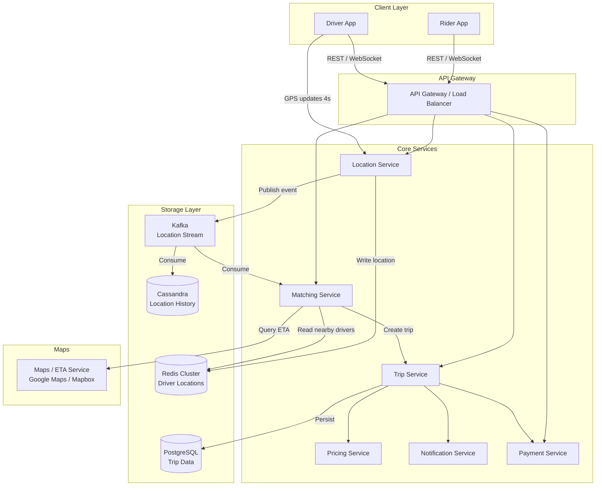

# Design: Uber (Ride Sharing)

## Problem Statement

Build a ride-sharing platform where riders can request trips, nearby drivers are matched in real-time, fares are calculated dynamically, and the entire trip lifecycle is tracked from request to payment. The system must handle millions of concurrent drivers broadcasting GPS coordinates every few seconds while simultaneously serving millions of ride requests.

## Why This System is Interesting

Uber is a masterclass in real-time geospatial engineering. The core tension is that location data is inherently transient (a driver's position 4 seconds ago is stale), but matching requires low-latency reads of that same data. Naive approaches — like querying a relational database with `ST_Distance` on every request — collapse at scale. The system also requires a distributed state machine across multiple services, where a trip transitions through well-defined states and any inconsistency (e.g., two riders matched to the same driver) is catastrophic.

## Functional Requirements

- Riders can request a trip from their current location to a destination
- System finds and matches the nearest available driver within acceptable time
- Real-time location tracking for both driver and rider during a trip
- Dynamic (surge) pricing based on supply and demand in an area
- ETA calculation before and during the trip
- In-app payment processing on trip completion
- Trip history and receipts for both riders and drivers
- Driver goes online/offline; availability is tracked

## Non-Functional Requirements

- Driver location updates ingested within 1 second of GPS broadcast
- Driver matching completed within 5 seconds of ride request
- 99.99% uptime for matching and trip services
- Location data eventually consistent is acceptable; trip state must be strongly consistent
- System scales to 5M concurrent active drivers globally
- Horizontal scalability — no single point of failure in core path

## Capacity Estimation

**Scale inputs:**
- 25M trips/day
- 5M active drivers globally
- Each driver sends GPS update every 4 seconds

**Location update throughput:**
```
5,000,000 drivers / 4 seconds = 1,250,000 location updates/second (1.25M/sec)
```

**Ride requests:**
```
25M trips/day / 86,400 seconds = ~290 requests/second average
Peak (10x) = ~2,900 requests/second
```

**Storage for location data:**
```
Per update: driver_id (8B) + lat (8B) + lng (8B) + timestamp (8B) = 32 bytes
1.25M updates/sec × 32B = 40 MB/sec
Only latest location per driver needed: 5M × 32B = 160 MB in memory (fits in Redis)
```

**Trip data storage:**
```
25M trips/day × 365 = ~9B trips/year
Per trip record ~1 KB = 9 TB/year (manageable with columnar storage)
```

**ETA/Map lookups:**
```
~2,900 ride requests/sec × multiple map queries = ~15,000 map API calls/second
```

## API Design

**Rider APIs:**

```
POST /v1/rides
Request:  { rider_id, pickup: {lat, lng}, dropoff: {lat, lng}, ride_type }
Response: { ride_id, estimated_fare, eta_seconds, surge_multiplier, status: "searching" }

GET /v1/rides/{ride_id}
Response: { ride_id, status, driver: {id, name, rating, location, eta}, fare }

DELETE /v1/rides/{ride_id}
Response: { status: "cancelled", cancellation_fee }
```

**Driver APIs:**

```
POST /v1/drivers/{driver_id}/location
Request:  { lat, lng, heading, speed, timestamp }
Response: { status: "ok" }

PUT /v1/drivers/{driver_id}/availability
Request:  { status: "available" | "offline" | "on_trip" }
Response: { status, surge_zones: [{polygon, multiplier}] }

POST /v1/rides/{ride_id}/accept
Response: { pickup: {lat, lng}, rider_name, contact }

POST /v1/rides/{ride_id}/complete
Request:  { final_distance_km, final_duration_sec }
Response: { fare_breakdown, payment_status }
```

## High-Level Architecture



## Core Components Deep Dive

### Location Service and Geospatial Indexing

The Location Service receives 1.25M GPS updates per second. Writing each to a relational database is impossible. Instead, driver locations are stored in **Redis** using geospatial data structures.

Redis `GEOADD` stores coordinates as a sorted set using a **Geohash** encoding. Finding nearby drivers becomes:

```
GEOSEARCH drivers:available FROMLONLAT <lng> <lat> BYRADIUS 5 km ASC COUNT 20
```

This executes in O(N+log(M)) where N is results and M is total set size — milliseconds for millions of drivers.

**Why not a Quadtree?** A quadtree is excellent for static datasets but requires expensive re-balancing as drivers move. Redis geospatial handles dynamic updates natively and the sorted-set implementation is battle-tested at scale. Uber actually uses **S2 geometry** (Google's spherical geometry library) for more precise cell-based indexing — S2 divides the sphere into hierarchical cells, enabling efficient range queries without the distortion of flat projections near the poles.

**S2 Cell approach:** Each driver is indexed in S2 cells at multiple levels (coarse to fine). A ride request queries cells at a radius-appropriate level, retrieving all driver IDs, then sorts by actual distance. The geospatial index lives entirely in RAM.

### Matching Algorithm

1. Rider submits request with pickup coordinates
2. Matching Service queries Redis/S2 for available drivers within 5 km radius
3. For each candidate driver (top 10–20), fetch ETA from Maps Service
4. Rank by: ETA (primary) + driver rating + acceptance rate
5. Send push notification to top candidate — wait 10 seconds for acceptance
6. If declined/timeout, move to next candidate
7. Once accepted, atomically transition driver to "on_trip" in Redis

Atomicity is critical: two simultaneous ride requests must not both claim the same driver. This is handled with a Redis `SET driver:{id}:lock NX EX 30` pattern — only one request wins the lock.

### Trip State Machine

```
REQUESTED → DRIVER_FOUND → ACCEPTED → DRIVER_ARRIVING → IN_RIDE → COMPLETED
                                                                  ↘ CANCELLED
```

Each transition is persisted to PostgreSQL with a timestamp. The Trip Service enforces valid transitions — it rejects requests to move backwards or skip states. This state is the source of truth; location updates from the driver are supplementary.

### Surge Pricing

The Pricing Service divides cities into H3 hexagonal grid cells (Uber's actual approach). Every 5 minutes, a background job:

1. Counts active ride requests per H3 cell
2. Counts available drivers per H3 cell
3. Computes demand/supply ratio
4. If ratio > threshold, applies surge multiplier (1.2x, 1.5x, 2x, etc.)
5. Publishes surge map to Redis for low-latency reads

Riders see the surge multiplier before confirming. Drivers see surge zones on their map, which incentivizes them to move into high-demand areas.

## Database Design

### Trip Table (PostgreSQL)

```sql
CREATE TABLE trips (
    trip_id         UUID PRIMARY KEY DEFAULT gen_random_uuid(),
    rider_id        UUID NOT NULL,
    driver_id       UUID,
    status          VARCHAR(20) NOT NULL DEFAULT 'requested',
    pickup_lat      DECIMAL(10, 7) NOT NULL,
    pickup_lng      DECIMAL(10, 7) NOT NULL,
    dropoff_lat     DECIMAL(10, 7),
    dropoff_lng     DECIMAL(10, 7),
    surge_multiplier DECIMAL(4, 2) DEFAULT 1.0,
    estimated_fare  DECIMAL(10, 2),
    final_fare      DECIMAL(10, 2),
    distance_km     DECIMAL(8, 3),
    duration_sec    INTEGER,
    requested_at    TIMESTAMPTZ NOT NULL DEFAULT NOW(),
    accepted_at     TIMESTAMPTZ,
    started_at      TIMESTAMPTZ,
    completed_at    TIMESTAMPTZ,
    INDEX idx_rider_id (rider_id),
    INDEX idx_driver_id (driver_id),
    INDEX idx_status_requested (status, requested_at)
);
```

### Driver Table (PostgreSQL)

```sql
CREATE TABLE drivers (
    driver_id       UUID PRIMARY KEY,
    name            VARCHAR(100) NOT NULL,
    phone           VARCHAR(20) UNIQUE NOT NULL,
    rating          DECIMAL(3, 2) DEFAULT 5.0,
    total_trips     INTEGER DEFAULT 0,
    vehicle_type    VARCHAR(20),
    license_plate   VARCHAR(20),
    is_verified     BOOLEAN DEFAULT FALSE,
    created_at      TIMESTAMPTZ DEFAULT NOW()
);
```

### Location History (Cassandra — time-series)

```
CREATE TABLE location_history (
    driver_id   UUID,
    recorded_at TIMESTAMP,
    lat         DOUBLE,
    lng         DOUBLE,
    speed       FLOAT,
    heading     SMALLINT,
    trip_id     UUID,
    PRIMARY KEY ((driver_id), recorded_at)
) WITH CLUSTERING ORDER BY (recorded_at DESC)
  AND default_time_to_live = 604800;  -- 7 days retention
```

Cassandra's partition-by-driver, cluster-by-time model enables efficient retrieval of a driver's path for a given trip, useful for dispute resolution and analytics.

**Why this database mix?**
- **Redis**: Sub-millisecond geospatial queries for matching; purely in-memory current state
- **PostgreSQL**: ACID transactions for financial trip records; strong consistency for state machine
- **Cassandra**: High-write-throughput for append-only location history; time-series access pattern is a natural fit

## Scaling Strategy

**Location Service** scales horizontally. GPS updates are partitioned by geographic region — drivers in the US East region write to a dedicated Location Service cluster. Redis is sharded by region with replication for read scaling.

**Matching Service** is stateless and horizontally scaled. Each instance queries the regional Redis cluster and Maps API. A request queue (Kafka) buffers spikes — if matching takes longer than 5 seconds, the request is retried rather than dropped.

**Trip Service** uses PostgreSQL with read replicas for trip history queries. Writes (state transitions) go to the primary. Connection pooling via PgBouncer prevents connection exhaustion under load.

**Global consistency** is not required — a driver in London is never matched with a rider in Tokyo. The system is partitioned by city/region, which naturally limits the blast radius of any failure.

## Key Bottlenecks and Solutions

| Bottleneck | Root Cause | Solution |
|---|---|---|
| Location write throughput | 1.25M writes/sec to Redis | Redis cluster with regional sharding; batch updates per region |
| Matching latency | N Maps API calls per request | Cache ETA estimates; pre-compute ETAs for top-100 nearest drivers |
| Double-booking | Race condition in driver acceptance | Redis atomic lock (SET NX) before assignment |
| Surge price staleness | Batch job every 5 minutes | Event-driven: recompute cell surge on each request/completion event |
| Payment failures | Network issues with payment provider | Async payment with retry queue; optimistic trip completion, reconcile later |

## Trade-offs Made

**Eventually consistent location vs. strong consistency:** Driver locations in Redis may be up to 4 seconds stale. This is acceptable — a driver 200m away who moved slightly is still the right match. Requiring strong consistency would require a distributed lock on every GPS update, throttling throughput by 100x.

**Pre-computed ETA vs. live ETA:** Fetching live ETA from Google Maps for every candidate driver on every ride request would cost millions of API calls per day. The system pre-computes ETAs for the nearest N drivers and caches them for 30 seconds, accepting slight inaccuracy for dramatically lower cost and latency.

**City-level partitioning vs. global matching:** Matching only within a city/region simplifies the architecture enormously but means a driver just across a city boundary won't be matched. This is acceptable given ride-sharing is inherently local.

## Real-World: How Uber Does It

Uber built **Schemaless** — a custom sharded MySQL system — for trip storage, later migrating to a Docstore backed by CockroachDB for global consistency. Their geospatial system evolved from a PostGIS-backed service to **H3** hexagonal indexing for surge pricing, and **S2 geometry** for driver matching. The dispatch system (DISCO) runs on a microservice architecture with dedicated matching pools per city. Uber's **RING** system handles driver supply forecasting, predicting where to pre-position drivers before demand spikes. At peak, Uber's systems handle over 40 million data points per second across their data pipeline.

## Interview Discussion Points

- **Why not use PostGIS for driver matching?** PostGIS spatial indexes (R-tree) are excellent but live in disk-backed storage. At 1.25M updates/sec, you need in-memory geospatial — Redis geospatial or S2 cell indexes fit perfectly.
- **How do you prevent two riders from getting the same driver?** Redis `SET driver:{id}:lock NX EX 30` — atomic single-command lock. Only the first requester wins.
- **How does surge pricing prevent gouging?** Cap multipliers at a legal maximum per region; require explicit rider confirmation; send SMS/email notice when surge is active.
- **What happens if the Matching Service crashes mid-match?** The ride request remains in `REQUESTED` state in PostgreSQL. A recovery job scans for stale `REQUESTED` trips and re-queues them.
- **How do you handle a driver going offline during a trip?** The Trip Service detects no GPS updates for 60 seconds → marks driver as `UNREACHABLE` → notifies rider → if unresolved, auto-completes trip at last known location.

## Summary

Uber's architecture is driven by the real-time geospatial matching problem. The key insight is that current driver locations are ephemeral and must live in memory (Redis/S2), while trip data is transactional and must be durable (PostgreSQL). The matching pipeline is a sequence of: geospatial query → ETA ranking → atomic lock → state transition. Surge pricing is a batch computation over H3 grid cells. The system is region-partitioned by design, which provides natural failure isolation and latency optimization. Every component is horizontally scalable, and the state machine pattern for trips ensures correctness even under partial failures.
