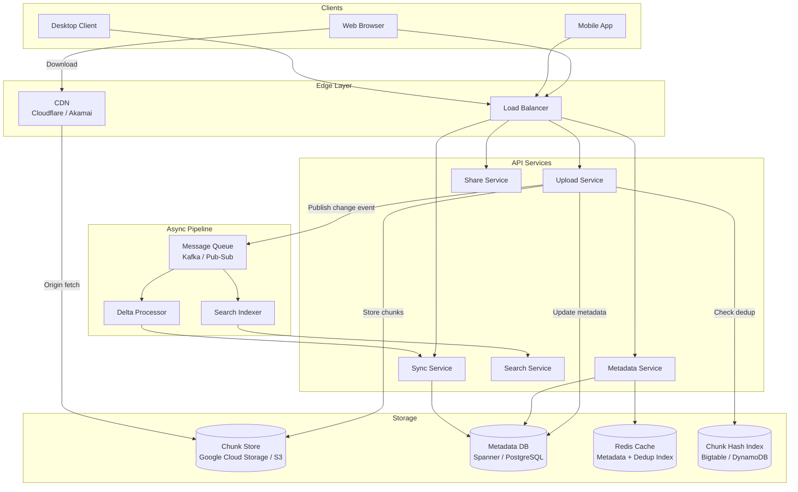

# Design: Google Drive (File Storage and Sync)

## Problem Statement

Build a cloud file storage system where users can upload, download, organize, and share files from any device. Changes made on one device must sync to all other devices automatically. The system must handle files of any size, support concurrent edits, and store data reliably for billions of users without duplicating identical files.

## Why This System is Interesting

Google Drive appears simple on the surface — upload a file, download it later — but the engineering challenges compound quickly at scale. The naive approach (upload whole files every time) wastes bandwidth and collapses under 1B users. Delta sync, content deduplication, and chunk-based uploads all interact with each other. Conflict resolution when two devices edit the same file simultaneously reveals deep questions about what "correctness" even means for a filesystem. This system also neatly demonstrates how to separate metadata storage from blob storage.

## Functional Requirements

- Users can upload files of any type and size (up to 5 TB per file)
- Files sync automatically across all user devices
- Users can share files/folders with other users (view or edit permissions)
- Versioning — users can see and restore previous versions
- Folders and hierarchical organization
- Search across file names and content
- Resumable uploads — large file upload can pause and resume
- Deduplication — identical files stored only once

## Non-Functional Requirements

- Durability: 99.999999999% (11 nines) — no file loss
- Availability: 99.9% uptime for read operations
- Consistency: Eventual consistency for sync across devices is acceptable; metadata operations (share, delete) should be strongly consistent
- Bandwidth efficiency: Only transmit changed blocks, not entire files
- Latency: Metadata operations < 200ms; upload throughput maximized for large files
- Scale: 1B users, average 15 GB free storage each

## Capacity Estimation

**Storage:**
```
1B users × 15 GB average used = 15 exabytes total
With 3x replication: 45 exabytes raw storage
Deduplication typically reduces this by 30-50% in practice
```

**Daily upload volume:**
```
Assume 0.1% of users upload per day = 1M users
Average file size = 5 MB
1M × 5 MB = 5 TB/day of new data
```

**Upload/download throughput:**
```
Peak: assume 10M concurrent uploads
At 1 Mbps average: 10 Tbps aggregate upload bandwidth
```

**Metadata operations:**
```
10M file operations/sec (open, rename, share, list directory)
Metadata per file: ~1 KB
10M files/day new × 365 = 3.65B new files/year
```

**Chunk storage:**
```
Standard chunk size: 4 MB
5 TB/day / 4 MB = ~1.25M new chunks/day
After deduplication (assume 40% duplicate): ~750K unique chunks/day stored
```

## API Design

**File Upload:**

```
POST /v1/files/upload/initiate
Request:  { name, size, mime_type, parent_folder_id, checksum_sha256 }
Response: { upload_id, chunk_size: 4194304, total_chunks: N }

PUT /v1/files/upload/{upload_id}/chunk/{chunk_index}
Request:  Binary chunk data (up to 4 MB)
Headers:  Content-MD5: <chunk_hash>
Response: { chunk_index, received: true, upload_id }

POST /v1/files/upload/{upload_id}/complete
Response: { file_id, version_id, created_at, url }
```

**File Management:**

```
GET /v1/files/{file_id}
Response: { file_id, name, size, mime_type, owner, shared_with, versions, download_url }

GET /v1/files/{file_id}/download
Response: Redirect to signed CDN URL (expires in 15 minutes)

DELETE /v1/files/{file_id}
Response: { status: "moved_to_trash", deletion_date }

POST /v1/files/{file_id}/share
Request:  { user_email, permission: "viewer" | "editor" }
Response: { share_id, share_link }
```

**Sync API:**

```
GET /v1/sync/changes?since={cursor}&device_id={id}
Response: { changes: [{file_id, event: "created|modified|deleted", version_id, delta_chunks}], next_cursor }
```

## High-Level Architecture



## Core Components Deep Dive

### Chunk-Based Upload and Deduplication

Large files are split into fixed-size chunks (4 MB is common). Each chunk is identified by its SHA-256 hash. The upload flow:

```
1. Client computes SHA-256 hash of entire file AND each 4MB chunk
2. Client sends: POST /upload/initiate with file hash
3. Server checks CHASH index: "Do we already have a file with this hash?"
   → YES: Server-side deduplication — no upload needed, just link metadata
   → NO: Proceed with chunked upload
4. For each chunk, client checks: "Does server already have this chunk hash?"
   → YES: Skip upload (chunk dedup across users)
   → NO: Upload the 4MB chunk
5. Server assembles manifest: [ chunk_hash_1, chunk_hash_2, ... ]
6. File record points to chunk manifest, not raw bytes
```

This deduplication strategy means if 100,000 users upload the same video file, only one copy exists in blob storage. The chunk hash index (backed by Bigtable or a fast key-value store) maps `chunk_hash → storage_location`.

### Delta Sync

When a user edits a file, only changed chunks need to be uploaded. The desktop client maintains a local index of chunk hashes for each file. On save:

```
1. Re-compute chunk hashes for modified file
2. Diff: new_chunks = current_hashes - previous_hashes
3. Upload only new_chunks
4. Send updated manifest to server
```

For a 100 MB file where only the first paragraph changed, only the first 4 MB chunk is re-uploaded — 96% bandwidth savings. This is the rsync algorithm applied to cloud storage.

### Conflict Resolution

When two devices edit the same file simultaneously (both have version V1, both produce version V2):

1. First sync to arrive is accepted as the new canonical version V2
2. Second sync detects a version conflict (parent is V1, but current version is already V2)
3. System creates a **conflict copy**: `filename (Harsh's conflicted copy 2026-07-08).docx`
4. Both versions are preserved — user manually merges if needed

Google Docs avoids this entirely with Operational Transformation (OT) for collaborative real-time editing. For Drive (binary files, not documents), conflict copies are the pragmatic solution.

### Versioning

Every upload creates a new version record:

```
file_id → [version_1, version_2, version_3]
```

Each version stores a chunk manifest. Old version chunks are retained for 30 days (configurable). The Chunk Store uses reference counting — a chunk is only deleted when no version references it. Storage reclamation runs as a background garbage collection job.

## Database Design

### Metadata Database (PostgreSQL / Spanner)

```sql
CREATE TABLE files (
    file_id         UUID PRIMARY KEY,
    owner_id        UUID NOT NULL,
    parent_folder   UUID,
    name            VARCHAR(1024) NOT NULL,
    mime_type       VARCHAR(128),
    current_version UUID NOT NULL,
    is_trashed      BOOLEAN DEFAULT FALSE,
    created_at      TIMESTAMPTZ DEFAULT NOW(),
    updated_at      TIMESTAMPTZ DEFAULT NOW(),
    INDEX idx_owner_parent (owner_id, parent_folder),
    INDEX idx_owner_updated (owner_id, updated_at DESC)
);

CREATE TABLE file_versions (
    version_id      UUID PRIMARY KEY,
    file_id         UUID NOT NULL REFERENCES files(file_id),
    size_bytes      BIGINT NOT NULL,
    chunk_manifest  JSONB NOT NULL,   -- ["hash1", "hash2", ...]
    created_at      TIMESTAMPTZ DEFAULT NOW(),
    created_by      UUID NOT NULL,
    INDEX idx_file_version (file_id, created_at DESC)
);

CREATE TABLE permissions (
    permission_id   UUID PRIMARY KEY,
    file_id         UUID NOT NULL,
    grantee_id      UUID NOT NULL,
    role            VARCHAR(20) NOT NULL,  -- 'viewer', 'editor', 'owner'
    granted_at      TIMESTAMPTZ DEFAULT NOW(),
    UNIQUE (file_id, grantee_id)
);
```

### Chunk Hash Index (Bigtable / DynamoDB)

```
Key:   SHA256_HASH (hex string, 64 chars)
Value: {
    storage_path: "gs://drive-chunks/ab/cd/abcd1234...",
    size_bytes: 4194304,
    ref_count: 1842,
    created_at: 1720396800
}
```

This is a pure key-value lookup — no range scans needed, so a hash-partitioned store like DynamoDB or Bigtable is ideal.

**Why this database split?**
- **PostgreSQL/Spanner**: Relational structure for folder hierarchies, permissions, and version history. Need JOIN capabilities and ACID guarantees for permission changes.
- **Bigtable/DynamoDB**: Point-lookup performance for dedup hash checks at high throughput. No relational needs.
- **Redis**: Cache hot metadata (recently accessed file records, permission checks) to avoid DB hits on every sync poll.

## Scaling Strategy

**Upload Service** is stateless and scales horizontally. Each instance handles chunk uploads directly to blob storage (using pre-signed URLs, the client may even upload directly to S3/GCS, bypassing the API tier entirely for the data plane).

**Metadata Service** uses read replicas for directory listings and file queries. Writes (uploads, renames, shares) go to primary with synchronous replication.

**Sync Service** is the hot path for the desktop client. The `GET /sync/changes` endpoint uses a cursor (logical timestamp or Kafka offset) to return only changes since the last poll. Long-polling or WebSockets reduce polling overhead. Changes are published to Kafka by the Upload Service; Sync Service reads from Kafka and maintains per-user change logs.

**Blob Storage** — Google Cloud Storage or S3 — handles durability natively (3+ geographic replications). Chunks are immutable once written, which simplifies caching and CDN integration.

## Key Bottlenecks and Solutions

| Bottleneck | Root Cause | Solution |
|---|---|---|
| Metadata DB hot rows | Popular shared folder accessed by thousands | Cache folder metadata in Redis with TTL; fan-out writes via event queue |
| Dedup check on every chunk | Hash lookup on write path | Bloom filter in memory first (fast negative check); only query DynamoDB on filter miss |
| Sync polling storms | All clients poll after network reconnect | Jitter + exponential backoff; push notifications via WebSocket/FCM instead of polling |
| Large file upload timeouts | Network interruptions on multi-GB uploads | Resumable uploads: each chunk uploaded independently; server tracks which chunks received |
| Permission check latency | Every download requires permission verification | Cache permission grants in Redis with 5-minute TTL; invalidate on permission change |

## Trade-offs Made

**Eventual consistency for sync vs. strong consistency:** A file modified on Device A may take a few seconds to appear on Device B. This is acceptable — users expect sync to be near-real-time, not instant. Requiring strong consistency would require synchronous cross-device coordination on every write, multiplying latency and reducing availability.

**Fixed 4 MB chunks vs. variable-length chunking:** Fixed chunks are simpler to implement and reason about. Variable-length chunking (like rsync's rolling hash) achieves better deduplication when files are inserted in the middle, but adds implementation complexity. Google Drive uses fixed chunks.

**Conflict copies vs. locking:** File locking prevents conflicts but creates usability problems (what if the locking user is offline?). Conflict copies are less elegant but always work, even in offline-first scenarios.

**Store metadata in SQL vs. NoSQL:** Hierarchical folder queries, permission lookups, and version history are inherently relational. NoSQL would require duplicating data and denormalizing aggressively. PostgreSQL or Spanner's expressiveness is worth the operational complexity at this scale.

## Real-World: How Google Does It

Google Drive's metadata is served by **Colossus** (Google's distributed filesystem) with a custom metadata layer. File content lives in Google's object storage, chunked by the client. Google's deduplication system uses content-defined chunking (variable chunk boundaries based on content rolling hash) for better duplicate detection. The sync protocol uses **Protocol Buffers** over gRPC for efficient serialization. Google Workspace files (Docs, Sheets) bypass Drive's blob storage entirely — they're stored as operation logs in a separate system (OT-based collaborative editing). Drive's change notification system uses **Server-Sent Events (SSE)** to push changes to connected clients, eliminating polling.

## Interview Discussion Points

- **Why not store files in a relational DB?** BLOBs in SQL don't scale — they inflate row sizes, break index efficiency, and can't leverage CDN or object storage tiers. Separate metadata (SQL) from content (object storage) is the correct pattern.
- **How do you handle a 5 TB file upload?** Multi-part upload: client splits into 4 MB chunks, uploads in parallel (8 concurrent streams), server assembles manifest. If one chunk fails, retry just that chunk.
- **How do you guarantee no file loss?** Three geographic replicas in blob storage (standard cloud object storage SLA). Additionally, the chunk manifest in the DB is the source of truth — if a chunk is in the manifest, it exists in storage (enforced by refcount-based GC).
- **How does search work?** A background Search Indexer consumes the Kafka change stream. For file names: inverted index on tokenized names. For content: separate text extraction pipeline (PDF, DOCX parsing) feeds a full-text search index (Elasticsearch or Google's proprietary search).
- **What if two users share a folder and one uploads 10,000 files?** Limit change event fan-out — publish one event per upload to Kafka, deliver to each subscriber's change log asynchronously. Rate limit change delivery per subscription to prevent subscriber overload.

## Summary

Google Drive's design separates concerns cleanly: metadata in a relational store, content in object storage, change events in a message queue. Chunk-based uploads enable deduplication and resumability. Delta sync minimizes bandwidth by only transmitting modified chunks. Eventual consistency for sync is the right trade-off — it enables offline-first clients and tolerates network partitions. The deduplication index is the linchpin of storage efficiency, turning 15 exabytes of logical storage into dramatically less physical storage. The architecture scales by making every service stateless and every data store independently scalable.
