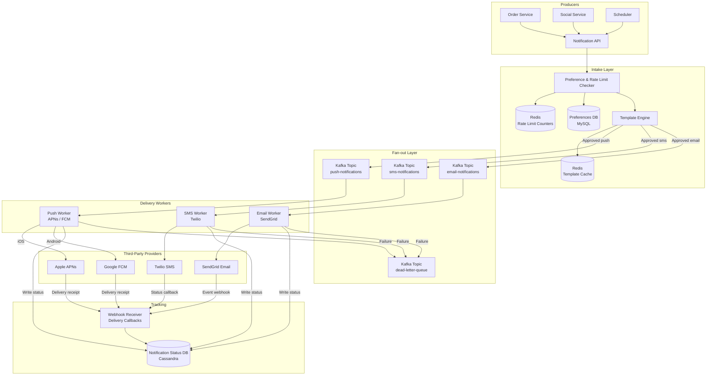

# Design: Notification System

## Problem Statement

Build a high-throughput notification system that sends messages to users via push notifications (iOS and Android), SMS, and email. The system must handle billions of notifications per day, guarantee delivery (no lost messages), respect user preferences (some users opt out of certain notification types), avoid spamming users, and support scheduling notifications for the future.

## Why This System is Interesting

A notification system looks deceptively simple — just send a message. The complexity emerges from the combination of requirements: billions of messages/day requires massive throughput, guaranteed delivery requires retry logic and persistence, multiple channels with different third-party providers require an abstraction layer, and user preferences with rate limiting require per-user state that must be checked on every message without becoming a bottleneck. The system is also an excellent example of fan-out architecture — one event (a user liked your photo) may need to notify one person, while another event (a popular tweet) may need to notify 50 million.

## Functional Requirements

- Send notifications via push (iOS APNs, Android FCM), SMS (Twilio), and email (SendGrid)
- Notifications are triggered by system events (new follower, order shipped, OTP) or scheduled in advance
- Users can set preferences: which notification types to receive, on which channels
- Notification templates — parameterized message content managed by product teams
- Delivery tracking — know if a notification was delivered, opened, or bounced
- Rate limiting — don't send more than N notifications per user per hour/day
- Priority levels: critical (OTP, payment alerts) bypass rate limits; promotional can be throttled

## Non-Functional Requirements

- Throughput: handle 1M notifications/second at peak
- Delivery latency: critical notifications delivered < 5 seconds; promotional < 5 minutes
- Reliability: no notification lost (at-least-once delivery)
- Exactly-once semantics for critical notifications (OTP must not be sent twice)
- Rate limit state must be consistent across all notification servers
- System must degrade gracefully — if email provider is down, queue and retry; do not drop

## Capacity Estimation

**Volume:**
```
1B notifications/day
1B / 86,400 sec = ~11,600/sec average
Peak (10x average) = 116,000/sec
Large fan-out events (viral tweet, breaking news alert) = up to 1M/sec burst
```

**Channel distribution (typical):**
```
Push notifications: 70% = 700M/day
Email:             20% = 200M/day
SMS:               10% = 100M/day
```

**Storage for notification log:**
```
Per notification record: ~500 bytes (recipient, template, status, timestamps)
1B × 500B = 500 GB/day
Retain 90 days: ~45 TB of notification logs
```

**Rate limit state:**
```
Active users: 100M
Per user: counter per notification type per time window
100M users × 10 counters × 8 bytes = 8 GB in Redis (easily fits)
```

**Template storage:**
```
~10,000 templates × 10 KB average = 100 MB — trivially small, cache entirely in memory
```

## API Design

**Send Notification (internal service API):**

```
POST /v1/notifications/send
Request: {
    event_type: "order_shipped",
    recipient_id: "user_123",
    template_id: "ORDER_SHIPPED_V2",
    variables: { order_id: "ORD-456", tracking_url: "..." },
    priority: "high",
    channels: ["push", "email"],   // optional override; defaults to user preferences
    idempotency_key: "ORD-456-shipped-notif"
}
Response: { notification_id, queued_at, estimated_delivery_ms }
```

**Schedule Notification:**

```
POST /v1/notifications/schedule
Request: {
    event_type: "cart_reminder",
    recipient_id: "user_123",
    template_id: "CART_REMINDER_24H",
    variables: { cart_value: "$45.00" },
    deliver_at: "2026-07-09T10:00:00Z"
}
Response: { scheduled_notification_id, deliver_at }
```

**User Preferences:**

```
GET /v1/users/{user_id}/preferences
Response: { preferences: [{ event_type, channels_enabled, frequency_limit }] }

PUT /v1/users/{user_id}/preferences
Request: { event_type: "marketing", channels_enabled: [], frequency_limit: 0 }
Response: { status: "updated" }
```

**Delivery Status:**

```
GET /v1/notifications/{notification_id}/status
Response: {
    notification_id,
    status: "delivered|failed|pending|bounced",
    channel_results: [
        { channel: "push", status: "delivered", delivered_at: "..." },
        { channel: "email", status: "bounced", reason: "mailbox_full" }
    ]
}
```

## High-Level Architecture



## Core Components Deep Dive

### Preference and Rate Limit Checker

This is the first gate every notification passes through. For each inbound notification event:

1. **Preference check:** Query user's preferences — has the user opted out of this event type on this channel?
2. **Rate limit check:** Has the user already received N notifications in the current window?

Both checks must be fast since they're on the critical path. User preferences are cached in Redis with a short TTL (5 minutes). The preference DB (MySQL) is the source of truth.

**Rate limiting implementation:**

```
For each (user_id, channel, window="1h"):
    key = "rl:{user_id}:{channel}:1h:{current_hour_epoch}"
    count = INCR key
    if count == 1: EXPIRE key 3600
    if count > MAX_PER_HOUR and priority != "critical":
        REJECT notification
```

This is a fixed-window counter. Sliding window is more accurate but requires more Redis operations. For notification rate limiting, fixed window is sufficient — small window boundary issues don't matter.

**Critical notifications bypass rate limits:** OTPs, payment confirmations, and security alerts skip the rate limiter entirely. They are tagged with `priority: critical` by the calling service.

### Template Engine

Templates separate message content from notification logic. A template for "order shipped" looks like:

```
Template: ORDER_SHIPPED_V2
Push title:   "Your order is on the way!"
Push body:    "Order {{order_id}} has shipped. Track it: {{tracking_url}}"
Email subject: "Your {{brand}} order has shipped"
Email html:   (full HTML template with variables)
SMS:          "Your order {{order_id}} shipped. Track: {{tracking_url}}"
```

The Template Engine substitutes variables from the event payload. Templates are stored in a DB and cached in Redis (entire template cache is ~100 MB — fits comfortably). Product teams update templates without code deployments.

### Kafka-Based Fan-out

After preference checking and template rendering, the system publishes to channel-specific Kafka topics. This decouples intake from delivery:

- **Backpressure:** If FCM is slow, the `push-notifications` topic fills up but intake is unaffected
- **Replay:** If a delivery worker had a bug, replay the Kafka topic to re-deliver
- **Scaling:** Add more consumers to a topic to increase parallelism independently per channel
- **Partitioning:** Kafka topics are partitioned by `user_id % partitions` — notifications to the same user arrive in order

For large fan-out events (1 user action notifies 1M followers), the upstream service publishes one event to a `fan-out-jobs` topic. A dedicated Fan-out Service reads this, looks up all followers from the social graph, and publishes individual notification events. This prevents the social service from directly overloading the notification intake.

### Retry Logic and Dead Letter Queue

Every delivery worker uses the following retry pattern:

```
Attempt 1: immediate
Attempt 2: after 30 seconds
Attempt 3: after 5 minutes
Attempt 4: after 30 minutes
Attempt 5: after 2 hours
After 5 attempts: move to Dead Letter Queue (DLQ) topic
```

The DLQ is a separate Kafka topic. A human-monitored alerting system fires when DLQ message count exceeds a threshold. Messages in DLQ can be manually replayed once the underlying issue is fixed.

**Idempotency** is critical for retries — sending an OTP twice is worse than not sending it. Each notification has an `idempotency_key`. Before delivery, the worker checks:

```
key = "idem:{idempotency_key}"
result = SET key "sent" NX EX 86400   -- only set if not exists, expire in 24h
if result == nil: already sent, skip
```

This Redis atomic set operation ensures exactly-once delivery semantics.

### Scheduler

Scheduled notifications (cart abandonment reminders, appointment reminders) are stored in a scheduled notifications table with a `deliver_at` timestamp. A scheduler job runs every 30 seconds:

```sql
SELECT * FROM scheduled_notifications
WHERE deliver_at <= NOW() + INTERVAL '30 seconds'
  AND status = 'pending'
LIMIT 1000;
```

Fetched notifications are published to the intake queue and their status updated to `enqueued`. For high-volume scheduled sends (marketing blast to 50M users), the scheduler fans out over hours rather than sending all at once, respecting per-provider rate limits.

## Database Design

### Notification Log (Cassandra)

```
CREATE TABLE notification_log (
    notification_id UUID,
    recipient_id    UUID,
    event_type      TEXT,
    channel         TEXT,
    status          TEXT,
    template_id     TEXT,
    created_at      TIMESTAMP,
    delivered_at    TIMESTAMP,
    opened_at       TIMESTAMP,
    failure_reason  TEXT,
    PRIMARY KEY ((recipient_id), created_at, notification_id)
) WITH CLUSTERING ORDER BY (created_at DESC)
  AND default_time_to_live = 7776000;  -- 90 days
```

Partitioned by `recipient_id` for efficient per-user notification history queries. Cassandra's write-optimized storage handles 1M+ inserts/second across a cluster.

### User Preferences (MySQL)

```sql
CREATE TABLE notification_preferences (
    user_id         BIGINT NOT NULL,
    event_type      VARCHAR(50) NOT NULL,
    push_enabled    BOOLEAN DEFAULT TRUE,
    sms_enabled     BOOLEAN DEFAULT FALSE,
    email_enabled   BOOLEAN DEFAULT TRUE,
    max_per_day     SMALLINT DEFAULT 10,
    updated_at      DATETIME DEFAULT NOW(),
    PRIMARY KEY (user_id, event_type)
);

CREATE TABLE device_tokens (
    user_id         BIGINT NOT NULL,
    device_id       CHAR(36) NOT NULL,
    platform        ENUM('ios', 'android') NOT NULL,
    push_token      VARCHAR(256) NOT NULL,
    is_active       BOOLEAN DEFAULT TRUE,
    updated_at      DATETIME DEFAULT NOW(),
    PRIMARY KEY (user_id, device_id),
    INDEX idx_push_token (push_token)
);
```

### Scheduled Notifications (PostgreSQL)

```sql
CREATE TABLE scheduled_notifications (
    id              UUID PRIMARY KEY DEFAULT gen_random_uuid(),
    recipient_id    UUID NOT NULL,
    template_id     VARCHAR(100) NOT NULL,
    variables       JSONB NOT NULL,
    deliver_at      TIMESTAMPTZ NOT NULL,
    status          VARCHAR(20) DEFAULT 'pending',
    created_at      TIMESTAMPTZ DEFAULT NOW(),
    INDEX idx_deliver_at_status (deliver_at, status)
);
```

## Scaling Strategy

**Intake layer** is stateless and scales horizontally. Rate limit state lives in Redis, not in application servers. Adding more intake servers means more Redis reads/writes — Redis cluster handles this by sharding keys.

**Kafka** scales by adding partitions and consumers. Each channel topic can have 100+ partitions, each consumed by a dedicated worker. The bottleneck is usually the third-party provider's rate limits, not Kafka throughput.

**Delivery workers** scale independently per channel. If FCM throughput is limited to 100K/sec, run 50 parallel workers each sending 2K/sec. Workers are stateless — they read from Kafka, call the provider API, write status to Cassandra.

**Cassandra** scales horizontally. 500 GB/day of notification logs is distributed across the cluster. Old partitions are automatically expired via TTL without expensive deletes.

## Key Bottlenecks and Solutions

| Bottleneck | Root Cause | Solution |
|---|---|---|
| Provider rate limits | FCM/APNs have per-credential rate limits | Multiple provider accounts; batch API calls (FCM supports 500 recipients per request) |
| Fan-out storms | 1 event triggers 10M notifications instantly | Async fan-out service; spread delivery over time windows per priority |
| Token staleness | User uninstalls app, push token invalidated | Handle INVALID_TOKEN response from APNs/FCM; mark token inactive, remove from future sends |
| Email deliverability | High bounce rate hurts sender reputation | Separate IPs per notification type; monitor bounce/spam rates; implement list hygiene |
| Rate limit Redis hot key | Viral user with 50M followers triggers 50M rate limit checks | Batch rate limit checks; local in-process cache for preference data (5-second TTL) |

## Trade-offs Made

**At-least-once vs. exactly-once delivery:** At-least-once is default (retries can cause duplicates). Exactly-once is implemented with Redis idempotency keys only for critical notifications (OTP, payment). The overhead of idempotency for all 1B notifications/day is justified only for notifications where duplicates cause harm.

**Fixed-window vs. sliding-window rate limiting:** Fixed-window is simpler and cheaper (1 Redis INCR per notification). Sliding-window is more accurate (no burst at window boundary) but requires a sorted set or multiple keys. For notification rate limiting, fixed-window accuracy is sufficient.

**Per-channel Kafka topics vs. single topic:** Separate topics per channel allow independent scaling and different consumer configurations per channel (email can have slower consumers, SMS needs faster). A single topic would require more complex consumer logic to route by channel.

**Pull-based scheduling vs. push-based:** The scheduler polls the DB every 30 seconds. Push-based (use a delay queue) would be more precise but adds infrastructure complexity. 30 seconds of scheduling imprecision is acceptable for all use cases except real-time OTPs (which are not scheduled).

## Real-World: How Companies Do It

**Facebook** uses a system called **Tornado** for mobile push notifications. It batches notifications per device and uses a single TCP connection to APNs per data center to maximize throughput. **Airbnb** built **Chronos** — a scheduling system for notifications backed by Kafka and Cassandra, with rate limiting in Redis. **Uber** routes all notifications through a single **Notification Platform** that handles preference management, template rendering, and delivery tracking centrally, used by 20+ internal services. **Twilio SendGrid** (an email provider itself) uses a multi-tenant Kafka pipeline with per-customer priority queues to prevent noisy neighbors from degrading deliverability for others.

## Interview Discussion Points

- **How do you handle APNs token expiry?** APNs returns `BadDeviceToken` error for invalid tokens. The push worker catches this response and marks the token as inactive in the device_tokens table. Future sends skip inactive tokens.
- **How do you prevent a spam notification flood?** Rate limiter (Redis counter) per user per channel. Additionally, circuit breaker: if a service sends 10x its normal notification volume in 5 minutes, throttle it and alert on-call.
- **How do you ensure OTPs arrive in under 5 seconds?** OTPs are marked `priority: critical`. They bypass rate limiting, skip the slow fan-out path, and go directly to the high-priority Kafka topic consumed by a dedicated worker with minimal batch overhead.
- **How do you handle a third-party provider outage (e.g., Twilio down)?** Messages stay in the Kafka topic. Workers detect 5xx errors and pause with exponential backoff. The DLQ catches messages that exhaust retries. When Twilio recovers, the Kafka consumer resumes and delivers queued messages. For SMS, fall back to a secondary provider (MessageBird, AWS SNS) if primary is down for more than 5 minutes.
- **How do you track open rates for push notifications?** The mobile app SDK sends an event to the analytics system when the user opens a notification (via notification tap handler). This event includes the `notification_id`, which is matched to the delivery record in Cassandra to update `opened_at`.

## Summary

A notification system's architecture is fundamentally a fan-out pipeline with reliability guarantees. The three-layer design — intake/validation, Kafka queues, delivery workers — decouples each concern and enables independent scaling. Rate limiting in Redis prevents spam without adding database load. Template management decouples message content from code. Idempotency keys prevent duplicate delivery of critical messages. The dead letter queue ensures no message is silently dropped. The key insight: use Kafka as the reliability backbone (messages persist until acknowledged), separate delivery channels into independent consumer groups, and treat third-party providers as unreliable external dependencies that require retry logic and fallback providers.
