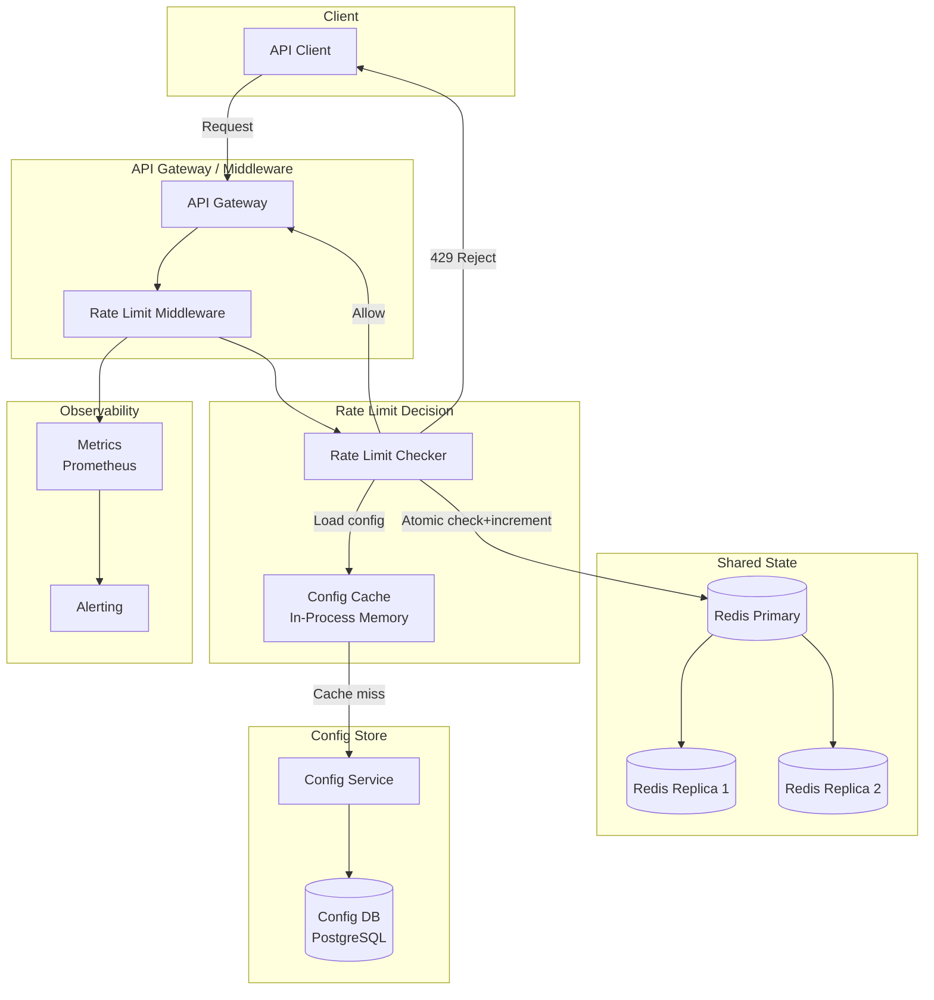

# Design: Distributed Rate Limiter

## Problem Statement

Build a distributed rate limiter that can enforce API request limits across a fleet of application servers. The rate limiter must allow exactly N requests per time window per client, work correctly when requests are spread across multiple servers, add minimal latency to every request, and support different limit policies per client and per endpoint.

## Why This System is Interesting

Rate limiting is one of those problems where the naive solution works perfectly on a single server but breaks completely when you scale horizontally. If you store rate limit counters in application memory, each of your 100 servers has its own counter — a client can make 100x the intended limit by round-robining across servers. The distributed solution requires shared state, which introduces latency and contention. The engineering challenge is making that shared state check fast enough that it doesn't meaningfully slow down every API request. This case study also introduces several important algorithms (Token Bucket, Sliding Window, Fixed Window) with different accuracy/performance trade-offs.

## Functional Requirements

- Enforce request rate limits per client (by API key, user ID, or IP)
- Support per-endpoint limits (e.g., `/search` allows 10 req/sec, `/checkout` allows 1 req/sec)
- Support global limits (system-wide cap regardless of client)
- Different limit tiers: free, pro, enterprise clients have different limits
- Return informative HTTP headers: remaining requests, reset time, retry-after
- Configurable limits without code deployments (dynamic config)

## Non-Functional Requirements

- Latency overhead: < 5ms added to each request (P99)
- Accuracy: allow no more than 5% above the configured limit
- Distributed: correct behavior across 100+ application servers
- High availability: rate limiter failure should fail open (allow requests) rather than block everything
- Throughput: handle 500,000 rate limit checks/second
- Consistency: eventual consistency acceptable for soft limits; strong consistency for strict financial/security limits

## Capacity Estimation

**Rate limit check volume:**
```
Assume 500,000 API requests/second at peak
Each request = 1 rate limit check
500,000 Redis operations/second
A single Redis instance handles ~100,000 ops/sec
Cluster needed: 5 Redis nodes minimum (with headroom: 10 nodes)
```

**Memory for rate limit state:**
```
Sliding window log approach:
  Per request stored: client_id (16B) + timestamp (8B) = 24B
  1M active clients × 1000 req/window × 24B = 24 GB — too large

Fixed window counter approach:
  Per active client per endpoint: 8B counter + 4B expiry = 12B
  1M clients × 10 endpoints × 12B = 120 MB — easily fits in Redis
```

**Configuration storage:**
```
10,000 API keys × 500 bytes per config = 5 MB — trivially small
Cache entire config in application memory
```

## Algorithm Comparison

| Algorithm | Accuracy | Memory | Burst Handling | Complexity |
|---|---|---|---|---|
| Fixed Window Counter | Low (boundary burst) | Low | Allows 2x burst at window edge | Simple |
| Sliding Window Log | High | High (stores all request timestamps) | Accurate burst control | Medium |
| Sliding Window Counter | Medium-High | Low | Good | Medium |
| Token Bucket | High | Low | Configurable burst | Medium |
| Leaky Bucket | High | Low | No burst (smoothing) | Medium |

**Token Bucket** is the most practical choice for API rate limiting:
- Tokens accumulate at a fixed rate (e.g., 100 tokens/second)
- Each request consumes 1 token
- Bucket has a max capacity (e.g., 200 tokens) — this defines burst size
- If bucket is empty, request is rejected
- Natural burst allowance: a client that was idle can make a short burst up to the bucket capacity

## API Design

**Rate limiter is typically not a user-facing API — it's middleware. But it must communicate results:**

**HTTP Response Headers (industry standard):**

```
X-RateLimit-Limit:      1000      # requests allowed per window
X-RateLimit-Remaining:  847       # requests remaining in current window
X-RateLimit-Reset:      1720400000 # Unix timestamp when window resets
X-RateLimit-RetryAfter: 45        # seconds until next request allowed (on 429)
```

**429 Too Many Requests Response:**

```json
{
    "error": "rate_limit_exceeded",
    "message": "You have exceeded 1000 requests per minute.",
    "retry_after_seconds": 45,
    "limit": 1000,
    "window": "60s"
}
```

**Admin API for Configuration:**

```
GET /admin/rate-limits/{api_key}
Response: { api_key, tier: "pro", limits: [{ endpoint: "*", rpm: 1000 }, { endpoint: "/search", rpm: 100 }] }

PUT /admin/rate-limits/{api_key}
Request:  { limits: [{ endpoint: "*", rpm: 5000 }] }
Response: { status: "updated", effective_immediately: true }

GET /admin/rate-limits/stats?window=1h
Response: { top_clients_by_volume: [...], rejected_requests: 14523, rejection_rate: 0.02 }
```

## High-Level Architecture



## Core Components Deep Dive

### Token Bucket in Redis

The Token Bucket algorithm is implemented using a Redis Lua script. Lua scripts in Redis execute atomically — no other commands run between the script's first and last instruction, preventing race conditions.

**State stored in Redis per client+endpoint:**
```
Key:   rl:{client_id}:{endpoint}
Type:  Hash
Fields:
    tokens:     current token count (float)
    last_refill: Unix timestamp of last token calculation (float)
```

**Lua Script (atomic token bucket check):**

```lua
-- KEYS[1] = rate limit key (e.g., "rl:api_key_123:*")
-- ARGV[1] = max_tokens (bucket capacity)
-- ARGV[2] = refill_rate (tokens per second)
-- ARGV[3] = current timestamp (float, Unix seconds)
-- ARGV[4] = requested_tokens (usually 1)

local key = KEYS[1]
local max_tokens = tonumber(ARGV[1])
local refill_rate = tonumber(ARGV[2])
local now = tonumber(ARGV[3])
local requested = tonumber(ARGV[4])

-- Fetch current state
local state = redis.call('HMGET', key, 'tokens', 'last_refill')
local tokens = tonumber(state[1])
local last_refill = tonumber(state[2])

-- Initialize if first request
if tokens == nil then
    tokens = max_tokens
    last_refill = now
end

-- Refill tokens based on time elapsed
local elapsed = now - last_refill
local new_tokens = math.min(max_tokens, tokens + (elapsed * refill_rate))

-- Check if request can proceed
local allowed = 0
if new_tokens >= requested then
    new_tokens = new_tokens - requested
    allowed = 1
end

-- Persist updated state with TTL (auto-cleanup idle keys)
local ttl = math.ceil(max_tokens / refill_rate) * 2
redis.call('HMSET', key, 'tokens', new_tokens, 'last_refill', now)
redis.call('EXPIRE', key, ttl)

-- Return: [allowed, remaining_tokens, ttl_seconds]
return {allowed, math.floor(new_tokens), ttl}
```

**Why Lua?** The read-check-write sequence (read current tokens, compute new tokens, write back) is a classic check-then-act race condition. Without atomicity, two concurrent requests could both read `tokens=1`, both decide they're allowed, both decrement to 0 — but both pass through, doubling the allowed rate. Lua scripts in Redis are atomic by definition.

**Application code calling the script:**

```python
def check_rate_limit(client_id: str, endpoint: str) -> RateLimitResult:
    config = get_config(client_id, endpoint)  # from in-process cache
    key = f"rl:{client_id}:{endpoint}"
    now = time.time()

    result = redis_client.evalsha(
        LUA_SCRIPT_SHA,
        1,           # number of keys
        key,         # KEYS[1]
        config.max_tokens,    # ARGV[1]
        config.refill_rate,   # ARGV[2]
        now,                  # ARGV[3]
        1                     # ARGV[4] - tokens requested
    )

    allowed = result[0] == 1
    remaining = result[1]
    reset_in = result[2]

    return RateLimitResult(
        allowed=allowed,
        remaining=remaining,
        limit=config.max_tokens,
        reset_at=int(now) + reset_in,
        retry_after=0 if allowed else math.ceil(1.0 / config.refill_rate)
    )
```

### Sliding Window Counter (Alternative)

Sliding window counter uses two fixed-window counters (current window + previous window) to approximate a true sliding window without storing individual timestamps:

```
current_window_count = INCR rl:{client}:{current_minute}
prev_window_count    = GET  rl:{client}:{prev_minute}

# Weighted blend: how far through current window are we?
elapsed_fraction = (now % 60) / 60.0
weighted_count = prev_window_count * (1 - elapsed_fraction) + current_window_count

if weighted_count > limit: REJECT
```

This requires 2 Redis GETs and 1 INCR — very cheap. The error is at most 0-40% of the theoretical worst case, which is acceptable for most API rate limiting.

### Fixed Window Counter (Simplest)

```python
def check_rate_limit_fixed_window(client_id: str, limit: int, window_sec: int) -> bool:
    now = int(time.time())
    window_start = now - (now % window_sec)
    key = f"rl:{client_id}:{window_start}"

    # Atomic: increment and set expiry
    pipe = redis_client.pipeline()
    pipe.incr(key)
    pipe.expire(key, window_sec * 2)
    results = pipe.execute()

    count = results[0]
    return count <= limit
```

**The boundary burst problem:** At 11:59:59 a client uses their 1000 requests. At 12:00:00 the window resets — they can immediately use 1000 more. In 2 seconds, they sent 2000 requests. For strict enforcement, use Token Bucket instead.

### Where to Place the Rate Limiter

**Option 1: API Gateway (recommended)**
- Rate limiter runs before requests hit application servers
- Centralized enforcement — one place to configure and monitor
- Failed requests cost minimal compute (no application code runs)
- All major API gateways (Kong, AWS API Gateway, NGINX) have built-in rate limiting

**Option 2: Application Middleware**
- More flexibility — can rate limit based on application-level context (user tier from JWT)
- Runs after authentication, so rate limiting by user ID is natural
- Higher cost — application starts processing before the request is rejected

**Option 3: Client-Side**
- Never rely on this for security — clients can ignore it
- Useful as a courtesy (SDK throttling to prevent client from hitting limits)

**Best practice: Both API Gateway (coarse limits) + Application middleware (fine-grained limits)**

### Distributed Rate Limit Without Redis

For very high-throughput scenarios where even Redis adds too much latency, use **token bucket with local approximation**:

1. Each server maintains a local in-memory token bucket
2. Every 1 second, servers synchronize their counters with a central store
3. Each server gets its fair share: `local_limit = global_limit / server_count`
4. Accuracy is lower but latency is zero (local memory check)

This is the approach used by systems that need sub-millisecond rate limit decisions.

## Database Design

### Rate Limit Configuration (PostgreSQL)

```sql
CREATE TABLE rate_limit_configs (
    config_id       UUID PRIMARY KEY DEFAULT gen_random_uuid(),
    client_id       VARCHAR(128) NOT NULL,  -- api_key, user_id, or "*" for default
    endpoint_pattern VARCHAR(256) DEFAULT '*',
    max_tokens      INTEGER NOT NULL,        -- bucket capacity
    refill_rate     DECIMAL(10, 2) NOT NULL, -- tokens/second
    window_sec      INTEGER DEFAULT 60,
    tier            VARCHAR(20) DEFAULT 'free',
    is_active       BOOLEAN DEFAULT TRUE,
    created_at      TIMESTAMPTZ DEFAULT NOW(),
    updated_at      TIMESTAMPTZ DEFAULT NOW(),
    UNIQUE (client_id, endpoint_pattern)
);

-- Examples:
-- ("*",          "*",        100, 100.0)  -- default: 100 req/sec
-- ("user_456",   "*",       1000, 100.0)  -- pro user: 1000 req/sec
-- ("user_789",   "/search",   10,   0.17) -- search endpoint: 10 req/min
-- ("key_ENTERPRISE", "*",  10000, 500.0)  -- enterprise: 10K burst, 500/sec
```

### Rate Limit Violations Log (for analytics and abuse detection)

```sql
CREATE TABLE rate_limit_violations (
    id              BIGSERIAL PRIMARY KEY,
    client_id       VARCHAR(128) NOT NULL,
    endpoint        VARCHAR(256),
    violated_at     TIMESTAMPTZ DEFAULT NOW(),
    request_count   INTEGER,
    limit_value     INTEGER,
    client_ip       INET
) PARTITION BY RANGE (violated_at);
-- Partition by day, retain 30 days
```

## Scaling Strategy

**Redis Cluster:** Shard rate limit keys across 6 Redis nodes (3 primary, 3 replica). Keys are distributed by hash slot. A `rl:client_123:*` key maps to a specific shard — all operations for that client hit the same shard, no cross-shard coordination needed.

**Config caching:** Rate limit configs change rarely (minutes-to-hours). Cache the entire config table in application memory on each server. Use a pub-sub mechanism (Redis Pub/Sub or Kafka) to invalidate caches when configs change.

**Read replicas for analytics:** Rate limit violation logs and usage stats queries run against PostgreSQL read replicas, not the primary.

**Circuit breaker on Redis:** If Redis is unavailable, the rate limiter should **fail open** (allow requests) rather than fail closed (block everything). A Redis timeout > 5ms triggers the circuit breaker, which bypasses rate limiting for 10 seconds. This prioritizes availability over perfect enforcement during Redis issues.

## Key Bottlenecks and Solutions

| Bottleneck | Root Cause | Solution |
|---|---|---|
| Redis latency on hot keys | Popular API key with high request rate | Redis pipeline batching; local token bucket with periodic Redis sync |
| Config lookup on every request | 500K requests/sec × config DB query = unsustainable | In-process config cache; invalidate via pub-sub only on config change |
| Lua script compilation | First EVALSHA call compiles the script | Pre-load script on Redis startup with SCRIPT LOAD; use EVALSHA always |
| Redis single-thread bottleneck | All writes are sequential in Redis | Redis 7+ threading for I/O; cluster sharding by client_id distributes load |
| Clock skew across servers | Servers 50ms apart use different timestamps in Lua | Use Redis server time (TIME command) inside Lua script instead of client-provided time |

## Trade-offs Made

**Eventual consistency for soft limits:** The sliding window approximation can allow up to 1.4x the configured limit at window boundaries. This is acceptable for API rate limiting (not a security boundary) in exchange for O(1) Redis operations.

**Strong consistency for strict limits:** Use a synchronous Redis transaction (Lua script) for financial APIs, auth endpoints, or OTP systems where exceeding the limit has real consequences. Pay the ~2ms Redis round-trip latency.

**Fail open vs. fail closed:** If the rate limiter's backend (Redis) is down, fail open — allow all requests. This prioritizes service availability. The alternative (fail closed) would take down your entire API if Redis has a 30-second blip. Document this behavior explicitly; don't let it surprise on-call engineers.

**Precision of token bucket timing:** The Lua script uses client-provided timestamps. Server clock skew can cause slight inaccuracies. Using Redis's own `TIME` command (added inside the Lua script as `local now = redis.call('TIME')`) eliminates clock skew at the cost of a slightly more complex script.

## Real-World: How Companies Do It

**Stripe** uses a custom rate limiter built on Redis. They use the token bucket algorithm with per-API-key, per-endpoint, and global limits applied in layers. Their rate limiter is a dedicated service called from an NGINX module before requests hit application servers. **GitHub** uses a fixed-window counter with a 5000 req/hour limit for authenticated users, stored in Redis. Their API returns `X-RateLimit-*` headers modeled by the rest of the industry. **Cloudflare** processes rate limiting at the edge without a central Redis — they use an eventually-consistent gossip protocol across edge nodes, accepting slight inaccuracies in exchange for zero added latency. **AWS API Gateway** implements rate limiting with a token bucket per stage/method, configurable up to 10,000 req/sec burst.

## Interview Discussion Points

- **Why not just use INCR + EXPIRE in Redis?** `INCR` followed by `EXPIRE` are two separate commands — not atomic. A server crash between the two leaves a key without expiry, permanently blocking that client. Use a Lua script or `SET key 1 EX ttl NX` for the first request, then plain INCR.
- **How do you handle Redis being down?** Circuit breaker pattern: if Redis calls timeout or fail for N consecutive attempts, bypass rate limiting entirely (fail open). Log this condition and alert. Rate limiting is a soft control — brief outages are acceptable.
- **How do you rate limit by IP for unauthenticated requests?** Use `X-Forwarded-For` header (set by load balancer) as the client identifier. Be careful: NAT means many users share an IP. Consider a lower limit per IP with a higher limit per authenticated user.
- **What if a client deliberately distributes requests across many IPs?** Distributed rate limiting by IP is fundamentally hard (bots use rotating proxies). Combine IP rate limiting with per-account limits, CAPTCHA, and behavioral analysis (ML-based bot detection). Rate limiting is one layer of a defense-in-depth strategy.
- **How do you implement tiered rate limits?** Store tier in the rate limit config. When a request arrives, look up the client's tier from the config cache and apply the corresponding limit. The Redis key can be the same structure regardless of tier — the limit value differs.

## Summary

A distributed rate limiter requires shared state (Redis) to work correctly across multiple application servers. The Token Bucket algorithm is the best general-purpose choice: it allows configurable bursting, has O(1) memory per client, and maps naturally to API semantics. Atomic execution via Lua scripts prevents race conditions. Config caching in application memory eliminates per-request DB queries. The rate limiter should live at the API Gateway layer for coarse limits, supplemented by application middleware for fine-grained user-level limits. The key operational principle: fail open if the rate limiter's backend is unavailable — service availability is more important than perfect rate enforcement. Return informative headers (`X-RateLimit-*`) on every response so API clients can implement adaptive request throttling and avoid hitting limits in the first place.
