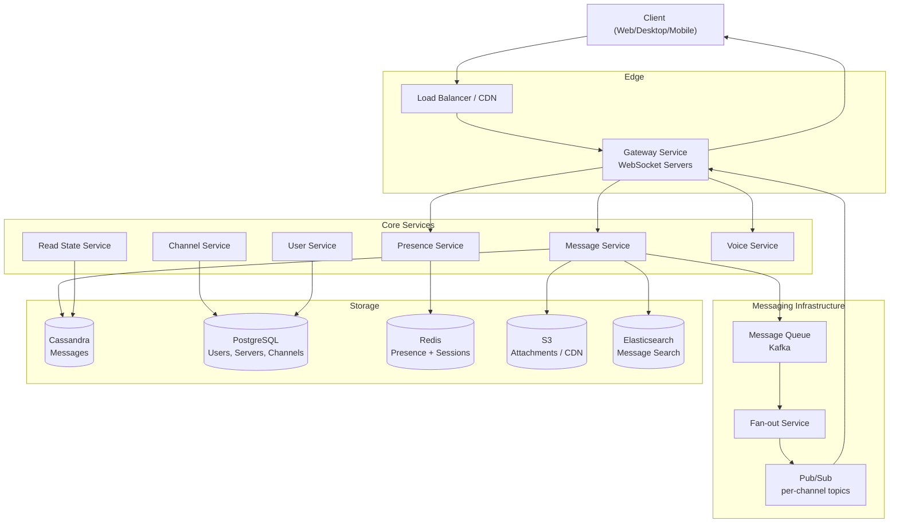

# Design: Discord — Real-time Chat Platform

## Problem Statement

Discord is a real-time communication platform combining text chat, voice/video channels, and community servers (guilds). Users join servers with hundreds of channels and thousands of members. Every message must be delivered instantly to all members viewing that channel. Unlike WhatsApp (1-to-1 or small groups), Discord servers can have 500,000 members — fanning out a single message to all online members is a non-trivial distributed systems problem.

---

## Why This System is Interesting

- **Massive fan-out**: One message in a 100k-member server must reach every online subscriber instantly.
- **Persistent WebSocket connections**: 19M concurrent users each hold an open connection — connection management is its own scaling challenge.
- **Read states**: Tracking which messages a user has read across thousands of channels is a harder problem than storing the messages themselves.
- **Voice/video**: WebRTC-based voice rooms require separate low-latency infrastructure.
- **Presence**: Showing who is online/offline/idle in real time requires high-frequency state updates.

---

## Functional Requirements

1. Users can create and join servers (guilds) with multiple text and voice channels.
2. Users can send and receive messages in real time within channels.
3. Users can send direct messages (DMs) and group DMs.
4. Voice/video channels support real-time audio/video communication.
5. Message history is persistent and searchable.
6. Users have presence status (online, idle, DND, offline) visible to friends and server members.
7. Read state tracking — unread message count per channel per user.
8. File and image attachments in messages.
9. Reactions, threads, pins.

---

## Non-Functional Requirements

- **Latency**: Message delivery under 100ms for users in the same region.
- **Availability**: 99.99% uptime — communication platforms must be always-on.
- **Scale**: 19M concurrent users, 4B messages/day.
- **Consistency**: Messages must appear in order; no message loss.
- **Durability**: Messages stored permanently (unless explicitly deleted).
- **Fan-out**: A message in a large server fan-outs to potentially 100k+ subscribers.

---

## Capacity Estimation

**Users and Messages**
- 19M concurrent users, ~500M registered users
- 4B messages/day = ~46,000 messages/second average
- Peak: 3x average = ~140,000 messages/second
- Average message size: 200 bytes (text) → ~800 GB/day of message data
- With metadata, attachments links: ~2 TB/day total write volume

**WebSocket Connections**
- 19M concurrent connections
- Each connection: ~10 KB memory overhead in the gateway
- 19M × 10 KB = ~190 GB RAM just for connection state
- Requires ~1,000 gateway servers (assuming 20k connections/server)

**Fan-out**
- Large server: 500k members, ~50k online at peak
- 1 message → 50k delivery tasks
- If 1,000 such servers post 1 msg/sec each → 50M delivery operations/sec
- Fan-out is the single hardest scaling problem

**Storage**
- Messages: 4B/day × 200 bytes = 800 GB/day → ~300 TB/year
- Cassandra with replication factor 3: ~900 TB/year raw storage

---

## API Design

**Send Message**
```
POST /channels/{channel_id}/messages
Authorization: Bearer <token>

{
  "content": "Hello, world!",
  "attachments": [],
  "nonce": "client-generated-uuid"
}

Response 200:
{
  "id": "1234567890123456789",
  "channel_id": "987654321",
  "author": { "id": "111", "username": "harshvardhan" },
  "content": "Hello, world!",
  "timestamp": "2026-07-08T10:00:00.000Z",
  "edited_timestamp": null
}
```

**Get Message History**
```
GET /channels/{channel_id}/messages?limit=50&before={message_id}

Response 200: [array of message objects, newest first]
```

**Update Read State**
```
POST /channels/{channel_id}/messages/{message_id}/ack
Authorization: Bearer <token>
// Marks this message as the last-read message in this channel
```

**WebSocket Gateway**
```
// Client connects: wss://gateway.discord.com/?v=10&encoding=json
// Client sends IDENTIFY:
{ "op": 2, "d": { "token": "...", "intents": 32767 } }

// Server sends READY with session data
// Server sends MESSAGE_CREATE events for each new message
{ "op": 0, "t": "MESSAGE_CREATE", "d": { ...message object... } }
```

---

## High-Level Architecture



---

## Core Components Deep Dive

### 1. Gateway Service (WebSocket Servers)
The gateway is the entry point for all real-time communication. Each gateway server maintains persistent WebSocket connections. Discord uses Elixir/Erlang (BEAM VM) because it can handle millions of lightweight processes with very low memory per process — ideal for holding millions of idle connections.

When a user connects, the gateway:
- Authenticates via token
- Loads the user's guild/channel list
- Subscribes the user's session to relevant pub/sub topics (one per channel the user can access)
- Sends a READY payload with initial state

### 2. Message Service
Handles message creation, validation, and storage. On receiving a message:
1. Validates content (length, rate limits, permissions)
2. Assigns a Snowflake ID (Twitter-style, encodes timestamp + worker + sequence)
3. Writes to Cassandra
4. Publishes to Kafka topic for async fan-out
5. Returns the message object to the sender

**Snowflake IDs**: 64-bit IDs where the top 41 bits are a millisecond timestamp. This allows sorting by ID to get time-ordered messages, and avoids UUID collisions without coordination.

### 3. Fan-out Service
This is the most performance-critical component. It consumes from Kafka and distributes messages to subscribers.

**Approach**: Each channel has a pub/sub topic. When a message arrives, the fan-out service publishes to that channel's topic. All gateway servers that have subscribers for that channel receive the message and push it to the relevant WebSocket connections.

**Challenge with large servers**: A channel with 50k online subscribers requires 50k push operations. Discord uses a tiered fan-out:
- Small servers (< 1k members): direct fan-out
- Large servers: publish to a channel topic; gateways pull and distribute locally

### 4. Presence Service
Tracks online/offline/idle/DND state. Built on Redis because presence is:
- Frequently updated (heartbeat every 45 seconds)
- Read very often
- Acceptable to lose on restart (can be rebuilt)

Redis sorted sets store user presence with TTLs. A user who stops sending heartbeats is automatically marked offline when the TTL expires.

### 5. Read State Service
Tracks `last_read_message_id` per (user, channel) pair. This is one of Discord's hardest scaling problems — with 500M users × thousands of channels, storing and querying read state requires careful design.

Discord stores read states in Cassandra with the partition key `(user_id)` and clustering key `channel_id`. A single Cassandra row per user-channel pair. Writes happen on every read acknowledgment; reads happen on login to compute unread counts.

---

## Database Design

### Cassandra — Messages

```sql
CREATE TABLE messages (
    channel_id   BIGINT,
    message_id   BIGINT,       -- Snowflake ID (time-ordered)
    author_id    BIGINT,
    content      TEXT,
    attachments  LIST<TEXT>,
    reactions    MAP<TEXT, INT>,
    edited_at    TIMESTAMP,
    deleted      BOOLEAN,
    PRIMARY KEY (channel_id, message_id)
) WITH CLUSTERING ORDER BY (message_id DESC)
  AND default_time_to_live = 0;  -- no expiry
```

Partition key is `channel_id` — all messages for a channel live on the same set of nodes, making range queries (get last 50 messages) a single-partition read. Message ID is a Snowflake so DESC order gives newest-first.

### Cassandra — Read States

```sql
CREATE TABLE read_states (
    user_id             BIGINT,
    channel_id          BIGINT,
    last_message_id     BIGINT,
    mention_count       INT,
    PRIMARY KEY (user_id, channel_id)
);
```

### PostgreSQL — Guilds, Channels, Users

```sql
CREATE TABLE users (
    id            BIGINT PRIMARY KEY,
    username      VARCHAR(32) NOT NULL,
    discriminator CHAR(4),
    email         VARCHAR(255) UNIQUE,
    avatar_hash   VARCHAR(64),
    created_at    TIMESTAMPTZ DEFAULT NOW()
);

CREATE TABLE guilds (
    id          BIGINT PRIMARY KEY,
    name        VARCHAR(100) NOT NULL,
    owner_id    BIGINT REFERENCES users(id),
    icon_hash   VARCHAR(64),
    member_count INT DEFAULT 0
);

CREATE TABLE channels (
    id          BIGINT PRIMARY KEY,
    guild_id    BIGINT REFERENCES guilds(id),
    name        VARCHAR(100),
    type        SMALLINT,     -- 0=text, 2=voice, 4=category
    position    INT,
    topic       TEXT
);

CREATE TABLE guild_members (
    guild_id    BIGINT REFERENCES guilds(id),
    user_id     BIGINT REFERENCES users(id),
    joined_at   TIMESTAMPTZ,
    nickname    VARCHAR(32),
    roles       BIGINT[],
    PRIMARY KEY (guild_id, user_id)
);
```

**Why two databases?** Cassandra handles high-throughput, append-heavy message writes with excellent horizontal scaling. PostgreSQL handles relational, low-write guild/user metadata that benefits from ACID transactions (e.g., guild creation, role management).

---

## Scaling Strategy

**Gateway scaling**: Stateless gateway servers behind a load balancer. Each server handles ~20k WebSocket connections. At 19M concurrent users: ~950 gateway servers. Session state stored in Redis so any gateway can handle reconnects.

**Cassandra scaling**: Horizontal sharding by `channel_id`. Add nodes as data grows. Replication factor 3 (3 copies of every partition). Cassandra's consistent hashing means adding a node requires only moving a fraction of data.

**Kafka**: Partitioned by `channel_id` so all messages for a channel are processed in order by the same consumer. Fan-out consumers scale horizontally.

**CDN for attachments**: All files uploaded to S3, served via CloudFront CDN. Discord stores the CDN URL in the message, not the binary data.

---

## Key Bottlenecks and Solutions

| Bottleneck | Solution |
|---|---|
| Large server fan-out (50k+ online) | Pub/sub per channel; gateways subscribe and deliver locally |
| 19M WebSocket connections | Elixir/BEAM: millions of lightweight processes per server |
| Message ordering | Snowflake IDs encode time; Cassandra clustering order by message_id |
| Read state writes (every message read) | Cassandra write-heavy table with partition by user_id; debounce writes in client |
| Presence updates (19M heartbeats/45s) | Redis with TTL; ~422k writes/second — Redis Cluster handles this |
| Hot channel partitions | Messages spread across Cassandra via channel_id; very popular channels still hit one partition set, mitigated by Cassandra's ring architecture |

---

## Trade-offs Made

1. **Eventual consistency for messages**: Cassandra is eventually consistent. Messages might appear slightly out of order on different clients momentarily. Discord accepts this for scale — messages have Snowflake IDs so clients can reorder locally.

2. **Fan-out vs pull**: Push-based fan-out (server pushes to all subscribers) adds complexity but reduces latency vs pull (clients poll). For real-time chat, push is required.

3. **Read state precision**: Discord debounces read state writes. If you scroll through 100 messages, it doesn't write 100 Cassandra rows — it batches and writes periodically. This means unread counts can be slightly stale after a crash.

4. **Voice routing**: Voice traffic goes through Discord's own QUIC-based relay nodes (not peer-to-peer) for NAT traversal. This adds latency but enables moderation and server-side processing.

---

## Real-World: How Discord Does It

- **Elixir/Erlang** for the gateway layer — Elixir's actor model maps perfectly to per-user WebSocket processes. Discord moved from Python to Elixir when Python couldn't handle connection counts.
- **Cassandra** for messages — chosen for write throughput and linear horizontal scaling. Discord had a famous incident where a single hot Cassandra partition caused cascading failures; they now use a "super properties" architecture to isolate hot guilds.
- **Rust** for performance-critical services — Discord rewrote their Read States service in Rust (from Go) because Go's GC pauses caused latency spikes at their scale.
- **Skia-based rendering** — Discord's client renders channel lists with a custom Skia canvas for performance, not DOM elements, because a server with 500 channels in a tree view would cause browser reflow storms.

---

## Interview Discussion Points

1. **How do you prevent a message from being delivered twice?** The gateway assigns a client-side nonce; if the server sees the same nonce from the same user in a short window, it deduplicates. The message ID is the canonical identifier.

2. **How does Discord handle message edit/delete?** Edits update the Cassandra row (Cassandra allows upserts). The fan-out service publishes a `MESSAGE_UPDATE` event. Clients update their local cache. Soft-delete sets a `deleted=true` flag; the content is cleared.

3. **What happens when a gateway server crashes?** Clients detect the WebSocket closure and reconnect with a `session_id` and `sequence` number. The new gateway replays any missed events from the sequence checkpoint (stored in Redis with a short TTL). If the session expired, the client does a full READY.

4. **How would you design the @everyone mention for a 500k-member server?** This is a fan-out to all 500k members, not just online ones. Offline members see the notification when they next connect. The fan-out service writes a notification row for each member — this is expensive and why large servers require special permissions to use @everyone.

---

## Summary

Discord's architecture centers on three hard problems: managing millions of persistent WebSocket connections (solved with Elixir/BEAM), fanning out messages to massive server audiences (solved with Kafka + per-channel pub/sub), and storing billions of messages efficiently (solved with Cassandra partitioned by channel_id). The read state system is a hidden complexity — tracking what each of 500M users has read across potentially thousands of channels requires careful data modeling in Cassandra. Voice/video is a separate stack built on WebRTC with Discord-owned relay servers. The system demonstrates that different subsystems benefit from different technologies: Elixir for connection management, Cassandra for message storage, PostgreSQL for relational guild data, Redis for ephemeral presence state.
