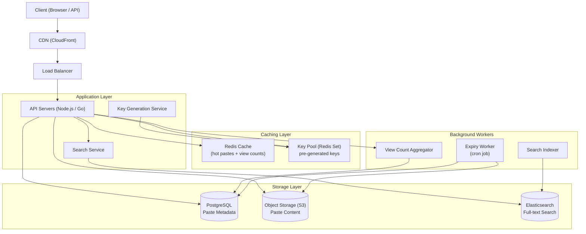

# Design: Pastebin — Text Storage Service

## Problem Statement

Pastebin lets users paste and share text (code snippets, logs, configuration files) via a short URL. It is intentionally simple, making it an excellent system design study for practicing URL generation, read-heavy caching, object storage, and expiry mechanics without the distracting complexity of larger systems.

---

## Why This System is Interesting

- **URL generation**: Same problem as TinyURL — generate a short, unique, collision-free key.
- **Read-heavy workload**: Pastes are read 10x more than written — caching strategy is critical.
- **Storage tiering**: Recent/popular pastes live in cache; old pastes live in cheap object storage.
- **Expiry**: Pastes can be set to expire — requires TTL management at the database and cache level.
- **Access control**: Private pastes with optional password protection.
- **Analytics**: View count per paste without slowing down reads.

---

## Functional Requirements

1. User can create a paste with text content (up to 10 MB).
2. System generates a unique short URL (e.g., `pastebin.com/aB3xK7`).
3. User can optionally set expiry (1 hour, 1 day, 1 week, never).
4. User can optionally set a password for private pastes.
5. User can optionally specify syntax highlighting language.
6. Anyone with the URL can read the paste (subject to password).
7. View count is tracked and displayed.
8. User accounts can see their paste history.
9. Full-text search across public pastes.
10. Pastes expire automatically after the set duration.

---

## Non-Functional Requirements

- **Availability**: 99.9% uptime.
- **Latency**: Paste read under 50ms (cache hit); under 200ms (cache miss).
- **Scale**: 1M pastes created/day, 10M reads/day.
- **Durability**: No paste loss before its expiry.
- **Storage**: Support pastes up to 10 MB; average ~10 KB.

---

## Capacity Estimation

**Writes**
- 1M pastes/day = ~12 pastes/second
- Average paste size: 10 KB
- Daily storage: 1M × 10 KB = 10 GB/day
- Yearly storage: 10 GB × 365 = ~3.6 TB/year
- With object storage replication (3x): ~11 TB/year

**Reads**
- 10M reads/day = ~116 reads/second average
- Peak (10x): ~1,160 reads/second
- Read/write ratio: 10:1 — strongly read-heavy

**Short URL Key Space**
- Using base62 (a-z, A-Z, 0-9) with 6 characters: 62^6 = ~56 billion unique keys
- At 1M pastes/day: 56B ÷ 1M = 56,000 days = 153 years before exhaustion
- 8 characters gives 62^8 ≈ 218 trillion — effectively infinite

**Cache Sizing**
- 80/20 rule: 20% of pastes receive 80% of reads
- 20% of 10M reads = 2M unique pastes accessed frequently
- 2M × 10 KB = 20 GB of hot paste content
- A single Redis cluster can hold this comfortably

**Metadata Database**
- 1M rows/day × 365 days × 5 years = 1.8B rows
- Each row: ~200 bytes metadata = ~360 GB over 5 years
- Manageable in PostgreSQL with partitioning

---

## API Design

**Create Paste**
```
POST /api/v1/pastes
Content-Type: application/json

{
  "content": "print('Hello, World!')",
  "language": "python",
  "expiry": "1d",
  "visibility": "public",
  "password": null,
  "title": "Quick Python snippet"
}

Response 201:
{
  "key": "aB3xK7",
  "url": "https://pastebin.com/aB3xK7",
  "created_at": "2026-07-08T10:00:00Z",
  "expires_at": "2026-07-09T10:00:00Z"
}
```

**Read Paste**
```
GET /api/v1/pastes/{key}
X-Password: optional-password-header

Response 200:
{
  "key": "aB3xK7",
  "title": "Quick Python snippet",
  "content": "print('Hello, World!')",
  "language": "python",
  "author": "harshvardhan",
  "created_at": "2026-07-08T10:00:00Z",
  "expires_at": "2026-07-09T10:00:00Z",
  "view_count": 142,
  "visibility": "public"
}

Response 404: { "error": "Paste not found or expired" }
Response 401: { "error": "Password required" }
```

**Delete Paste**
```
DELETE /api/v1/pastes/{key}
Authorization: Bearer <token>

Response 204: No Content
```

**Search Pastes**
```
GET /api/v1/search?q=python+list+comprehension&language=python&page=1

Response 200:
{
  "results": [{ "key": "...", "title": "...", "snippet": "..." }],
  "total": 340,
  "page": 1
}
```

---

## High-Level Architecture



---

## Core Components Deep Dive

### 1. Key Generation Service
The most interesting design choice in Pastebin. Two approaches:

**Approach A — Generate on demand**: Hash the content (MD5/SHA256) and take the first 6 characters, base62-encoded. Problem: different users pasting the same content get the same URL (could be a feature or a bug). Also requires collision checking.

**Approach B — Pre-generated key pool (preferred)**: A background service pre-generates random 6-character base62 keys and stores them in a Redis set (`SPOP` removes and returns one atomically). The API pops a key when creating a paste. This eliminates collision checks at request time and is O(1).

```
Key Generation Worker:
  while pool_size < TARGET:
    key = random_base62(6)
    if key not in used_keys:
      SADD key_pool key

API Create:
  key = SPOP key_pool   // atomic, no race condition
  store paste with key
```

### 2. Read Path (Cache Strategy)
Read performance is critical at 10:1 read-to-write ratio.

```
GET /pastes/{key}:
  1. Check Redis: GET paste:{key}
     - HIT: Return cached content. Increment view counter asynchronously.
     - MISS: Continue
  2. Check PostgreSQL for metadata (expiry, password, visibility)
     - If expired or not found: Return 404
     - If password-protected: Validate password hash
  3. Fetch content from S3 using stored s3_key
  4. Store in Redis with TTL = min(paste_expiry, 24h)
  5. Return content
```

For very popular pastes (e.g., a paste going viral), the CDN layer caches the HTTP response for public pastes, reducing load on the origin entirely.

### 3. View Count Tracking
Incrementing a database counter on every read is a bottleneck. Instead:
- Increment a Redis counter: `INCR views:{key}` (O(1), in-memory)
- A background worker runs every 60 seconds: reads all view counters from Redis, batch-updates PostgreSQL, resets Redis counters
- This means view counts can be up to 60 seconds stale — acceptable for analytics

### 4. Expiry Mechanism
Two-layer expiry:
- **Redis TTL**: Cache entry expires automatically — expired pastes won't be served from cache.
- **PostgreSQL + Cron**: A scheduled job runs every hour, queries `WHERE expires_at < NOW()`, deletes metadata rows, and schedules S3 object deletion.

S3 object lifecycle policies can also auto-delete objects after a number of days, providing a safety net.

### 5. Private Paste / Password Protection
- Password is stored as a bcrypt hash in PostgreSQL.
- On read, the client sends the password in a header.
- The API hashes the input and compares with stored hash.
- Private pastes are not indexed in Elasticsearch and not cached in CDN.

---

## Database Design

### PostgreSQL — Paste Metadata

```sql
CREATE TABLE pastes (
    id          BIGSERIAL PRIMARY KEY,
    key         CHAR(8) UNIQUE NOT NULL,    -- short URL key
    title       VARCHAR(255),
    language    VARCHAR(32) DEFAULT 'text',
    s3_key      VARCHAR(512) NOT NULL,       -- pointer to S3 object
    content_size INT NOT NULL,               -- bytes
    author_id   BIGINT REFERENCES users(id),
    visibility  SMALLINT DEFAULT 0,          -- 0=public, 1=unlisted, 2=private
    password_hash VARCHAR(72),              -- bcrypt hash, nullable
    view_count  INT DEFAULT 0,
    created_at  TIMESTAMPTZ DEFAULT NOW(),
    expires_at  TIMESTAMPTZ,                -- NULL means never
    is_deleted  BOOLEAN DEFAULT FALSE
);

CREATE INDEX idx_pastes_key ON pastes(key);
CREATE INDEX idx_pastes_expires_at ON pastes(expires_at) WHERE expires_at IS NOT NULL;
CREATE INDEX idx_pastes_author ON pastes(author_id);

CREATE TABLE users (
    id          BIGSERIAL PRIMARY KEY,
    username    VARCHAR(32) UNIQUE NOT NULL,
    email       VARCHAR(255) UNIQUE NOT NULL,
    password_hash VARCHAR(72) NOT NULL,
    created_at  TIMESTAMPTZ DEFAULT NOW()
);
```

**Why PostgreSQL?** The dataset is ~1.8B rows over 5 years but metadata is only ~200 bytes/row — PostgreSQL handles billions of rows well with partitioning. The relational model is appropriate for user-paste relationships.

**Why not store content in PostgreSQL?** Large text fields (up to 10 MB) bloat the database, slow down full-table scans, and make backups enormous. Object storage (S3) is 10x cheaper per GB, built for this workload, and serves content directly via CDN.

### Object Storage Layout

```
s3://pastebin-content/
  pastes/
    2026/
      07/
        08/
          aB3xK7.txt
          xP9mQ2.txt
```

Hierarchical key structure avoids S3 hot-partition issues (S3 shards by key prefix).

### Elasticsearch — Search Index

```json
{
  "mappings": {
    "properties": {
      "key":      { "type": "keyword" },
      "title":    { "type": "text" },
      "content":  { "type": "text", "analyzer": "standard" },
      "language": { "type": "keyword" },
      "author":   { "type": "keyword" },
      "created_at": { "type": "date" },
      "view_count": { "type": "integer" }
    }
  }
}
```

Only public pastes are indexed. The Indexer worker reads new paste metadata from PostgreSQL and pushes content to Elasticsearch asynchronously (eventual consistency for search is acceptable).

---

## Scaling Strategy

**Horizontal API scaling**: Stateless API servers behind a load balancer. Session state in Redis. Scale to handle peak 1,160 reads/second — each API server handles ~500 RPS, so 3 API servers suffice for reads; 2 for writes.

**Read scaling**: 80% of reads will be CDN cache hits for public pastes. Only 20% reach the origin. Of those, 80% are Redis cache hits. Only 4% of reads (116 × 0.04 ≈ 5 RPS) hit the database — trivial load.

**Database scaling**: PostgreSQL with read replicas for read traffic. Table partitioned by `created_at` (monthly partitions) so expiry queries scan only recent partitions.

**S3**: Inherently scalable. Use transfer acceleration for users far from the S3 region.

---

## Key Bottlenecks and Solutions

| Bottleneck | Solution |
|---|---|
| Key collisions at creation | Pre-generated key pool in Redis — O(1) pop, no collision checking |
| View count write amplification | Redis counters aggregated by background worker |
| Large paste reads (10 MB) | S3 + CDN direct delivery; don't route through API server |
| Search indexing lag | Elasticsearch updated asynchronously; search is eventually consistent |
| Expiry cleanup | Indexed `expires_at` column + partitioned table for fast batch deletes |
| Cold cache on server restart | Warm cache on startup by loading recently accessed paste keys |

---

## Trade-offs Made

1. **Key generation via pool vs on-demand hashing**: Pool requires a background worker and Redis but eliminates write-path latency for collision checking. Worth the operational complexity.

2. **Eventual consistency for view counts**: Up to 60 seconds stale. Acceptable for analytics; not acceptable for, say, financial data.

3. **Separate metadata DB and content storage**: Adds complexity (two hops for a full paste read) but necessary for cost efficiency at scale and to avoid PostgreSQL bloat.

4. **Search is eventually consistent**: New pastes appear in search results with a delay. Alternative is synchronous indexing (slower writes) or dual writes (risk of inconsistency on failure). Async indexing with a dead letter queue is the pragmatic choice.

---

## Real-World: How Pastebin Does It

The original Pastebin (pastebin.com) was acquired by Jeroen Vader and has largely been a PHP + MySQL system with Nginx caching. Modern alternatives like GitHub Gist store content in Git repositories with metadata in MySQL — giving version history for free. Hastebin is an open-source alternative using Redis for all storage. The most interesting real-world system is GitHub's approach: treat each paste as a Git repo, enabling forks and version history.

---

## Interview Discussion Points

1. **What if two users request the same pre-generated key simultaneously?** Redis `SPOP` is atomic — only one caller gets the popped value. No race condition.

2. **How do you handle the key pool running out?** Monitor pool size and alert when below 10k keys. The pool should be replenished faster than it is consumed. With 1M pastes/day and 56B possible keys, this is a non-issue unless the background worker crashes for days.

3. **How would you support paste forking (like Gist)?** Add a `forked_from_key` column in PostgreSQL. On fork, create a new paste with a copy of the content in S3 and a reference to the original.

4. **How do you prevent abuse (spam, illegal content)?** Rate limiting by IP/user at the load balancer level. Content scanning as an async background job. DMCA takedown via `is_deleted` flag without physical deletion.

---

## Summary

Pastebin's value as a case study is its clarity. The core problems — URL key generation, read-heavy caching, cheap content storage, expiry management — appear in almost every web system. The solution pattern (pre-generated keys from a Redis pool, content in S3, metadata in PostgreSQL, hot reads through Redis cache) is directly reusable in systems like TinyURL, image hosting, file sharing, and document storage. Despite its simplicity, optimizing view count tracking, cache warm-up, and search indexing without blocking the write path reveals the general principles of designing asynchronous, read-optimized systems.
