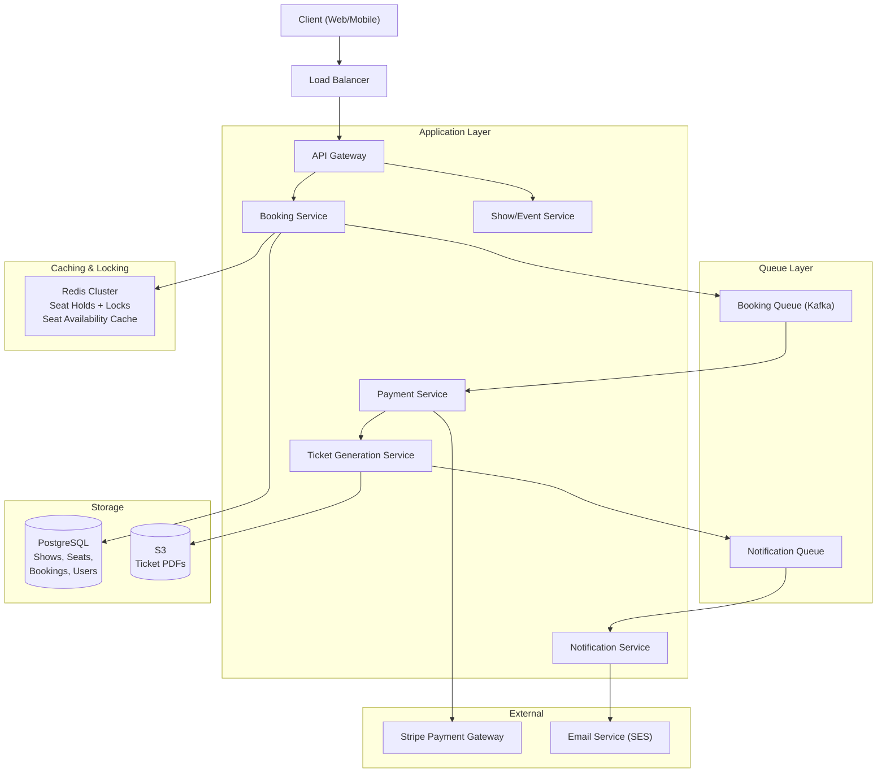
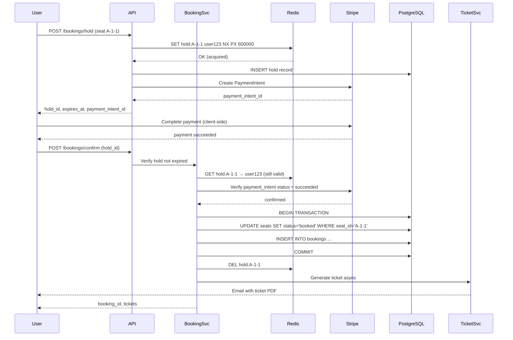

# Design: BookMyShow — Ticket Booking System

## Problem Statement

BookMyShow (or Ticketmaster) allows users to browse events, view available seats on an interactive seat map, select seats, pay, and receive tickets. The hard problem: when 1 million users simultaneously try to book seats for a Taylor Swift concert at the moment tickets go on sale, every user sees the same seat as available, but only one can book it. The system must prevent double-booking while remaining fast and available under extreme peak load.

---

## Why This System is Interesting

This system is the canonical example for teaching:
- **Concurrent seat locking**: Optimistic vs pessimistic locking; distributed locks
- **Seat hold**: Reserve a seat for 10 minutes while the user pays — seat is neither booked nor free
- **Flash sale traffic**: 1M concurrent users for a single event — horizontal scaling isn't enough
- **Payment integration**: Atomic booking + payment — what happens if payment succeeds but booking fails?
- **Idempotency**: User double-clicks "Book" — should not book twice
- **Fairness**: Should it be first-come-first-served or a lottery?

---

## Functional Requirements

1. Users can browse events, venues, and shows.
2. Users can view an interactive seat map with real-time availability.
3. Users can select seats and initiate checkout.
4. System holds selected seats for 10 minutes while user completes payment.
5. System releases held seats if payment times out.
6. On successful payment, seats are marked booked and tickets are issued.
7. Users receive e-tickets (PDF/QR code) via email.
8. Waitlist for sold-out shows.
9. Admins can release blocks of seats (e.g., artist hold released 24h before show).

---

## Non-Functional Requirements

- **No double-booking**: Two users must never book the same seat.
- **Low latency under normal load**: Seat availability in < 200ms; booking in < 2s.
- **High availability**: 99.99% uptime.
- **Peak load**: 1M concurrent users for popular event releases.
- **Hold expiry**: Held seats must be released exactly at 10-minute mark.
- **Idempotency**: Payment/booking operations safe to retry.

---

## Capacity Estimation

**Normal Load**
- 5M registered users, 100k DAU
- 10,000 events live at any time
- 500 seat selections/second (normal)
- 100 bookings/second (normal)

**Peak Load — Flash Sale**
- 1M users arrive simultaneously for a single event
- Single venue: 50,000 seats
- Users race to book within the first 60 seconds
- Peak seat view requests: 1M/sec
- Peak booking attempts: 1M/sec (but only 50k can succeed)
- After seats run out, the spike drops to near-zero

**Database Requirements**
- Events: 10k active events × 50k seats = 500M seat rows
- A booking record: ~500 bytes
- 100 bookings/sec × 86,400 sec × 365 days = ~3B bookings/year → ~1.5 TB/year

**Seat Hold Storage**
- During flash sale: 50k holds × 500 bytes = 25 MB in Redis — trivially small

---

## API Design

**Get Seat Map**
```
GET /api/v1/shows/{show_id}/seats

Response 200:
{
  "show_id": "show_123",
  "venue": "Madison Square Garden",
  "sections": [
    {
      "section_id": "A",
      "rows": [
        {
          "row": "1",
          "seats": [
            { "seat_id": "A-1-1", "status": "available", "price": 150.00 },
            { "seat_id": "A-1-2", "status": "held",      "price": 150.00 },
            { "seat_id": "A-1-3", "status": "booked",    "price": 150.00 }
          ]
        }
      ]
    }
  ]
}
```

**Hold Seats**
```
POST /api/v1/bookings/hold
Authorization: Bearer <token>

{
  "show_id": "show_123",
  "seat_ids": ["A-1-1", "A-1-4"]
}

Response 200:
{
  "hold_id": "hold_abc123",
  "seat_ids": ["A-1-1", "A-1-4"],
  "expires_at": "2026-07-08T10:10:00Z",
  "total_price": 300.00,
  "payment_intent_id": "pi_stripe_xyz"
}

Response 409:
{
  "error": "SEAT_UNAVAILABLE",
  "unavailable_seats": ["A-1-1"]
}
```

**Confirm Booking (after payment)**
```
POST /api/v1/bookings/confirm
Authorization: Bearer <token>

{
  "hold_id": "hold_abc123",
  "payment_intent_id": "pi_stripe_xyz"
}

Response 200:
{
  "booking_id": "bkg_789",
  "status": "confirmed",
  "tickets": [
    { "ticket_id": "tkt_001", "seat": "A-1-1", "qr_code": "..." }
  ]
}
```

---

## High-Level Architecture



---

## Core Components Deep Dive

### The Central Problem: Preventing Double Booking

Three strategies exist, each with trade-offs:

**Strategy 1 — Pessimistic Locking (Database Row Lock)**
```sql
BEGIN;
SELECT * FROM seats WHERE seat_id = 'A-1-1' FOR UPDATE;
-- other transaction blocks here until this one commits
UPDATE seats SET status = 'held' WHERE seat_id = 'A-1-1';
COMMIT;
```
- Pros: Strong guarantee, simple to reason about.
- Cons: Under flash sale load (1M concurrent), row locks cause massive contention and timeout storms. Not viable for peak load.

**Strategy 2 — Optimistic Locking (Version Number)**
```sql
-- Read with version
SELECT seat_id, status, version FROM seats WHERE seat_id = 'A-1-1';
-- version = 5, status = 'available'

-- Write with version check (compare-and-swap)
UPDATE seats
SET status = 'held', version = 6
WHERE seat_id = 'A-1-1' AND version = 5 AND status = 'available';
-- If 0 rows affected: another user got it first — return conflict
```
- Pros: No locks held between read and write; high concurrency.
- Cons: Under extreme contention (1M users for same seat), almost all updates fail and retry — thundering herd.

**Strategy 3 — Redis Distributed Lock + Queue (Recommended for flash sales)**
- Use Redis `SET NX PX` (set if not exists with TTL) as a distributed lock per seat.
- For flash sales, use a **queue-based booking** approach: funnel all booking requests through a queue; process them serially per show. First request wins; others get queued or rejected.

### Seat Hold Implementation

When a user selects seats:

```
HOLD SEAT (Redis approach):
  For each seat_id:
    SET hold:{seat_id} {user_id} NX PX 600000  // 10 minute TTL
    If SET returns nil: seat already held → return 409

If all seats held successfully:
  Write hold record to PostgreSQL (for durability)
  Create Stripe PaymentIntent
  Return hold_id to client

Redis TTL expiry automatically releases the hold after 10 minutes.
A background job also scans PostgreSQL for expired holds as a safety net.
```

The critical insight: Redis `SET NX` is atomic. Two concurrent requests for the same seat — only one succeeds. This is a distributed lock implemented with Redis.

### Booking Confirmation Flow



### Flash Sale Traffic Management

For a Taylor Swift concert going on sale at noon:

1. **Queue-based booking**: All booking requests go into a Kafka queue. A fixed number of workers (matching DB write capacity) consume from the queue in order. Users beyond the seat count receive "sold out" responses.

2. **Virtual waiting room**: Before noon, direct users to a waiting room page. At noon, assign each user a random position in a queue. This converts the thundering herd (all users at exactly noon) into an orderly line.

3. **Read scaling for seat map**: During flash sale, the seat map is cached in Redis (updated on each booking). The API reads from cache, not the database, for availability queries.

4. **Rate limiting**: Limit each user to N booking attempts per minute to prevent bots.

---

## Database Design

### PostgreSQL Schema

```sql
CREATE TABLE venues (
    id          BIGSERIAL PRIMARY KEY,
    name        VARCHAR(255) NOT NULL,
    city        VARCHAR(100),
    capacity    INT NOT NULL
);

CREATE TABLE events (
    id          BIGSERIAL PRIMARY KEY,
    title       VARCHAR(255) NOT NULL,
    artist      VARCHAR(255),
    venue_id    BIGINT REFERENCES venues(id),
    event_date  TIMESTAMPTZ NOT NULL
);

CREATE TABLE shows (
    id          BIGSERIAL PRIMARY KEY,
    event_id    BIGINT REFERENCES events(id),
    show_time   TIMESTAMPTZ NOT NULL,
    sale_start  TIMESTAMPTZ NOT NULL,      -- when tickets go on sale
    total_seats INT NOT NULL,
    available_seats INT NOT NULL           -- denormalized counter
);

CREATE TABLE seats (
    id          BIGSERIAL PRIMARY KEY,
    show_id     BIGINT REFERENCES shows(id),
    section     VARCHAR(10),
    row         VARCHAR(5),
    number      INT,
    price       DECIMAL(10,2),
    status      VARCHAR(20) DEFAULT 'available',
    -- 'available', 'held', 'booked', 'blocked'
    version     INT DEFAULT 0,             -- for optimistic locking
    UNIQUE (show_id, section, row, number)
);

CREATE INDEX idx_seats_show_status ON seats(show_id, status);

CREATE TABLE bookings (
    id              BIGSERIAL PRIMARY KEY,
    user_id         BIGINT REFERENCES users(id),
    show_id         BIGINT REFERENCES shows(id),
    status          VARCHAR(20) DEFAULT 'pending',
    -- 'pending', 'confirmed', 'cancelled', 'refunded'
    total_amount    DECIMAL(10,2),
    payment_intent  VARCHAR(255),          -- Stripe PaymentIntent ID
    idempotency_key VARCHAR(255) UNIQUE,   -- client-provided for dedup
    created_at      TIMESTAMPTZ DEFAULT NOW(),
    confirmed_at    TIMESTAMPTZ
);

CREATE TABLE booking_seats (
    booking_id  BIGINT REFERENCES bookings(id),
    seat_id     BIGINT REFERENCES seats(id),
    PRIMARY KEY (booking_id, seat_id)
);

CREATE TABLE tickets (
    id          BIGSERIAL PRIMARY KEY,
    booking_id  BIGINT REFERENCES bookings(id),
    seat_id     BIGINT REFERENCES seats(id),
    qr_code     VARCHAR(255) UNIQUE,
    ticket_url  VARCHAR(512),              -- S3 PDF URL
    issued_at   TIMESTAMPTZ DEFAULT NOW()
);

CREATE TABLE holds (
    hold_id     VARCHAR(64) PRIMARY KEY,
    user_id     BIGINT REFERENCES users(id),
    show_id     BIGINT REFERENCES shows(id),
    seat_ids    BIGINT[],
    expires_at  TIMESTAMPTZ NOT NULL,
    status      VARCHAR(20) DEFAULT 'active'
);
```

**Why PostgreSQL?** Ticket booking requires ACID transactions. When confirming a booking: the seat status update, booking insertion, and available_seats decrement must all succeed or all fail. PostgreSQL's transactional guarantees make this straightforward.

---

## Scaling Strategy

**Read scaling**: Event catalog, show listing, and seat maps served from cache (Redis + CDN). 95% of read traffic doesn't touch the database.

**Write scaling (booking)**: Bottleneck is the database. Shard bookings by `show_id` — each show's seats live on one shard. Flash sales for different shows don't compete. Within a show, use the queue-based approach.

**Seat map updates**: When a seat is booked, publish to a Kafka topic. A cache-update consumer updates the Redis seat map. WebSocket connections push seat availability changes to clients (real-time seat map updates).

**Payment service**: Stateless, scales horizontally. Stripe handles payment concurrency.

---

## Key Bottlenecks and Solutions

| Bottleneck | Solution |
|---|---|
| 1M users for same seat map | CDN cache for seat map; push updates via WebSocket |
| Thundering herd at sale start | Virtual waiting room + randomized queue position |
| Double booking under concurrent load | Redis SET NX distributed lock per seat |
| Hold expiry releasing stuck seats | Redis TTL as primary; DB cron job as backup |
| Payment + booking atomicity | Confirm booking only after verifying Stripe payment_intent status |
| Bot traffic during flash sales | Rate limiting + CAPTCHA at load balancer layer |

---

## Trade-offs Made

1. **Pessimistic vs optimistic locking**: Pessimistic locking is simpler but fails under flash sale load. Redis distributed locks are more complex but scale. The trade-off is operational complexity vs correctness under load.

2. **Hold duration (10 minutes)**: Too short → users rush and fail payment. Too long → seats are locked for bots/abandoned carts. 10 minutes is industry standard for ticketing.

3. **Queue-based booking vs direct**: Queue adds 1-2 seconds of latency for booking but enables flash sale handling. Direct booking is faster but fails under extreme load.

4. **First-come-first-served vs lottery**: FCFS rewards low-latency connections (advantageous for bots and users near servers). Lottery is fairer but harder to implement and can feel arbitrary. Ticketmaster uses FCFS; some concert promoters use lottery for high-demand shows.

---

## Real-World: How BookMyShow / Ticketmaster Does It

Ticketmaster uses a queue system called "Verified Fan" for high-demand events. Users are pre-registered and given randomized access times. During the Beyoncé Renaissance tour, Ticketmaster's system was overwhelmed with 14M users, exposing their lack of capacity at the queuing layer.

BookMyShow handles IPL and Bollywood concerts similarly. Their peak design includes:
- **Traffic shaping**: Requests metered into the booking system
- **Seat locking in Redis** with 10-minute TTL
- **Asynchronous ticket generation**: PDF/QR code generated after booking confirmation, not during

The key lesson from real-world failures: the database is never the bottleneck — the seat hold and queuing layers are. Systems that skip the virtual waiting room expose their databases to request floods that cause cascading failures.

---

## Interview Discussion Points

1. **What if Redis goes down during a hold?** Use Redis Sentinel or Cluster for HA. The PostgreSQL `holds` table is a durable backup. On Redis restart, replay active holds from PostgreSQL to warm the cache.

2. **What if payment succeeds but booking confirmation fails?** The PaymentIntent ID is stored in the hold. On retry, the Booking Service calls Stripe to check PaymentIntent status before re-processing. The idempotency_key on the bookings table prevents duplicate booking rows.

3. **How do you handle seat transfers and resale?** Create a transfer record linking old booking to new owner. The ticket QR code is invalidated and a new one issued. A resale marketplace requires escrow — payment held until transfer verified.

4. **How would you design the waitlist?** A waitlist table with (user_id, show_id, position). When a seat is cancelled/released, a background worker notifies the next waitlisted user and grants them a 5-minute priority hold window.

---

## Summary

BookMyShow is the definitive system design case study for concurrency. The core insight is that the correctness problem (preventing double booking) and the performance problem (1M concurrent users) require different solutions at different layers: Redis distributed locks solve correctness at the individual seat level, while virtual waiting rooms and queue-based booking solve the performance problem at the event level. The booking flow must be treated as a distributed transaction across Redis (hold), PostgreSQL (booking), and Stripe (payment), with careful handling of partial failures at each step. This pattern — distributed locks, optimistic concurrency, idempotent operations, async post-processing — applies to any reservation system: hotels, flights, restaurant tables, or parking spots.
