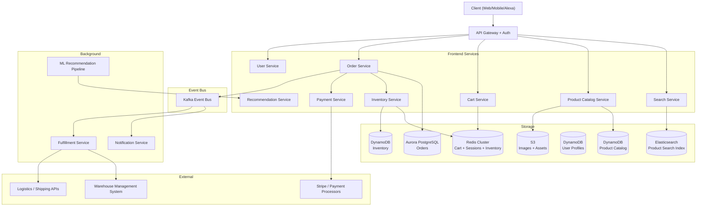

# Design: Amazon — E-commerce Platform

## Problem Statement

Amazon is one of the world's most complex software systems. It handles 200M+ active customers, hundreds of millions of product SKUs, real-time inventory across thousands of warehouses, and peak Black Friday traffic 10x above average — all while providing sub-second search results, consistent cart state, and guaranteed order delivery. No single team owns the whole system; instead hundreds of microservices collaborate through APIs and event streams.

---

## Why This System is Interesting

- **Product catalog**: Hundreds of millions of items with search, faceted filtering, and personalized ranking.
- **Shopping cart**: Deceptively simple but must handle concurrent sessions, guest-to-user merge, and survive service restarts.
- **Inventory**: Prevent overselling without making the purchase flow painfully slow.
- **Order state machine**: An order moves through 8+ states with different services owning each transition.
- **Payment**: Idempotent charges, fraud detection, multiple payment methods.
- **Black Friday**: 10x traffic spike requires pre-planned scaling, not reactive scaling.

---

## Functional Requirements

1. Users can search for products by keyword, category, brand, price range, ratings.
2. Users can view product detail pages with images, description, reviews, seller info.
3. Users can add/remove items from a shopping cart (guest and authenticated).
4. Users can place orders, choosing delivery address and payment method.
5. System validates inventory before confirming orders.
6. Order progresses through: placed → payment processing → confirmed → warehoused → shipped → out for delivery → delivered.
7. Users receive email/SMS updates at each state transition.
8. Users can cancel orders (before shipped) or initiate returns.
9. Sellers can list products and manage inventory.
10. Recommendation engine surfaces relevant products.

---

## Non-Functional Requirements

- **Search latency**: < 200ms for product search results.
- **Cart operations**: < 50ms (Redis-based).
- **Checkout latency**: < 2s including payment processing.
- **Inventory accuracy**: No overselling (strong consistency for inventory decrements).
- **Availability**: 99.99% uptime — every minute of downtime costs ~$500k.
- **Scale**: 200M customers; Black Friday peak of 100k orders/minute.
- **Data volume**: 400M product SKUs, 300M user accounts.

---

## Capacity Estimation

**Normal Load**
- 200M active customers; ~15M DAU
- Search queries: 2M/day = ~23 queries/sec average
- Product page views: 50M/day = ~580 pages/sec
- Orders: 2M/day = ~23 orders/sec average
- Cart operations: 20M/day = ~230 ops/sec

**Black Friday Peak (10x)**
- Orders: 100k orders/minute = ~1,667 orders/sec
- Search: 230 queries/sec
- Product views: 5,800 pages/sec
- Cart operations: 2,300 ops/sec

**Storage**
- Product catalog: 400M products × 5 KB metadata = 2 TB
- Product images: 400M × 10 images × 500 KB = 2 PB (stored in S3)
- Orders: 2M/day × 365 × 5 years = ~3.6B orders × 1 KB = ~3.6 TB
- User data: 300M users × 10 KB = 3 TB
- Inventory: 400M SKUs × 200 bytes = 80 GB (fits in memory)

---

## API Design

**Product Search**
```
GET /api/v1/search?q=wireless+headphones&category=electronics
  &min_price=50&max_price=200&brand=Sony,Bose
  &sort=relevance&page=1&page_size=20
  &prime_eligible=true

Response 200:
{
  "total": 4521,
  "page": 1,
  "results": [
    {
      "asin": "B08N5WRWNW",
      "title": "Sony WH-1000XM4 Wireless Headphones",
      "price": 279.99,
      "rating": 4.7,
      "review_count": 84621,
      "prime": true,
      "thumbnail": "https://cdn.amazon.com/..."
    }
  ],
  "facets": {
    "brands": [{"name": "Sony", "count": 143}],
    "price_ranges": [{"range": "100-200", "count": 891}]
  }
}
```

**Cart Operations**
```
PUT /api/v1/cart/items
Authorization: Bearer <token>

{
  "asin": "B08N5WRWNW",
  "quantity": 2,
  "seller_id": "A1B2C3"
}

Response 200:
{
  "cart_id": "cart_abc123",
  "item_count": 3,
  "subtotal": 609.97,
  "items": [...]
}
```

**Place Order**
```
POST /api/v1/orders
Authorization: Bearer <token>

{
  "cart_id": "cart_abc123",
  "shipping_address_id": "addr_xyz",
  "payment_method_id": "pm_stripe_123",
  "delivery_option": "prime_2day",
  "idempotency_key": "client-uuid-1234"
}

Response 201:
{
  "order_id": "112-3456789-0123456",
  "status": "placed",
  "estimated_delivery": "2026-07-10",
  "total": 624.97
}
```

---

## High-Level Architecture



---

## Core Components Deep Dive

### 1. Product Catalog & Search

The product catalog is a read-heavy system. Amazon has two layers:

**DynamoDB for raw product data**: Each product (ASIN) is stored as a document with attributes. DynamoDB provides single-digit millisecond reads by ASIN. Writes happen when sellers update listings.

**Elasticsearch for search**: A search index is built from DynamoDB via a streaming pipeline (DynamoDB Streams → Kafka → Elasticsearch indexer). The Elasticsearch index supports:
- Full-text search on title, description, brand
- Faceted filtering (category, price range, brand, Prime eligibility, ratings)
- Geospatial queries for warehouse proximity
- Custom scoring (relevance × click-through rate × review score × Prime status)

Search results are re-ranked by a machine learning model trained on user click data before being returned.

### 2. Shopping Cart

The cart has unique requirements: it must survive user logout/login, support guest → user merge, and be extremely fast (every product page has "Add to Cart").

**Redis as the primary cart store**: Each cart is a Redis hash:
```
HSET cart:{user_id}
  items:B08N5WRWNW:A1B2C3  '{"quantity": 2, "price": 279.99, "added_at": "..."}'
  items:B07FZ8S74R:A4B5C6  '{"quantity": 1, "price": 44.99, "added_at": "..."}'
  metadata  '{"currency": "USD", "last_updated": "..."}'
EXPIRE cart:{user_id} 2592000  // 30 days TTL
```

**Guest cart merge**: Guest cart is stored in Redis with `cart:{session_id}`. On login, the Cart Service merges guest cart items into the user cart (items in guest override user if in conflict) and deletes the guest cart.

**Cart durability**: Redis is in-memory. Amazon persists carts to DynamoDB asynchronously every few minutes as a backup. The cart Redis is configured with AOF persistence for durability.

### 3. Inventory Management

Preventing overselling is the core challenge. Inventory has two levels:
- **Physical inventory**: Actual units in warehouses, managed by WMS
- **Available-to-promise (ATP)**: Units available for new orders (= physical − reserved)

**Strategy**: Store ATP inventory in Redis as counters. On order placement:
```
DECRBY inventory:{asin}:{warehouse_id} {quantity}
// Returns new value; if < 0, INCRBY to roll back and return "out of stock"
```

Redis atomic operations (DECRBY) prevent race conditions. The physical inventory in DynamoDB is updated asynchronously after warehouse fulfillment.

**Safety buffer**: Amazon maintains a "soft floor" — when ATP drops to 5 units, listing shows "Only 5 left in stock!" and rate-limits further purchases. At 0, the listing shows "Out of Stock" even if physical inventory exists (safety buffer for fulfillment errors).

### 4. Order State Machine

An order is a long-running process that can take days. It's modeled as a state machine:

```
placed → payment_processing → payment_confirmed
       → inventory_reserved → pick_pack_in_progress
       → ready_to_ship → shipped → out_for_delivery
       → delivered

// Failure paths:
placed → payment_failed → cancelled
shipped → return_requested → return_in_transit → refunded
```

Each state transition is:
1. An event published to Kafka
2. The downstream service consumes the event, performs its work, publishes the next event
3. The Order Service updates its own state table

This event-driven approach decouples services. The Order Service doesn't call the Warehouse Service directly — it publishes `ORDER_CONFIRMED` to Kafka, and the Fulfillment Service consumes it.

### 5. Payment Processing

Idempotency is critical — a user's network drops after clicking "Place Order." Did it go through?

**Implementation**:
- Client generates a UUID `idempotency_key` before submitting.
- Order Service stores the key with status in a Redis idempotency table (TTL 24h).
- If the same key arrives again, return the stored result without re-processing.
- Stripe PaymentIntents are also inherently idempotent via their own idempotency key header.

**Flow**:
1. Create Stripe PaymentIntent (authorized, not captured)
2. Reserve inventory
3. Capture payment (charge card)
4. Confirm order

If capture fails after inventory reservation: release inventory, cancel order.
If order service crashes after capture: on recovery, check Stripe for payment status and complete or refund.

---

## Database Design

### Orders (Aurora PostgreSQL)

```sql
CREATE TABLE orders (
    id              VARCHAR(20) PRIMARY KEY,  -- Amazon format: 112-XXXXXXX-XXXXXXX
    user_id         BIGINT NOT NULL,
    status          VARCHAR(30) NOT NULL,
    currency        CHAR(3) DEFAULT 'USD',
    subtotal        DECIMAL(12,2),
    shipping_cost   DECIMAL(12,2),
    tax             DECIMAL(12,2),
    total           DECIMAL(12,2),
    shipping_address JSONB,
    payment_intent  VARCHAR(255),
    idempotency_key VARCHAR(255) UNIQUE,
    placed_at       TIMESTAMPTZ DEFAULT NOW(),
    confirmed_at    TIMESTAMPTZ,
    shipped_at      TIMESTAMPTZ,
    delivered_at    TIMESTAMPTZ
);

CREATE TABLE order_items (
    id          BIGSERIAL PRIMARY KEY,
    order_id    VARCHAR(20) REFERENCES orders(id),
    asin        VARCHAR(10),
    seller_id   VARCHAR(20),
    quantity    INT,
    unit_price  DECIMAL(10,2),
    warehouse_id VARCHAR(10)
);

CREATE TABLE order_events (
    id          BIGSERIAL PRIMARY KEY,
    order_id    VARCHAR(20) REFERENCES orders(id),
    event_type  VARCHAR(50),
    payload     JSONB,
    created_at  TIMESTAMPTZ DEFAULT NOW()
);

CREATE INDEX idx_orders_user ON orders(user_id, placed_at DESC);
CREATE INDEX idx_orders_status ON orders(status);
```

### Inventory (DynamoDB + Redis)

```
DynamoDB table: inventory
  PK: asin
  SK: warehouse_id
  Attributes: physical_qty, reserved_qty, atp_qty, last_updated

Redis hash: inventory:{asin}:{warehouse_id}
  atp: 47   // available-to-promise, decremented on order
```

**Why two databases for orders vs inventory?** Orders are relational (order_items join orders for fulfillment, returns, and analytics) — PostgreSQL's query flexibility is needed. Inventory is a simple key-value counter accessed by ASIN — DynamoDB + Redis provides the speed and atomicity needed.

---

## Scaling Strategy

**Black Friday prep**:
- Pre-scale: 2 weeks before, double EC2/ECS capacity; negotiate higher RDS instance sizes.
- Cache warming: Pre-load top 10k ASINs into Redis product cache.
- Feature flagging: Disable non-critical features (detailed recommendations, review highlights) to reduce load.
- Read replicas: Spin up 5+ Aurora read replicas; route product detail reads to replicas.
- Queue backpressure: Add SQS queues in front of inventory and payment services to absorb bursts.

**Search at scale**: Elasticsearch cluster with 20+ data nodes, 3 master nodes. Index sharded by category. Queries load-balanced across replica shards.

**Cart at scale**: Redis Cluster with 6 shards × 3 replicas = 18 Redis nodes. Cart keys sharded by user_id hash. 230 ops/sec normal, 2,300 peak — trivial for Redis Cluster.

---

## Key Bottlenecks and Solutions

| Bottleneck | Solution |
|---|---|
| Product search at 230 RPS peak | Elasticsearch cluster; results cached in Redis for popular queries |
| Inventory race conditions | Redis DECRBY atomic operations + DynamoDB conditional writes |
| Black Friday order spike (1,667/sec) | SQS queue in front of order processing; auto-scale workers |
| Cart durability in Redis | AOF persistence + async DynamoDB backup |
| Payment idempotency | Client-generated idempotency key; Redis dedup table with TTL |
| Order state coordination across services | Kafka event bus; each service owns its state transition |

---

## Trade-offs Made

1. **Cart in Redis (not PostgreSQL)**: Redis gives 50ms cart operations, but requires careful durability design (AOF + DynamoDB backup). PostgreSQL would be durable but 10x slower.

2. **Eventual consistency for search index**: New product listings take minutes to appear in search (DynamoDB Streams → Kafka → ES pipeline has latency). Sellers see this delay. Strong consistency for search would require synchronous writes to ES on every product update, slowing the write path.

3. **Microservices vs monolith**: Amazon famously moved to microservices (the "two-pizza team" rule). Each service (Cart, Order, Inventory, Payment) is independently deployable and scalable. Trade-off: distributed systems complexity, network failures, eventual consistency across services.

4. **Soft floor inventory**: Showing "Out of Stock" when 5 units remain prevents overselling edge cases at the cost of slightly lower sales conversion. Worth it for customer trust.

---

## Real-World: How Amazon Does It

Amazon invented the microservices architecture pattern (their internal "service-oriented architecture" mandate from Jeff Bezos in 2002 is famous). Key real-world details:
- **Dynamo (DynamoDB)** was built by Amazon for shopping cart storage, described in their seminal 2007 paper. It uses consistent hashing and eventual consistency with vector clocks.
- **Aurora** is Amazon's managed PostgreSQL/MySQL with 6-way replication across 3 AZs — used for transactional data like orders.
- **ElastiCache** (Redis) for session state, cart, and inventory counters.
- **A9** (now Amazon Advertising) runs the search and recommendation stack with custom ML ranking models trained on billions of click events.
- **AWS Lambda** handles unpredictable peak load for stateless operations (image resizing, notification dispatch) without pre-provisioning servers.

---

## Interview Discussion Points

1. **How do you handle a product going out of stock mid-checkout?** The inventory reservation happens during checkout (not on "add to cart"). If inventory drops to 0 between cart and checkout, the checkout returns an "inventory unavailable" error and the user must remove the item.

2. **How do you merge a guest cart when a user logs in?** Cart Service reads both guest (by session_id) and user carts. For duplicate items, take the higher quantity. Write merged result to user cart. Delete guest cart. Entire operation in a Redis transaction (MULTI/EXEC).

3. **How does Amazon prevent fraudulent orders?** A fraud scoring service runs in parallel with payment processing. It assigns a risk score (0-100) based on device fingerprint, IP, order history, velocity checks. High-risk orders are flagged for manual review or declined.

4. **What is the order of operations to prevent money-without-inventory bugs?** Always reserve inventory before charging. If inventory reservation fails → return error, never charge. If charge succeeds but inventory reservation fails (extremely rare) → issue full refund immediately.

---

## Summary

Amazon's e-commerce platform is a case study in microservices done at the extreme. Each component solves a specific problem with the right data store: Redis for fast, atomic cart and inventory operations; Elasticsearch for product discovery; PostgreSQL for ACID-compliant order management; DynamoDB for massive-scale product metadata. The order state machine, driven by Kafka events between services, is the backbone that lets hundreds of teams independently develop and deploy without coordinating schema migrations or deployment timing. The hardest single problem is inventory consistency — avoiding overselling while maintaining checkout speed — solved by Redis atomic decrements as the first checkpoint, with PostgreSQL as the durable record.
