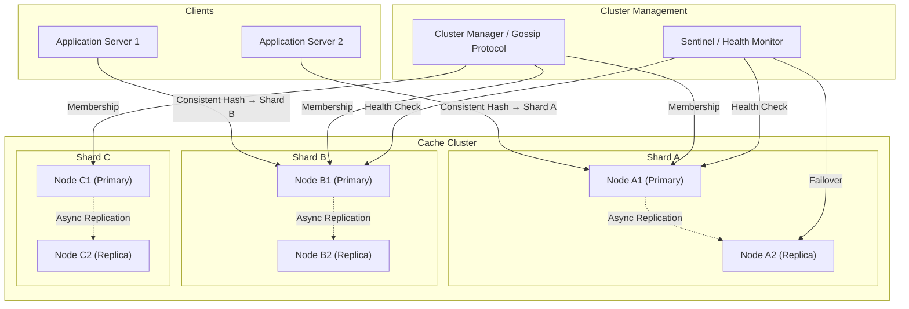

# Design: Distributed Cache — Redis at Scale

## Problem Statement

Build a distributed in-memory caching system from scratch — understanding the internals of Redis and Memcached. The system must store key-value pairs in memory for fast reads, distribute data across multiple nodes (no single node can hold everything), replicate data for fault tolerance, evict stale entries when memory is full, and handle cluster membership changes (adding/removing nodes) without downtime or data loss.

---

## Why This System is Interesting

This is a foundational infrastructure component. Understanding it deeply means understanding:
- **Data structures in memory**: How LRU cache is actually implemented (doubly linked list + hashmap).
- **Consistent hashing**: Why naive modular hashing fails for distributed systems.
- **Replication**: How writes propagate to replica nodes without sacrificing performance.
- **Eviction policies**: LRU, LFU, TTL — the math and trade-offs.
- **Network protocol**: Why Redis uses a simple text protocol (RESP) that's still faster than most RPC frameworks.
- **Persistence**: How an in-memory store can survive restarts.

---

## Functional Requirements

1. `SET key value [EX seconds]` — store key with optional TTL
2. `GET key` — retrieve value; return null if missing or expired
3. `DEL key` — delete a key
4. `EXISTS key` — check existence
5. `INCR / DECR key` — atomic integer increment/decrement
6. `MGET / MSET` — bulk operations
7. Keys distributed across N nodes using consistent hashing
8. Each key replicated on R nodes (default R=2)
9. LRU eviction when memory limit is reached
10. Optional persistence (snapshot or append-only log)
11. Add or remove nodes from cluster without full redistribution

---

## Non-Functional Requirements

- **Latency**: < 1ms for GET/SET on cache hit (in-memory).
- **Throughput**: 1M operations/second per node.
- **Availability**: Cache should degrade gracefully — losing one node should not cause complete outage.
- **Memory efficiency**: Minimize overhead per key (metadata, pointers).
- **Consistency**: Single-node operations are atomic; cluster operations are eventually consistent.

---

## Capacity Estimation

**Single Node**
- Modern server: 64-128 GB RAM
- Redis memory overhead per key: ~50 bytes (pointer, expiry metadata, LRU timestamp)
- 100-byte value → total ~150 bytes/entry
- 64 GB / 150 bytes = ~450M keys per node

**Cluster Sizing**
- Workload: 10B cached items, average 200 bytes/item
- Total data: 10B × 200 bytes = 2 TB
- With replication factor 2: 4 TB total memory
- At 64 GB/node: 4 TB / 64 GB = 63 nodes (~64 nodes, rounded for clean consistent hash ring)

**Throughput**
- Single Redis node: ~1M ops/sec (single-threaded event loop, I/O multiplexing)
- 64 nodes: ~64M ops/sec cluster-wide
- Network: 1M ops × 100 bytes avg = 100 MB/s per node — well within 10 GbE NIC capacity

---

## API Design

**Client API (RESP Protocol over TCP)**
```
// SET with TTL
*5\r\n$3\r\nSET\r\n$8\r\nusername\r\n$5\r\nhello\r\n$2\r\nEX\r\n$3\r\n300\r\n
// Response: +OK\r\n

// GET
*2\r\n$3\r\nGET\r\n$8\r\nusername\r\n
// Response: $5\r\nhello\r\n  (bulk string)
// Or: $-1\r\n  (null bulk string, key not found)

// INCR (atomic)
*2\r\n$4\r\nINCR\r\n$7\r\ncounter\r\n
// Response: :42\r\n  (integer)
```

**Cluster Routing (client-side)**
```python
def get(key: str) -> Optional[str]:
    node = consistent_hash(key)    # deterministic node selection
    return node.send_command("GET", key)

def set(key: str, value: str, ttl: int = None):
    node = consistent_hash(key)
    replicas = get_replica_nodes(node, count=R-1)
    # Write to primary
    node.send_command("SET", key, value, "EX", ttl)
    # Async write to replicas
    for replica in replicas:
        replica.send_async("SET", key, value, "EX", ttl)
```

---

## High-Level Architecture



---

## Core Components Deep Dive

### 1. LRU Cache: Data Structure

The single most important data structure in a cache. We need O(1) for both GET (find any key) and eviction (remove the least recently used key).

**Problem with a simple sorted structure**: A heap gives O(log n) for min-element access. We need O(1).

**Solution: Doubly Linked List + HashMap**

```
HashMap: key → Node pointer (O(1) lookup)
Doubly Linked List: nodes ordered by access time (head = MRU, tail = LRU)

struct Node {
    string key
    string value
    Node*  prev
    Node*  next
    time_t expiry       // 0 = no expiry
    size_t size         // memory occupied
}

struct LRUCache {
    unordered_map<string, Node*> map   // O(1) lookup
    Node* head                          // most recently used
    Node* tail                          // least recently used (eviction candidate)
    size_t capacity                     // max memory
    size_t current_size
}
```

**Operations**:
```
GET(key):
  node = map[key]
  if node == null: return null
  if node.expiry != 0 && now() > node.expiry:
    evict(node)
    return null
  move_to_head(node)   // O(1): pointer manipulation
  return node.value

SET(key, value, ttl):
  if map.contains(key):
    node = map[key]
    node.value = value
    node.expiry = now() + ttl
    move_to_head(node)
  else:
    node = new Node(key, value, now() + ttl)
    map[key] = node
    add_to_head(node)
    current_size += node.size
    while current_size > capacity:
      evict_lru()      // remove tail

evict_lru():
  node = tail
  remove_from_list(node)
  delete map[node.key]
  current_size -= node.size

move_to_head(node):
  // Unlink
  node.prev.next = node.next
  node.next.prev = node.prev
  // Relink at head
  node.next = head
  head.prev = node
  head = node
```

All operations are O(1). This is why Redis uses a similar structure internally (with approximated LRU using a sampled approach for efficiency at scale).

### 2. Consistent Hashing

**Why not simple modular hashing?**
With 10 nodes: `node = hash(key) % 10`. If you add an 11th node, almost every key remaps: `hash(key) % 11 ≠ hash(key) % 10`. You'd need to rehash ~91% of your cache → cache stampede → database overload.

**Consistent hashing**: Place both nodes and keys on a virtual ring (0 to 2^32). A key maps to the first node clockwise from its hash position.

```
Ring positions (0 to 2^32 - 1):

hash("node_A") = 0x1000  → Node A at position 4096
hash("node_B") = 0x5000  → Node B at position 20480
hash("node_C") = 0xA000  → Node C at position 40960

hash("user:123") = 0x3000  → between Node A and Node B → routes to Node B
hash("user:456") = 0x7000  → between Node B and Node C → routes to Node C
```

Adding Node D at position 0x6000: Only keys between 0x5000 and 0x6000 move (were going to Node C, now go to Node D). Typically ~1/N keys remapped.

**Virtual nodes (vnodes)**: Instead of placing each physical node at one ring position, place it at 150-300 virtual positions. This ensures even distribution even with heterogeneous hardware.

```python
class ConsistentHashRing:
    def __init__(self, vnodes=150):
        self.ring = SortedDict()   # position → node
        self.vnodes = vnodes

    def add_node(self, node: str):
        for i in range(self.vnodes):
            virtual_key = f"{node}:vnode:{i}"
            position = hash(virtual_key) % (2**32)
            self.ring[position] = node

    def get_node(self, key: str) -> str:
        position = hash(key) % (2**32)
        # Find first position >= key position (clockwise)
        idx = self.ring.bisect_left(position)
        if idx == len(self.ring):
            idx = 0  # wrap around
        return self.ring.peekitem(idx)[1]

    def get_replica_nodes(self, key: str, count: int) -> list:
        # Return count distinct nodes starting from key's primary
        position = hash(key) % (2**32)
        idx = self.ring.bisect_left(position)
        nodes = []
        seen = set()
        while len(nodes) < count:
            node = self.ring.peekitem(idx % len(self.ring))[1]
            if node not in seen:
                nodes.append(node)
                seen.add(node)
            idx += 1
        return nodes
```

### 3. Replication

**Primary-replica replication**: Each shard has one primary (handles writes) and R-1 replicas (handle reads, provide fault tolerance).

**Replication stream**: Primary logs every write command to an in-memory replication buffer. Replicas maintain a persistent connection and receive a stream of commands. Replicas replay commands in order.

```
Primary:
  On SET key value:
    1. Execute locally (update LRU cache)
    2. Append command to replication backlog
    3. Signal replicas

Replica:
  1. Connect to primary, send PSYNC <replication_id> <offset>
  2. If primary has backlog from offset: send incremental updates
  3. Else: full resync (primary sends RDB snapshot; replica loads it)
  4. After sync: stream of commands in real time
```

**Asynchronous replication trade-off**: Writes return to client before replica confirmation. If primary crashes after ACK but before replica receives the write, the write is lost. This is the fundamental availability-vs-durability trade-off.

Redis offers `WAIT num_replicas timeout` for semi-synchronous confirmation — blocks until N replicas confirm, with timeout. Used for critical writes.

### 4. Cluster Gossip Protocol

Nodes detect membership changes (joins, failures) through a gossip protocol. Each node periodically sends its known state to random peers. Nodes spread information in O(log N) rounds.

```
Gossip message format:
{
  "sender": "node_A",
  "epoch": 42,
  "nodes": [
    { "id": "node_A", "address": "10.0.1.1:6379", "state": "alive", "last_seen": 1720432800 },
    { "id": "node_B", "address": "10.0.1.2:6379", "state": "alive", "last_seen": 1720432795 },
    { "id": "node_C", "address": "10.0.1.3:6379", "state": "suspect", "last_seen": 1720432700 }
  ]
}
```

Node C's `last_seen` is 100 seconds ago → marked suspect. If still suspect after a threshold, marked failed. The primary for C's shard promotes its replica (using a leader election).

### 5. Cache Eviction Policies

| Policy | Description | When to Use |
|--------|-------------|-------------|
| LRU (Least Recently Used) | Evict key not accessed longest | General-purpose caching |
| LFU (Least Frequently Used) | Evict key accessed least often | When recent access patterns repeat |
| TTL-based | Evict on expiry | Session data, rate limits |
| Random | Evict random key | Low overhead when workload unknown |
| Volatile-LRU | LRU among keys with TTL set | Preserve permanent keys |
| allkeys-LFU | LFU across all keys | Hot-cold data separation |

Redis uses an **approximated LRU**: sampling 5-10 random keys and evicting the one with the oldest LRU timestamp. This avoids maintaining a full LRU list across millions of keys (memory overhead) while approximating true LRU with >95% accuracy.

### 6. Persistence Options

**RDB (Redis Database Snapshot)**
- Full memory dump at intervals (every 5 minutes, every hour).
- Compact binary format.
- On restart: load the snapshot. Loss = writes since last snapshot.
- Good for: disaster recovery, backup.

**AOF (Append-Only File)**
- Every write command appended to a log file.
- On restart: replay all commands.
- `fsync` policy: always (safest, slowest), every second (good balance), never (fastest, OS decides).
- AOF grows large; compacted via background rewrite (creates minimal set of commands to recreate current state).
- Good for: durability requirements.

**Hybrid (Redis default in 7.x)**: Load from RDB snapshot, then replay AOF from the point of the snapshot. Fast startup + full durability.

### 7. Network Protocol: RESP

Redis Serialization Protocol (RESP) is intentionally simple:
- `+OK\r\n` — simple string
- `-Error message\r\n` — error
- `:42\r\n` — integer
- `$5\r\nhello\r\n` — bulk string (length-prefixed)
- `*3\r\n:1\r\n:2\r\n:3\r\n` — array

Why not JSON or Protocol Buffers? RESP is parseable in a single pass with no schema lookup. A Redis server parses 100 bytes of RESP in nanoseconds. JSON parsing is 10-100x slower due to string scanning.

---

## Database Design (Internal Key Layout)

```
Key storage in hash table:
  dictEntry {
    sds key;            // Simple Dynamic String
    robj *value;        // Redis object (string, list, hash, set, zset)
    dictEntry *next;    // chaining for collision
  }

  robj {
    unsigned type:4;    // OBJ_STRING, OBJ_LIST, etc.
    unsigned encoding:4; // RAW, INT, EMBSTR, ZIPLIST, etc.
    unsigned lru:24;    // LRU clock (seconds)
    int refcount;
    void *ptr;          // pointer to actual data
  }
```

Redis uses different encodings based on data size:
- Short strings (≤44 bytes): embedded in the `robj` struct (`EMBSTR`) — no extra allocation
- Integers: stored directly as a pointer cast to int (`OBJ_ENCODING_INT`) — no allocation
- Lists ≤128 items: `LISTPACK` (flat memory layout) → more compact than linked list
- Hashes ≤128 fields: `LISTPACK` (ZipList style)

This explains why Redis is so memory-efficient: data encoding is automatically chosen to minimize bytes.

---

## Scaling Strategy

**Adding a node to the cluster**:
1. Start new node (empty).
2. Cluster Manager assigns it hash slots from existing nodes (each existing node donates `total_slots / new_node_count` slots).
3. Data migration: for each migrating slot, keys are moved atomically (`MIGRATE` command).
4. During migration, a redirecting mechanism (`-ASK` response) tells clients where to find keys in transit.
5. After migration complete, slot ownership is updated in cluster metadata.

**Read scaling**: Route GET requests to replicas. Client-side library uses replica nodes for reads when `readonly` mode is set. Replica reads are slightly stale (milliseconds behind primary).

**Hot key problem**: A single key receiving millions of requests/sec overloads one shard. Solutions:
- Key splitting: `user:123:shard:0`, `user:123:shard:1` ... `user:123:shard:N`. Client hashes to a random shard.
- Local client cache: Cache the hot key in the application process memory (L1 cache) with a 100ms TTL. Redis becomes L2.

---

## Key Bottlenecks and Solutions

| Bottleneck | Solution |
|---|---|
| Single-threaded Redis CPU bound | I/O threads in Redis 6+ (multi-threaded network I/O, single-threaded command execution) |
| Hot key overloads one shard | Key splitting or local client-side cache |
| Adding nodes causes cache stampede | Gradual slot migration; ASK redirects; keep old data available during migration |
| Large value serialization | Compress large values with LZ4/Snappy before storing; store binary |
| Memory fragmentation | `jemalloc` allocator; `MEMORY PURGE` command to return memory to OS |
| Replication lag under heavy write load | Increase replication buffer size; monitor `replication_backlog` |

---

## Trade-offs Made

1. **Approximate LRU vs exact LRU**: Exact LRU requires maintaining a global sorted structure (O(log N) updates). Redis approximates with sampling — 95%+ accuracy with O(1) overhead. Worth the trade-off at scale.

2. **Asynchronous replication**: Primary doesn't wait for replica confirmation. Writes can be lost if primary fails. Alternative (synchronous) dramatically reduces throughput. Cache systems tolerate data loss better than databases — a cache miss just goes to the backing store.

3. **Single-threaded command execution**: Redis executes commands on a single thread — no lock contention, simple reasoning about atomicity. Trade-off: can't use multiple cores for commands. Multi-threaded I/O in Redis 6 partially addresses this by offloading network reads/writes.

4. **In-memory only (no disk tiering)**: Redis doesn't automatically spill to disk when RAM is full — it evicts. Alternative: a tiered cache (like Caffeine → Memcached → Redis) adds complexity but provides larger effective cache size.

---

## Real-World: How Redis Cluster Works

Redis Cluster (released in Redis 3.0) uses 16,384 hash slots. Each key maps to a slot via `CRC16(key) % 16384`. Slots are assigned to nodes. Multi-key operations require all keys to be in the same slot — use hash tags `{user:123}:orders` and `{user:123}:profile` to force same slot.

Redis's actual eviction is done in `activeExpireCycle()` — a background job that samples 20 random keys per cycle, deletes expired ones, and repeats if > 25% were expired (to avoid letting expired keys accumulate). Lazy expiry also deletes on access.

Production Redis deployments (e.g., Twitter's Twemcache, GitHub's Redis) typically run dozens of standalone Redis instances rather than Redis Cluster, with client-side sharding, because Cluster's cross-slot operation limitations complicate application code.

---

## Interview Discussion Points

1. **Why does Redis use a single thread?** Eliminates lock contention. A single-threaded event loop (like Nginx) handles thousands of connections via epoll/kqueue I/O multiplexing. The bottleneck is rarely CPU for in-memory operations — it's network I/O, which multi-threaded network (Redis 6+) addresses.

2. **What happens during a Redis failover?** Replicas run an election: each candidate broadcasts a `FAILOVER_AUTH_REQUEST`; masters in majority of shards vote; first candidate to reach majority wins and becomes the new primary. Typically completes in 1-3 seconds.

3. **How does consistent hashing handle a node failure differently from adding a node?** On failure: all the failed node's keys are unavailable until replicas are promoted (seconds). With replication, replicas serve the keys immediately after promotion — minimal downtime. Without replication, those keys are cache-missed until the node recovers or data is redistributed.

4. **What is the difference between Redis and Memcached?** Redis: rich data structures (lists, hashes, sets, sorted sets), persistence options, replication, Lua scripting, transactions. Memcached: simpler, multi-threaded, pure string key-value, slightly faster for simple GET/SET under very high concurrency. Use Redis unless you need Memcached's multi-threading model and have only string use cases.

---

## Summary

A distributed cache is a masterclass in applying data structures (LRU via doubly linked list + hashmap) and distributed systems primitives (consistent hashing, gossip protocol, leader election) to build a system that provides sub-millisecond access to frequently needed data. Redis's success comes from a series of deliberate design choices: single-threaded execution eliminates concurrency bugs, RESP protocol minimizes parsing overhead, approximate LRU avoids maintaining expensive global state, and consistent hashing enables online cluster resizing. The core engineering insight is that a cache must degrade gracefully — a cache miss is a performance issue, not a correctness issue — which justifies asynchronous replication, approximate algorithms, and eventual consistency in a way that databases cannot accept.
