# 04. Design Patterns Reference Card

Every system design interview answer draws from a small set of recurring architectural patterns. When you recognize the problem, you should immediately know which pattern to reach for. This reference card lists the most important patterns, with a clear description, a diagram, and the conditions under which you would use each one.

---

## 1. Cache-Aside (Lazy Loading)

**Problem it solves:** Database reads are slow (5–20ms). Popular data is read thousands of times per second. The database cannot sustain the load.

**Solution:** The application checks the cache first. On a miss, it reads from the database and writes the result to the cache. Subsequent reads hit the cache.

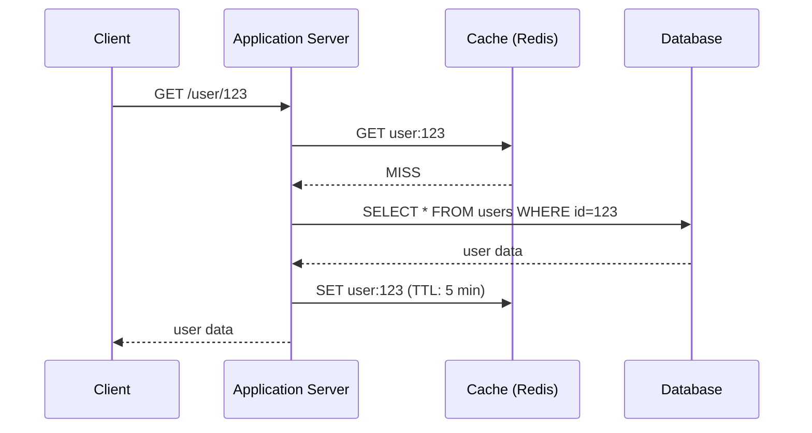

**When to use:**
- Read-heavy workloads with repeated access to the same data.
- Data that changes infrequently (user profiles, product catalog).
- You can tolerate slightly stale data (TTL controls staleness).

**Trade-offs:**
- Cache miss penalty: first request pays full DB latency.
- Stale data: cache may serve outdated data until TTL expires.
- Thundering herd: if many requests miss the cache simultaneously, all hit the database. Mitigate with request coalescing or probabilistic early expiration.

**Real-world example:** Twitter caches user profiles, tweet content, and pre-computed timelines in Redis. Most reads never touch the database.

---

## 2. Write-Through Cache

**Problem it solves:** Cache-aside can serve stale data. You need the cache to always be consistent with the database.

**Solution:** Every write goes to the cache AND the database, synchronously. Reads always hit the cache.

**When to use:** When you can tolerate slightly higher write latency but need read consistency. Bank account balances, inventory counts.

**Trade-offs:** Higher write latency (two writes instead of one). Cache may contain rarely-read data that was written but never read (wasted memory).

---

## 3. Write-Behind (Write-Back) Cache

**Problem it solves:** Write throughput is too high for the database to keep up with synchronously.

**Solution:** Writes go to the cache immediately (fast ack to client). The cache asynchronously flushes data to the database in batches.

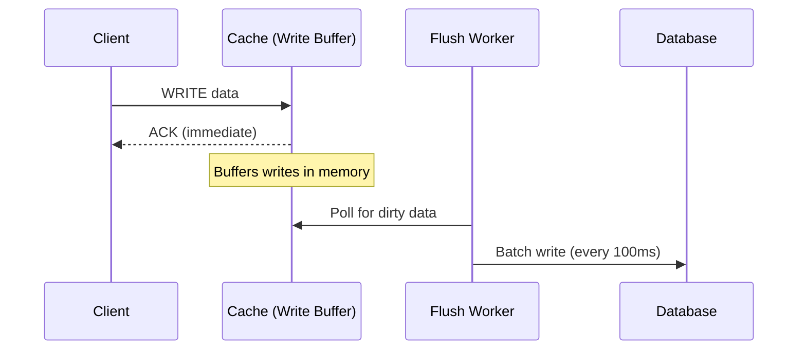

**When to use:**
- Extremely write-heavy workloads (logging, telemetry, analytics).
- Batch writes are much more efficient than individual writes.
- Some data loss on cache failure is acceptable.

**Trade-offs:** If the cache crashes before flushing, writes are lost. Not suitable for financial transactions. Requires a durable write-ahead log in the cache to mitigate data loss.

**Real-world example:** MySQL's InnoDB buffer pool uses write-behind. Time-series databases (InfluxDB, TimescaleDB) batch incoming data points before writing to disk.

---

## 4. Fan-Out: Push (Write-Time) vs. Pull (Read-Time)

**Problem it solves:** When User A posts content, their followers need to see it. How do you distribute the content to all followers efficiently?

**Push model (fan-out on write):** When A posts, immediately write the post_id to each follower's inbox. Read is O(1) — just read the inbox.

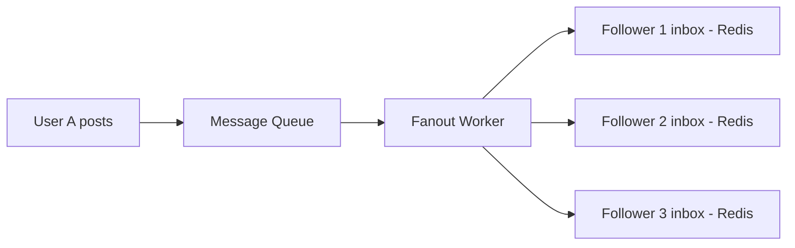

**Pull model (fan-out on read):** When B reads their feed, query all people B follows and merge their recent posts. Write is O(1); read is expensive.

**Hybrid model (best practice):** Push for regular users. Pull for celebrity accounts with millions of followers (prevents write storms).

| | Push Model | Pull Model |
|--|-----------|------------|
| Write cost | O(followers) | O(1) |
| Read cost | O(1) | O(following count) |
| Storage | Higher (precomputed) | Lower |
| Staleness | Low | Can be fresher |
| Best for | Most users | Celebrity accounts |

---

## 5. Database Sharding

**Problem it solves:** A single database node can no longer handle the data volume or query load. You need to distribute data across multiple nodes.

**Solution:** Partition data such that each shard holds a subset of the total data. All nodes together hold the complete dataset.

### Sharding by User ID (Range-based)

Users 1–1M go to Shard 1, 1M–2M to Shard 2, etc.

**Problem:** Uneven load. New users (higher IDs) all go to the newest shard. Old shards sit idle.

### Sharding by Hash of User ID

Hash the user_id and mod by the number of shards. Evenly distributes load.

**Problem:** Adding a shard requires re-hashing and moving data. Use consistent hashing to minimize data movement.

### Sharding by Geography

Users in the US on US-East servers, Europe on EU servers.

**Best for:** Regulatory requirements (GDPR), latency (data close to users).

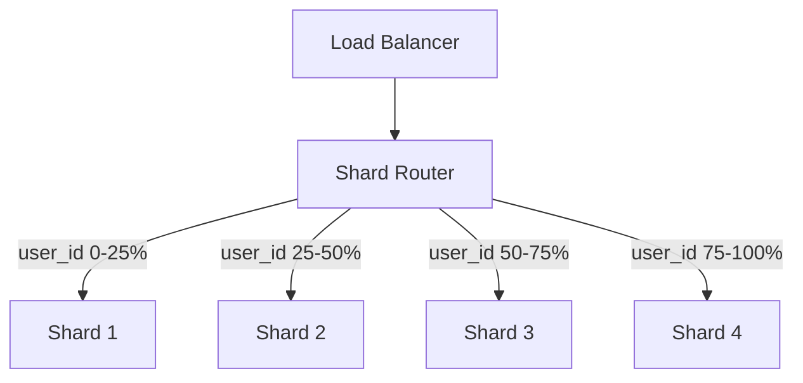

**Trade-offs of sharding:**
- Cross-shard queries (JOINs across shards) are expensive or impossible.
- Transactions across shards require distributed transaction protocols.
- Operational complexity increases significantly.
- Resharding (when you add nodes) requires careful data migration.

---

## 6. Saga Pattern (Distributed Transactions)

**Problem it solves:** A business operation spans multiple microservices, each with its own database. You need either all steps to succeed or all to roll back — but a 2PC across services is too slow and fragile.

**Solution:** Break the transaction into a series of local transactions. If any step fails, execute compensating transactions to undo previous steps.

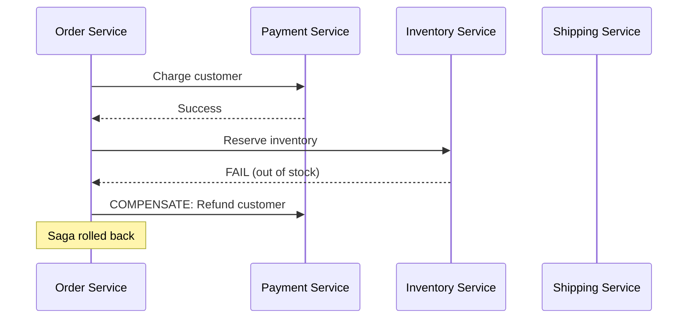

**Choreography vs. Orchestration:**
- **Choreography:** Each service publishes events; other services react. Decoupled but harder to debug.
- **Orchestration:** A central Saga Orchestrator directs each step and handles failures. Easier to reason about.

**When to use:** E-commerce order placement, hotel+flight booking, any multi-step business process across services.

**Trade-offs:** Complex to implement. Compensating transactions must be idempotent. Temporary inconsistency is visible between steps.

---

## 7. Circuit Breaker

**Problem it solves:** When Service B is overloaded or failing, Service A keeps sending requests, causing cascading failure through the system.

**Solution:** Wrap calls to Service B in a circuit breaker. After N consecutive failures, the breaker "opens" and immediately returns an error without calling B, giving B time to recover.

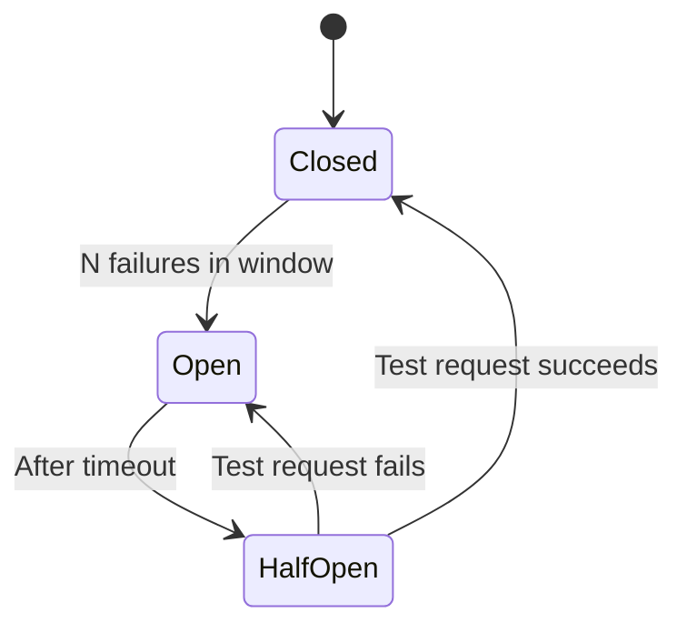

**States:**
- **Closed:** Normal operation. Requests pass through.
- **Open:** B is failing. Return error immediately (fast fail). No requests sent to B.
- **Half-Open:** After a timeout, send one test request to B. If it succeeds, close the breaker. If it fails, re-open.

**When to use:** Any synchronous service-to-service call. Especially important when downstream services have strict SLAs.

**Real-world example:** Netflix Hystrix (now deprecated, replaced by Resilience4j). The concept is implemented in service meshes like Istio automatically.

---

## 8. CQRS (Command Query Responsibility Segregation)

**Problem it solves:** Read and write operations have very different performance characteristics. Optimizing a single data model for both is a compromise.

**Solution:** Separate the write model (commands — accepting updates, enforcing business rules) from the read model (queries — optimized for fast reads, pre-joined, denormalized).

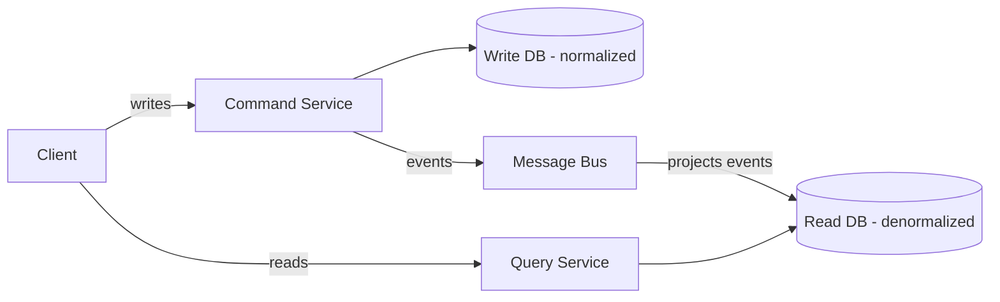

**When to use:**
- Complex domain logic on writes but simple fast queries on reads.
- The read and write workloads scale very differently.
- Event sourcing (CQRS and event sourcing pair naturally).

**Trade-offs:** Eventual consistency between write and read models (until events propagate). Increased system complexity — two data models to maintain.

**Real-world example:** An e-commerce system where order placement has complex validation (inventory, fraud, payment) but order history display needs a simple, fast query.

---

## 9. Event Sourcing

**Problem it solves:** How do you reconstruct state at any point in time? How do you audit every change to an entity's state?

**Solution:** Instead of storing current state, store the sequence of events that led to the current state. Current state = replay of all events from the beginning.

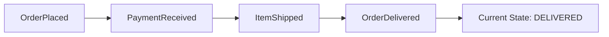

**Benefits:**
- Full audit log is inherent.
- Can rebuild state at any point in time.
- Natural fit with CQRS (events drive read-model projections).
- Append-only log is efficient.

**Trade-offs:** Querying current state requires event replay (expensive for long event streams — mitigate with periodic snapshots). Eventually consistent read models. More complex than CRUD.

**When to use:** Financial transactions (bank account balance = sum of all credits and debits), order management, audit-sensitive domains.

---

## 10. Outbox Pattern

**Problem it solves:** You need to update your database AND publish an event to a message queue atomically. If the DB write succeeds but the event publish fails, your downstream services are out of sync.

**Solution:** Write the event to an "outbox" table in the same database transaction as your business data. A separate relay process reads unprocessed outbox entries and publishes them to the message queue, then marks them processed.

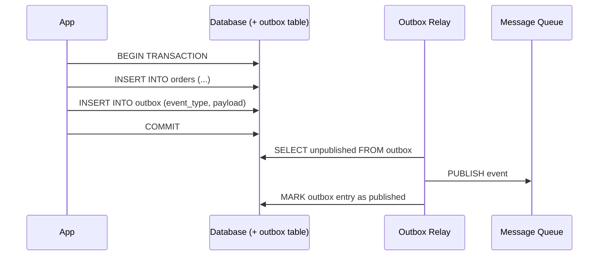

**When to use:** Any time you need a database write and a message publish to be atomic. Order placement, user registration, payment processing.

**Trade-offs:** At-least-once delivery (relay may publish duplicates). Consumers must be idempotent. The outbox table can grow if the relay falls behind.

---

## 11. Two-Phase Commit (2PC)

**Problem it solves:** A transaction spans two or more databases or services, and you need all-or-nothing atomicity.

**Solution:** Phase 1 (Prepare): Coordinator asks all participants to prepare (lock resources, write to WAL). Phase 2 (Commit): If all prepared successfully, coordinator tells all to commit. If any fails, coordinator tells all to rollback.

**When to use:** Cross-database transactions where you cannot use the Saga pattern (e.g., legacy systems without compensating transaction support).

**Trade-offs:** Coordinator is a SPOF. If the coordinator crashes between Phase 1 and Phase 2, participants are stuck holding locks until recovery. Slow — requires two round trips + locking. Avoided in large-scale distributed systems for these reasons.

---

## 12. Bloom Filter

**Problem it solves:** Checking whether an item exists in a large set is expensive (e.g., "has this URL been crawled?", "has this username been taken?"). A hash set would use too much memory.

**Solution:** A space-efficient probabilistic data structure. Can definitively say "definitely NOT in set" or "probably in set." No false negatives; some false positives.

**When to use:**
- Web crawlers (avoid re-crawling visited URLs).
- Databases (avoid disk lookups for non-existent keys — Cassandra uses this internally).
- Username availability check (avoid DB query for common names that are definitely taken).
- Spam filter (quick reject of known-bad email addresses).

**Real-world example:** Cassandra uses a Bloom filter per SSTable so that reads for non-existent rows don't require checking every SSTable file on disk.

---

## 13. Consistent Hashing

**Problem it solves:** When you add or remove a node from a distributed cache or database cluster, standard modulo hashing (key % n_nodes) requires remapping nearly all keys, causing a thundering herd.

**Solution:** Arrange nodes on a hash ring (0 to 2^32). A key maps to the nearest node clockwise on the ring. When a node is added/removed, only keys in that node's range need to move — about 1/N of all keys.

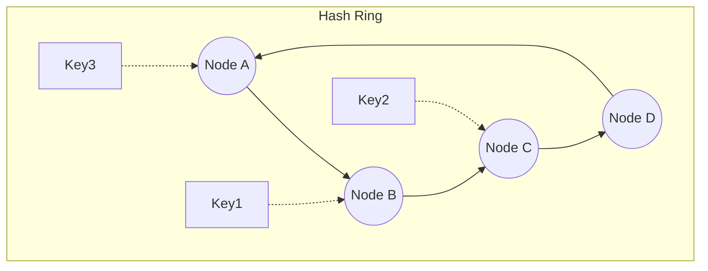

**Virtual nodes:** Each physical node owns multiple positions on the ring (virtual nodes). This ensures even distribution even with heterogeneous hardware.

**When to use:** Distributed caches (Redis Cluster, Memcached), distributed storage (Cassandra, DynamoDB), load balancing with sticky sessions.

---

## 14. Leader-Follower (Primary-Replica)

**Problem it solves:** A single database node becomes a read bottleneck. You also need fault tolerance — if the primary fails, data should remain available.

**Solution:** One primary node accepts all writes. Zero or more replica nodes replicate the write log and serve reads.

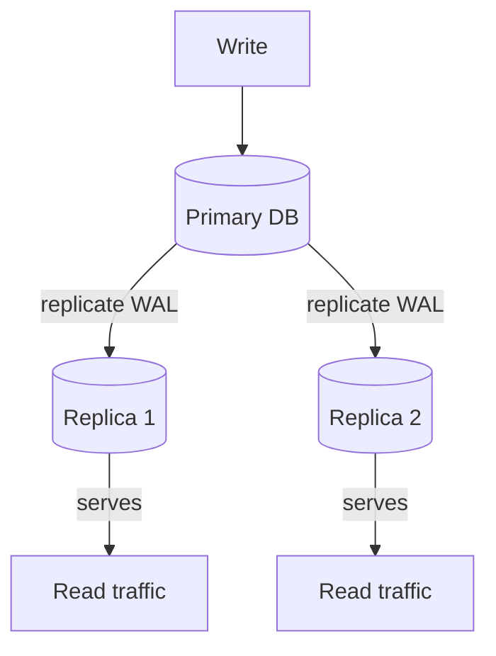

**Synchronous vs. Asynchronous replication:**
- Synchronous: write ack'd only when replica confirms receipt. No data loss on failover. Higher write latency.
- Asynchronous: write ack'd when primary writes. Replica may lag. Lower latency but potential data loss on failover.

**When to use:** Almost every production relational database deployment. Read-heavy systems that can tolerate eventual consistency between primary and replicas.

---

## 15. Sidecar Pattern

**Problem it solves:** Cross-cutting concerns (service discovery, mTLS, logging, tracing, circuit breaking) need to be consistent across all services. Embedding this logic in every service is duplicative and error-prone.

**Solution:** Deploy a proxy ("sidecar") container alongside each service instance. All traffic in and out of the service passes through the sidecar, which handles cross-cutting concerns transparently.

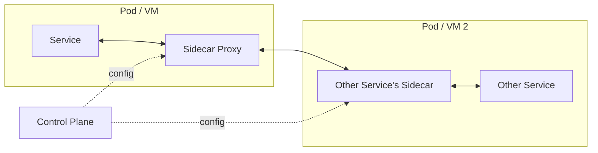

**Examples of sidecar functionality:** mTLS between services, circuit breaking, retries with backoff, distributed tracing injection, metrics collection, service discovery.

**When to use:** Microservices architectures where you run a service mesh (Istio, Linkerd, Envoy). The sidecar is deployed automatically by the orchestrator (Kubernetes).

**Real-world example:** Istio deploys an Envoy proxy sidecar in every pod. Every request between services goes through the sidecar, giving you automatic mTLS, observability, and traffic management without changing application code.

---

## Pattern Selection Cheat Sheet

| Situation | Pattern to Reach For |
|-----------|---------------------|
| Read-heavy system, DB under pressure | Cache-Aside + Read Replicas |
| Write-heavy, can tolerate async flush | Write-Behind Cache, Message Queue |
| Social feed, one-to-many distribution | Fan-Out (push/pull hybrid) |
| DB too large for one node | Sharding + Consistent Hashing |
| Business process spans multiple services | Saga Pattern |
| Downstream service is flaky | Circuit Breaker |
| Reads and writes have different models | CQRS |
| Need full audit history | Event Sourcing |
| DB write + event publish must be atomic | Outbox Pattern |
| Distributed transaction (legacy) | Two-Phase Commit |
| Membership check over huge set | Bloom Filter |
| Cache cluster, nodes added/removed often | Consistent Hashing |
| DB read scaling + fault tolerance | Leader-Follower Replication |
| Cross-cutting concerns in microservices | Sidecar (Service Mesh) |
