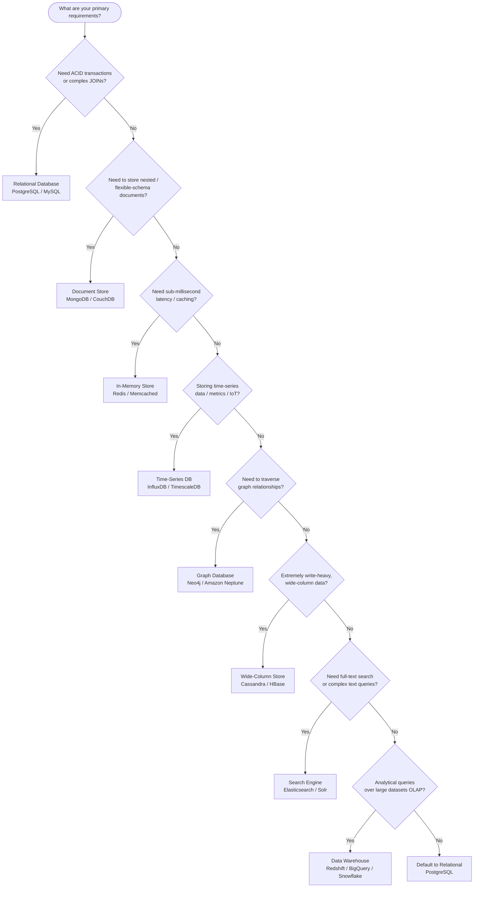

# 06. SQL vs NoSQL Decision Guide

One of the first decisions in any system design is the database. Getting it wrong means either under-serving your access patterns (slow queries, painful schema migrations) or over-engineering (operational complexity you don't need).

This guide gives you a structured process for choosing a database in interviews and in practice.

---

## Decision Tree

---

## Relational Databases (SQL)

**Primary options:** PostgreSQL, MySQL, SQLite (embedded), Oracle, SQL Server

### Strengths
- **ACID transactions:** Atomicity, Consistency, Isolation, Durability. This is the gold standard for correctness. If you need "either both records are written or neither is," SQL is your tool.
- **Complex queries:** JOINs across multiple tables, aggregations, window functions — SQL handles these natively with the query planner optimizing execution automatically.
- **Schema enforcement:** Data integrity constraints (foreign keys, unique constraints, check constraints) are enforced by the database, preventing bad data from entering.
- **Mature ecosystem:** 50 years of tooling, ORMs, migration frameworks, backup tools, and DBA knowledge.
- **Well-understood scaling:** Vertical scaling (bigger hardware), read replicas, connection pooling — all well-documented.

### Weaknesses
- **Schema migrations are expensive:** Adding a column to a 100 million row table can lock the table for minutes or require careful online migration tooling.
- **Vertical scaling ceiling:** A single PostgreSQL node tops out at roughly 10,000–50,000 QPS. Horizontal sharding is complex and breaks some SQL features (cross-shard JOINs).
- **Object-relational impedance mismatch:** Storing nested objects (a user with an array of addresses) requires either multiple tables + JOINs, or JSON columns (a hybrid approach).

### Scaling Characteristics
- **Single node:** Up to ~20,000 QPS (indexed reads)
- **With read replicas:** 5–10x read scaling
- **With connection pooling (PgBouncer):** Handles many more concurrent connections
- **With sharding:** Near-linear horizontal scaling, but requires application-level routing

### When FAANG Uses SQL
- **Google:** Cloud Spanner (distributed SQL with global ACID transactions) for financial systems, inventory, ads billing
- **Facebook/Meta:** MySQL at massive scale with custom sharding (Vitess, later their own layers)
- **Uber:** PostgreSQL for trips, payments, driver records — strict consistency required
- **Airbnb:** MySQL for bookings, payments — ACID properties essential
- **Amazon:** RDS Aurora for order management, user accounts

---

## Document Databases

**Primary options:** MongoDB, CouchDB, Amazon DocumentDB, Firestore

### Strengths
- **Flexible schema:** Documents don't need a fixed schema. New fields can be added without a migration. This is ideal during rapid development or when the domain model evolves frequently.
- **Native nested data:** A user document can contain an array of addresses, an embedded profile, and a list of recent orders — no JOINs needed.
- **Horizontal scaling:** MongoDB's native sharding distributes documents across shards with automatic balancing.
- **Developer-friendly:** The document model maps naturally to how most applications represent data (JSON/objects).

### Weaknesses
- **No multi-document ACID transactions (historically):** MongoDB added multi-document transactions in v4.0, but they are slower and less idiomatic. The document model discourages transactions by design.
- **No true JOINs:** Embedding is the alternative to JOINs. Designing a document model requires thinking carefully about access patterns upfront.
- **Duplication:** Embedding denormalizes data. Updating a piece of data (e.g., a user's address embedded in many orders) requires updating many documents.

### Scaling Characteristics
- Shards by shard key; chooses the key carefully to avoid hotspots
- Secondary indexes on any field; compound indexes for common query patterns
- Change streams for real-time event-driven applications

### When to Use
- Product catalogs (attributes vary by product category)
- User profiles with varying fields
- Content management systems
- Mobile app backends where schema evolves rapidly

---

## In-Memory Stores (Cache)

**Primary options:** Redis, Memcached, DragonflyDB

### Strengths
- **Sub-millisecond latency:** RAM access is 100ns. Redis round-trip within a datacenter is under 1ms. This is 10–100x faster than any disk-backed database.
- **Rich data structures (Redis):** Strings, hashes, lists, sets, sorted sets, streams, geospatial indexes. These map naturally to many common use cases.
- **Atomic operations:** INCR, LPUSH, ZADD are atomic. Combined with Lua scripts, you can build complex atomic operations.
- **TTL support:** Built-in key expiration. Perfect for session storage, caches, and rate limiting.

### Weaknesses
- **Limited data size:** Bounded by available RAM. You cannot store all of your production data in Redis.
- **Durability trade-offs:** Redis persistence (RDB snapshots, AOF logging) adds overhead. Without persistence, data is lost on restart.
- **Not a primary data store:** Redis is a cache and auxiliary store. Your source of truth should be a durable database.

### Primary Use Cases
- **Session storage:** User authentication sessions (fast read, TTL expires them automatically)
- **Cache:** Pre-computed results, hot database rows, API responses
- **Rate limiting:** Atomic INCR with TTL for request counting
- **Leaderboards:** Sorted sets (ZADD/ZRANGE) for real-time rankings
- **Pub/Sub:** Real-time message broadcasting
- **Distributed locks:** SET NX EX for mutex locks
- **Pre-computed feeds:** Twitter timelines stored as Redis sorted sets

### When FAANG Uses Redis
- **Twitter:** User timelines (sorted sets), rate limiting, session storage
- **GitHub:** Caching, job queues (Sidekiq)
- **Pinterest:** Social graph caching, feed generation
- **Snapchat:** Stories, session data

---

## Time-Series Databases

**Primary options:** InfluxDB, TimescaleDB (PostgreSQL extension), Prometheus, Victoria Metrics, Amazon Timestream

### Strengths
- **Optimized write throughput:** Designed for high-rate sequential writes (millions of data points per second).
- **Built-in time functions:** Downsampling, aggregation over time windows, rate calculations — all native.
- **Efficient storage:** Time-series data compresses extremely well (delta-of-delta encoding reduces storage by 10x vs. raw).
- **Retention policies:** Automatic data expiration and downsampling (keep 1-minute data for 1 month, hourly summaries for 1 year).

### Weaknesses
- **Single access pattern:** Optimized for time-range queries. Poor for relational queries or document lookups.
- **Not a general store:** You would not store user accounts in InfluxDB.

### When to Use
- Application metrics (CPU, memory, request latency)
- IoT sensor data
- Financial tick data (stock prices)
- Infrastructure monitoring (Prometheus is the standard)
- Any data where the primary query is "what happened between time T1 and T2?"

---

## Graph Databases

**Primary options:** Neo4j, Amazon Neptune, TigerGraph, JanusGraph

### Strengths
- **Efficient traversal:** Finding "friends of friends," shortest path between nodes, all nodes within N hops — operations that require recursive JOINs in SQL are native traversals in a graph DB.
- **Natural data model:** Entities (nodes) and relationships (edges) map directly to many real-world domains.
- **Flexible relationship properties:** Edges can have attributes (e.g., "followed since: 2022-01-01").

### Weaknesses
- **Niche use cases:** Most applications don't need graph traversal. Using a graph DB when you don't need it adds operational complexity for no benefit.
- **Not for bulk analytics:** Graph databases are optimized for traversal, not for aggregating across all records.
- **Operational maturity:** Less mature tooling compared to SQL or Redis.

### When to Use
- Social network friend recommendations ("people you may know")
- Fraud detection (transaction chains, account clusters)
- Knowledge graphs
- Network topology (which services depend on which)
- Recommendation engines with explicit relationship modeling

---

## Wide-Column Stores

**Primary options:** Apache Cassandra, HBase, Amazon DynamoDB (shares characteristics), Google Bigtable

### Strengths
- **Linear horizontal scaling:** Add nodes, get proportionally more throughput and storage. Cassandra scales to hundreds of nodes routinely.
- **Write-optimized:** LSM tree storage engine converts random writes into sequential writes. Very high write throughput (10,000–100,000 writes/sec per node).
- **Tunable consistency:** Per-operation choice of consistency level (ONE, QUORUM, ALL).
- **No single point of failure:** All nodes are equal (no primary/replica distinction in Cassandra). Any node can handle any request.
- **Geographic distribution:** Multi-datacenter replication is built-in.

### Weaknesses
- **No ad-hoc queries:** Queries must follow the data model. You design the table around the queries you need to run, not the other way around. Secondary indexes are limited and expensive.
- **No JOINs:** Cassandra has no JOIN support. Denormalization is required.
- **Eventual consistency:** By default, reads may return stale data. Requires careful consistency level selection for strong consistency.
- **Schema design is hard:** A poor partition key choice creates hot partitions, destroying performance.

### When FAANG Uses Cassandra/Wide-Column
- **Netflix:** Viewing history, user data — hundreds of billions of rows
- **Apple:** 75,000+ Cassandra nodes for iCloud
- **Discord:** Billions of messages stored
- **Instagram:** User feed, media metadata
- **Facebook:** Messages (Hbase-based)

---

## Search Engines

**Primary options:** Elasticsearch, OpenSearch (AWS fork), Apache Solr, Typesense, Meilisearch

### Strengths
- **Full-text search:** Inverted index enables relevance-ranked text search that relational databases cannot match.
- **Faceted search:** Filter by multiple attributes simultaneously with counts (e.g., "electronics + price $50–100 + 4-star+ rating").
- **Fuzzy matching:** Handles typos, synonyms, stemming.
- **Aggregation and analytics:** Real-time aggregations over large datasets.

### Weaknesses
- **Not a primary data store:** Elasticsearch is eventually consistent and lacks strong ACID guarantees.
- **Operationally complex:** Cluster management, index mapping, shard sizing.
- **Expensive for pure storage:** Not designed for high-throughput writes of raw data.

### When to Use
- Any feature with a search bar and relevance ranking
- Log aggregation and analysis (ELK/EFK stack)
- Product search (e-commerce)
- Document search (legal, healthcare)

---

## Data Warehouses (OLAP)

**Primary options:** Amazon Redshift, Google BigQuery, Snowflake, Databricks, ClickHouse

### Strengths
- **Analytical queries at scale:** Columnar storage enables sub-second aggregations over billions of rows.
- **SQL interface:** Standard SQL dialect — analysts don't need to learn a new query language.
- **Separation of compute and storage (modern):** Snowflake/BigQuery/Redshift Serverless scale compute independently of storage.
- **Integration:** Native connectors to data pipelines (Kafka, Spark, dbt).

### Weaknesses
- **Not for OLTP:** High-latency insert path. Not designed for thousands of single-row writes per second.
- **Cost:** Columnar storage and compute are expensive at scale.
- **Not real-time:** Data pipelines introduce minutes-to-hours of lag.

### When to Use
- Business intelligence and reporting
- Data science / ML feature engineering
- Historical analysis
- Any query that aggregates over millions or billions of rows

---

## Quick Decision Summary

| If you need... | Use |
|---------------|-----|
| ACID transactions, relational data | PostgreSQL or MySQL |
| Flexible documents, evolving schema | MongoDB |
| Sub-millisecond reads, caching | Redis |
| Massive write throughput, no JOINs | Cassandra |
| Full-text search, relevance ranking | Elasticsearch |
| Time-series data, metrics | InfluxDB or TimescaleDB |
| Graph traversal, relationship queries | Neo4j |
| Analytics over historical data | BigQuery, Redshift, Snowflake |

---

## The "Use Both" Answer

In real systems, you almost always use multiple databases — each for what it does best. A common production stack:

- **PostgreSQL:** User accounts, billing, transactional data (needs ACID)
- **Redis:** Session cache, pre-computed feeds, rate limiting (needs speed)
- **Cassandra:** User activity logs, high-volume time-stamped events (needs write scale)
- **Elasticsearch:** Search feature (needs full-text relevance)
- **S3/GCS:** Blob storage for images, videos, files (needs cheap, durable object storage)
- **Redshift/BigQuery:** Analytics and reporting (needs OLAP)

In an interview, it is perfectly correct — and often better — to say "I'd use PostgreSQL for user accounts and Cassandra for the activity feed" than to try to force one database to do everything. Show that you understand the trade-offs of each choice.
