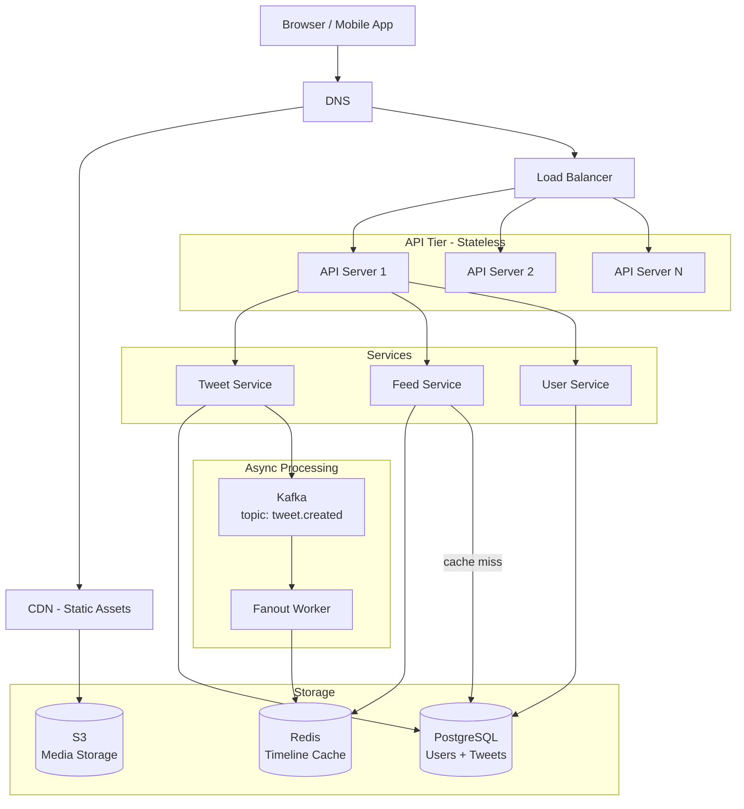

# 07. Architecture Diagrams Guide

How you draw your system matters almost as much as what you draw. A clear, well-organized diagram communicates your thinking instantly. A messy, cluttered diagram forces the interviewer to decode your design instead of evaluating it.

This guide covers what to draw, how to draw it, what level of detail is appropriate, and how to avoid the mistakes that waste time and confuse interviewers.

---

## Why Diagrams Matter in Interviews

A system design interview is fundamentally a communication exercise. The diagram serves as:
- A **shared reference** between you and the interviewer — you can say "the data flows from here to here" and point.
- A **thinking tool** — drawing forces you to be concrete. Vague ideas get exposed when you try to draw them.
- A **progress indicator** — the interviewer can see where you are in the design, what you've covered, and where gaps exist.
- A **canvas for deep dives** — when the interviewer wants to go deeper on a component, they point to it on your diagram.

---

## Standard Shapes and Symbols

Use these shapes consistently. Your interviewer has seen hundreds of system design diagrams — using conventional shapes means they can interpret your diagram instantly without asking what each box means.

| Component | Shape | Convention |
|-----------|-------|------------|
| User / Client | Person icon or rectangle labeled "Client" | Always the starting point |
| Web Browser | Rectangle labeled "Browser" or "Web Client" | |
| Mobile App | Rectangle labeled "Mobile App" | |
| Load Balancer | Rectangle or triangle | Label it "LB" or "Load Balancer" |
| API Server | Rectangle | "API Service", "Web Server", "Service Name" |
| Database (any) | Cylinder | Standard database symbol |
| Cache | Rectangle with label | "Redis Cache", "Memcached" |
| Message Queue | Rectangle or elongated hexagon | "Kafka", "SQS", "RabbitMQ" |
| Object Storage | Cylinder or cloud icon | "S3", "GCS", "Blob Storage" |
| CDN | Cloud or rectangle at the edge | "CDN", "CloudFront", "Akamai" |
| DNS | Diamond or rectangle | "DNS" |
| Firewall | Rectangle | Optional — mention verbally if relevant |
| Service / Microservice | Rectangle | Named after function: "Auth Service", "Feed Service" |
| External Service | Dashed rectangle | Indicates external/third-party |

---

## What Components to Include

Not every system needs every component. Here is a checklist of what to consider for each design:

### Always Consider

- **Client (browser / mobile app):** Every system has a client. Start here.
- **DNS:** Mention it even if you don't draw it in detail. "Requests resolve via DNS to our CDN or load balancer."
- **CDN:** For any system serving static assets or globally distributed traffic. Very common — mention it for media, video, web apps.
- **Load Balancer:** For any system with more than one server. Sits between the client/CDN and your API layer.
- **API / Application Servers:** Your core business logic. Stateless, horizontally scalable.
- **Database(s):** Where data is durably stored. Always include. Always label what type.
- **Cache:** Redis/Memcached for hot data. Include if you're doing any read optimization.

### Include When Relevant

- **Message Queue (Kafka, SQS):** For async processing, event-driven systems, fan-out.
- **Background Workers:** Services that consume from the queue.
- **Object Storage (S3):** For any media, files, or large blobs.
- **Search Service (Elasticsearch):** If search is a feature.
- **Notification Service:** For push/email/SMS delivery.
- **Authentication Service:** For any system with user login (or mention it as a component).
- **API Gateway:** For microservices architectures — rate limiting, auth, routing in one place.
- **Service Mesh / Sidecar:** For advanced microservices architectures (mention verbally, diagram if asked).

---

## How to Start Drawing

### The Golden Rule: Top to Bottom, Left to Right

Start with the client at the top (or top-left). Data flows downward (client → load balancer → service → database). This matches how people read diagrams.

### Step-by-Step Drawing Process

**Step 1 — Anchor the client:** Draw the client box in the top-left or top-center of your space.

**Step 2 — Add the entry point:** CDN (for global traffic) or load balancer directly below the client.

**Step 3 — Add the application tier:** One or more service boxes below the load balancer. For a simple system, one box labeled "API Servers." For a microservices design, multiple named boxes.

**Step 4 — Add data stores:** Databases (cylinders) and caches (boxes) below or to the side of the services that use them. Use proximity to indicate ownership — the service that owns a database sits directly above it.

**Step 5 — Add async path:** Message queues and background workers, typically to the right or bottom of the synchronous path.

**Step 6 — Label the arrows:** Show direction of data flow. Label with the protocol and operation type where it matters.

---

## What Level of Detail to Show

### Wrong: Too Little Detail

A diagram with just "Client → Server → Database" tells the interviewer nothing. It looks like you either don't know what goes in between, or you're not putting in the effort.

### Wrong: Too Much Detail

Drawing 15 microservices, 8 databases, every queue topic, and every service dependency in the first 5 minutes of diagramming is a mistake. You haven't finished requirements. You haven't explained your reasoning. The diagram becomes a confusing wall of boxes.

### Right: Major Components First, Detail on Request

Start with the 6–8 major components. Each component should represent a meaningful service boundary, not a single function. As the interviewer asks about specific components, expand those in detail.

**First pass (high-level):**
```
Client → CDN → Load Balancer → API Servers → Database
                                           → Cache
                                           → Message Queue → Workers
```

**Second pass (on request — e.g., "tell me more about the feed generation"):**
Expand the "Feed Service" box into: Feed Generator, Timeline Cache (Redis), Fanout Worker, and show the Kafka topic in detail.

---

## How to Label Connections

Every arrow should convey:
- **Direction:** Which way does data flow?
- **Protocol:** HTTP/REST, gRPC, WebSocket, AMQP, TCP?
- **What is being sent:** "POST /tweet", "tweet_id", "user location update"

You don't need to label every single arrow in detail. Label the important ones — especially the ones where the protocol or data format is a non-obvious design choice.

**Examples of useful labels:**
- `HTTP/REST (POST /tweet)` — from client to API gateway
- `gRPC` — from API server to internal microservice
- `WebSocket` — from client to chat server
- `Kafka topic: tweet.created` — from tweet service to fanout worker
- `TCP 3306` — from service to MySQL (less important to label, but fine)
- `read (cache miss fallthrough)` — from cache to database

---

## Complete Example: Social Media Feed Architecture

Here is a full annotated example for a Twitter-like feed system:



### What This Diagram Shows
- The client hits DNS, which routes to CDN (for static assets) or the load balancer (for API calls).
- The load balancer distributes across stateless API servers.
- API servers delegate to specialized services (Tweet, Feed, User).
- Tweet writes go to PostgreSQL (source of truth) and publish an event to Kafka.
- The Fanout Worker consumes from Kafka and writes tweet IDs into follower timelines in Redis.
- Feed reads check Redis first (cache hit: fast). On miss, query PostgreSQL (slower path).
- Media goes directly from client to S3 via a pre-signed URL (not shown but worth mentioning).

---

## Common Diagram Mistakes

### Drawing the "Happy Path" Only

Most candidates draw only the write path or only the read path. Both matter. Draw the arrows for both reads and writes. Show that a cache has a "miss" path back to the database.

### Not Labeling Your Database Type

Drawing a cylinder is meaningless without a label. "PostgreSQL," "Redis," "Cassandra" — be specific. The database choice is a major design decision.

### Drawing Connections Without Direction

Arrows without arrowheads are ambiguous. Every connection should have a direction. Data flow direction matters — it tells you which component is the "client" and which is the "server" in each interaction.

### Starting Too Wide, Too Fast

Don't draw 20 components before you've explained any of them. Draw a component, explain what it does, then move to the next. The interviewer follows along and can ask questions. If you draw everything first and explain later, the diagram is impenetrable.

### Forgetting the Database

It sounds absurd but happens constantly. Candidates draw a beautiful application tier and never draw where the data actually lives.

### Making the Diagram Too Small

If you're on a whiteboard, use the whole board. Small diagrams are hard to see and leave no room for expansion during the deep dive phase. Spread out. Components that are related should be close to each other; components at different layers should have clear vertical separation.

---

## Tools for Virtual Interviews

When the interview is remote, you will typically be given a shared diagramming tool or asked to draw in a shared doc. Know at least one of these before your interview.

| Tool | Strengths | Best For |
|------|-----------|---------|
| **Excalidraw** (excalidraw.com) | Free, hand-drawn style, simple shapes, real-time sharing | Default recommendation. Feels natural, not over-engineered. |
| **draw.io** (app.diagrams.net) | Free, very full-featured, many shapes | When you want standard UML/network symbols |
| **Lucidchart** | Professional, polished | If the company provides it |
| **Miro** | Collaborative, infinite canvas | When the interview is very open-ended and wide |
| **Google Slides** | Available everywhere | When no dedicated tool is provided |
| **Pen + Camera** | Use physical pen, point camera at paper | For very informal or startup interviews |

**Practice tip:** Before any virtual system design interview, open Excalidraw and spend 10 minutes drawing a quick diagram. Your hands should know where the shapes are so you're not fumbling with the UI during the interview.

---

## Drawing Velocity

Aim to produce a coherent high-level diagram in **8–10 minutes**. Any slower, and you're burning time you need for the deep dive. Any faster, and you've probably drawn without explaining.

The right pacing is: **draw one component, explain it, move to the next.** The interview should feel like a conversation, not a presentation where you reveal a finished diagram at the end.

---

*A diagram is a tool for communication, not a deliverable. The best architecture diagram in the world doesn't help if you can't explain the reasoning behind each choice.*
