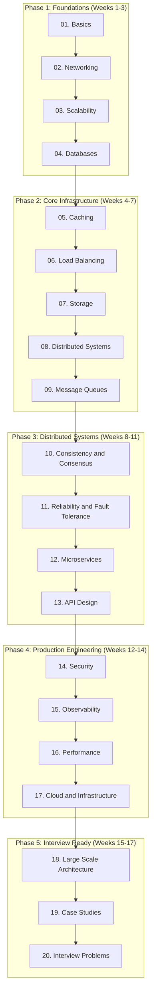

# Learning Roadmap

A structured, phase-by-phase guide through the course. Each phase builds directly on the one before it. Estimated timelines assume 6-8 hours of focused study per week.

---

## The Five Phases at a Glance

| Phase | Chapters | Focus | Time |
|-------|----------|-------|------|
| 1 — Foundations | 01-04 | Vocabulary, networking, scaling, and data | 2-3 weeks |
| 2 — Core Infrastructure | 05-09 | The components every system is built from | 3-4 weeks |
| 3 — Distributed Systems | 10-13 | How large-scale systems stay consistent and reliable | 3-4 weeks |
| 4 — Production Engineering | 14-17 | Security, observability, performance, and cloud | 2-3 weeks |
| 5 — Interview Ready | 18-20 | Real systems, real problems, structured practice | 2-3 weeks |

---

## Phase Progression Diagram



---

## Phase 1: Foundations

**Chapters 1-4 | Estimated: 2-3 weeks**

### What you will study

| Chapter | Key Topics |
|---------|-----------|
| 01. Basics | System design goals, requirements, constraints, back-of-envelope estimation |
| 02. Networking | HTTP/HTTPS, DNS, TCP/UDP, proxies, CDNs, WebSockets |
| 03. Scalability | Vertical vs horizontal scaling, stateless architecture, replication |
| 04. Databases | SQL vs NoSQL, indexing, ACID, normalization, sharding, replication |

### Topic Dependencies

```
System Design Goals
    └── Requirements (functional vs non-functional)
            └── Estimation (users, storage, bandwidth)
                    └── Networking fundamentals (HTTP, DNS)
                            └── Database basics (SQL, indexing)
                                    └── Scaling concepts (vertical, horizontal)
```

### What you will be able to design after Phase 1

After completing Phase 1, you can design a basic 3-tier web application:

- A client that communicates over HTTP/HTTPS
- A stateless application server layer that can be scaled horizontally
- A primary relational database with appropriate indexes
- Basic DNS and CDN setup for static assets
- Back-of-envelope estimates for any given user load

**Sample system you can tackle:** A simple URL shortener, a basic blog platform, or a read-heavy API.

---

## Phase 2: Core Infrastructure

**Chapters 5-9 | Estimated: 3-4 weeks**

### What you will study

| Chapter | Key Topics |
|---------|-----------|
| 05. Caching | Cache-aside, write-through, write-back, Redis, Memcached, eviction policies |
| 06. Load Balancing | Round robin, least connections, consistent hashing, Layer 4/7, health checks |
| 07. Storage | Object storage, block storage, HDFS, S3, blob storage patterns |
| 08. Distributed Systems | CAP theorem, consistency models, vector clocks, distributed clocks |
| 09. Message Queues | Pub/sub, Kafka, RabbitMQ, exactly-once semantics, event-driven patterns |

### Topic Dependencies

```
Database basics (from Phase 1)
    └── Caching (reduces database load)
            └── Load Balancing (distributes traffic across replicas)
                    └── Storage (where large files and objects live)
                            └── Distributed Systems theory (CAP, consistency)
                                    └── Message Queues (async decoupling)
```

### What you will be able to design after Phase 2

- Multi-tier architectures with caching at every level (client, CDN, application, database)
- Horizontally scaled application servers behind load balancers
- Separation of file/blob storage from transactional databases
- Asynchronous workflows using message queues
- Systems that can tolerate network partitions and work asynchronously

**Sample systems you can tackle:** A photo sharing service, an e-commerce order system, a notification service, a file upload pipeline.

---

## Phase 3: Distributed Systems

**Chapters 10-13 | Estimated: 3-4 weeks**

### What you will study

| Chapter | Key Topics |
|---------|-----------|
| 10. Consistency and Consensus | Strong/eventual consistency, linearizability, Raft, Paxos, 2PC, Saga |
| 11. Reliability and Fault Tolerance | Redundancy, replication, circuit breakers, retries, bulkheads, chaos |
| 12. Microservices | Service decomposition, bounded contexts, service mesh, sidecars |
| 13. API Design | REST, gRPC, GraphQL, API gateways, versioning, rate limiting, idempotency |

### Topic Dependencies

```
Message Queues (from Phase 2)
    └── Consistency and Consensus (what guarantees queues and DBs give you)
            └── Reliability Patterns (how to build tolerant systems)
                    └── Microservices (decompose into reliable services)
                            └── API Design (how services expose themselves)
```

### What you will be able to design after Phase 3

- Distributed systems that reason explicitly about consistency tradeoffs
- Microservice architectures with well-defined service boundaries
- APIs that are versioned, rate-limited, and idempotent
- Failure-tolerant systems using circuit breakers, bulkheads, and retries
- Distributed transactions using Saga or 2PC patterns

**Sample systems you can tackle:** A payments platform, a booking system, a distributed inventory service, a multi-region social network.

---

## Phase 4: Production Engineering

**Chapters 14-17 | Estimated: 2-3 weeks**

### What you will study

| Chapter | Key Topics |
|---------|-----------|
| 14. Security | AuthN/AuthZ, OAuth, JWT, TLS, secrets management, OWASP, threat modeling |
| 15. Observability | Structured logging, metrics, distributed tracing, alerting, SLOs/SLAs |
| 16. Performance | Profiling, N+1 queries, connection pooling, async I/O, throughput tuning |
| 17. Cloud and Infrastructure | Docker, Kubernetes, Terraform, CI/CD, blue-green, canary deployments |

### Topic Dependencies

```
Microservices + APIs (from Phase 3)
    └── Security (who can access which service)
            └── Observability (can you see what is happening)
                    └── Performance (make it fast)
                            └── Cloud and Infrastructure (deploy it reliably)
```

### What you will be able to design after Phase 4

- Secure systems with proper authentication, authorization, and secret management
- Observable systems with structured logging, metrics, and distributed traces
- Performance-tuned systems free of common bottlenecks
- Containerized, infrastructure-as-code deployments with safe rollout strategies

**Sample systems you can tackle:** A multi-tenant SaaS platform, a financial data processing pipeline, a real-time analytics dashboard, a CI/CD platform.

---

## Phase 5: Interview Ready

**Chapters 18-20 | Estimated: 2-3 weeks**

### What you will study

| Chapter | Key Topics |
|---------|-----------|
| 18. Large Scale Architecture | Global distribution, multi-region, geo-routing, data sovereignty |
| 19. Case Studies | Twitter, YouTube, Uber, WhatsApp, Google Search, Netflix, Dropbox, Airbnb |
| 20. Interview Problems | Framework, practice problems, common mistakes, evaluation rubric |

### What you will be able to design after Phase 5

By this point, you can design any system presented in a system design interview with confidence:

- Clarify requirements before diving into architecture
- Estimate scale and capacity before choosing components
- Design the happy path, then harden it for failure
- Identify bottlenecks and propose solutions with clear tradeoffs
- Communicate the design clearly in 45 minutes

**Systems you can tackle:** Design Twitter, YouTube, Uber, a distributed cache, a web crawler, a search autocomplete, a notification system, a payment system, a collaborative document editor.

---

## Skill Progression Summary

```
After Phase 1:   Can design a basic scalable web app
After Phase 2:   Can design a distributed app with caching, queuing, and object storage
After Phase 3:   Can design fault-tolerant distributed systems with explicit consistency guarantees
After Phase 4:   Can design production-grade systems that are secure, observable, and deployable
After Phase 5:   Can design any system under interview conditions with clear tradeoff reasoning
```

---

## Tips for Staying on Track

- **Weekly goals over daily goals.** Life happens. Give yourself a week to complete each chapter, not a day.
- **Short sessions beat long sessions.** 90 minutes of focused reading beats 4 hours of distracted skimming.
- **Use the Progress Tracker.** Checking off topics is motivating and keeps you honest about what you have actually absorbed.
- **Do mock interviews from Phase 3 onward.** You cannot prepare for interviews by reading alone.
- **Revisit chapters.** The distributed systems chapters (08-13) are worth a second read after completing the course.
